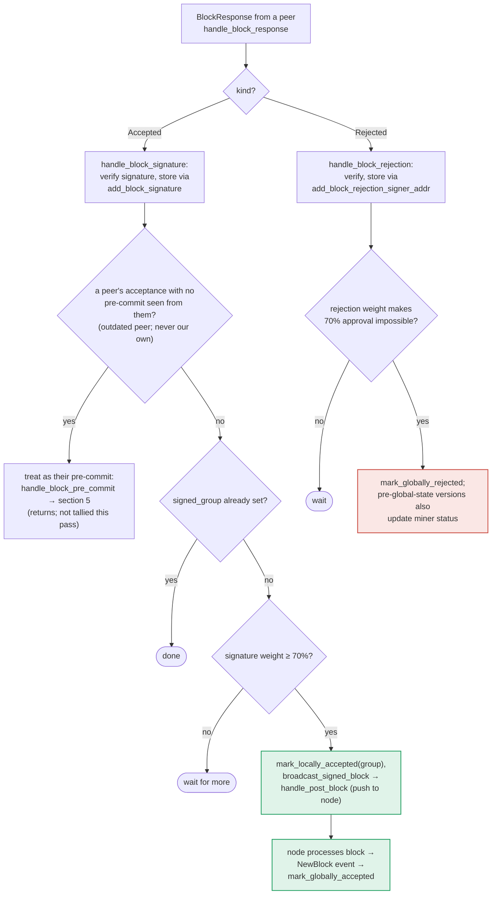

### Title
Stale rejection weight is never retracted when a signer flips to acceptance, letting a single signer grief block finalization on the miner's coordinator - ([File: stacks-node/src/nakamoto_node/stackerdb_listener.rs])

### Summary
The node-side `StackerDBListener` message loop that tallies `BlockResponse` votes from signers (in the function that processes `messages` from `SignerEvent::SignerMessages`, `stacks-node/src/nakamoto_node/stackerdb_listener.rs:372-591`) maintains two independent counters, `total_weight_approved` and `total_weight_rejected`, gated by two *different* de-duplication sets: the Accepted branch gates on `block.gathered_signatures.contains_key(&slot_id)` while the Rejected branch gates on `block.responded_signers.insert(slot_id)`. Because `responded_signers` is shared but `gathered_signatures` is not populated by a rejection, a signer who first rejects and later accepts the same block gets counted in `total_weight_rejected` (from the reject) and then also in `total_weight_approved` (from the later accept), with `total_weight_rejected` never decremented. [1](#0-0) [2](#0-1) 

### Finding Description
In the Accepted-message branch, weight is added to `total_weight_approved` only if the signer's slot is not already present in `gathered_signatures`:
```
if !block.gathered_signatures.contains_key(&slot_id) {
    block.total_weight_approved = block.total_weight_approved.saturating_add(signer_entry.weight);
    ...
}
block.gathered_signatures.insert(slot_id, signature);
block.responded_signers.insert(slot_id);
``` [1](#0-0) 

In the Rejected-message branch, weight is added to `total_weight_rejected` only if `responded_signers.insert(slot_id)` returns `true` (i.e., first time seen):
```
if block.responded_signers.insert(slot_id) {
    block.total_weight_rejected = block.total_weight_rejected.saturating_add(signer_entry.weight);
    ...
}
``` [2](#0-1) 

Sequence for one signer, one slot, same `signer_signature_hash`:
1. Signer sends `Rejected` first → `responded_signers.insert(slot_id)` returns `true` (first insert) → `total_weight_rejected += weight`.
2. Same signer later sends a validly-signed `Accepted` for the same block → the Accepted branch's guard checks `gathered_signatures.contains_key(&slot_id)`, which is still `false` (rejection never touched `gathered_signatures`) → `total_weight_approved += weight` is applied *in addition to* the already-recorded rejection weight. `responded_signers.insert(slot_id)` is called again but is now a no-op since it was already `true`, so there is no code path that ever decrements `total_weight_rejected`.

The result: `total_weight_rejected` for that slot is "sticky" and is never retracted even after the same signer switches their vote to acceptance. Both counters therefore no longer represent a partition of the signer set's weight — the equality "aggregated tally == set of currently-valid, mutually exclusive per-signer votes" is broken.

This is fully reachable by a single one-slot signer (or one slot compromised/malicious signer) with no majority, no other party's key, and no auth-token — it only requires sending two validly-signed `BlockResponse` messages (`Rejected` then `Accepted`) for the same `signer_signature_hash` over StackerDB, which the protocol otherwise permits since signers are allowed to be first-pass-reject-then-reconsider (e.g., during the pre-commit/recheck flow described in `docs/signer-flows.md` sections 4–6, where the same block hash can transition between validate-reject, pre-commit, and final signature depending on evolving chainstate visibility). [3](#0-2) 

The consuming code in `SignCoordinator::get_block_status` (`stacks-node/src/nakamoto_node/signer_coordinator.rs`) checks the rejection condition *before* the approval condition on every polling iteration:
```
if block_status.total_weight_rejected.saturating_add(self.weight_threshold) > self.total_weight {
    ... return Err(NakamotoNodeError::SignersRejected { ... });
} else if block_status.total_weight_approved >= self.weight_threshold {
    ... return Ok(...)
}
``` [4](#0-3) 

Because the stale rejection weight is retained indefinitely, a set of independent legitimate rejecters approaching (but below) the 30% blocking minority, combined with one flip-flopping signer whose *current* vote is actually acceptance, can push `total_weight_rejected` over the blocking-minority threshold even though the real, up-to-date sentiment of the signer set no longer includes that flip-flopper's rejection. The miner will then abort the block as `SignersRejected` (triggering a costly re-propose cycle and potentially excluding transactions as "problematic") for a block that in reality had, or was about to have, enough approving weight.

### Impact Explanation
This is a liveness/griefing bug reachable by a single signer (no majority required): it can cause the miner's coordinator to prematurely and incorrectly conclude a block was rejected by the signer set, wedging/stalling block production and potentially causing transactions to be spuriously flagged as temporarily/permanently excluded via the `failed_txids` accounting that runs in the same rejection path. It does not directly cause an invalid/non-canonical block to be signed (the final signature aggregate itself, built from `gathered_signatures`, still only contains one authentic signature per signer), so it falls short of "Critical," but it matches the "High" liveness-wedge criterion: a signer (or small minority) that can manipulate the coordinator's weight bookkeeping to stall consensus on an otherwise-valid block.

### Likelihood Explanation
Likelihood is moderate-to-high in adversarial conditions: any single StackerDB participant that controls a signer's private key for one slot can trivially craft the Reject-then-Accept message pair themselves (no majority, no other signer's key, no auth token needed). It could also occur unintentionally in real deployments, since signers can legitimately re-derive a different verdict for the same block hash across the validate/pre-commit/recheck lifecycle documented in `docs/signer-flows.md`, so the same slot's `Rejected`→`Accepted` transition is not necessarily malicious — this makes the bug likely to be triggered even without an active attacker, worsening effective likelihood of the griefing effect being observed in production combined with genuine minority dissent.

### Recommendation
Use a single mutually-exclusive vote-state map per slot (e.g., `HashMap<slot_id, VoteState::{Approved(sig), Rejected}>`) instead of two independently-gated data structures (`gathered_signatures` vs `responded_signers`). When a later message from the same slot supersedes an earlier one, decrement the stale counter (e.g., subtract `signer_entry.weight` from `total_weight_rejected` before adding it to `total_weight_approved`, and vice versa), or simply recompute both totals from the single up-to-date vote map on every update rather than maintaining two incrementing/never-decrementing running sums.

### Proof of Concept
1. Start a signer set (e.g., N=5) monitoring a `BlockProposal` on StackerDB.
2. As signer S1 (slot 0), sign and publish a `BlockResponse::Rejected` message for `signer_signature_hash = H` (any valid rejection reason). `stackerdb_listener.rs` records `total_weight_rejected += weight(S1)` and `responded_signers.insert(0)`.
3. As the same signer S1, sign and publish a `BlockResponse::Accepted` message for the *same* `H` with a validly-signed acceptance. Because `gathered_signatures` does not yet contain slot 0, the listener adds `total_weight_approved += weight(S1)` without touching/decrementing `total_weight_rejected`.
4. Observe (via the `StackerDBListener: Signature Added to block` / `StackerDBListener: Signer rejected block` log lines, or by inspecting `BlockInfo`/`total_weight_rejected` state) that `total_weight_rejected` for `H` still includes `weight(S1)` even though S1's current, latest vote is acceptance.
5. Have other genuinely-rejecting signers contribute weight up to just under the 30% blocking minority; S1's stale rejection weight is the final increment that pushes `total_weight_rejected.saturating_add(weight_threshold) > total_weight`, causing `SignCoordinator::get_block_status` to return `NakamotoNodeError::SignersRejected` even though S1 has already switched to accepting the block.

### Citations

**File:** stacks-node/src/nakamoto_node/stackerdb_listener.rs (L443-465)
```rust
                        if !block.gathered_signatures.contains_key(&slot_id) {
                            block.total_weight_approved = block
                                .total_weight_approved
                                .saturating_add(signer_entry.weight);

                            info!("StackerDBListener: Signature Added to block";
                                "signer_signature_hash" => %block_sighash,
                                "signer_pubkey" => signer_pubkey.to_hex(),
                                "signer_slot_id" => slot_id,
                                "signature" => %signature,
                                "signer_weight" => signer_entry.weight,
                                "total_weight_approved" => block.total_weight_approved,
                                "percent_approved" => block.total_weight_approved as f64 / self.total_weight as f64 * 100.0,
                                "total_weight_rejected" => block.total_weight_rejected,
                                "percent_rejected" => block.total_weight_rejected as f64 / self.total_weight as f64 * 100.0,
                                "weight_threshold" => self.weight_threshold,
                                "tenure_extend_timestamp" => tenure_extend_timestamp,
                                "read_count_extend_timestamp" => read_count_extend_timestamp,
                                "server_version" => metadata.server_version,
                            );
                        }
                        block.gathered_signatures.insert(slot_id, signature);
                        block.responded_signers.insert(slot_id);
```

**File:** stacks-node/src/nakamoto_node/stackerdb_listener.rs (L515-519)
```rust
                        if block.responded_signers.insert(slot_id) {
                            block.total_weight_rejected = block
                                .total_weight_rejected
                                .saturating_add(signer_entry.weight);

```

**File:** docs/signer-flows.md (L349-376)
```markdown
## 6. Responses from other signers

Peer acceptances and rejections drive the two consensus outcomes. Acceptances
tally toward the 70% signing threshold and reaching it makes _this_ signer
assemble the signature set and push the block to its node. Rejections tally
toward the blocking minority (>30%), which makes the 70% unreachable and
finalizes the block as globally rejected.



```

**File:** stacks-node/src/nakamoto_node/signer_coordinator.rs (L509-545)
```rust
            if block_status
                .total_weight_rejected
                .saturating_add(self.weight_threshold)
                > self.total_weight
            {
                info!(
                    "{}/{} signer weight votes to reject block",
                    block_status.total_weight_rejected, self.total_weight;
                    "signer_signature_hash" => %block_signer_sighash,
                );
                counters.bump_naka_rejected_blocks();

                // Only act on failed txids that a blocking minority (>30% weight) agrees on
                let blocking_minority = self.total_weight.saturating_sub(self.weight_threshold);
                let mut temporarily_excluded_txids = HashSet::new();
                let mut permanently_excluded_txids = HashSet::new();
                for (txid, info) in &block_status.failed_txids {
                    if info.total_weight > blocking_minority {
                        // Do not perma ban txids that only a small minority of signers reported as problematic
                        // But make sure its removed from the next block proposal
                        if info.problematic_weight > blocking_minority {
                            permanently_excluded_txids.insert(txid.clone());
                        } else {
                            temporarily_excluded_txids.insert(txid.clone());
                        }
                    }
                }

                return Err(NakamotoNodeError::SignersRejected {
                    temporarily_excluded_txids,
                    permanently_excluded_txids,
                });
            } else if block_status.total_weight_approved >= self.weight_threshold {
                info!("Received enough signatures, block accepted";
                    "signer_signature_hash" => %block_signer_sighash,
                );
                return Ok(block_status.gathered_signatures.values().cloned().collect());
```
