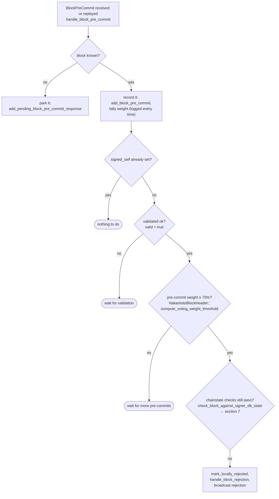
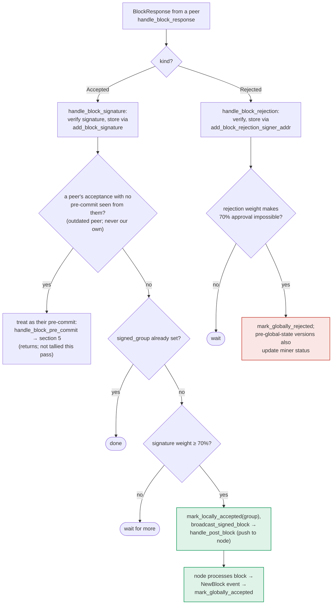

### Title
Peer-signature threshold path in `store_and_process_block_signature` broadcasts a block without re-running the local chainstate recheck - (File: `stacks-signer/src/v0/signer.rs`)

### Summary
`store_and_process_block_signature` (called from `handle_block_signature`, reached via `BlockResponse::Accepted` messages) can cross the 70% signature threshold and push a block to the node purely from *already-stored peer signatures*, without ever calling `check_block_against_signer_db_state` and without checking this signer's own `block_info.valid`. Every other place that produces the same effect (crossing the threshold and signing/broadcasting) — `handle_block_pre_commit`'s threshold branch and `handle_block_validate_ok` — explicitly re-runs that recheck first. The gate exists on the "intended" path but is missing on a structurally equivalent path, the same class of bug as `Bribe.addRewardToken()` being gated while `notifyRewardAmount()` reaches the identical state change ungated.

### Finding Description
Two facts combine to create the gap:

1. `add_block_pre_commit` unconditionally records a peer's pre-commit the moment a `BlockPreCommit` message arrives, before any validity/threshold checks run: [1](#0-0) 
so `has_committed(signer, hash)` becomes `true` for that signer/block pair even if this local signer's own `block_info.valid` is still `None` (block not yet validated by our node) — `handle_block_pre_commit` bails out right after that store when `!block_info.valid.unwrap_or(false)`: [2](#0-1) 

2. When a `BlockResponse::Accepted` (signature) later arrives from a signer that already has `has_committed == true`, `store_and_process_block_signature` skips the pre-commit reroute and goes straight into the tally/broadcast branch: [3](#0-2) 
That branch computes `total_signature_weight` purely from stored signatures, and once the threshold is met it calls `mark_locally_accepted(true)` and `broadcast_signed_block` → `handle_post_block` (which posts the block to this signer's own node) — with **no** call to `check_block_against_signer_db_state` and **no** check of `block_info.valid`: [4](#0-3) 

Compare this to the two paths that are documented as producing the same terminal action (sign/broadcast on crossing threshold), both of which explicitly re-verify chainstate immediately before acting:
- Pre-commit threshold path: `check_block_against_signer_db_state` runs, and only on success does the code proceed to sign: [5](#0-4) 
- Validation-ok path: the same recheck runs before `mark_pre_committed`: [6](#0-5) 

`docs/signer-flows.md` describes the intended design explicitly: the pre-commit threshold path is "the only place the signer produces a block signature by counting votes," and stresses that "the chainstate re-check runs first" before a signature is allowed to leave the box: [7](#0-6) 
Yet section 6 of the same doc shows the peer-`BlockResponse::Accepted` tally path reaching `mark_locally_accepted`/broadcast via a separate branch (`store_and_process_block_signature`) that the design narrative never subjects to that recheck: [8](#0-7) 

The equality broken is "aggregated-weight vs verified-accepts": the threshold logic is supposed to represent this signer's own confirmed, freshly-rechecked willingness to sign combined with peers' pre-commits/signatures, but on this branch the local signer relays/pushes a block to its node purely on the strength of already-buffered peer signatures, without itself ever confirming the block still passes `check_latest_block_in_tenure` / conflict checks at the moment of crossing threshold (and, in the earliest-arrival case, without ever confirming `block_info.valid == Some(true)` at all, since the block can still be `Unprocessed` when this branch fires).

### Impact Explanation
This falls under "a signer signing an invalid, non-canonical, or conflicting block" / broadcasting one to the node. If the chain state changes between when peer signatures accumulate and when this signer's tally crosses threshold (a Bitcoin reorg, a competing sibling block becoming canonical, or this signer's own validation of the block simply not having completed yet), the standard defenses (`check_block_against_signer_db_state`, the `get_signed_conflicts`/`reorg_permit_stands` freshness logic) that gate every other route to `mark_locally_accepted` are bypassed here. The block is pushed to the node via `handle_post_block` on the strength of stored signatures alone.

### Likelihood Explanation
No majority collusion or third-party key is needed to trigger the code path itself: it fires whenever the specific signer that sent the accepting signature had previously sent (or is treated as having sent, via the outdated-peer fallback) a pre-commit for that hash — a completely ordinary sequence in honest operation, not an attack precondition. Reaching the numeric 70% threshold does require the aggregate stored signatures to add up (as in any normal successful round), but nothing in this branch conditions that tally on *this* signer's own current, freshly-checked view of the chain, unlike every sibling threshold-crossing branch in the same file. The realistic trigger is a race/reorg window between when peer signatures were received and buffered and when the local recheck would otherwise have run — a timing condition entirely plausible for a single slow/behind signer or during any fork event, not requiring compromising a majority of signers.

### Recommendation
Insert the same `check_block_against_signer_db_state` recheck (and require `block_info.valid == Some(true)`) inside `store_and_process_block_signature`'s threshold-crossing branch, immediately before `mark_locally_accepted(true)` / `broadcast_signed_block`, mirroring the guard already present in `handle_block_pre_commit` (lines 1340-1366) and `handle_block_validate_ok` (lines 1941-1970). If the recheck fails, mark the block locally rejected and broadcast a rejection instead of pushing the block to the node.

### Proof of Concept
Conceptual reproduction (exact harness would need the existing `stacks-signer/src/v0/tests.rs` `MockNode` test scaffolding used elsewhere in this file, e.g. `run_sibling_scenario`):
1. Signer S receives a `BlockProposal` for block B and stores it as `Unprocessed` (`block_info.valid == None`).
2. A quorum-worth of other signers each send a `BlockPreCommit` for B before S's own node validation returns; each is recorded via `add_block_pre_commit`, setting `has_committed == true` for their addresses, without effect on B's state since `block_info.valid` is still `None` (`handle_block_pre_commit` returns early each time).
3. Meanwhile (or after), a Bitcoin/Stacks reorg makes a sibling block B' the canonical tip at the same height, or S's own node ends up rejecting/never validating B.
4. The same signers then broadcast `BlockResponse::Accepted(B)` signatures (their `signed_self` was set on their own side under their own — possibly now-stale — view). On S, each triggers `handle_block_signature` → `store_and_process_block_signature`; since `has_committed` is already `true` for them, the pre-commit reroute is skipped and the code proceeds straight to the tally.
5. Once stored signatures cross the 70% threshold, S calls `mark_locally_accepted(true)` and `broadcast_signed_block` → `handle_post_block`, pushing B to S's node — without S ever calling `check_block_against_signer_db_state` on B or confirming `block_info.valid`, even though B may already conflict with the now-canonical B' from S's own perspective.

### Citations

**File:** stacks-signer/src/v0/signer.rs (L1275-1281)
```rust
        // Always save the pre-commit - we will need to store signer responses for determining which
        // are misbehaving, offline, etc.
        // commit message is from a valid sender! store it
        self.signer_db
            .add_block_pre_commit(block_hash, stacker_address)
            .unwrap_or_else(|_| panic!("{self}: Failed to save block pre-commit"));

```

**File:** stacks-signer/src/v0/signer.rs (L1316-1331)
```rust
        if block_info.signed_self.is_some() {
            debug!(
                "{self}: Received pre-commit for a block that we have already signed. Doing nothing...",
            );
            return;
        }

        if !block_info.valid.unwrap_or(false) {
            // We received a pre-commit for a block that we have not validated or we have already marked this block as invalid.
            // We should not do anything further as we do not know what our response should be and we do not change our votes on rejected
            // blocks unless we receive a new block proposal for it and the reject reason allows us to reconsider.
            debug!(
                "{self}: Received a pre-commit for a block that we have not determined to be valid: {:?}. Doing nothing...", block_info.valid
            );
            return;
        }
```

**File:** stacks-signer/src/v0/signer.rs (L1340-1366)
```rust
        // The chain and signer db state may have changed materially since this block passed the
        // proposal-time checks (e.g. between validation and reaching the pre-commit threshold we
        // may have signed a block that this one would reorg). Re-run the chainstate checks
        // before putting a signature over the block, and respond with a rejection if they no
        // longer pass, just as the block validation response handler does.
        if let Some(block_rejection) =
            self.check_block_against_signer_db_state(stacks_client, &block_info.block)
        {
            warn!(
                "{self}: Reached the pre-commit threshold for a block, but it no longer passes the chainstate checks. Rejecting.";
                "signer_signature_hash" => %block_hash,
                "block_height" => block_info.block.header.chain_length,
                "reject_code" => %block_rejection.reason_code,
                "reject_reason" => &block_rejection.reason,
            );
            if let Err(e) = block_info.mark_locally_rejected() {
                if !block_info.has_reached_consensus() {
                    warn!("{self}: Failed to mark block as locally rejected: {e:?}");
                }
            };
            self.signer_db
                .insert_block(&block_info)
                .unwrap_or_else(|e| self.handle_insert_block_error(e));
            self.handle_block_rejection(&block_rejection, sortition_state);
            self.send_block_response(&block_info.block, block_rejection.into());
            return;
        }
```

**File:** stacks-signer/src/v0/signer.rs (L1941-1970)
```rust
        if !block_info.check_static_valid_block() {
            debug!("{self}: Block is syntatically invalid; will not store");
            return;
        }

        if let Some(block_rejection) =
            self.check_block_against_signer_db_state(stacks_client, &block_info.block)
        {
            // The signer db state has changed. We no longer view this block as valid. Override the validation response.
            if let Err(e) = block_info.mark_locally_rejected() {
                if !block_info.has_reached_consensus() {
                    warn!("{self}: Failed to mark block as locally rejected: {e:?}");
                }
            };
            self.signer_db
                .insert_block(&block_info)
                .unwrap_or_else(|e| self.handle_insert_block_error(e));
            self.handle_block_rejection(&block_rejection, sortition_state);
            self.send_block_response(&block_info.block, block_rejection.into());
        } else {
            if let Err(e) = block_info.mark_pre_committed() {
                // The block may have reached enough signatures before we validated the block so should fail to mark pre-committed
                // but still call to make sure the timestamps and validity are updated correctly.
                if !block_info.has_reached_consensus()
                    && block_info.state != BlockState::LocallyAccepted
                {
                    warn!("{self}: Failed to mark block as approved: {e:?}",);
                    return;
                }
            }
```

**File:** stacks-signer/src/v0/signer.rs (L2452-2466)
```rust
        // signature is valid! store it.
        // if this returns false, it means the signature already exists in the DB, so just return.
        if !self
            .signer_db
            .add_block_signature(block_hash, signer_address, signature)
            .unwrap_or_else(|_| panic!("{self}: Failed to save block signature"))
        {
            return;
        }

        // If this isn't our own signature and we haven't seen a pre-commit from this signer yet, try treating it as a pre-commit in case the caller is running an outdated version
        if signer_address != &self.stacks_address && !self.signer_db.has_committed(block_hash, signer_address).inspect_err(|e| warn!("Failed to check if pre-commit message already considered for {signer_address:?} for {block_hash}: {e}")).unwrap_or(false) {
            self.handle_block_pre_commit(stacks_client, sortition_state, signer_address, block_hash);
            return;
        }
```

**File:** stacks-signer/src/v0/signer.rs (L2468-2538)
```rust
        if block_info.signed_group.is_some() {
            // We have already processed this block to the accepted state. Adding more signatures will not change anything so nothing to check.
            return;
        }
        // do we have enough signatures to broadcast?
        // i.e. is the threshold reached?
        let signatures = self
            .signer_db
            .get_block_signatures(block_hash)
            .unwrap_or_else(|_| panic!("{self}: Failed to load block signatures"));

        // put signatures in order by signer address (i.e. reward cycle order)
        let addrs_to_sigs: HashMap<_, _> = signatures
            .into_iter()
            .filter_map(|sig| {
                let Ok(public_key) = Secp256k1PublicKey::recover_to_pubkey_without_validating_low_s(
                    block_hash.bits(),
                    &sig,
                ) else {
                    return None;
                };
                let addr = StacksAddress::p2pkh(self.mainnet, &public_key);
                Some((addr, sig))
            })
            .collect();

        let signature_weight = self.signer_weights.get(signer_address).unwrap_or(&0);
        let total_signature_weight = self.compute_signature_signing_weight(addrs_to_sigs.keys());
        let total_weight = self.compute_signature_total_weight();

        let min_weight = NakamotoBlockHeader::compute_voting_weight_threshold(total_weight)
            .unwrap_or_else(|_| {
                panic!("{self}: Failed to compute threshold weight for {total_weight}")
            });

        if min_weight > total_signature_weight {
            info!("{self}: Received block acceptance, but have not yet reached the acceptance threshold.";
                "signer_signature_hash" => %block_hash,
                "signature_weight" => signature_weight,
                "consensus_hash" => %block_info.block.header.consensus_hash,
                "block_height" => block_info.block.header.chain_length,
                "total_weight_approved" => total_signature_weight,
                "total_weight" => total_weight,
                "percent_approved" => (total_signature_weight as f64 / total_weight as f64 * 100.0),
            );
            return;
        }
        info!("{self}: have reached the block acceptance threshold";
            "signer_signature_hash" => %block_hash,
            "signature_weight" => signature_weight,
            "consensus_hash" => %block_info.block.header.consensus_hash,
            "block_height" => block_info.block.header.chain_length,
            "total_weight_approved" => total_signature_weight,
            "total_weight" => total_weight,
            "percent_approved" => (total_signature_weight as f64 / total_weight as f64 * 100.0),
        );

        // have enough signatures to broadcast!
        // move block to LOCALLY accepted state.
        // It is only considered globally accepted IFF we receive a new block event confirming it OR see the chain tip of the node advance to it.
        if let Err(e) = block_info.mark_locally_accepted(true) {
            if !block_info.has_reached_consensus() {
                warn!("{self}: Failed to mark block as locally accepted: {e:?}");
            }
        }
        let _ = self.signer_db.insert_block(block_info).map_err(|e| {
            warn!("Failed to set group threshold signature timestamp for {block_hash}: {e:?}");
            panic!("{self} Failed to write block to signerdb: {e}");
        });
        self.broadcast_signed_block(stacks_client, block_info.block.clone(), &addrs_to_sigs);
    }
```

**File:** docs/signer-flows.md (L229-249)
```markdown
## 5. Pre-commit threshold → signature

The only place the signer produces a block signature by counting votes.
Pre-commits from peers (and our own) accumulate; at ≥70% weight the signer
decides whether to follow through. Between validation and threshold, we may have
signed a _different_ block at the same height, possibly in another tenure, so
the world must be re-checked before the signature leaves the box.



**File:** docs/signer-flows.md (L357-387)
```markdown


The outdated-peer fallback keeps mixed-version fleets live: an acceptance from a
peer that never sent a pre-commit is routed into the pre-commit path instead, so
that peer's weight still counts toward the threshold that produces _our_
signature. Note that reaching 70% signatures still only marks the block
_locally_ accepted with the group timestamp; global acceptance waits for the node
to adopt it. Marking the miner invalid on a 30% `ReorgNotAllowed` rejection is
skipped once the active protocol version uses global signer state.

> Anchors: `handle_block_response`, `handle_block_signature`,
> `store_and_process_block_signature`, `broadcast_signed_block`,
> `handle_block_rejection`, `store_and_process_block_rejection` (signer.rs)
```
