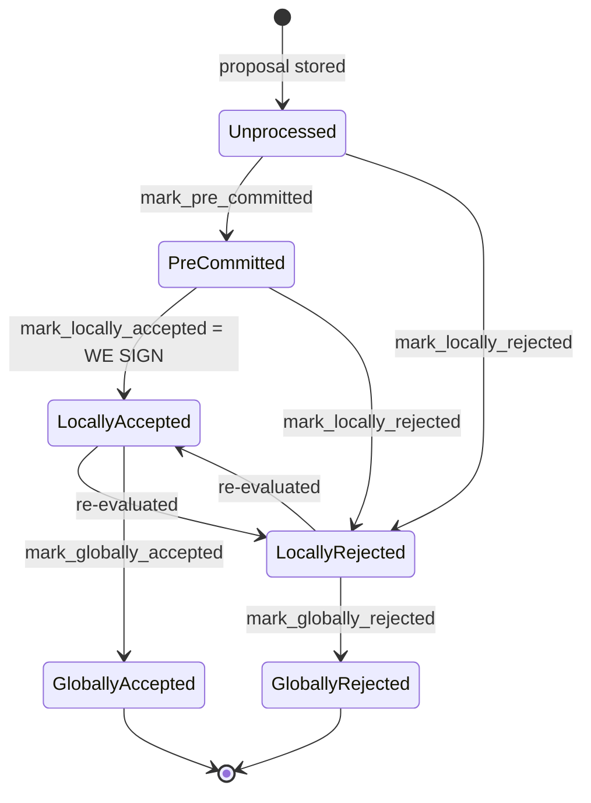

## Finding [1](#0-0) 

### Title
Stale-signer cleanup deletes a `RegisteredSigner` while a block is still `PreCommitted` (unresolved), silently abandoning the in-flight consensus vote - ([File: stacks-signer/src/runloop.rs])

### Summary
`cleanup_stale_signers` decides whether an outgoing reward-cycle signer instance can be safely destroyed by calling `has_unprocessed_blocks`, but that predicate only checks for blocks in `BlockState::Unprocessed`. A block that has already been validated and pre-committed (`BlockState::PreCommitted`), yet has not reached the 70% pre-commit weight threshold needed to be signed, is invisible to this check. The runloop can therefore tear down the live `Signer` object for that reward cycle while it still owes a signature to a block it had already promised to sign, silently dropping that pending commitment — the same bug class as `MessageProxy.removeConnectedChain` deleting chain state without checking for unresolved in-flight messages.

### Finding Description
`cleanup_stale_signers` in `stacks-signer/src/runloop.rs` is called every time the runloop refreshes on a new burn block: [2](#0-1) 

For every configured signer whose `reward_cycle < current_reward_cycle`, it only keeps a `ConfiguredSigner::RegisteredSigner` alive if `signer.has_unprocessed_blocks()` returns `true`: [3](#0-2) 

`has_unprocessed_blocks` is implemented as: [4](#0-3) 

and delegates to `SignerDb::has_unprocessed_blocks`, which is a SQL query filtered to `state = ?2` with `?2 = BlockState::Unprocessed`: [5](#0-4) 

But the `BlockState` lifecycle has a distinct, non-terminal intermediate state, `PreCommitted`, entered by `mark_pre_committed` after node validation succeeds and before the 70% pre-commit weight threshold is reached: [6](#0-5) 

A block sitting in `PreCommitted` is explicitly documented as "validated, willing to sign if the pre-commit threshold is met" — i.e., a promise that has not yet been redeemed as a signature. `has_unprocessed_blocks` does not query for this state, so from the cleanup routine's point of view, a signer holding only `PreCommitted` blocks looks exactly like a signer with nothing pending, and is deleted from `self.stacks_signers`: [7](#0-6) 

Once removed, the runloop no longer holds any live `Signer` object for that reward cycle. Any further `BlockPreCommit`/`BlockValidationResponse` traffic for that reward cycle has nothing to dispatch to (the router keys instances by `reward_cycle % 2`, and messages from the outgoing set are already filtered by parity in `process_event`), so the deleted signer will never contribute its own signature to that block even if the network subsequently gathers enough pre-commit weight to cross the threshold — its half-finished commitment is simply discarded.

The codebase's own regression-test comment for the pre-commit threshold makes clear how consequential this half-finished state is: it explicitly notes a `PreCommitted`-only block "must NOT suppress the timeout... if it never reaches the pre-commit threshold the tenure would otherwise stall forever": [8](#0-7) 

That comment covers a *different* mechanism (timeout capitulation to a next miner), but it corroborates that `PreCommitted`-but-unsigned is treated in this codebase as a real, unresolved participation obligation — exactly the class of state `has_unprocessed_blocks` fails to protect during cleanup.

### Impact Explanation
This is a liveness wedge for the affected signer: once its in-memory `Signer` instance for the outgoing reward cycle is deleted while a block is `PreCommitted`, that signer is permanently prevented from ever emitting the signature it had already committed to for that block, matching "a signer wedged into never signing valid blocks" from the accepted High-impact class. If enough signers hit this same boundary condition on the same block (e.g. a tenure/proposal that straddles the exact reward-cycle turnover, when several signers experience the burn-height-driven refresh before the pre-commit weight crosses 70%), the block could be starved of the signatures needed to reach the group threshold, stalling that specific proposal, analogous to messages "getting stuck from getting processed on the other end" in the source finding.

### Likelihood Explanation
This requires no majority collusion and no privileged access — it is triggered purely by ordinary timing: a block proposal near the very end of a reward cycle that gets validated and pre-committed by a signer, combined with the pre-commit weight not yet crossing threshold before that signer's `refresh_runloop`/`cleanup_stale_signers` pass observes `current_reward_cycle` having advanced. A miner (or gossip delay) can increase the likelihood by delaying block delivery or artificially spacing out pre-commit propagation near a reward-cycle boundary, but no signer key or majority is needed to trigger the underlying logic gap.

### Recommendation
Extend `SignerDb::has_unprocessed_blocks` (or add a parallel check consulted by `cleanup_stale_signers`) to also treat blocks in `BlockState::PreCommitted` as "still pending" for the purposes of stale-signer cleanup, mirroring the mitigation the external report recommended for `removeConnectedChain`: do not tear down state that still has an outstanding commitment, and/or explicitly resolve (reject/expire) any `PreCommitted` block before the owning signer instance is removed.

### Proof of Concept
1. Signer S is registered for reward cycle `N`. A miner proposes block `B` for reward cycle `N` near the reward-cycle boundary.
2. S validates `B` and calls `mark_pre_committed` (state becomes `PreCommitted`), broadcasts its pre-commit, but the aggregate pre-commit weight across all signers has not yet crossed the 70% threshold (`handle_block_pre_commit`, `stacks-signer/src/v0/signer.rs:1250-1338`).
3. A subsequent burn block pushes `current_burn_block_height` into reward cycle `N+1`. `refresh_runloop` runs, computing `current_reward_cycle = N+1`, and calls `cleanup_stale_signers(N+1)`.
4. `cleanup_stale_signers` sees S's `reward_cycle = N < N+1` and calls `S.has_unprocessed_blocks()`, which queries only for `BlockState::Unprocessed`. Since `B` is `PreCommitted`, not `Unprocessed`, the query finds nothing and returns `false`.
5. S is added to `to_delete` and removed from `self.stacks_signers`.
6. Even if remaining signers later push `B`'s pre-commit weight over threshold, S no longer exists to re-run `handle_block_pre_commit` and issue its own signature — its pre-commit promise for `B` is permanently lost.

### Citations

**File:** stacks-signer/src/runloop.rs (L441-441)
```rust
        self.cleanup_stale_signers(current_reward_cycle);
```

**File:** stacks-signer/src/runloop.rs (L471-500)
```rust
    fn cleanup_stale_signers(&mut self, current_reward_cycle: u64) {
        #[cfg(any(test, feature = "testing"))]
        if TEST_SKIP_SIGNER_CLEANUP.get() {
            warn!("Skipping signer cleanup due to testing directive.");
            return;
        }
        let mut to_delete = Vec::new();
        for (idx, signer) in &mut self.stacks_signers {
            let reward_cycle = signer.reward_cycle();
            if reward_cycle >= current_reward_cycle {
                // We are either the current or a future reward cycle, so we are not stale.
                continue;
            }
            match signer {
                ConfiguredSigner::RegisteredSigner(signer) => {
                    if !signer.has_unprocessed_blocks() {
                        debug!("{signer}: Signer's tenure has completed.");
                        to_delete.push(*idx);
                    }
                }
                ConfiguredSigner::NotRegistered { .. } => {
                    debug!("{signer}: Unregistered signer's tenure has completed.");
                    to_delete.push(*idx);
                }
            }
        }
        for idx in to_delete {
            self.stacks_signers.remove(&idx);
        }
    }
```

**File:** stacks-signer/src/v0/signer.rs (L418-426)
```rust
    fn has_unprocessed_blocks(&self) -> bool {
        self.signer_db
            .has_unprocessed_blocks(self.reward_cycle)
            .unwrap_or_else(|e| {
                error!("{self}: Failed to check for pending blocks: {e:?}",);
                // Assume we have pending blocks to prevent premature cleanup
                true
            })
    }
```

**File:** stacks-signer/src/signerdb.rs (L1855-1868)
```rust
    /// Determine if there are any unprocessed blocks
    pub fn has_unprocessed_blocks(&self, reward_cycle: u64) -> Result<bool, DBError> {
        let query = "SELECT block_info FROM blocks WHERE reward_cycle = ?1 AND state = ?2 LIMIT 1";
        let result: Option<String> = query_row(
            &self.db,
            query,
            params!(
                &u64_to_sql(reward_cycle)?,
                &BlockState::Unprocessed.to_string()
            ),
        )?;

        Ok(result.is_some())
    }
```

**File:** docs/signer-flows.md (L130-150)
```markdown
## 2. Block lifecycle (`BlockState`)

Every proposal tracked in the signer DB carries a `BlockState`. **`PreCommitted`
carries no signature**: it means "validated, willing to sign if the pre-commit
threshold is met." The first signature appears at `mark_locally_accepted`.
Global states are terminal against each other.


```

**File:** stacks-signer/src/chainstate/tests/v2.rs (L717-732)
```rust
    let mut block_info = BlockInfo::from(block_proposal);
    block_info.mark_pre_committed().unwrap();
    signer_db.insert_block(&block_info).unwrap();

    // A block we have only pre-committed to must NOT suppress the timeout. A pre-commit carries
    // no signature over the block, and if it never reaches the pre-commit threshold the tenure
    // would otherwise stall forever: the signers that pre-committed could never time the miner
    // out and fall back to the prior miner.
    assert!(SortitionState::is_timed_out(
        &consensus_hash,
        &signer_db,
        &eval,
        &address,
        Duration::from_secs(1),
    )
    .unwrap());
```
