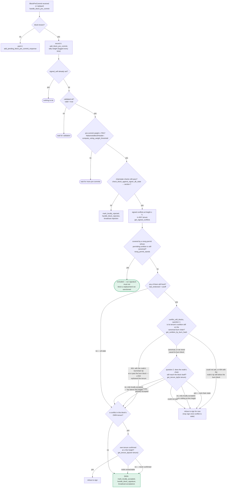

### Title
ECDSA Miner-Signature Malleability Splits a Single Block Into Two Distinct `signer_signature_hash`/`block_id` Values, Breaking Equivocation/Conflict Detection - (File: `stackslib/src/chainstate/nakamoto/mod.rs`)

### Summary
`NakamotoBlockHeader::block_hash()` is derived from `signer_signature_hash_inner()`, whose preimage includes the miner's ECDSA `miner_signature` bytes [1](#0-0) [2](#0-1) . ECDSA signatures are canonically malleable: for signature `(r, s, recid)`, `(r, n-s, recid^1)` recovers to the same public key and is accepted by the verifier, since the codebase explicitly allows high-S miner signatures (`recover_to_pubkey_without_validating_low_s`) and even documents/tests this malleability with a dedicated helper. The repo's own test helper `malleablize_signature` documents this exact transform and states it is "used to construct malleablized blocks: flipping the miner signature changes a block's id without changing its execution" [3](#0-2) , and `check_proposal_accepts_high_s_miner_sign` confirms the signer's proposal-check path accepts high-S miner signatures by design [4](#0-3) .

This is the direct structural analog of CVE-2021-21405 (BLS "malleability"): a single logically-identical block admits two distinct valid signature encodings, which yields two distinct unique identifiers (there, block CID; here, `signer_signature_hash`/`block_hash`/`block_id`) for what must be a single canonical object.

### Finding Description
`miner_signature_hash()` covers all header fields except the two signature fields [5](#0-4) . The miner signs that hash with `sign_miner()` [6](#0-5) . Critically, `signer_signature_hash()` — the hash signers actually sign, and from which `block_hash()`/`block_id()` are derived — additionally commits to `self.miner_signature` in its preimage [2](#0-1) , and `block_hash()`/`block_id()` are computed directly from `signer_signature_hash_inner()` [7](#0-6) .

Because `recover_miner_pk()` / signer-side validation use `recover_to_pubkey_without_validating_low_s`, which does not reject the malleable "negated-s" complement of a valid ECDSA signature [8](#0-7) , a one-slot miner can take a single legitimate block (identical `consensus_hash`, `chain_length`, transactions, `parent_block_id`, `timestamp`, etc.) and derive a second, byte-distinct `miner_signature` (`s' = n - s`, flipped recovery id) that recovers to the same miner public key and passes `check_miner_signature`. Since `miner_signature` feeds into `signer_signature_hash_inner()`, these two representations of the *same block* produce two different `signer_signature_hash` values, hence two different `block_hash()`/`block_id()` values — exactly the "same content, two IDs" bug class from the BLS advisory.

The signer-side chainstate and equivocation/conflict-detection machinery (`stacks-signer/src/chainstate/v1.rs`, `v2.rs`, `signerdb.rs`, and `handle_block_pre_commit`/`store_and_process_block_signature` in `stacks-signer/src/v0/signer.rs`) key block state, pre-commits, and rejections by `signer_signature_hash` (i.e., `block_info.signer_signature_hash()`), not by semantic block content [9](#0-8) [10](#0-9) . This means the "one canonical block per height/tenure" and "signed conflicts at height ≥ h" checks described in the signer flow docs treat the two malleablized variants as *two unrelated blocks*, not as duplicates of one block [11](#0-10) .

### Impact Explanation
A single miner (one slot, no majority-signer collusion required) can broadcast variant A of a block to one subset of signers and the malleablized variant B (same content, flipped miner signature) to another subset via StackerDB/gossip. Each subset validates and pre-commits/signs against its own `signer_signature_hash`, unaware they are semantically the same block. This:
- Splits the aggregated approval weight for what is really one block across two distinct hash identities, breaking the "aggregated weight vs verified accepts" equality the 70%-threshold logic depends on (`verify_signer_signatures` / `compute_voting_weight_threshold` in `stackslib/src/chainstate/nakamoto/mod.rs` lines 1086-1207) — each variant could independently accumulate signer weight that the code treats as validating a *unique* canonical block, when in fact the two are the same underlying content with different miner-signature encodings.
- Defeats the signer equivocation/conflict guard (`get_signed_conflicts`/`reorg_permit_stands` logic referenced in `docs/signer-flows.md`), because that guard's uniqueness key (`signer_signature_hash`) is exactly the value the miner can bifurcate — a signer that already pre-committed/signed variant A will not recognize variant B as "the same block already handled," and vice versa, so signers on each side of the gossip split can independently sign/pre-commit, and the miner can potentially assemble two independently-thresholded signature sets for the same tenure/height.

This maps to the "Critical" bucket in the rules: a rejection/acceptance equality is broken because the state machine's notion of block identity (hash) does not match block content, letting a single miner cause signers to treat one block as two, undermining the one-per-height / conflicting-block invariant.

### Likelihood Explanation
No majority of signers, no other party's key, and no auth token are needed — only the miner's own signing key, which it already legitimately controls for its own tenure. The transform (`s' = n - s`, flip recovery-id bit) is a few lines of trivial big-integer arithmetic, already implemented and exercised as a test utility in this very codebase (`malleablize_signature`), and the high-S/low-S allowance for *miner* signatures is a deliberate design choice (confirmed by `check_proposal_accepts_high_s_miner_sign`), not an oversight limited to test code. The only barrier to exploitation is whether any independent duplicate-content check exists downstream (e.g., NakamotoChainState's storage layer, `insert_stacks_block_header`) that would reject a second block at the same `(consensus_hash, chain_length)` irrespective of `block_id` — this was not confirmed in the explored code, so the practical blast radius (whether it's caught before finalization at the node level, or only causes a signer-side liveness/weight-accounting wedge) is not fully verified.

### Recommendation
- Do not include `miner_signature` in the `signer_signature_hash_inner()` preimage (mirror `miner_signature_hash_inner()`, which correctly excludes it), so the block identity signers commit to and the resulting `block_hash()`/`block_id()` are invariant to any valid re-encoding of the miner's signature.
- Alternatively/additionally, enforce canonical (low-S) miner signatures the same way transaction signatures already are (the codebase itself notes it stopped accepting high-S in transactions "because they cause txid malleability" — apply the same rule to miner block signatures) rather than deliberately permitting `recover_to_pubkey_without_validating_low_s` for this signature class.
- Add a duplicate-block-content check in the signer's conflict/equivocation logic keyed on `(consensus_hash, chain_length, tx_merkle_root, parent_block_id)` rather than solely on `signer_signature_hash`, so structurally-identical blocks with different signature encodings are recognized as the same object.

### Proof of Concept
1. Miner mines a normal Nakamoto block `B` and signs it: `B.header.miner_signature = sign_miner(B)`, giving `signer_signature_hash_A = B.header.signer_signature_hash()`.
2. Miner computes `sig' = malleablize_signature(B.header.miner_signature)` (negate `s` mod curve order `n`, flip low bit of the recovery id) — this is exactly the transform already implemented in `stackslib/src/chainstate/nakamoto/tests/node.rs::malleablize_signature` [12](#0-11) .
3. Miner sets `B'.header.miner_signature = sig'` while every other field (txs, `consensus_hash`, `parent_block_id`, `tx_merkle_root`, `timestamp`) is identical to `B`.
4. `recover_miner_pk()`/`check_miner_signature()` on `B'` succeeds (recovers the same pubkey) because `recover_to_pubkey_without_validating_low_s` accepts both `s` and `n-s` forms [8](#0-7) .
5. `B.header.signer_signature_hash() != B'.header.signer_signature_hash()` because the preimage differs only in the `miner_signature` bytes fed into `signer_signature_hash_inner()` [2](#0-1) , hence `B.block_id() != B'.block_id()` even though `B` and `B'` represent the same tenure/height/content.
6. Broadcast `B` to signer subset 1 and `B'` to signer subset 2 via StackerDB; each subset independently proposes/pre-commits/signs its variant, tracked under its own distinct `signer_signature_hash` in `signer_db`/`block_info` state (`store_and_process_block_signature`, `handle_block_pre_commit`), with no code path recognizing them as the same block.

### Citations

**File:** stackslib/src/chainstate/nakamoto/mod.rs (L1006-1024)
```rust
    /// Inner calculation of the message digest for miners to sign.
    /// This includes all fields _except_ the signatures.
    fn miner_signature_hash_inner(&self) -> Result<Sha512Trunc256Sum, CodecError> {
        let mut hasher = Sha512_256::new();
        let fd = &mut hasher;
        write_next(fd, &self.version)?;
        write_next(fd, &self.chain_length)?;
        write_next(fd, &self.burn_spent)?;
        write_next(fd, &self.consensus_hash)?;
        write_next(fd, &self.parent_block_id)?;
        write_next(fd, &self.tx_merkle_root)?;
        write_next(fd, &self.state_index_root)?;
        write_next(fd, &self.timestamp)?;
        write_next(fd, &self.pox_treatment)?;
        if Self::version_includes_problematic_txs(self.version) {
            write_next(fd, &self.problematic_txs)?;
        }
        Ok(Sha512Trunc256Sum::from_hasher(hasher))
    }
```

**File:** stackslib/src/chainstate/nakamoto/mod.rs (L1026-1045)
```rust
    /// Inner calculation of the message digest for stackers to sign.
    /// This includes all fields _except_ the stacker signature.
    fn signer_signature_hash_inner(&self) -> Result<Sha512Trunc256Sum, CodecError> {
        let mut hasher = Sha512_256::new();
        let fd = &mut hasher;
        write_next(fd, &self.version)?;
        write_next(fd, &self.chain_length)?;
        write_next(fd, &self.burn_spent)?;
        write_next(fd, &self.consensus_hash)?;
        write_next(fd, &self.parent_block_id)?;
        write_next(fd, &self.tx_merkle_root)?;
        write_next(fd, &self.state_index_root)?;
        write_next(fd, &self.timestamp)?;
        write_next(fd, &self.miner_signature)?;
        write_next(fd, &self.pox_treatment)?;
        if Self::version_includes_problematic_txs(self.version) {
            write_next(fd, &self.problematic_txs)?;
        }
        Ok(Sha512Trunc256Sum::from_hasher(hasher))
    }
```

**File:** stackslib/src/chainstate/nakamoto/mod.rs (L1047-1056)
```rust
    pub fn recover_miner_pk(&self) -> Option<StacksPublicKey> {
        let signed_hash = self.miner_signature_hash();
        let recovered_pk = StacksPublicKey::recover_to_pubkey_without_validating_low_s(
            signed_hash.bits(),
            &self.miner_signature,
        )
        .ok()?;

        Some(recovered_pk)
    }
```

**File:** stackslib/src/chainstate/nakamoto/mod.rs (L1058-1069)
```rust
    pub fn block_hash(&self) -> BlockHeaderHash {
        // same as sighash -- we don't commit to signatures
        BlockHeaderHash(
            self.signer_signature_hash_inner()
                .expect("BUG: failed to serialize block header hash struct")
                .0,
        )
    }

    pub fn block_id(&self) -> StacksBlockId {
        StacksBlockId::new(&self.consensus_hash, &self.block_hash())
    }
```

**File:** stackslib/src/chainstate/nakamoto/mod.rs (L1075-1083)
```rust
    /// Sign the block header by the miner
    pub fn sign_miner(&mut self, privk: &StacksPrivateKey) -> Result<(), ChainstateError> {
        let sighash = self.miner_signature_hash().0;
        let sig = privk
            .sign(&sighash)
            .map_err(|se| net_error::SigningError(se.to_string()))?;
        self.miner_signature = sig;
        Ok(())
    }
```

**File:** stacks-signer/src/chainstate/tests/v2.rs (L238-255)
```rust
#[test]
/// We no longer accept *transaction* signatures with high S (because they cause
/// txid malleability), but in *miner* signatures they're still allowed.
fn check_proposal_accepts_high_s_miner_sign() {
    let (stacks_client, mut signer_db, miner_sk, mut block, current_sortition, _, sortitions_view) =
        setup_test_environment(function_name!());
    block.header.consensus_hash = current_sortition.data.consensus_hash;

    block.header.miner_signature = miner_sk
        .sign(block.header.miner_signature_hash().as_bytes())
        .unwrap()
        .with_negated_s();
    assert_eq!(
        sortitions_view.check_proposal(&stacks_client, &mut signer_db, &block),
        Ok(()),
        "should validate"
    );
}
```

**File:** stacks-signer/src/v0/signer.rs (L1250-1282)
```rust
    /// Handle pre-commit message from another signer
    fn handle_block_pre_commit(
        &mut self,
        stacks_client: &StacksClient,
        sortition_state: &mut Option<SortitionsView>,
        stacker_address: &StacksAddress,
        block_hash: &Sha512Trunc256Sum,
    ) {
        let Some(mut block_info) = self.block_lookup_by_reward_cycle(block_hash) else {
            // A pre-commit for a block we have not seen proposed yet means the proposal
            // has not reached us. Log it at INFO: it is a direct signal that our view of
            // the proposal stream is behind the rest of the signer set.
            info!("{self}: Received block pre-commit for an unknown block, storing as pending";
                "signer_address" => %stacker_address,
                "signer_signature_hash" => %block_hash,
                "signer_weight" => self.signer_weights.get(stacker_address).copied().unwrap_or(0),
            );
            if let Err(e) = self
                .signer_db
                .add_pending_block_pre_commit_response(block_hash, stacker_address)
            {
                warn!("{self}: Failed to save pending block pre-commit response: {e:?}");
            }
            return;
        };
        // Always save the pre-commit - we will need to store signer responses for determining which
        // are misbehaving, offline, etc.
        // commit message is from a valid sender! store it
        self.signer_db
            .add_block_pre_commit(block_hash, stacker_address)
            .unwrap_or_else(|_| panic!("{self}: Failed to save block pre-commit"));

        let block_hash = block_info.block.header.signer_signature_hash();
```

**File:** stacks-signer/src/v0/signer.rs (L2442-2456)
```rust
    /// Store the block acceptance signature and check if we have reached a consensus decision on the block because of it. If we have, update the block state accordingly and broadcast the block if accepted.
    fn store_and_process_block_signature(
        &mut self,
        stacks_client: &StacksClient,
        sortition_state: &mut Option<SortitionsView>,
        block_info: &mut BlockInfo,
        signer_address: &StacksAddress,
        signature: &MessageSignature,
    ) {
        let block_hash = &block_info.signer_signature_hash();
        // signature is valid! store it.
        // if this returns false, it means the signature already exists in the DB, so just return.
        if !self
            .signer_db
            .add_block_signature(block_hash, signer_address, signature)
```

**File:** docs/signer-flows.md (L229-269)
```markdown
## 5. Pre-commit threshold → signature

The only place the signer produces a block signature by counting votes.
Pre-commits from peers (and our own) accumulate; at ≥70% weight the signer
decides whether to follow through. Between validation and threshold, we may have
signed a _different_ block at the same height, possibly in another tenure, so
the world must be re-checked before the signature leaves the box.



**File:** stackslib/src/chainstate/nakamoto/tests/node.rs (L279-299)
```rust
fn malleablize_signature(sig: &MessageSignature) -> MessageSignature {
    // secp256k1 group order `n`, big-endian.
    const SECP256K1_ORDER_BE: [u8; 32] = [
        0xFF, 0xFF, 0xFF, 0xFF, 0xFF, 0xFF, 0xFF, 0xFF, 0xFF, 0xFF, 0xFF, 0xFF, 0xFF, 0xFF, 0xFF,
        0xFE, 0xBA, 0xAE, 0xDC, 0xE6, 0xAF, 0x48, 0xA0, 0x3B, 0xBF, 0xD2, 0x5E, 0x8C, 0xD0, 0x36,
        0x41, 0x41,
    ];
    // MessageSignature layout: [recovery_id (1)][r (32)][s (32)].
    let mut bytes = sig.0;
    // s' = n - s, as a 32-byte big-endian subtraction.
    let mut borrow = 0i16;
    for i in (0..32).rev() {
        let diff = SECP256K1_ORDER_BE[i] as i16 - bytes[33 + i] as i16 - borrow;
        let (val, next_borrow) = if diff < 0 { (diff + 256, 1) } else { (diff, 0) };
        bytes[33 + i] = val as u8;
        borrow = next_borrow;
    }
    // Negating s flips the parity of R, so flip the recovery id's low bit.
    bytes[0] ^= 0x01;
    MessageSignature(bytes)
}
```
