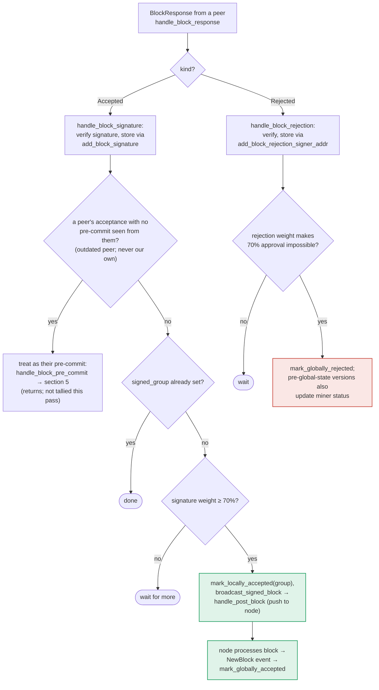

### Title
Peer-acceptance threshold path skips the chainstate/conflict recheck that the pre-commit path enforces before endorsing a block - (File: stacks-signer/src/v0/signer.rs)

### Summary
`handle_block_pre_commit` (the pre-commit → signature path) explicitly re-runs `check_block_against_signer_db_state` and the signed-conflict guard (`get_signed_conflicts`/`reorg_permit_stands`/`conflict_still_blocks`) immediately before this signer places its own signature, precisely because state can change between validation and threshold-crossing. `store_and_process_block_signature`, which is the *other* path that reaches the same terminal action (`mark_locally_accepted` + `broadcast_signed_block`) when enough peer `BlockAccepted` messages tally past the 70% weight threshold, contains no equivalent recheck at all before broadcasting.

### Finding Description
`handle_block_pre_commit` (`stacks-signer/src/v0/signer.rs:1250-1479`) is documented and coded to defend against exactly one race: "between validation and threshold, we may have signed a different block at the same height, possibly in another tenure, so the world must be re-checked before the signature leaves the box." It does this in order: `check_block_against_signer_db_state` [1](#0-0) , then the fresh-conflict scan against `get_signed_conflicts` with `reorg_permit_stands`/`conflict_still_blocks` [2](#0-1) , only then calling `mark_locally_accepted` and producing/broadcasting this signer's own acceptance [3](#0-2) .

`store_and_process_block_signature` (`stacks-signer/src/v0/signer.rs:2443-2538`) reaches the *same* consensus-relevant action — `mark_locally_accepted(true)` plus `broadcast_signed_block`, i.e. pushing the block to the node as accepted — but purely from tallying peer `BlockAccepted` signature weight, with **no call to `check_block_against_signer_db_state` and no conflict scan** anywhere in the function [4](#0-3) . The only bypass condition guarding entry into the accumulation logic is whether this signer has already recorded a pre-commit from that peer (`has_committed`) — if so, the peer's acceptance is tallied directly instead of being routed back through `handle_block_pre_commit` [5](#0-4) .

This is structurally the same class of bug as the `bypassSignatoryApproval` report: one code path (pre-commit → sign) performs the "important checks" (chainstate/state recheck, conflict guard) right before the safety-relevant action, while a second, functionally-equivalent path to the identical action (peer-signature tally → accept+broadcast) omits them entirely. The docs (`docs/signer-flows.md:349-387`) confirm this asymmetry is real in the current design: section 5's diagram shows an explicit `RECHECK` node before `SIGN`, while section 6's diagram for `BCAST` has no recheck node at all [6](#0-5) .

The race this can exploit: this same signer may sign block C at height h through the pre-commit→SIGN path (satisfying the fresh-conflict guard at that moment), and shortly after, delayed/gossiped `BlockAccepted` messages for a sibling block B at the same height (already pre-committed to by this signer earlier, hence `has_committed` is true and the peer messages are tallied rather than re-routed) arrive and cross the 70% threshold. `store_and_process_block_signature` will then unconditionally call `mark_locally_accepted(true)` for B and `broadcast_signed_block`, without ever checking that B now conflicts with the C this same signer already signed — the exact scenario the dedicated tests `signer_refuses_to_sign_second_sibling_tenure_start` / `reproposal_cannot_bypass_fresh_conflict` were written to prevent for the pre-commit path [7](#0-6) , but those tests exercise only the pre-commit/sign path, not the peer-acceptance tally path.

### Impact Explanation
This breaks the safety invariant that a signer must never endorse/push two conflicting blocks at the same height while a signature on one is still fresh — the invariant that `handle_block_pre_commit`'s conflict guard exists specifically to protect. Endorsing and broadcasting a conflicting, non-canonical sibling block via `broadcast_signed_block` is a signer participating in producing a conflicting-block acceptance, matching the "Critical" impact bar (a signer effectively acting toward a conflicting block being accepted).

### Likelihood Explanation
Reaching this code path does not require compromising other signers' keys or a malicious majority: it only requires (a) two conflicting sibling blocks at the same height, which one miner/tenure race can produce, and (b) ordinary gossip timing where this signer's own pre-commit record for the "losing" block already exists (satisfying `has_committed`) while its own conflicting signature on the other block was placed via the normal pre-commit path in between. That is a plausible, naturally occurring timing window rather than a contrived scenario, since the whole point of section 5's recheck is that exactly this kind of interleaving is expected to happen ("we may have signed a different block at the same height... between validation and threshold").

### Recommendation
Add the same recheck sequence used in `handle_block_pre_commit` — `check_block_against_signer_db_state` and the signed-conflict scan (`get_signed_conflicts`/`reorg_permit_stands`/`conflict_still_blocks`) — into `store_and_process_block_signature` before calling `mark_locally_accepted` and `broadcast_signed_block`, so that crossing the acceptance threshold via peer `BlockAccepted` tallies is held to the same standard as crossing it via the pre-commit path.

### Proof of Concept
Not independently executed against a live node in this pass (index/tool access is read-only); the trace above is derived directly from the two code paths and the existing test suite's documented intent:
1. Two sibling blocks B and C are proposed at height h in different tenures (miner-induced fork).
2. Signer S locally pre-commits to both B and C (as pre-commits are not vetoing, per docs section 7).
3. S reaches the pre-commit threshold and SIGNs C first, via `handle_block_pre_commit`'s recheck+conflict guard passing at that moment [8](#0-7) .
4. Shortly after, enough peers' `BlockAccepted` messages for B (for which S already has pre-commit records, so `has_committed` is true) arrive and push B's tallied weight over threshold in `store_and_process_block_signature`.
5. Because that function never re-runs the chainstate/conflict recheck, S calls `mark_locally_accepted(true)` and `broadcast_signed_block` for B despite having already signed conflicting C moments earlier — reproducing, via a different code path, exactly the scenario `signer_refuses_to_sign_second_sibling_tenure_start` was written to prevent for the pre-commit path [9](#0-8) .

### Citations

**File:** stacks-signer/src/v0/signer.rs (L1333-1457)
```rust
        if min_weight > commit_weight {
            debug!(
                "{self}: Not enough pre-committed to block {block_hash} (have {commit_weight}, need at least {min_weight}/{total_weight})"
            );
            return;
        }

        // The chain and signer db state may have changed materially since this block passed the
        // proposal-time checks (e.g. between validation and reaching the pre-commit threshold we
        // may have signed a block that this one would reorg). Re-run the chainstate checks
        // before putting a signature over the block, and respond with a rejection if they no
        // longer pass, just as the block validation response handler does.
        if let Some(block_rejection) =
            self.check_block_against_signer_db_state(stacks_client, &block_info.block)
        {
            warn!(
                "{self}: Reached the pre-commit threshold for a block, but it no longer passes the chainstate checks. Rejecting.";
                "signer_signature_hash" => %block_hash,
                "block_height" => block_info.block.header.chain_length,
                "reject_code" => %block_rejection.reason_code,
                "reject_reason" => &block_rejection.reason,
            );
            if let Err(e) = block_info.mark_locally_rejected() {
                if !block_info.has_reached_consensus() {
                    warn!("{self}: Failed to mark block as locally rejected: {e:?}");
                }
            };
            self.signer_db
                .insert_block(&block_info)
                .unwrap_or_else(|e| self.handle_insert_block_error(e));
            self.handle_block_rejection(&block_rejection, sortition_state);
            self.send_block_response(&block_info.block, block_rejection.into());
            return;
        }

        // A pre-commit may be superseded by a competing proposal at the same height (e.g. a
        // re-proposed tenure-start block after the first failed to reach consensus), but a
        // signature must not be superseded while it's still "fresh". A signed block at the
        // same or higher height in ANY tenure is a conflict: two blocks at the same height are
        // siblings no matter which tenure they belong to (e.g. the next tenure's tenure-start
        // block conflicts with the current tenure's block at the same height). Blocks in
        // tenures whose reorg we sanctioned under the reorg-timing rules are excluded, but
        // only while the sortition the permit was granted to is still canonical
        // (`check_parent_tenure_choice` records the permit, `reorg_permit_stands` re-derives
        // its validity from the node); every other question about whether a conflict is
        // still live is derived from the node in `conflict_still_blocks`.
        //
        // Unlike the chainstate check above, a refusal here is "for now" rather than a
        // broadcast rejection: a later pre-commit re-evaluation may still sign the block once
        // the conflicting signature has gone stale.
        let conflicts = match self
            .signer_db
            .get_signed_conflicts(block_info.block.header.chain_length, &block_hash)
        {
            Ok(conflicts) => conflicts,
            Err(e) => {
                warn!("{self}: Failed to query the signed blocks. Refusing to sign block {block_hash}: {e:?}");
                return;
            }
        };
        let freshness_cutoff = get_epoch_time_secs().saturating_sub(
            self.proposal_config
                .tenure_last_block_proposal_timeout
                .as_secs(),
        );
        // A fresh signature only blocks while the block it covers could still be part of the
        // chain: see `conflict_still_blocks`, which asks the node whether it is. Check
        // freshness first: it is a local timestamp comparison, while `reorg_permit_stands`
        // and `conflict_still_blocks` each query the node, so stale conflicts cost no
        // round-trips.
        if let Some(conflict) = conflicts.iter().find(|conflict| {
            conflict.last_endorsed > freshness_cutoff
                && !self.reorg_permit_stands(stacks_client, conflict)
                && self.conflict_still_blocks(
                    stacks_client,
                    conflict,
                    block_info.block.header.chain_length,
                )
        }) {
            warn!(
                "{self}: Reached the pre-commit threshold for a block, but we have recently signed or accepted a different block at the same or higher height. Refusing to sign.";
                "signer_signature_hash" => %block_hash,
                "block_height" => block_info.block.header.chain_length,
                "conflicting_signer_signature_hash" => %conflict.signer_signature_hash,
                "conflicting_block_height" => conflict.stacks_height,
                "conflicting_consensus_hash" => %conflict.consensus_hash,
            );
            return;
        }

        // No conflict is both fresh and still live. A conflict that no longer matters, i.e.
        // stale, or provably dead per `conflict_still_blocks`, cannot veto on its own. A
        // stale conflict in another tenure in particular no longer speaks for us: whether this
        // block may replace what another tenure built is settled by the chainstate checks above.
        // A stale conflict in this block's own tenure still blocks if the node already has that
        // tenure at or above the proposed height, since the proposal then duplicates state the
        // node has already built on. (The chainstate checks don't cover this for tenure-change
        // blocks: those check the parent tenure instead of their own.)
        // The permit check is deferred to here so that only same-tenure conflicts pay for it.
        if conflicts.iter().any(|conflict| {
            conflict.consensus_hash == block_info.block.header.consensus_hash
                && !self.reorg_permit_stands(stacks_client, conflict)
        }) {
            match stacks_client.get_tenure_tip(&block_info.block.header.consensus_hash) {
                Ok(tip) => {
                    let tip_height = tip.anchored_header.height();
                    if tip_height >= block_info.block.header.chain_length {
                        warn!(
                            "{self}: Reached the pre-commit threshold for a block that conflicts with previously signed or accepted blocks, and the canonical tip of its tenure is already at or above the proposed height. Refusing to sign.";
                            "signer_signature_hash" => %block_hash,
                            "block_height" => block_info.block.header.chain_length,
                            "canonical_tip_height" => tip_height,
                        );
                        return;
                    }
                }
                Err(e) => {
                    warn!(
                        "{self}: Failed to fetch the canonical tip of the proposed block's tenure: {e:?}. Treating the tenure as unconfirmed.";
                        "signer_signature_hash" => %block_hash,
                        "consensus_hash" => %block_info.block.header.consensus_hash,
                    );
                }
            }
        }
```

**File:** stacks-signer/src/v0/signer.rs (L1466-1479)
```rust
        // It is only considered globally accepted IFF we receive a new block event confirming it OR see the chain tip of the node advance to it.
        if let Err(e) = block_info.mark_locally_accepted(false) {
            if !block_info.has_reached_consensus() {
                warn!("{self}: Failed to mark block as locally accepted: {e:?}",);
            }
        }
        self.signer_db
            .insert_block(&block_info)
            .unwrap_or_else(|e| self.handle_insert_block_error(e));
        let accepted = self.create_block_acceptance(&block_info.block);
        // have to save the signature _after_ the block info
        self.handle_block_signature(stacks_client, sortition_state, &accepted);
        self.send_block_response(&block_info.block, accepted.into());
    }
```

**File:** stacks-signer/src/v0/signer.rs (L2454-2538)
```rust
        if !self
            .signer_db
            .add_block_signature(block_hash, signer_address, signature)
            .unwrap_or_else(|_| panic!("{self}: Failed to save block signature"))
        {
            return;
        }

        // If this isn't our own signature and we haven't seen a pre-commit from this signer yet, try treating it as a pre-commit in case the caller is running an outdated version
        if signer_address != &self.stacks_address && !self.signer_db.has_committed(block_hash, signer_address).inspect_err(|e| warn!("Failed to check if pre-commit message already considered for {signer_address:?} for {block_hash}: {e}")).unwrap_or(false) {
            self.handle_block_pre_commit(stacks_client, sortition_state, signer_address, block_hash);
            return;
        }

        if block_info.signed_group.is_some() {
            // We have already processed this block to the accepted state. Adding more signatures will not change anything so nothing to check.
            return;
        }
        // do we have enough signatures to broadcast?
        // i.e. is the threshold reached?
        let signatures = self
            .signer_db
            .get_block_signatures(block_hash)
            .unwrap_or_else(|_| panic!("{self}: Failed to load block signatures"));

        // put signatures in order by signer address (i.e. reward cycle order)
        let addrs_to_sigs: HashMap<_, _> = signatures
            .into_iter()
            .filter_map(|sig| {
                let Ok(public_key) = Secp256k1PublicKey::recover_to_pubkey_without_validating_low_s(
                    block_hash.bits(),
                    &sig,
                ) else {
                    return None;
                };
                let addr = StacksAddress::p2pkh(self.mainnet, &public_key);
                Some((addr, sig))
            })
            .collect();

        let signature_weight = self.signer_weights.get(signer_address).unwrap_or(&0);
        let total_signature_weight = self.compute_signature_signing_weight(addrs_to_sigs.keys());
        let total_weight = self.compute_signature_total_weight();

        let min_weight = NakamotoBlockHeader::compute_voting_weight_threshold(total_weight)
            .unwrap_or_else(|_| {
                panic!("{self}: Failed to compute threshold weight for {total_weight}")
            });

        if min_weight > total_signature_weight {
            info!("{self}: Received block acceptance, but have not yet reached the acceptance threshold.";
                "signer_signature_hash" => %block_hash,
                "signature_weight" => signature_weight,
                "consensus_hash" => %block_info.block.header.consensus_hash,
                "block_height" => block_info.block.header.chain_length,
                "total_weight_approved" => total_signature_weight,
                "total_weight" => total_weight,
                "percent_approved" => (total_signature_weight as f64 / total_weight as f64 * 100.0),
            );
            return;
        }
        info!("{self}: have reached the block acceptance threshold";
            "signer_signature_hash" => %block_hash,
            "signature_weight" => signature_weight,
            "consensus_hash" => %block_info.block.header.consensus_hash,
            "block_height" => block_info.block.header.chain_length,
            "total_weight_approved" => total_signature_weight,
            "total_weight" => total_weight,
            "percent_approved" => (total_signature_weight as f64 / total_weight as f64 * 100.0),
        );

        // have enough signatures to broadcast!
        // move block to LOCALLY accepted state.
        // It is only considered globally accepted IFF we receive a new block event confirming it OR see the chain tip of the node advance to it.
        if let Err(e) = block_info.mark_locally_accepted(true) {
            if !block_info.has_reached_consensus() {
                warn!("{self}: Failed to mark block as locally accepted: {e:?}");
            }
        }
        let _ = self.signer_db.insert_block(block_info).map_err(|e| {
            warn!("Failed to set group threshold signature timestamp for {block_hash}: {e:?}");
            panic!("{self} Failed to write block to signerdb: {e}");
        });
        self.broadcast_signed_block(stacks_client, block_info.block.clone(), &addrs_to_sigs);
    }
```

**File:** docs/signer-flows.md (L357-375)
```markdown

```

**File:** stacks-signer/src/v0/tests.rs (L770-826)
```rust
    #[test]
    fn signer_refuses_to_sign_second_sibling_tenure_start() {
        // Pin the fresh window far beyond the test's runtime so the guard can only take the
        // fresh branch; the stale branch is covered by the tests below.
        let (info_a, info_b, _) = run_sibling_scenario(Duration::from_secs(100_000), false, None);
        assert_a_signed(&info_a);
        // B is still pre-committed (the sibling is allowed to reach pre-commit), but the signer
        // must refuse to place a second signature on a conflicting same-height block in this
        // tenure while its signature on A is fresh.
        assert_eq!(
            info_b.state,
            BlockState::PreCommitted,
            "block B should be pre-committed but not promoted, got: {}",
            info_b.state
        );
        assert!(
            info_b.signed_self.is_none(),
            "block B must NOT be signed: the signer already signed a conflicting sibling in this tenure"
        );
    }

    #[test]
    fn stale_sibling_still_refused_when_canonical_tip_at_height() {
        // A zero timeout makes A's signature stale immediately, but the node reports A as the
        // canonical tip at the same height, so the replacement must still be refused.
        let (info_a, info_b, _) = run_sibling_scenario(Duration::ZERO, true, None);
        assert_a_signed(&info_a);
        assert_eq!(
            info_b.state,
            BlockState::PreCommitted,
            "block B should be pre-committed but not promoted, got: {}",
            info_b.state
        );
        assert!(
            info_b.signed_self.is_none(),
            "block B must NOT be signed: the conflicting sibling is canonical at this height"
        );
    }

    #[test]
    fn stale_sibling_replaced_when_canonical_tip_below() {
        // A zero timeout makes A's signature stale immediately, and the node's canonical tip
        // is still the parent (height 9): A failed to be confirmed, so the signer must sign
        // the replacement rather than stall the tenure (the reorg-recovery case).
        let (info_a, info_b, _) = run_sibling_scenario(Duration::ZERO, false, None);
        assert_a_signed(&info_a);
        assert_eq!(
            info_b.state,
            BlockState::LocallyAccepted,
            "block B should be signed: the conflicting sibling timed out and is not canonical, got: {}",
            info_b.state
        );
        assert!(
            info_b.signed_self.is_some(),
            "block B should carry our signature after the conflict timed out unconfirmed"
        );
    }
```
