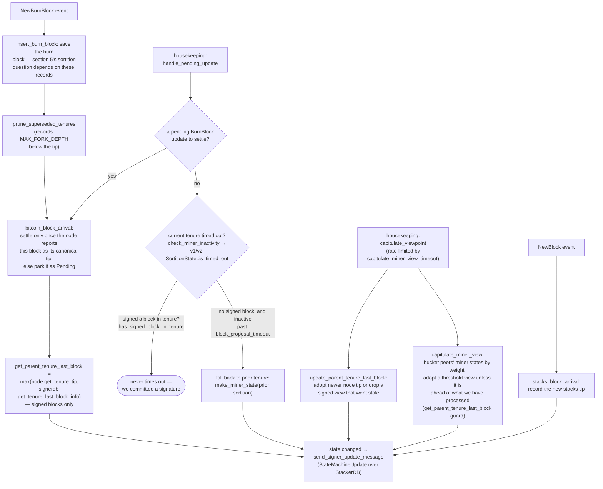

### Title
Signer re-checks at pre-commit/signing time never re-verify the block's miner-identity/consensus-hash binding, allowing a signature over a block from a no-longer-active miner - (File: stacks-signer/src/v0/signer.rs)

### Summary
The Matrix bug is a missing-equality-check on replacement: when a message *replaces* an already-validated original, the replacement is not re-checked for the property (encryption) that made the original trustworthy. The analogous pattern in this repo is `check_block_against_signer_db_state`, the function that is re-run at validate-ok time and again right before a signature is emitted (after the pre-commit threshold is reached). It only re-verifies tenure/height continuity (`check_tenure_change_confirms_parent` / `check_latest_block_in_tenure`), but never re-verifies the miner-identity checks (`current_miner_pkh` match, `consensus_hash == tenure_id`, bitvec) that `GlobalStateView::check_proposal` performs only once, at initial proposal receipt.

### Finding Description
`GlobalStateView::check_proposal` (`stacks-signer/src/chainstate/v2.rs:113-175`) is the only place that checks that a proposed block's consensus hash matches the currently active miner's `tenure_id`, and that the block's recovered miner pubkey hash matches `current_miner_pkh` (`RejectReason::ConsensusHashMismatch`, `RejectReason::PubkeyHashMismatch`). This is explicitly documented as proposal-time-only in `docs/signer-flows.md:425-433`: "Two things belong to the proposal path only and are **not** re-run at validate-ok or at signing: … the v2 `check_proposal` wrapper checks miner pubkey hash, consensus hash, the pox bitvec, and tenure-extend rules before delegating here."

However, `self.signer_state.current_miner` (the "who is the active miner" view) is a live, mutable value that can change between the moment a block is proposed/validated and the moment the signer actually signs it: it is updated by `capitulate_miner_view`/`capitulate_viewpoint` adopting a threshold peer view, or by falling back to the prior tenure on inactivity (`docs/signer-flows.md:450-476`, section 8). The block-signing path re-checks chainstate consistency but not miner identity:

- `handle_block_validate_ok` re-checks via `check_block_against_signer_db_state`.
- The pre-commit-threshold path in `handle_block_pre_commit` (`stacks-signer/src/v0/signer.rs:1340-1366`) explicitly re-runs "the chainstate checks" before signing, but that function (`check_block_against_signer_db_state`, `stacks-signer/src/v0/signer.rs:1803-1880`) only calls `SortitionData::check_tenure_change_confirms_parent` (tenure-change case) or `SortitionData::check_latest_block_in_tenure` (non-tenure-change case) — neither of which touches `current_miner_pkh` or `tenure_id` matching.

So if, between validation and the pre-commit threshold being reached, the signer's `current_miner` view moves on (a new miner becomes active, or the signer falls back to a prior tenure after a timeout), the block already queued for signing is not re-validated against the new miner identity before the signature is placed. The equality that should hold at signing time — "the block's `(consensus_hash, miner_pubkey_hash)` binds to the currently active miner" — is only checked once, at proposal time, and the check is never repeated at the moment the signature is actually produced.

### Impact Explanation
If the identity/tenure-binding check is stale at signing time, a single miner (plus ordinary StackerDB gossip that everyone already sees) can arrange for its early-round-valid proposal to sit in pre-commit long enough for the signer's local miner view to move on, and still collect a legitimate signer's signature over a block that no longer corresponds to that signer's current notion of the active/legitimate miner. This is a "signer signing a non-canonical/stale-authorization block" — a break of the equality between "who was authorized when the check ran" and "who is authorized when the signature is emitted," which is the class of Critical impact called out in scope (a signer signing an invalid/non-canonical block).

### Likelihood Explanation
This requires only a single miner controlling proposal timing plus ordinary gossip-visible state-machine updates (`StateMachineUpdate`) from other signers already flowing through StackerDB — no majority key compromise, no auth_token, and no other signer's private key. The pre-commit threshold mechanism intentionally allows a delay between validation and signature (documented as "may have signed a _different_ block ... so the world must be re-checked" in `docs/signer-flows.md:229-235`), and that re-check window is exactly where the miner-identity check is missing.

### Recommendation
Re-run the miner-identity/consensus-hash/pubkey-hash and bitvec checks that `GlobalStateView::check_proposal` performs at proposal time inside `check_block_against_signer_db_state`, so that the same equality is enforced both before pre-commit and immediately before the signature is emitted, not only once at initial proposal receipt.

### Proof of Concept
1. Miner M1 proposes block B for tenure T1; signer validates and pre-commits B (`check_proposal` passes: consensus_hash/pubkey checks against `current_miner_pkh = M1`).
2. Before B reaches the ≥70% pre-commit weight threshold, the signer's local state machine adopts a new active-miner view (via `capitulate_miner_view` reacting to peers' `StateMachineUpdate`s, or via inactivity fallback) such that the currently active miner is no longer M1/T1.
3. Pre-commits for B keep arriving from other signers whose views have not yet updated, crossing the threshold on this signer.
4. `handle_block_pre_commit` calls `check_block_against_signer_db_state`, which only checks tenure continuity (`check_tenure_change_confirms_parent`/`check_latest_block_in_tenure`) — it never re-checks that B's `consensus_hash`/miner pubkey still match `current_miner_pkh`/`tenure_id` — so the signer signs B despite its own view no longer recognizing M1/T1 as authorized. [1](#0-0) [2](#0-1) [3](#0-2) [4](#0-3) [5](#0-4)

### Citations

**File:** stacks-signer/src/chainstate/v2.rs (L111-175)
```rust
impl GlobalStateView {
    /// Apply checks from the signer state machine on the block proposal.
    pub fn check_proposal(
        &self,
        client: &StacksClient,
        signer_db: &mut SignerDb,
        block: &NakamotoBlock,
    ) -> Result<(), RejectReason> {
        let MinerState::ActiveMiner {
            current_miner_pkh,
            tenure_id,
            parent_tenure_id,
            ..
        } = &self.signer_state.current_miner
        else {
            info!(
                "No valid current miner. Considering invalid.";
                "block_height" => block.header.chain_length,
                "signer_signature_hash" => %block.header.signer_signature_hash()
            );
            return Err(RejectReason::InvalidMiner);
        };
        if &block.header.consensus_hash != tenure_id {
            info!("Miner block proposal consensus hash does not match the current miner's tenure id. Considering invalid.";
                "block_height" => block.header.chain_length,
                "signer_signature_hash" => %block.header.signer_signature_hash(),
                "block_consensus_hash" => %block.header.consensus_hash,
                "active_miner_tenure_id" => %tenure_id,
                "active_miner_parent_tenure_id" => %parent_tenure_id,
            );
            return Err(RejectReason::ConsensusHashMismatch {
                actual: block.header.consensus_hash.clone(),
                expected: tenure_id.clone(),
            });
        }
        let Some(miner_pk) = block.header.recover_miner_pk() else {
            warn!("Failed to recover miner pubkey";
                  "signer_signature_hash" => %block.header.signer_signature_hash(),
                  "consensus_hash" => %block.header.consensus_hash);
            return Err(RejectReason::IrrecoverablePubkeyHash);
        };
        let miner_pkh = Hash160::from_data(&miner_pk.to_bytes_compressed());
        if current_miner_pkh != &miner_pkh {
            warn!(
                "Miner block proposal pubkey does not match the winning pubkey hash for its sortition. Considering invalid.";
                "proposed_block_consensus_hash" => %block.header.consensus_hash,
                "signer_signature_hash" => %block.header.signer_signature_hash(),
                "proposed_block_pubkey" => &miner_pk.to_hex(),
                "proposed_block_pubkey_hash" => %miner_pkh,
                "active_miner_pubkey_hash" => %current_miner_pkh,
            );
            return Err(RejectReason::PubkeyHashMismatch);
        }
        let bitvec_all_1s = block.header.pox_treatment.iter().all(|entry| entry);
        if !bitvec_all_1s {
            warn!(
                "Miner block proposal has bitvec field which punishes in disagreement with signer. Considering invalid.";
                "proposed_block_consensus_hash" => %block.header.consensus_hash,
                "signer_signature_hash" => %block.header.signer_signature_hash(),
                "active_miner_consensus_hash" => ?tenure_id,
                "active_miner_parent_consensus_hash" => ?parent_tenure_id,
            );
            return Err(RejectReason::InvalidBitvec);
        }

```

**File:** stacks-signer/src/v0/signer.rs (L1338-1366)
```rust
        }

        // The chain and signer db state may have changed materially since this block passed the
        // proposal-time checks (e.g. between validation and reaching the pre-commit threshold we
        // may have signed a block that this one would reorg). Re-run the chainstate checks
        // before putting a signature over the block, and respond with a rejection if they no
        // longer pass, just as the block validation response handler does.
        if let Some(block_rejection) =
            self.check_block_against_signer_db_state(stacks_client, &block_info.block)
        {
            warn!(
                "{self}: Reached the pre-commit threshold for a block, but it no longer passes the chainstate checks. Rejecting.";
                "signer_signature_hash" => %block_hash,
                "block_height" => block_info.block.header.chain_length,
                "reject_code" => %block_rejection.reason_code,
                "reject_reason" => &block_rejection.reason,
            );
            if let Err(e) = block_info.mark_locally_rejected() {
                if !block_info.has_reached_consensus() {
                    warn!("{self}: Failed to mark block as locally rejected: {e:?}");
                }
            };
            self.signer_db
                .insert_block(&block_info)
                .unwrap_or_else(|e| self.handle_insert_block_error(e));
            self.handle_block_rejection(&block_rejection, sortition_state);
            self.send_block_response(&block_info.block, block_rejection.into());
            return;
        }
```

**File:** stacks-signer/src/v0/signer.rs (L1799-1880)
```rust
    /// WARNING: This is an incomplete check. Do NOT call this function PRIOR to check_proposal or block_proposal validation succeeds.
    ///
    /// Re-verify a block's chain length against the last signed block within signerdb.
    /// This is required in case a block has been approved since the initial checks of the block validation endpoint.
    fn check_block_against_signer_db_state(
        &mut self,
        stacks_client: &StacksClient,
        proposed_block: &NakamotoBlock,
    ) -> Option<BlockRejection> {
        let signer_signature_hash = proposed_block.header.signer_signature_hash();
        // If this is a tenure change block, ensure that it confirms the correct number of blocks from the parent tenure.
        if let Some(tenure_change) = proposed_block.get_tenure_change_tx_payload() {
            // Ensure that the tenure change block confirms the expected parent block
            match SortitionData::check_tenure_change_confirms_parent(
                tenure_change,
                proposed_block,
                &mut self.signer_db,
                stacks_client,
                self.proposal_config.tenure_last_block_proposal_timeout,
                self.proposal_config.reorg_attempts_activity_timeout,
            ) {
                Ok(true) => return None,
                Ok(false) => {
                    return Some(self.create_block_rejection(
                        RejectReason::SortitionViewMismatch,
                        proposed_block,
                    ))
                }
                Err(e) => {
                    warn!("{self}: Error checking block proposal: {e}";
                        "signer_signature_hash" => %signer_signature_hash,
                        "block_id" => %proposed_block.block_id()
                    );
                    return Some(self.create_block_rejection(
                        RejectReason::ConnectivityIssues(
                            "error checking block proposal".to_string(),
                        ),
                        proposed_block,
                    ));
                }
            }
        }

        // Ensure that the block is the last block in the chain of its current tenure.
        match SortitionData::check_latest_block_in_tenure(
            &proposed_block.header.consensus_hash,
            proposed_block,
            &mut self.signer_db,
            stacks_client,
            self.proposal_config.tenure_last_block_proposal_timeout,
            self.proposal_config.reorg_attempts_activity_timeout,
        ) {
            Ok(is_latest) => {
                if !is_latest {
                    warn!(
                        "Miner's block proposal does not confirm as many blocks as we expect";
                        "proposed_block_consensus_hash" => %proposed_block.header.consensus_hash,
                        "proposed_block_signer_signature_hash" => %signer_signature_hash,
                        "proposed_chain_length" => proposed_block.header.chain_length,
                    );
                    Some(self.create_block_rejection(
                        RejectReason::SortitionViewMismatch,
                        proposed_block,
                    ))
                } else {
                    None
                }
            }
            Err(e) => {
                warn!("{self}: Failed to check block against signer db: {e}";
                    "signer_signature_hash" => %signer_signature_hash,
                    "block_id" => %proposed_block.block_id()
                );
                Some(self.create_block_rejection(
                    RejectReason::ConnectivityIssues(
                        "failed to check block against signer db".to_string(),
                    ),
                    proposed_block,
                ))
            }
        }
    }
```

**File:** docs/signer-flows.md (L420-437)
```markdown
A failed check becomes a different rejection depending on who asked.
`check_block_against_signer_db_state` returns `SortitionViewMismatch`, or
`ConnectivityIssues` when the lookup itself errored rather than answering; the v2
`check_proposal` path returns `InvalidParentBlock`.

Two things belong to the proposal path only and are **not** re-run at validate-ok
or at signing:

- `validate_tenure_change_payload` rejects with `DuplicateBlockFound` when we
  have already accepted a block in the tenure a tenure-change block is starting.
  v2 counts locally or globally accepted blocks (`get_last_signed_block`); v1
  counts only globally accepted ones (`get_last_globally_accepted_block`).
- the v2 `check_proposal` wrapper checks miner pubkey hash, consensus hash, the
  pox bitvec, and tenure-extend rules before delegating here.

Because the duplicate check never runs again, a block that crosses the pre-commit
threshold long after it was proposed relies on section 5's own-tenure conflict
guard to cover the same ground.
```

**File:** docs/signer-flows.md (L450-476)
```markdown
## 8. Burn blocks & the miner-view state machine

Independent of any single block, the signer maintains a view of _who the current
miner is and what they should build on_, and broadcasts it as a
`StateMachineUpdate`. The whole miner state, including
`parent_tenure_last_block`, is the equality key for global agreement, so what
this flow computes is consensus-visible.


```
