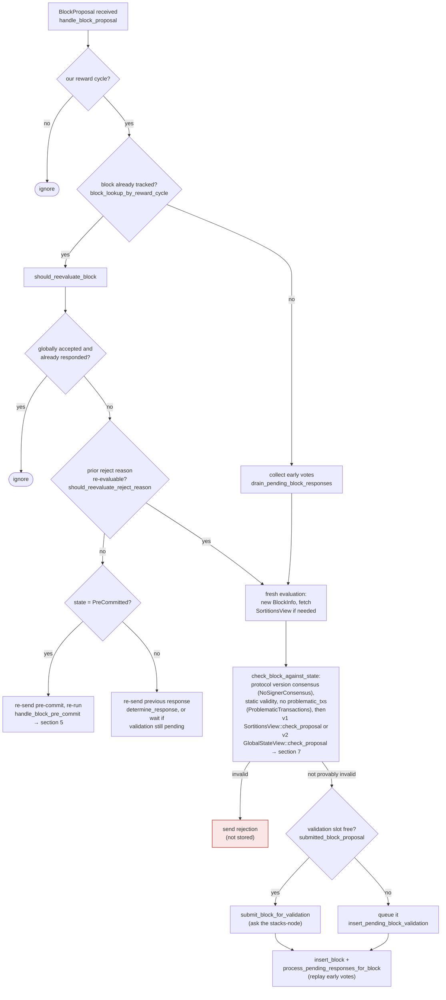

## Title
Signer weight double-counted across accept/reject tallies when a signer flips its vote after already responding — ([File: stacks-node/src/nakamoto_node/stackerdb_listener.rs])

### Summary
`StackerDBListener` (the miner-side aggregator that decides when a block has reached the 70% signing threshold or the 30% blocking-rejection threshold) guards each of its two weight tallies (`total_weight_approved`, `total_weight_rejected`) with a different, independent key. The `Accepted` handler only checks `gathered_signatures` (a `BTreeMap<slot_id, signature>`) before adding weight, while the `Rejected` handler checks a separate `responded_signers: HashSet<slot_id>` before adding weight, and the `Accepted` handler also unconditionally inserts into `responded_signers` after its own guard passes. [1](#0-0) [2](#0-1) 

This is analogous to the Illuminate `Redeemer` issue: two accounting paths (`holdings` updates from the multi-PT `redeem()` and the Sense `redeem()`) share state but are each guarded independently, so a caller that hits both paths gets counted twice. Here, a single signer that first rejects (guarded/counted via `responded_signers`) and later accepts the same block (guarded/counted via `gathered_signatures`, a disjoint key) gets its weight added to *both* `total_weight_rejected` and `total_weight_approved`, because the `Accepted` guard never checks whether that slot already has recorded rejection weight.

### Finding Description
In `handle_block_response`-equivalent logic inside `StackerDBListener`'s message loop:

- On `BlockResponse::Accepted`, weight is added to `block.total_weight_approved` only if `!block.gathered_signatures.contains_key(&slot_id)`, after which `slot_id` is inserted into both `gathered_signatures` and `responded_signers`. [1](#0-0) 
- On `BlockResponse::Rejected`, weight is added to `block.total_weight_rejected` only if `block.responded_signers.insert(slot_id)` returns `true` (i.e., first time this slot has responded at all). [2](#0-1) 

If signer S (slot `k`) rejects first, `responded_signers` gains `k` and `total_weight_rejected += weight_k`. If S later re-signs and accepts the same block (a normal, permitted re-evaluation path in the v0 signer, e.g. after `should_reevaluate_block`/`handle_block_pre_commit` reconsideration — see `docs/signer-flows.md` section 3/5 on re-evaluation), [3](#0-2)  the `Accepted` handler's guard only inspects `gathered_signatures`, which does not yet contain `k`, so it adds `weight_k` a second time into `total_weight_approved` — without ever removing/correcting the stale `weight_k` already present in `total_weight_rejected`.

The result: `total_weight_approved + total_weight_rejected` can exceed `total_weight`, and specifically `total_weight_rejected` retains a phantom contribution from a signer who has since switched to accepting. This breaks the equality the coordinator relies on ("rejection weight recounted for a switched vote" — aggregated weight no longer reflects the verified, current set of distinct rejecting signers).

### Impact Explanation
The coordinator's decision logic in `signer_coordinator.rs::get_block_status` treats `total_weight_rejected.saturating_add(weight_threshold) > total_weight` as proof that 70% approval is now mathematically impossible and aborts the proposal with `NakamotoNodeError::SignersRejected`. [4](#0-3)  Because a signer's stale rejection weight is never retracted once that signer switches to acceptance, this stale weight can combine with a smaller number of genuinely-still-rejecting signers to cross the 30% blocking threshold even though, in reality, fewer signers currently reject the block than the tally implies. This wedges the miner into abandoning a block proposal that in fact has (or could reach) sufficient real support, forcing it to strip/exclude transactions or re-propose — a liveness/availability degradation on block production driven purely by stale accounting, not by genuine signer disagreement.

### Likelihood Explanation
This requires only one non-majority signer (or a signer whose gossip/network path allows sending a Reject then later an Accept for the same block — a scenario the codebase itself anticipates and supports via `should_reevaluate_block`/pre-commit re-evaluation flows). [5](#0-4)  No majority collusion or key compromise is needed; a single signer naturally flipping its vote (e.g., after a stale-conflict re-evaluation) triggers the double count. Likelihood is therefore non-trivial in normal operation, especially under network delay/reordering where a rejection and a later legitimate acceptance for the same block are both observed by the coordinator.

### Recommendation
Guard the `Accepted` weight-increment with the same key space as `Rejected` (or a single unified "has this slot already contributed weight, and to which side" map), and when a signer's vote flips, subtract the previously counted weight from the stale tally before adding it to the new one. E.g., track `HashMap<slot_id, VoteWeight{Accepted|Rejected}>` and reconcile transitions atomically instead of using two independently-guarded collections (`gathered_signatures` vs `responded_signers`).

### Proof of Concept
1. Miner proposes block `B`; coordinator starts `get_block_status` and listens via `StackerDBListener`.
2. Signer S (weight `w`) sends `BlockResponse::Rejected` for `B`. `responded_signers.insert(slot_S)` → `true` → `total_weight_rejected += w`. [2](#0-1) 
3. S later legitimately re-evaluates (e.g., a stale-conflict resolves) and sends `BlockResponse::Accepted` for the same `B`. `gathered_signatures.contains_key(slot_S)` is `false` (S never accepted before) → `total_weight_approved += w`. [1](#0-0) 
4. Now `total_weight_rejected` still includes `w` from step 2, and `total_weight_approved` also includes `w` from step 3 — `w` counted twice across the two tallies, with `total_weight_rejected` left stale/incorrect.
5. If enough other signers genuinely reject (just under 30% by themselves), the stale `w` tips `total_weight_rejected` over the blocking-minority threshold in `get_block_status`, causing `Err(NakamotoNodeError::SignersRejected)` even though the real current rejecting weight (excluding S, who switched to accept) does not warrant it. [4](#0-3)

### Citations

**File:** stacks-node/src/nakamoto_node/stackerdb_listener.rs (L443-465)
```rust
                        if !block.gathered_signatures.contains_key(&slot_id) {
                            block.total_weight_approved = block
                                .total_weight_approved
                                .saturating_add(signer_entry.weight);

                            info!("StackerDBListener: Signature Added to block";
                                "signer_signature_hash" => %block_sighash,
                                "signer_pubkey" => signer_pubkey.to_hex(),
                                "signer_slot_id" => slot_id,
                                "signature" => %signature,
                                "signer_weight" => signer_entry.weight,
                                "total_weight_approved" => block.total_weight_approved,
                                "percent_approved" => block.total_weight_approved as f64 / self.total_weight as f64 * 100.0,
                                "total_weight_rejected" => block.total_weight_rejected,
                                "percent_rejected" => block.total_weight_rejected as f64 / self.total_weight as f64 * 100.0,
                                "weight_threshold" => self.weight_threshold,
                                "tenure_extend_timestamp" => tenure_extend_timestamp,
                                "read_count_extend_timestamp" => read_count_extend_timestamp,
                                "server_version" => metadata.server_version,
                            );
                        }
                        block.gathered_signatures.insert(slot_id, signature);
                        block.responded_signers.insert(slot_id);
```

**File:** stacks-node/src/nakamoto_node/stackerdb_listener.rs (L515-518)
```rust
                        if block.responded_signers.insert(slot_id) {
                            block.total_weight_rejected = block
                                .total_weight_rejected
                                .saturating_add(signer_entry.weight);
```

**File:** docs/signer-flows.md (L164-203)
```markdown
## 3. A block proposal arrives

The miner broadcasts a proposal. If we've seen this exact block before,
`should_reevaluate_block` decides whether the old verdict stands; a block we
only pre-committed to is deliberately routed back through the pre-commit
evaluation so a re-proposal cannot shortcut to a signature. A fresh proposal is
checked against our view of the world _before_ spending a node validation on it.



Early votes: acceptances, rejections, and pre-commits that arrived before the
proposal itself are parked in pending tables and replayed once the proposal is
known.

> Anchors: `handle_block_proposal`, `should_reevaluate_block`,
> `should_reevaluate_reject_reason`, `check_block_against_state`,
> `submit_block_for_validation`, `process_pending_responses_for_block`
> (signer.rs); `check_proposal` (chainstate/v1.rs, v2.rs)
```

**File:** stacks-node/src/nakamoto_node/signer_coordinator.rs (L509-540)
```rust
            if block_status
                .total_weight_rejected
                .saturating_add(self.weight_threshold)
                > self.total_weight
            {
                info!(
                    "{}/{} signer weight votes to reject block",
                    block_status.total_weight_rejected, self.total_weight;
                    "signer_signature_hash" => %block_signer_sighash,
                );
                counters.bump_naka_rejected_blocks();

                // Only act on failed txids that a blocking minority (>30% weight) agrees on
                let blocking_minority = self.total_weight.saturating_sub(self.weight_threshold);
                let mut temporarily_excluded_txids = HashSet::new();
                let mut permanently_excluded_txids = HashSet::new();
                for (txid, info) in &block_status.failed_txids {
                    if info.total_weight > blocking_minority {
                        // Do not perma ban txids that only a small minority of signers reported as problematic
                        // But make sure its removed from the next block proposal
                        if info.problematic_weight > blocking_minority {
                            permanently_excluded_txids.insert(txid.clone());
                        } else {
                            temporarily_excluded_txids.insert(txid.clone());
                        }
                    }
                }

                return Err(NakamotoNodeError::SignersRejected {
                    temporarily_excluded_txids,
                    permanently_excluded_txids,
                });
```
