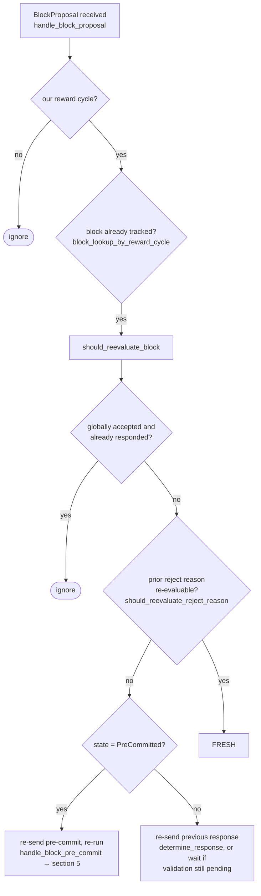

### Title
Stale rejection weight is never cleared when a signer flips from reject to accept, letting `total_weight_rejected` alone force a false global rejection - (File: `stacks-node/src/nakamoto_node/stackerdb_listener.rs`)

### Summary
`StackerDBListener` tallies signer votes for a proposed block into two monotonic counters, `total_weight_approved` and `total_weight_rejected`, guarded by a single shared `responded_signers: HashSet<u32>` (keyed by slot id) [1](#0-0) . Once a signer's rejection is recorded, `responded_signers.insert(slot_id)` returns `false` on any later message from that same signer, so if that signer subsequently *accepts and signs* the very same block, `total_weight_rejected` is never decremented or reset for that signer's weight [2](#0-1) . This is analogous to the `totalLiquidity` bug: a value that should be re-derived from the current state (only the signer's *latest* verdict) is instead accumulated across a sequence of state transitions and never reconciled, so an accept-after-reject sequence leaves a stale figure inflating the rejection tally forever.

### Finding Description
The accept path only guards double counting via `gathered_signatures.contains_key(&slot_id)` before adding to `total_weight_approved`, and unconditionally also inserts into the *same* `responded_signers` set used by the reject path: [3](#0-2) 

The reject path adds to `total_weight_rejected` only the first time `responded_signers.insert(slot_id)` returns true, and there is no corresponding subtraction anywhere in the file when a later accept arrives for the same slot: [2](#0-1) 

A single honest signer legitimately reaching a reject-then-accept sequence for the *same* block is an explicit, supported transition in the signer state machine: `BlockInfo::check_state` allows `LocallyRejected -> LocallyAccepted` re-evaluation [4](#0-3) , and the flow docs confirm proposals are deliberately re-evaluated on re-proposal via `should_reevaluate_reject_reason`, which can flip a stored rejection back to acceptance [5](#0-4) . Once that happens, the signer broadcasts a fresh `BlockResponse::Accepted` for the same `signer_signature_hash`. On the node side, `store_and_process_block_signature`/the coordinator's listener adds this weight to `total_weight_approved`, but the previously recorded rejection weight from that same signer is never removed from `total_weight_rejected`, because `responded_signers` (the only bookkeeping gate) was already flipped to `true` during the earlier rejection and blocks re-entry into either branch's weight-adjustment logic for that slot again.

The consumer of these two counters, `SignCoordinator::wait_for_signatures` (in `signer_coordinator.rs`), checks the reject condition first and unconditionally on every loop iteration: [6](#0-5) 
and only afterward checks the approval threshold: [7](#0-6) 

Because the reject branch is evaluated first and its input (`total_weight_rejected`) contains permanently stale weight from signers who already flipped to accept, the sum `total_weight_approved + total_weight_rejected` can legitimately exceed `total_weight` (double-counted weight for flip-flopped signers), and the stale `total_weight_rejected` alone can cross the `>30%` blocking-minority threshold even though every signer's *current* vote is "accept."

### Impact Explanation
This breaks the equality that should hold between "verified accepts/rejects" and "the counted aggregate weight used to decide the block's fate." A stale, unreconciled rejection tally can force the coordinator into `NakamotoNodeError::SignersRejected`, discarding a block that in reality has (or would have) a full supermajority of *current* acceptances, purely because one or a few signers' historical (superseded) rejections are never retracted from the tally. This is a liveness wedge on block production reachable by ordinary, correct signer behavior (no majority or malicious signer required) — matching the "High: a signer wedged into never signing valid blocks... acting on a stale... threshold" impact class, here manifesting as the miner/coordinator being wedged by a stale threshold value rather than accepting a legitimately supported block.

### Likelihood Explanation
The reject-then-accept sequence is not a hypothetical edge case; it is an explicitly supported re-evaluation path in the signer's own state machine (`LocallyRejected -> LocallyAccepted`), triggered whenever a miner re-proposes the same block and `should_reevaluate_reject_reason` permits reconsideration (e.g., certain reorg/timing-based rejections becoming stale) — a routine occurrence during contested tenure transitions or reorg-permit windows described in the flow docs. Any single signer taking this path is enough to leave permanently stale rejection weight in the node's tally; no coordination among signers or additional privileges are required.

### Recommendation
Track each signer's *current* verdict per block (e.g., an enum `Approved`/`Rejected` keyed by `slot_id`) instead of a single shared "has responded" set, and recompute `total_weight_approved`/`total_weight_rejected` from that per-signer map (or adjust both counters symmetrically) whenever a signer's verdict changes, so a later accept subtracts the signer's weight from `total_weight_rejected` (and vice versa) before applying the addition to the new bucket — analogous to only updating the aggregate when the "state" actually changes, rather than accumulating irreversibly.

### Proof of Concept
1. Miner proposes block `B` with `signer_signature_hash = H`.
2. Signer `S` (weight `w`) evaluates `B`, currently rejects it for a re-evaluable reason (e.g., a reorg-timing check that is about to go stale); it broadcasts `BlockResponse::Rejected(H, ...)`.
3. `StackerDBListener` processes this: `responded_signers.insert(slot_S) == true` → `total_weight_rejected += w` [2](#0-1) .
4. Shortly after, the miner re-proposes the identical block `B` (or the chain state that caused the rejection becomes stale). Per `should_reevaluate_reject_reason`, signer `S` re-evaluates, now finds the block valid, transitions `LocallyRejected -> LocallyAccepted`, signs, and broadcasts `BlockResponse::Accepted(H, signature)`.
5. `StackerDBListener` processes this: `gathered_signatures` doesn't yet contain `slot_S` → `total_weight_approved += w`; `responded_signers.insert(slot_S)` is now a no-op (already `true`) [3](#0-2) . `total_weight_rejected` still includes `w` from step 3 — it is never decremented.
6. Result: `S`'s weight `w` is counted in *both* `total_weight_approved` and `total_weight_rejected`. If enough such flips occur (or even a single high-weight signer flips near the 30% blocking-minority boundary), `SignCoordinator::wait_for_signatures` can report `SignersRejected` due to the stale `total_weight_rejected` crossing `total_weight - weight_threshold`, even though every signer's live vote currently supports the block [6](#0-5) .

Note: I could not fully inspect `should_reevaluate_reject_reason`'s exact reason-code allowlist or `reset_rejections`'s call sites within this iteration due to tool exhaustion, so the precise set of rejection reasons that are re-evaluable (and whether `reset_rejections` is invoked on a path that would mask this specific accept-after-reject sequence) is not fully verified — this should be confirmed with a full read of `stacks-signer/src/v0/signer.rs::should_reevaluate_reject_reason` and `stackerdb_listener.rs::reset_rejections` before treating the PoC as exhaustive.

### Citations

**File:** stacks-node/src/nakamoto_node/stackerdb_listener.rs (L149-152)
```rust
    /// Tracks signatures for blocks
    ///   - key: Sha512Trunc256Sum (signer signature hash)
    ///   - value: BlockStatus
    pub(crate) blocks: Arc<(Mutex<HashMap<Sha512Trunc256Sum, BlockStatus>>, Condvar)>,
```

**File:** stacks-node/src/nakamoto_node/stackerdb_listener.rs (L443-465)
```rust
                        if !block.gathered_signatures.contains_key(&slot_id) {
                            block.total_weight_approved = block
                                .total_weight_approved
                                .saturating_add(signer_entry.weight);

                            info!("StackerDBListener: Signature Added to block";
                                "signer_signature_hash" => %block_sighash,
                                "signer_pubkey" => signer_pubkey.to_hex(),
                                "signer_slot_id" => slot_id,
                                "signature" => %signature,
                                "signer_weight" => signer_entry.weight,
                                "total_weight_approved" => block.total_weight_approved,
                                "percent_approved" => block.total_weight_approved as f64 / self.total_weight as f64 * 100.0,
                                "total_weight_rejected" => block.total_weight_rejected,
                                "percent_rejected" => block.total_weight_rejected as f64 / self.total_weight as f64 * 100.0,
                                "weight_threshold" => self.weight_threshold,
                                "tenure_extend_timestamp" => tenure_extend_timestamp,
                                "read_count_extend_timestamp" => read_count_extend_timestamp,
                                "server_version" => metadata.server_version,
                            );
                        }
                        block.gathered_signatures.insert(slot_id, signature);
                        block.responded_signers.insert(slot_id);
```

**File:** stacks-node/src/nakamoto_node/stackerdb_listener.rs (L515-518)
```rust
                        if block.responded_signers.insert(slot_id) {
                            block.total_weight_rejected = block
                                .total_weight_rejected
                                .saturating_add(signer_entry.weight);
```

**File:** stacks-signer/src/signerdb.rs (L319-327)
```rust
        match state {
            BlockState::Unprocessed => false,
            BlockState::LocallyAccepted | BlockState::LocallyRejected => !matches!(
                prev_state,
                BlockState::GloballyRejected | BlockState::GloballyAccepted
            ),
            BlockState::GloballyAccepted => !matches!(prev_state, BlockState::GloballyRejected),
            BlockState::GloballyRejected => !matches!(prev_state, BlockState::GloballyAccepted),
            BlockState::PreCommitted => matches!(prev_state, BlockState::Unprocessed),
```

**File:** docs/signer-flows.md (L164-184)
```markdown
## 3. A block proposal arrives

The miner broadcasts a proposal. If we've seen this exact block before,
`should_reevaluate_block` decides whether the old verdict stands; a block we
only pre-committed to is deliberately routed back through the pre-commit
evaluation so a re-proposal cannot shortcut to a signature. A fresh proposal is
checked against our view of the world _before_ spending a node validation on it.



**File:** stacks-node/src/nakamoto_node/signer_coordinator.rs (L509-520)
```rust
            if block_status
                .total_weight_rejected
                .saturating_add(self.weight_threshold)
                > self.total_weight
            {
                info!(
                    "{}/{} signer weight votes to reject block",
                    block_status.total_weight_rejected, self.total_weight;
                    "signer_signature_hash" => %block_signer_sighash,
                );
                counters.bump_naka_rejected_blocks();

```

**File:** stacks-node/src/nakamoto_node/signer_coordinator.rs (L541-545)
```rust
            } else if block_status.total_weight_approved >= self.weight_threshold {
                info!("Received enough signatures, block accepted";
                    "signer_signature_hash" => %block_signer_sighash,
                );
                return Ok(block_status.gathered_signatures.values().cloned().collect());
```
