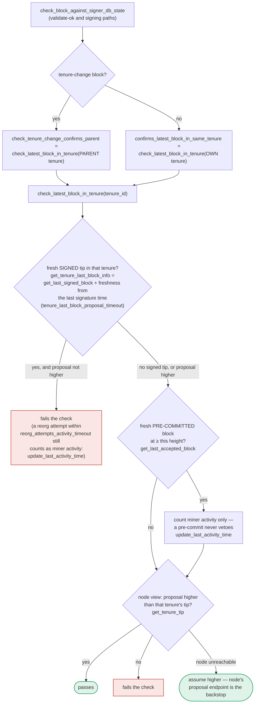

## Title
Signer can be induced to sign two conflicting blocks in the same tenure at the same height after a stale-signature window expires — ([File: stacks-signer/src/v0/signer.rs])

### Summary
`handle_block_pre_commit`'s same-tenure conflict guard only blocks a competing proposal if the node's own view of the tenure's chain tip has already reached the conflicting height. If the previously signed sibling block was never submitted to (or accepted by) the node — e.g. because the block-producer withheld it — and enough time passes for that signature to be considered "stale," the signer will sign a second, different block at the same height in the same tenure, breaking the one-signed-block-per-height safety invariant with no need for a majority of the signer set or any key compromise.

### Finding Description
The signer's chainstate re-check (`check_block_against_signer_db_state`) is the primary defense against re-signing at the same height in the same tenure, but it only fires while the earlier signature is *fresh* (governed by `tenure_last_block_proposal_timeout`) — see `get_tenure_last_block_info`/`check_latest_block_in_tenure` [1](#0-0) . Once that signature goes stale, the check falls through to asking the node whether its tenure tip has reached the conflicting height, and if the node hasn't (or is unreachable), it *passes* the proposal [2](#0-1) .

The last backstop is the "own-tenure" conflict branch inside `handle_block_pre_commit`, entered once the general any-tenure freshness-gated conflict check does not block the sign (because it explicitly requires `conflict.last_endorsed > freshness_cutoff`): [3](#0-2) 

The same-tenure branch that follows does **not** re-check freshness of the earlier signature at all — it only asks the node for the tenure's current tip and refuses to sign solely if that tip is already at or above the proposed height: [4](#0-3) 

If the node's tenure tip has not advanced to the conflicting height — which is true whenever the earlier signed sibling was never uploaded/accepted by the node (a miner can simply not submit it) — the function falls through to `mark_locally_accepted` and signs the new, conflicting block: [5](#0-4) 

The design intentionally trades safety margin for liveness here: the code comments explain that "a dead signature must not stall the chain restarting beneath it," and staleness plus `conflict_still_blocks`/`reorg_permit_stands` are meant to let a *dead* conflict stop blocking [6](#0-5) . But the mechanism cannot distinguish "the earlier block died because of a real burnchain reorg" from "the earlier block is perfectly alive but the block-producer simply never submitted it to this node," because it relies purely on the node's local tenure tip rather than any canonical-orphan proof (contrast with `conflict_still_blocks`, which does check burn-block canonicity via `get_sortition_by_burn_hash` before treating a cross-tenure conflict as dead — that stronger check is not used in this same-tenure branch).

### Impact Explanation
This is a Critical-class outcome per the stated rubric: the signer ends up producing two valid signatures over two different, conflicting blocks (same tenure, same height), i.e. equivocation. A single signer's signature on both leaves is exactly the kind of "signer signing a conflicting block" that undermines the assumption other signers/nodes rely on when tallying weight toward the 70% threshold, and it can be engineered by a single block-producer (no majority of signers, no compromised keys, no auth token) by controlling what it submits to the node versus what it broadcasts to signers.

### Likelihood Explanation
Exploitation requires:
1. Get a signer to validate and sign block B1 at height h in tenure T via the normal pre-commit threshold path.
2. Prevent B1 from ever being accepted/known to that signer's paired node (simply do not submit/upload it, or delay it past `tenure_last_block_proposal_timeout`).
3. Wait for B1's signature to go stale.
4. Propose a differently-constructed block B2 at the same height h in the same tenure T; drive its pre-commit threshold the same way.

All of these are actions available to the block producer alone (plus ordinary signer-to-signer gossip of pre-commits/proposals), matching the "one-slot miner plus gossip" scope. The timing dependency (waiting out `tenure_last_block_proposal_timeout`) makes this require some patience but not any privileged access.

### Recommendation
In the same-tenure branch of `handle_block_pre_commit` (lines 1432–1457), do not rely solely on the node's tenure-tip height to clear a same-tenure conflict. Before allowing a sign, verify the same canonicity condition used for cross-tenure conflicts (`conflict_still_blocks`'s sortition-canonicity check) so that a same-tenure sibling can only stop blocking once its tenure's sortition is provably orphaned, not merely because the node hasn't seen the earlier block yet.

### Proof of Concept
1. Block-producer proposes block B1 (height h, tenure T); signer set drives pre-commit weight over 70%, signer S signs B1 (`handle_block_pre_commit`, sign branch at [5](#0-4) ), but the producer never submits B1 to any node for acceptance.
2. Wait past `tenure_last_block_proposal_timeout` so B1's `last_endorsed` timestamp is stale relative to `freshness_cutoff`.
3. Block-producer proposes B2 — same tenure T, same height h, differing content (e.g. different tx set/timestamp) — through the normal proposal → validate-ok path; `check_block_against_signer_db_state`'s "own tenure" freshness check no longer fires because B1 is stale and the node's tenure tip is still below h.
4. Signer set again drives pre-commit weight past 70% for B2. In `handle_block_pre_commit`, the any-tenure conflict check at lines 1403–1421 does not block (B1 is not fresh), and the same-tenure branch at lines 1432–1457 queries `get_tenure_tip(T)`; since the node still reports the tip below h (B1 was never submitted), the function does not `return` and instead signs B2.
5. Result: signer S has produced valid signatures over both B1 and B2 at the same height in the same tenure.

### Citations

**File:** docs/signer-flows.md (L391-418)
```markdown
`check_latest_block_in_tenure` answers "does this block confirm the tip we
expect?" and it runs in three places: at proposal arrival (inside
`check_proposal`), at validate-ok, and at the moment of signing. _Which_ tenure
it is asked about depends on the block: a tenure-change block is checked against
its **parent** tenure, every other block against its **own**. Never both. The
pivotal helper is `get_tenure_last_block_info`, which considers only blocks that
carry a signature (`get_last_signed_block`): a pre-commit never vetoes anything,
it only counts as miner activity.


```

**File:** stacks-signer/src/v0/signer.rs (L1108-1136)
```rust
    /// Whether a block we signed still conflicts at `proposed_height`.
    ///
    /// The guard exists to stop us endorsing two blocks that could both end up in the chain. It
    /// must not, however, outlive the block it protects: a Bitcoin reorg can kill a block we
    /// signed, and a dead signature must not stall the chain restarting beneath it.
    ///
    /// Two questions, each answerable by the node at any time:
    ///
    /// 1. Is the tenure's sortition still on the canonical burn chain? We saved the tenure's
    ///    burn block when it arrived, and `/v3/sortitions` resolves it against the node's
    ///    canonical fork. A 404 means a burnchain fork orphaned the tenure: everything it built
    ///    is void, so the conflict is dead no matter what state its block is in.
    ///
    /// 2. Does the node's canonical Stacks chain still reach the block?
    ///    * If it does, the block is real chain state, so it keeps blocking. (If the reorg-timing
    ///      rules sanctioned replacing it, the tenure is recorded as superseded and the conflict
    ///      never reaches this check at all.)
    ///    * If it does not, and the block was once globally accepted, the node had it and a
    ///      reorg moved past it. That is proof it is dead, so it stops blocking.
    ///    * If it does not, and the block was never globally accepted, the node may simply never
    ///      have been handed it, since that only happens once the whole signer set has signed. We
    ///      cannot tell "dead" from "not yet known", so a sibling at the same height keeps
    ///      blocking (signing both would be the double-sign this guard is for), while a block
    ///      above the proposal does not: it is no sibling, and abandoning an unconfirmed block to
    ///      restart beneath it is a reorg rather than an equivocation.
    ///
    /// If we have no saved burn block, or the node is unreachable, the conflict keeps blocking.
    /// That only delays the replacement until our signature goes stale, whereas wrongly signing
    /// cannot be taken back.
```

**File:** stacks-signer/src/v0/signer.rs (L1383-1421)
```rust
        let conflicts = match self
            .signer_db
            .get_signed_conflicts(block_info.block.header.chain_length, &block_hash)
        {
            Ok(conflicts) => conflicts,
            Err(e) => {
                warn!("{self}: Failed to query the signed blocks. Refusing to sign block {block_hash}: {e:?}");
                return;
            }
        };
        let freshness_cutoff = get_epoch_time_secs().saturating_sub(
            self.proposal_config
                .tenure_last_block_proposal_timeout
                .as_secs(),
        );
        // A fresh signature only blocks while the block it covers could still be part of the
        // chain: see `conflict_still_blocks`, which asks the node whether it is. Check
        // freshness first: it is a local timestamp comparison, while `reorg_permit_stands`
        // and `conflict_still_blocks` each query the node, so stale conflicts cost no
        // round-trips.
        if let Some(conflict) = conflicts.iter().find(|conflict| {
            conflict.last_endorsed > freshness_cutoff
                && !self.reorg_permit_stands(stacks_client, conflict)
                && self.conflict_still_blocks(
                    stacks_client,
                    conflict,
                    block_info.block.header.chain_length,
                )
        }) {
            warn!(
                "{self}: Reached the pre-commit threshold for a block, but we have recently signed or accepted a different block at the same or higher height. Refusing to sign.";
                "signer_signature_hash" => %block_hash,
                "block_height" => block_info.block.header.chain_length,
                "conflicting_signer_signature_hash" => %conflict.signer_signature_hash,
                "conflicting_block_height" => conflict.stacks_height,
                "conflicting_consensus_hash" => %conflict.consensus_hash,
            );
            return;
        }
```

**File:** stacks-signer/src/v0/signer.rs (L1432-1465)
```rust
        if conflicts.iter().any(|conflict| {
            conflict.consensus_hash == block_info.block.header.consensus_hash
                && !self.reorg_permit_stands(stacks_client, conflict)
        }) {
            match stacks_client.get_tenure_tip(&block_info.block.header.consensus_hash) {
                Ok(tip) => {
                    let tip_height = tip.anchored_header.height();
                    if tip_height >= block_info.block.header.chain_length {
                        warn!(
                            "{self}: Reached the pre-commit threshold for a block that conflicts with previously signed or accepted blocks, and the canonical tip of its tenure is already at or above the proposed height. Refusing to sign.";
                            "signer_signature_hash" => %block_hash,
                            "block_height" => block_info.block.header.chain_length,
                            "canonical_tip_height" => tip_height,
                        );
                        return;
                    }
                }
                Err(e) => {
                    warn!(
                        "{self}: Failed to fetch the canonical tip of the proposed block's tenure: {e:?}. Treating the tenure as unconfirmed.";
                        "signer_signature_hash" => %block_hash,
                        "consensus_hash" => %block_info.block.header.consensus_hash,
                    );
                }
            }
        }
        if !conflicts.is_empty() {
            info!(
                "{self}: Reached the pre-commit threshold for a block that conflicts with previously signed or accepted blocks, but none of those conflicts still blocks it. Signing the replacement.";
                "signer_signature_hash" => %block_hash,
                "block_height" => block_info.block.header.chain_length,
                "num_conflicts" => conflicts.len(),
            );
        }
```

**File:** stacks-signer/src/v0/signer.rs (L1466-1479)
```rust
        // It is only considered globally accepted IFF we receive a new block event confirming it OR see the chain tip of the node advance to it.
        if let Err(e) = block_info.mark_locally_accepted(false) {
            if !block_info.has_reached_consensus() {
                warn!("{self}: Failed to mark block as locally accepted: {e:?}",);
            }
        }
        self.signer_db
            .insert_block(&block_info)
            .unwrap_or_else(|e| self.handle_insert_block_error(e));
        let accepted = self.create_block_acceptance(&block_info.block);
        // have to save the signature _after_ the block info
        self.handle_block_signature(stacks_client, sortition_state, &accepted);
        self.send_block_response(&block_info.block, accepted.into());
    }
```
