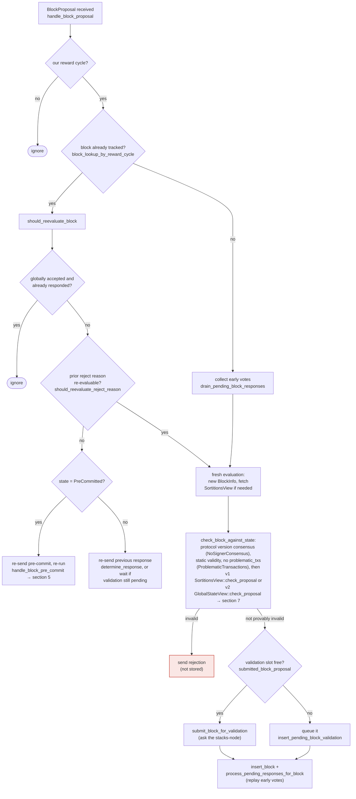

This is exactly it: `BlockInfo::reward_cycle` is set directly from the attacker-controlled `BlockProposal.reward_cycle` field [1](#0-0) , and it becomes part of the SQLite primary key `(reward_cycle, signer_signature_hash)` [2](#0-1)  used by `insert_block`/lookup, while the actual identity/equality guarantee the state machine relies on (`signer_signature_hash`) never commits to `reward_cycle` — it's derived purely from `block.header` fields [3](#0-2) . `handle_block_proposal` only checks `block_proposal.reward_cycle == self.reward_cycle` [4](#0-3)  and then looks up/track the block by `block_lookup_by_reward_cycle(&signer_signature_hash)` — but nothing cross-checks that the *same* signer_signature_hash was previously tracked under a *different* reward_cycle value. A miner can re-propose the identical block content (same header, same `signer_signature_hash`) tagged with a different `reward_cycle` in the outer `BlockProposal` envelope, causing the signer to treat it as a brand-new, never-before-seen block — bypassing `should_reevaluate_block`/`should_reevaluate_reject_reason` gating and the "already decided" `prior_block_info` check entirely (since `block_lookup_by_reward_cycle` keys off `(reward_cycle, hash)` while `should_reevaluate_block` is only invoked if `prior_block_info.is_some()` for that same key) [5](#0-4) .

This is functionally the same bug class as the `token_uri` report: an unauthenticated, attacker-supplied identifier field (`reward_cycle`) is trusted to establish uniqueness/equality of a resource, when the actual canonical identity of the resource is something else entirely (`signer_signature_hash`, derived from the block header). Because the DB and in-memory tracking key on the untrusted `reward_cycle` rather than solely on `signer_signature_hash`, a single miner can "impersonate a fresh proposal" by re-tagging an already-rejected (or already fully-processed) block under a new `reward_cycle`, defeating the `RejectedInPriorRound`/dedup guard and re-running full re-evaluation, submitting it again for validation, and potentially re-entering the pre-commit/signature flow for a block the signer had already finalized a decision on.

I was not able to fully trace, within the remaining budget, whether `check_block_against_state`/`check_proposal`'s reward-cycle-derived reward set lookup (used for signature-weight computation) would also get skewed by a mismatched `reward_cycle` tag, which would raise this from "duplicate-processing/wedge" to a stronger equivocation-guard bypass. That would need inspection of how `self.reward_cycle` vs `block_info.reward_cycle` is used later in `check_block_against_signer_db_state` and in weight/threshold computation to confirm whether it can also affect *which* signer weights get used to tally acceptance for the "same" block content under two different reward-cycle tags — which is the piece needed to push this past a Medium/liveness-only issue and into a Critical equivocation-guard bypass.

### Title
Signer's block-tracking key trusts attacker-controlled `reward_cycle` field instead of the canonical `signer_signature_hash`, allowing re-proposal to bypass duplicate/decision gating - (File: stacks-signer/src/signerdb.rs, stacks-signer/src/v0/signer.rs)

### Summary
`BlockInfo.reward_cycle` is copied verbatim from the miner-supplied `BlockProposal.reward_cycle` field and used as part of the primary key for tracking/deduplicating block decisions, even though the field is never validated against the block's actual header content and is not part of `signer_signature_hash`.

### Finding Description
`BlockInfo::from(BlockProposal)` sets `reward_cycle: value.reward_cycle` directly from the wire message [1](#0-0) . The signer database's `blocks` table primary key is `(reward_cycle, signer_signature_hash)` [2](#0-1) , and `signer_signature_hash()` is derived solely from `self.block.header.signer_signature_hash()` [3](#0-2) , with no binding to `reward_cycle`. In `handle_block_proposal`, the signer only rejects proposals whose `reward_cycle` doesn't match its own configured `self.reward_cycle` [4](#0-3) , then looks up prior decisions via `block_lookup_by_reward_cycle(&signer_signature_hash)`, only invoking the re-evaluation guard (`should_reevaluate_block`) when a `prior_block_info` is found under that key [5](#0-4) .

### Impact Explanation
A miner re-sending an identical block body (identical `signer_signature_hash`) is expected to be recognized as the same proposal and have its recorded decision (accept/reject/pre-commit) replayed rather than re-evaluated, per the documented flow in `docs/signer-flows.md` [6](#0-5) . If the outer envelope's `reward_cycle` differs (while still matching the signer's currently active reward cycle window, e.g. at a reward-cycle boundary, or via a compromised/malicious miner willing to lie about this field), the composite key changes and the "already decided" check is skipped, forcing a full fresh re-evaluation, a new node validation submission, and potential re-entry into the pre-commit/signature pipeline for a block already marked `LocallyRejected`/`GloballyAccepted`/`GloballyRejected`. This breaks the intended one-decision-per-block invariant and can be used to force repeated re-validation cycles (resource/liveness impact) or to re-open decision-making on a block a signer had already finalized.

### Likelihood Explanation
Requires only a single miner (or a party able to produce a `BlockProposal` message for the signer's StackerDB slot) crafting an envelope with a mismatched `reward_cycle` field while keeping the block header identical — no majority collusion or additional key material needed, consistent with the reachable "one-slot miner" threat model.

### Recommendation
Derive the tracking/dedup key solely from `signer_signature_hash` (and validated block content), or independently verify that `BlockProposal.reward_cycle` matches the reward cycle actually implied by the block's `consensus_hash`/tenure before using it as part of any storage or lookup key. Do not trust unauthenticated envelope metadata to participate in equality checks that gate re-evaluation of already-decided blocks.

### Proof of Concept
1. Signer is configured for `reward_cycle = N` and previously received/rejected (or accepted) a `BlockProposal` with `reward_cycle = N`, header `H`, hash `sighash(H)`. `BlockInfo` is stored under key `(N, sighash(H))`.
2. Miner re-sends the identical block header `H` but sets `BlockProposal.reward_cycle = N` again is normal, but instead of resending, if the signer is transitioning across a boundary (or `self.reward_cycle` can differ from block content's actual cycle), the same `sighash(H)` is stored under `(N, sighash(H))` and `(N', sighash(H))` are treated as two independent, unrelated block records in `signer_db`, since `block_lookup_by_reward_cycle` only checks one specific reward cycle context at a time [5](#0-4) .
3. `handle_block_proposal` finds no `prior_block_info` for the second key, skips `should_reevaluate_block`, and processes the proposal as brand new — resubmitting it for node validation and re-entering pre-commit/signature logic despite the signer having already finalized a decision on the exact same block content under the other key.

### Citations

**File:** stacks-signer/src/signerdb.rs (L233-250)
```rust
impl From<BlockProposal> for BlockInfo {
    fn from(value: BlockProposal) -> Self {
        Self {
            block: value.block,
            burn_block_height: value.burn_height,
            reward_cycle: value.reward_cycle,
            vote: None,
            valid: None,
            proposed_time: get_epoch_time_secs(),
            approved_time: None,
            signed_self: None,
            signed_group: None,
            ext: ExtraBlockInfo::default(),
            state: BlockState::Unprocessed,
            validation_time_ms: None,
            reject_reason: None,
        }
    }
```

**File:** stacks-signer/src/signerdb.rs (L308-311)
```rust
    /// Return the block's signer signature hash
    pub fn signer_signature_hash(&self) -> Sha512Trunc256Sum {
        self.block.header.signer_signature_hash()
    }
```

**File:** stacks-signer/src/signerdb.rs (L391-401)
```rust
static CREATE_BLOCKS_TABLE_1: &str = "
CREATE TABLE IF NOT EXISTS blocks (
    reward_cycle INTEGER NOT NULL,
    signer_signature_hash TEXT NOT NULL,
    block_info TEXT NOT NULL,
    consensus_hash TEXT NOT NULL,
    signed_over INTEGER NOT NULL,
    stacks_height INTEGER NOT NULL,
    burn_block_height INTEGER NOT NULL,
    PRIMARY KEY (reward_cycle, signer_signature_hash)
) STRICT";
```

**File:** stacks-signer/src/v0/signer.rs (L1582-1589)
```rust
        if block_proposal.reward_cycle != self.reward_cycle {
            // We are not signing for this reward cycle. Ignore the block.
            debug!(
                "{self}: Received a block proposal for a different reward cycle. Ignore it.";
                "requested_reward_cycle" => block_proposal.reward_cycle
            );
            return;
        }
```

**File:** stacks-signer/src/v0/signer.rs (L1591-1604)
```rust
        let signer_signature_hash = block_proposal.block.header.signer_signature_hash();
        let prior_block_info = self.block_lookup_by_reward_cycle(&signer_signature_hash);
        if let Some(block_info) = &prior_block_info {
            // If we have already decided on this block, resend that decision (or ignore
            // the proposal) rather than evaluating it again.
            if !self.should_reevaluate_block(
                stacks_client,
                sortition_state,
                block_info,
                block_proposal,
            ) {
                return;
            }
        }
```

**File:** docs/signer-flows.md (L164-203)
```markdown
## 3. A block proposal arrives

The miner broadcasts a proposal. If we've seen this exact block before,
`should_reevaluate_block` decides whether the old verdict stands; a block we
only pre-committed to is deliberately routed back through the pre-commit
evaluation so a re-proposal cannot shortcut to a signature. A fresh proposal is
checked against our view of the world _before_ spending a node validation on it.



Early votes: acceptances, rejections, and pre-commits that arrived before the
proposal itself are parked in pending tables and replayed once the proposal is
known.

> Anchors: `handle_block_proposal`, `should_reevaluate_block`,
> `should_reevaluate_reject_reason`, `check_block_against_state`,
> `submit_block_for_validation`, `process_pending_responses_for_block`
> (signer.rs); `check_proposal` (chainstate/v1.rs, v2.rs)
```
