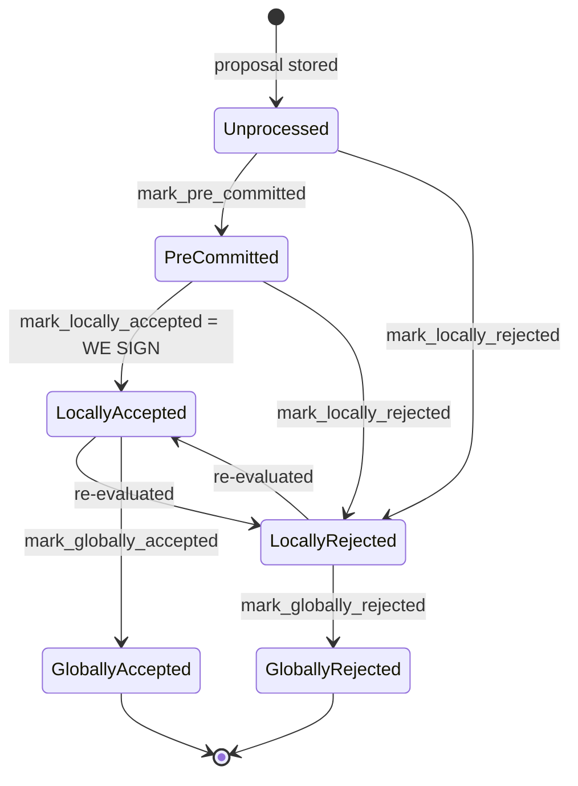

### Title
Rejected signer's weight is never cleared when the same signer later accepts, letting the same weight sit in both `total_weight_approved` and `total_weight_rejected` - (File: stacks-node/src/nakamoto_node/stackerdb_listener.rs)

### Summary
### Finding Description
`StackerDBListener::run` tallies signer votes on a proposed block into a shared `BlockStatus` behind a `Mutex`, gated by two different membership checks depending on the vote type:

- On `BlockResponse::Accepted`, the weight is added only if the slot is not already present in `gathered_signatures`: [1](#0-0) 
- On `BlockResponse::Rejected`, the weight is added only if the slot was not already present in `responded_signers` (a *different* set, shared across both accept and reject paths): [2](#0-1) 

Because the signer's local state machine explicitly allows `LocallyRejected -> LocallyAccepted` as a valid re-evaluation (a signer legitimately changes its mind about a block it previously rejected, e.g. after a conflicting sibling goes stale), a single signer can legitimately emit `Rejected` followed later by `Accepted` for the same `signer_signature_hash`. When this happens:
1. `Rejected` arrives first: `responded_signers.insert(slot_id)` succeeds (fresh) → `total_weight_rejected += weight`.
2. `Accepted` arrives second: the guard checked is `!gathered_signatures.contains_key(&slot_id)`, which is still `true` (that map was never touched by the rejection path) → `total_weight_approved += weight` is applied *again*, using the same signer's weight that is already baked into `total_weight_rejected`.

The reverse order (`Accepted` then `Rejected`) is correctly guarded, because the `Accepted` path also inserts into the shared `responded_signers` set, so a later `Rejected` from the same signer is a no-op. Only the accept-after-reject ordering slips through, because the accept path checks the wrong/independent set (`gathered_signatures`) instead of `responded_signers`.

### Impact Explanation
This breaks the invariant that `total_weight_approved` and `total_weight_rejected` are built from disjoint sets of signer weight (i.e., that `total_weight_approved + total_weight_rejected <= total_weight`, and specifically that no single signer's weight counts toward both). This is the node-side analogue of the "aggregated-weight vs. verified-accepts" equality the rules call out: the aggregated rejection weight used to decide a block is "dead" (`total_weight_rejected.saturating_add(weight_threshold) > total_weight` at [3](#0-2) ) retains stale weight from a signer who has since accepted the block, while `total_weight_approved` is simultaneously moving toward the acceptance threshold with overlapping weight budget. The miner/coordinator's live tally of "has this block been globally rejected" no longer reflects a consistent, disjoint partition of the signer set's weight, and the rejected-weight counter is a one-way ratchet that is never corrected when a signer's opinion legitimately flips to acceptance. This can cause the coordinator to declare a block dead (and the miner to abandon it) based on stale rejection weight that the signer set has already superseded — a liveness wedge on block production that a single signer can trigger via ordinary state-machine re-evaluation, requiring no majority and no forged signature.

### Likelihood Explanation
The signer state machine documentation explicitly supports `LocallyRejected -> LocallyAccepted` "re-evaluated" transitions (see `docs/signer-flows.md` state diagram, anchored to `BlockInfo::check_state`) [4](#0-3) , and multiple test names in `stacks-signer/src/v0/tests.rs` (e.g. `stale_sibling_replaced_when_canonical_tip_below`) confirm a signer can move from refusing to sign to signing the same/competing block once a prior conflict goes stale. Any single honest-but-slow signer that rejects first (e.g. due to a transient sibling conflict) and later signs once the conflict clears will trigger this ordering on the node side without any adversarial intent, making this reachable in normal operation, not just via a malicious signer.

### Recommendation
On the `BlockResponse::Accepted` path, gate the weight increment on `!block.responded_signers.contains(&slot_id)` (the same set used by the rejection path) instead of `!block.gathered_signatures.contains_key(&slot_id)`, and when a signer transitions from rejected to accepted, decrement `total_weight_rejected` by that signer's weight (or otherwise track per-signer current vote so the two aggregate totals remain a disjoint partition of `total_weight`).

### Proof of Concept
1. Node's `StackerDBListener` is coordinating signatures for a proposed block `B` from `total_weight` signers.
2. Signer `S` (weight `w`) sends `BlockResponse::Rejected` for `B`. In `run()`, `blocks.get_mut(&B).responded_signers.insert(S)` succeeds → `total_weight_rejected += w` [2](#0-1) .
3. Later, `S` re-evaluates and locally accepts `B` (a state transition the signer explicitly supports), and sends `BlockResponse::Accepted` for the same `B`.
4. In `run()`, the accept-path check `!blocks.get_mut(&B).gathered_signatures.contains_key(&S)` is `true` (untouched by step 2) → `total_weight_approved += w` is applied [1](#0-0) .
5. Now `total_weight_approved + total_weight_rejected` counts `S`'s weight `w` twice against a shared `total_weight` budget, and `total_weight_rejected` still includes `w` even though `S` currently accepts `B`. If enough other signers behave similarly or if `w` is large, the `total_weight_rejected.saturating_add(weight_threshold) > total_weight` check can fire and mark the block dead using stale rejection weight that no longer reflects the current signer set's opinion, even while `total_weight_approved` is independently climbing toward the real acceptance threshold.

Note: I was not able to execute this in a live cluster; the analysis is based on static reading of `stackerdb_listener.rs`'s message-handling loop and the documented signer state-machine transitions. A background Devin session with repo access would be needed to write and run an integration test (e.g., extending `stacks-node/src/tests/signer/v0/*`) to confirm the exact downstream miner behavior when this stale-rejected-weight condition is hit.

### Citations

**File:** stacks-node/src/nakamoto_node/stackerdb_listener.rs (L443-465)
```rust
                        if !block.gathered_signatures.contains_key(&slot_id) {
                            block.total_weight_approved = block
                                .total_weight_approved
                                .saturating_add(signer_entry.weight);

                            info!("StackerDBListener: Signature Added to block";
                                "signer_signature_hash" => %block_sighash,
                                "signer_pubkey" => signer_pubkey.to_hex(),
                                "signer_slot_id" => slot_id,
                                "signature" => %signature,
                                "signer_weight" => signer_entry.weight,
                                "total_weight_approved" => block.total_weight_approved,
                                "percent_approved" => block.total_weight_approved as f64 / self.total_weight as f64 * 100.0,
                                "total_weight_rejected" => block.total_weight_rejected,
                                "percent_rejected" => block.total_weight_rejected as f64 / self.total_weight as f64 * 100.0,
                                "weight_threshold" => self.weight_threshold,
                                "tenure_extend_timestamp" => tenure_extend_timestamp,
                                "read_count_extend_timestamp" => read_count_extend_timestamp,
                                "server_version" => metadata.server_version,
                            );
                        }
                        block.gathered_signatures.insert(slot_id, signature);
                        block.responded_signers.insert(slot_id);
```

**File:** stacks-node/src/nakamoto_node/stackerdb_listener.rs (L515-519)
```rust
                        if block.responded_signers.insert(slot_id) {
                            block.total_weight_rejected = block
                                .total_weight_rejected
                                .saturating_add(signer_entry.weight);

```

**File:** stacks-node/src/nakamoto_node/stackerdb_listener.rs (L567-574)
```rust
                        if block
                            .total_weight_rejected
                            .saturating_add(self.weight_threshold)
                            > self.total_weight
                        {
                            // Signal to anyone waiting on this block that we have enough rejections
                            cvar.notify_all();
                        }
```

**File:** docs/signer-flows.md (L130-150)
```markdown
## 2. Block lifecycle (`BlockState`)

Every proposal tracked in the signer DB carries a `BlockState`. **`PreCommitted`
carries no signature**: it means "validated, willing to sign if the pre-commit
threshold is met." The first signature appears at `mark_locally_accepted`.
Global states are terminal against each other.


```
