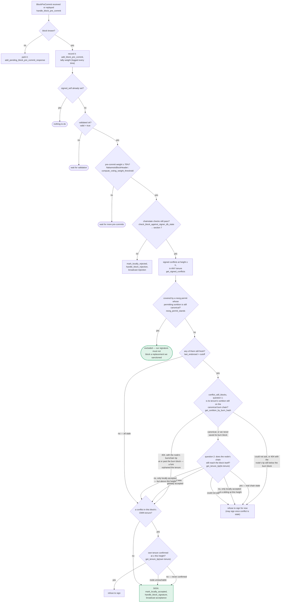

Based on the trace through the relevant code paths, this claim does not hold up.

**The equality holds.** `determine_response` (`stacks-signer/src/v0/signer.rs:458-471`) only ever produces a `BlockResponse` (including `Accepted`) if `block_info.valid` is `Some`, and `valid` is only set inside `handle_block_validate_ok`/`handle_block_validate_reject`, which themselves are only invoked from `handle_block_validate_response` for a `BlockValidateResponse` whose `signer_signature_hash` is looked up via `block_lookup_by_reward_cycle(signer_signature_hash)` — i.e., strictly scoped to the specific block's own hash. [1](#0-0) [2](#0-1) 

When a second proposal `B` arrives while `submitted_block_proposal` is occupied by `A`, `handle_block_proposal` calls `insert_pending_block_validation` and stores `B` with `valid=None` — it never marks `B` valid or signs it. [3](#0-2) 

On re-proposal of the same `B` while its validation is still pending, `should_reevaluate_block` reaches `determine_response(block_info)`, which returns `None` because `block_info.valid` is still `None`; the function then checks `has_pending_block_validation` and simply returns `false` (do nothing) rather than fabricating an `Accepted`/leak. [4](#0-3) 

Eventually, once `A` resolves (via `handle_block_validate_response`, which clears `submitted_block_proposal` only if the hash matches, or via `check_submitted_block_proposal`'s timeout, which rejects `A` and clears the slot), `check_pending_block_validations` pulls `B` from `block_validations_pending` and calls `submit_block_for_validation` for `B`'s *own* hash — so `B` always eventually gets its own real `BlockValidateOk`/`Reject` before any signature-producing path (`mark_pre_committed` → `handle_block_pre_commit` → `mark_locally_accepted`) can fire for it. [5](#0-4) [6](#0-5) 

The pre-commit → signature path itself is gated on `block_info.valid == Some(true)` before weight-threshold and re-check logic runs, so there is no route to `mark_locally_accepted` without a validation verdict for that exact block. [7](#0-6) 

This exact race (asynchronous validation creating a window where signatures could otherwise slip through) is a known, deliberately-guarded scenario, documented and covered by existing tests (e.g. `signer_waits_for_validation_before_signing` in `signers_wait_for_validation.rs`, and the `async_sibling_validation` module in `stacks-signer/src/v0/tests.rs`), both of which assert that a signer never signs before its own validation response arrives. [8](#0-7) [9](#0-8) 

There is no permanent wedge either: `check_submitted_block_proposal` enforces `block_proposal_validation_timeout`, guaranteeing the slot is freed and queued proposals are eventually processed even if the outstanding node response never arrives. [6](#0-5) 

The HTTP 202 "Accepted" returned by `RPCBlockProposalRequestHandler::try_handle_request` is purely an acknowledgment that node-side validation has been queued/spawned — it is not a signer signature and carries no cryptographic weight in the signing protocol; it does not interact with `submitted_block_proposal`/`insert_pending_block_validation` at all, since those are signer-side, not node-side, constructs. [10](#0-9) 

#No vulnerability found for this question.

### Citations

**File:** stacks-signer/src/v0/signer.rs (L458-471)
```rust
    fn determine_response(&mut self, block_info: &BlockInfo) -> Option<BlockResponse> {
        // We will only have the valid field set if we have already validated this block
        // against our stacks-node/local state.
        let valid = block_info.valid?;
        let response = if valid {
            debug!("{self}: Accepting block {}", block_info.block.block_id());
            self.create_block_acceptance(&block_info.block).into()
        } else {
            debug!("{self}: Rejecting block {}", block_info.block.block_id());
            self.create_block_rejection(RejectReason::RejectedInPriorRound, &block_info.block)
                .into()
        };
        Some(response)
    }
```

**File:** stacks-signer/src/v0/signer.rs (L1530-1547)
```rust
            if let Some(block_response) = self.determine_response(block_info) {
                self.send_block_response(&block_info.block, block_response);
                return false;
            } else {
                let is_pending = self
                    .signer_db
                    .has_pending_block_validation(&signer_signature_hash)
                    .unwrap_or_else(|e| {
                        warn!("{self}: Failed to load pending block validations: {e:?}");
                        false
                    });
                if is_pending {
                    debug!(
                        "{self}: received a block proposal for a block for which we is already pending validation. Do nothing.";
                        "signer_signature_hash" => %block_info.block.header.signer_signature_hash(),
                        "block_id" => %block_info.block.block_id()
                    );
                    return false;
```

**File:** stacks-signer/src/v0/signer.rs (L1681-1719)
```rust
        } else {
            // Just in case check if the last block validation submission timed out.
            self.check_submitted_block_proposal();
            if self.submitted_block_proposal.is_none() {
                // We don't know if proposal is valid, submit to stacks-node for further checks and store it locally.
                info!(
                    "{self}: submitting block proposal for validation";
                    "signer_signature_hash" => %signer_signature_hash,
                    "block_id" => %block_proposal.block.block_id(),
                    "block_height" => block_proposal.block.header.chain_length,
                    "burn_height" => block_proposal.burn_height,
                );

                #[cfg(any(test, feature = "testing"))]
                self.test_stall_block_validation_submission();
                self.submit_block_for_validation(
                    stacks_client,
                    &block_proposal.block,
                    get_epoch_time_secs(),
                );
            } else {
                // Still store the block but log we can't submit it for validation. We may receive enough signatures/rejections
                // from other signers to push the proposed block into a global rejection/acceptance regardless of our participation.
                // However, we will not be able to participate beyond this until our block submission times out or we receive a response
                // from our node.
                warn!("{self}: cannot submit block proposal for validation as we are already waiting for a response for a prior submission. Inserting pending proposal.";
                    "signer_signature_hash" => signer_signature_hash.to_string(),
                );
                self.signer_db
                    .insert_pending_block_validation(&signer_signature_hash, get_epoch_time_secs())
                    .unwrap_or_else(|e| {
                        warn!("{self}: Failed to insert pending block validation: {e:?}")
                    });
            }

            // Do not store KNOWN invalid blocks as this could DOS the signer. We only store blocks that are valid or unknown.
            self.signer_db
                .insert_block(&block_info)
                .unwrap_or_else(|e| self.handle_insert_block_error(e));
```

**File:** stacks-signer/src/v0/signer.rs (L1888-1919)
```rust
    ) {
        crate::monitoring::actions::increment_block_validation_responses(true);
        let signer_signature_hash = &block_validate_ok.signer_signature_hash;
        if self
            .submitted_block_proposal
            .as_ref()
            .map(|(proposal_hash, _)| proposal_hash == signer_signature_hash)
            .unwrap_or(false)
        {
            self.submitted_block_proposal = None;
        }
        if let Some(replay_tx_hash) = block_validate_ok.replay_tx_hash {
            info!("Inserting block validated by replay tx";
                "signer_signature_hash" => %signer_signature_hash,
                "replay_tx_hash" => replay_tx_hash
            );
            self.signer_db
                .insert_block_validated_by_replay_tx(
                    signer_signature_hash,
                    replay_tx_hash,
                    block_validate_ok.replay_tx_exhausted,
                )
                .unwrap_or_else(|e| {
                    warn!("{self}: Failed to insert block validated by replay tx: {e:?}")
                });
        }
        // For mutability reasons, we need to take the block_info out of the map and add it back after processing
        let Some(mut block_info) = self.block_lookup_by_reward_cycle(signer_signature_hash) else {
            // We have not seen this block before. Why are we getting a response for it?
            debug!("{self}: Received a block validate response for a block we have are not tracking. Ignoring...");
            return;
        };
```

**File:** stacks-signer/src/v0/signer.rs (L2082-2112)
```rust
    /// Check if we can submit a block validation, and do so if we have pending block proposals
    fn check_pending_block_validations(&mut self, stacks_client: &StacksClient) {
        // if we're already waiting on a submitted block proposal, we cannot submit yet.
        if self.submitted_block_proposal.is_some() {
            return;
        }

        let (signer_sig_hash, insert_ts) =
            match self.signer_db.get_and_remove_pending_block_validation() {
                Ok(Some(x)) => x,
                Ok(None) => {
                    return;
                }
                Err(e) => {
                    warn!("{self}: Failed to get pending block validation: {e:?}");
                    return;
                }
            };

        info!("{self}: Found a pending block validation: {signer_sig_hash:?}");
        match self.signer_db.block_lookup(&signer_sig_hash) {
            Ok(Some(block_info)) => {
                self.submit_block_for_validation(stacks_client, &block_info.block, insert_ts);
            }
            Ok(None) => {
                // This should never happen
                error!("{self}: Pending block validation not found in DB: {signer_sig_hash:?}");
            }
            Err(e) => error!("{self}: Failed to get block info: {e:?}"),
        }
    }
```

**File:** stacks-signer/src/v0/signer.rs (L2114-2173)
```rust
    /// Check the current tracked submitted block proposal to see if it has timed out.
    /// Broadcasts a rejection and marks the block locally rejected if it has.
    fn check_submitted_block_proposal(&mut self) {
        let Some((proposal_signer_sighash, block_submission)) =
            self.submitted_block_proposal.take()
        else {
            // Nothing to check.
            return;
        };
        if block_submission.elapsed() < self.block_proposal_validation_timeout {
            // Not expired yet. Put it back!
            self.submitted_block_proposal = Some((proposal_signer_sighash, block_submission));
            return;
        }
        // For mutability reasons, we need to take the block_info out of the map and add it back after processing
        let mut block_info = match self.signer_db.block_lookup(&proposal_signer_sighash) {
            Ok(Some(block_info)) => {
                if block_info.has_reached_consensus() {
                    // The block has already reached consensus.
                    return;
                }
                block_info
            }
            Ok(None) => {
                // This is weird. If this is reached, its probably an error in code logic or the db was flushed.
                // Why are we tracking a block submission for a block we have never seen / stored before.
                error!("{self}: tracking an unknown block validation submission.";
                    "signer_signature_hash" => %proposal_signer_sighash,
                );
                return;
            }
            Err(e) => {
                error!("{self}: Failed to lookup block in signer db: {e:?}",);
                return;
            }
        };
        // We cannot determine the validity of the block, but we have not reached consensus on it yet.
        // Reject it so we aren't holding up the network because of our inaction.
        warn!(
            "{self}: Failed to receive block validation response within {} ms. Rejecting block.", self.block_proposal_validation_timeout.as_millis();
            "signer_signature_hash" => %proposal_signer_sighash,
        );
        let rejection = self.create_block_rejection(
            RejectReason::ConnectivityIssues(
                "failed to receive block validation response in time".to_string(),
            ),
            &block_info.block,
        );
        block_info.reject_reason = Some(rejection.response_data.reject_reason.clone());
        if let Err(e) = block_info.mark_locally_rejected() {
            if !block_info.has_reached_consensus() {
                warn!("{self}: Failed to mark block as locally rejected: {e:?}");
            }
        };
        self.send_block_response(&block_info.block, rejection.into());

        self.signer_db
            .insert_block(&block_info)
            .unwrap_or_else(|e| self.handle_insert_block_error(e));
    }
```

**File:** docs/signer-flows.md (L237-269)
```markdown


**File:** stacks-node/src/tests/signer/v0/signers_wait_for_validation.rs (L33-56)
```rust
#[test]
#[ignore]
/// Test that signers don't issue signatures until they have validated the block
///
/// This test verifies a race condition where a signer receives enough pre-commits
/// to exceed the 70% threshold before receiving its own block validation response.
/// The signer should NOT issue a signature until it has confirmed the block is valid.
///
/// Test Setup:
/// - Distribute signers across two miners (4 on miner 1, 1 on miner 2)
/// - Signers on different miners use different validation endpoints
///
/// Test Execution:
/// 1. Propose a block to all signers
/// 2. Pause block validation on miner 2 (the single signer)
/// 3. 4 signers on miner 1 issue pre-commits, pushing threshold over 70%
/// 4. The single signer on miner 2 receives all pre-commits but its validation is stalled
/// 5. Verify the single signer does NOT issue a signature until validation completes
/// 6. Resume validation and confirm the block is accepted
///
/// Test Assertion:
/// The signer waits for its own validation before issuing a signature, preventing
/// race conditions where it could sign before discovering the block is invalid.
fn signer_waits_for_validation_before_signing() {
```

**File:** stacks-signer/src/v0/tests.rs (L319-328)
```rust
/// Tests for the asynchronous-validation tenure-start timing gap.
///
/// `check_proposal` rejects a second tenure-start block for a tenure, but it runs before the
/// node's async validation, so two sibling tenure-start blocks proposed within the validation
/// window can both be pre-committed. A signer must still refuse to place a *signature* on a
/// second sibling while its signature on the first is fresh, so a single winning miner cannot
/// obtain two signer certificates for one sortition. Once the signature has timed out, the
/// signer consults the node and signs the replacement only if the signed sibling is not
/// canonical at that height, so a sibling that failed to be confirmed can still be replaced.
#[cfg(test)]
```

**File:** stackslib/src/net/api/postblock_proposal.rs (L1268-1276)
```rust
        match res {
            Ok(_) => {
                let preamble = HttpResponsePreamble::accepted_json(&preamble);
                let body = HttpResponseContents::try_from_json(&serde_json::json!({
                    "result": "Accepted",
                    "message": "Block proposal is processing, result will be returned via the event observer"
                }))?;
                Ok((preamble, body))
            }
```
