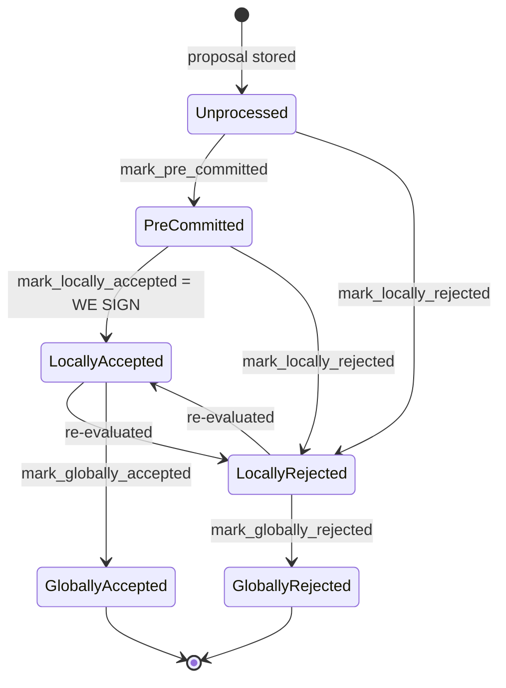

### Title
Stale rejection weight not cleared when a signer switches from Reject to Accept on the same block, causing double-counted weight that can force a spurious `SignersRejected` - (File: `stacks-node/src/nakamoto_node/stackerdb_listener.rs`)

### Summary
The mainer-side `StackerDBListener` aggregates per-block approval/rejection weight in a `BlockStatus` map keyed by `signer_signature_hash`. When a signer first sends a `BlockResponse::Rejected` for a block, its weight is added to `total_weight_rejected` and its `slot_id` is recorded in `responded_signers`. If the *same* signer later re-evaluates the block (a state transition explicitly supported by the signer state machine, `LocallyRejected -> LocallyAccepted : re-evaluated`) and sends `BlockResponse::Accepted` for the same block hash, the accept-path only checks `gathered_signatures.contains_key(&slot_id)` before adding weight to `total_weight_approved` — it never removes that signer's stake from `total_weight_rejected`. The signer's weight is therefore counted in both totals simultaneously, exactly analogous to the reported bug where an old delegatee entry is never cleared when a token is re-delegated, causing the same balance to be counted twice.

### Finding Description
`BlockStatus` tracks `total_weight_approved`, `total_weight_rejected`, `gathered_signatures`, and `responded_signers` per block hash [1](#0-0) .

On `BlockResponse::Accepted`, the weight is added iff the slot is not already in `gathered_signatures` — no check against, or clearing of, any prior rejection for that slot: [2](#0-1) 

On `BlockResponse::Rejected`, the weight is added iff the slot is newly inserted into `responded_signers`, and there is no corresponding removal of that slot from `gathered_signatures`/`total_weight_approved` if the signer had previously accepted: [3](#0-2) 

The only code path that clears `total_weight_rejected` is `reset_rejections`, which is invoked solely by the coordinator on a full rejection-timeout, and it unconditionally zeroes out all rejection weight for the block — it is not a per-signer correction for a switched vote, and it does not run on every reject→accept transition: [4](#0-3) 

This is a normal, single-signer-triggerable path: the signer-side state machine explicitly allows `LocallyRejected --> LocallyAccepted : re-evaluated` (e.g., after a subsequent proposal re-evaluation or after removing a stale objection) as documented in [5](#0-4)  and implemented via `mark_locally_accepted`/`mark_locally_rejected`/`move_to` in `BlockInfo` [6](#0-5) . A single signer that rejects and then accepts the very same `signer_signature_hash` (same block, e.g. after retrying validation) triggers this on the node side without needing cooperation from any other signer.

By contrast, the SignerDB layer on the *signer* side does implement the correct “remove-old-then-add-new” pattern for its own local bookkeeping (`add_block_signature` deletes any rejection row for that signer before inserting the signature row) [7](#0-6) , and this exact cleanup is validated by the `reject_then_accept` unit test [8](#0-7) . The node-side `StackerDBListener` aggregate weight tracker, however, has no equivalent invariant.

### Impact Explanation
The coordinator's block-rejection decision is driven directly by `total_weight_rejected`: [9](#0-8) 

Because a switched-to-accept signer's weight is never removed from `total_weight_rejected`, that stale weight persists and can combine with weight from other, currently-rejecting signers to cross the `total_weight - weight_threshold` blocking-minority threshold, even though the switching signer is in reality now an approver. This breaks the equality that the miner's decision should be based on the *current, verified* set of accepts/rejects: it is instead based on an inflated, double-counted tally where one signer's weight is simultaneously present on both sides of the ledger. The practical effect is a liveness/safety-adjacent fault: a valid block that has legitimately reached (or would reach) the 70% acceptance threshold can be spuriously reported as `NakamotoNodeError::SignersRejected`, causing the miner to discard the block and potentially exclude/ban transactions it believes are "problematic" based on this corrupted weight accounting (`failed_txids` weight comparisons at lines 521-535 use the same inflated `blocking_minority`/`total_weight` baseline). This is a mismatch between "aggregated weight" and "verified accepts," matching the required Critical/High impact class in the rules.

### Likelihood Explanation
This requires only a single signer to flip its vote on one block from reject to accept — a state transition the signer client itself performs routinely as part of its supported re-evaluation flow (`should_reevaluate_block`, `LocallyRejected -> LocallyAccepted`). No majority collusion, no key compromise, and no malicious behavior is needed; ordinary validation-timing races (e.g., a signer rejects a proposal early due to a transient/incomplete validation and later successfully validates and accepts the same block hash) are sufficient to trigger the double count.

### Recommendation
When processing `BlockResponse::Accepted`, if the signer's slot is currently present in `responded_signers` as a rejecter (i.e., contributed to `total_weight_rejected` but not `total_weight_approved`), subtract that signer's weight from `total_weight_rejected` before/while adding it to `total_weight_approved`. Symmetrically, when processing `BlockResponse::Rejected` for a signer that had previously accepted, subtract their weight from `total_weight_approved` before adding it to `total_weight_rejected`. Track each signer's current committed side (accept vs reject) per block explicitly (e.g., a `HashMap<slot_id, bool>` recording the last known vote) rather than only append-only sets, so that the two aggregate totals always reflect the *current* state.

### Proof of Concept
1. Miner proposes block `B` (`signer_signature_hash = H`); `StackerDBListener` creates a fresh `BlockStatus` for `H` via `insert_block` (`total_weight_approved = 0`, `total_weight_rejected = 0`).
2. Signer `S` (weight `w`) initially rejects `B` (e.g., due to a transient state mismatch). `handle_block_proposal` marks it `LocallyRejected` and the node processes `BlockResponse::Rejected`: `total_weight_rejected += w`, `S`'s slot recorded in `responded_signers`.
3. `S` re-evaluates the same block per its state machine (`should_reevaluate_block` → `LocallyRejected --> LocallyAccepted`) and sends `BlockResponse::Accepted` for the same `H`.
4. Node processes the accept: since `S`'s slot is not yet in `gathered_signatures`, `total_weight_approved += w` is executed — `total_weight_rejected` is left untouched at its previous value including `w`.
5. Now both `total_weight_approved` and `total_weight_rejected` include `S`'s weight `w`. If other signers' current votes bring `total_weight_rejected` (which still improperly includes `w`) above `total_weight - weight_threshold`, the coordinator returns `NakamotoNodeError::SignersRejected` at line 537 even though, counting current votes correctly, the block may have legitimately reached (or been close to) the acceptance threshold.

### Citations

**File:** stacks-node/src/nakamoto_node/stackerdb_listener.rs (L443-465)
```rust
                        if !block.gathered_signatures.contains_key(&slot_id) {
                            block.total_weight_approved = block
                                .total_weight_approved
                                .saturating_add(signer_entry.weight);

                            info!("StackerDBListener: Signature Added to block";
                                "signer_signature_hash" => %block_sighash,
                                "signer_pubkey" => signer_pubkey.to_hex(),
                                "signer_slot_id" => slot_id,
                                "signature" => %signature,
                                "signer_weight" => signer_entry.weight,
                                "total_weight_approved" => block.total_weight_approved,
                                "percent_approved" => block.total_weight_approved as f64 / self.total_weight as f64 * 100.0,
                                "total_weight_rejected" => block.total_weight_rejected,
                                "percent_rejected" => block.total_weight_rejected as f64 / self.total_weight as f64 * 100.0,
                                "weight_threshold" => self.weight_threshold,
                                "tenure_extend_timestamp" => tenure_extend_timestamp,
                                "read_count_extend_timestamp" => read_count_extend_timestamp,
                                "server_version" => metadata.server_version,
                            );
                        }
                        block.gathered_signatures.insert(slot_id, signature);
                        block.responded_signers.insert(slot_id);
```

**File:** stacks-node/src/nakamoto_node/stackerdb_listener.rs (L515-518)
```rust
                        if block.responded_signers.insert(slot_id) {
                            block.total_weight_rejected = block
                                .total_weight_rejected
                                .saturating_add(signer_entry.weight);
```

**File:** stacks-node/src/nakamoto_node/stackerdb_listener.rs (L691-704)
```rust
impl StackerDBListenerComms {
    /// Insert a block into the block status map with initial values.
    pub fn insert_block(&self, block: &NakamotoBlockHeader) {
        let (lock, _cvar) = &*self.blocks;
        let mut blocks = lock.lock().expect("FATAL: failed to lock block status");
        let block_status = BlockStatus {
            responded_signers: HashSet::new(),
            gathered_signatures: BTreeMap::new(),
            total_weight_approved: 0,
            total_weight_rejected: 0,
            failed_txids: HashMap::new(),
        };
        blocks.insert(block.signer_signature_hash(), block_status);
    }
```

**File:** stacks-node/src/nakamoto_node/stackerdb_listener.rs (L706-723)
```rust
    /// Reset rejections for a block proposal.
    /// This is used when a block proposal times out and we need to retry it by
    /// clearing the block's rejections. Block approvals cannot be cleared
    /// because an old approval could always be used to make a block reach
    /// the approval threshold.
    pub fn reset_rejections(&self, signer_sighash: &Sha512Trunc256Sum) {
        let (lock, _cvar) = &*self.blocks;
        let mut blocks = lock.lock().expect("FATAL: failed to lock block status");
        if let Some(block) = blocks.get_mut(signer_sighash) {
            block.responded_signers.clear();
            block.total_weight_rejected = 0;

            // Add approving signers back to the responded signers set
            for (slot_id, _) in block.gathered_signatures.iter() {
                block.responded_signers.insert(*slot_id);
            }
        }
    }
```

**File:** docs/signer-flows.md (L130-150)
```markdown
## 2. Block lifecycle (`BlockState`)

Every proposal tracked in the signer DB carries a `BlockState`. **`PreCommitted`
carries no signature**: it means "validated, willing to sign if the pre-commit
threshold is met." The first signature appears at `mark_locally_accepted`.
Global states are terminal against each other.


```

**File:** stacks-signer/src/signerdb.rs (L272-306)
```rust
    /// Mark this block as valid, record the approved time timestamp if not already set and attempt to mark it as pre-committed.
    pub fn mark_pre_committed(&mut self) -> Result<(), String> {
        self.valid = Some(true);
        self.approved_time.get_or_insert(get_epoch_time_secs());
        self.move_to(BlockState::PreCommitted)
    }

    /// Mark this block as valid and the appropriate timestamps if they aren't already set, and attempt to mark it as locally accepted.
    pub fn mark_locally_accepted(&mut self, group_signed: bool) -> Result<(), String> {
        if group_signed {
            self.signed_group.get_or_insert(get_epoch_time_secs());
        } else {
            self.valid = Some(true);
            self.approved_time.get_or_insert(get_epoch_time_secs());
            self.signed_self.get_or_insert(get_epoch_time_secs());
        }
        self.move_to(BlockState::LocallyAccepted)
    }

    /// Mark this block's signed group time if not already set and attempt to mark it as globally accepted.
    pub fn mark_globally_accepted(&mut self) -> Result<(), String> {
        self.signed_group.get_or_insert(get_epoch_time_secs());
        self.move_to(BlockState::GloballyAccepted)
    }

    /// Mark this block as invalid and attempt to mark it as locally rejected
    pub fn mark_locally_rejected(&mut self) -> Result<(), String> {
        self.valid = Some(false);
        self.move_to(BlockState::LocallyRejected)
    }

    /// Attempt to mark the block as globally rejected
    pub fn mark_globally_rejected(&mut self) -> Result<(), String> {
        self.move_to(BlockState::GloballyRejected)
    }
```

**File:** stacks-signer/src/signerdb.rs (L1870-1906)
```rust
    /// Record an observed block signature
    pub fn add_block_signature(
        &self,
        block_sighash: &Sha512Trunc256Sum,
        signer_addr: &StacksAddress,
        signature: &MessageSignature,
    ) -> Result<bool, DBError> {
        // Remove any block rejection entry for this signer and block hash
        let del_qry = "DELETE FROM block_rejection_signer_addrs WHERE signer_signature_hash = ?1 AND signer_addr = ?2";
        let del_args = params![block_sighash, signer_addr.to_string()];
        self.db.execute(del_qry, del_args)?;

        // Insert the block signature
        let qry = "INSERT OR IGNORE INTO block_signatures (signer_signature_hash, signer_addr, signature) VALUES (?1, ?2, ?3);";
        let args = params![
            block_sighash,
            signer_addr.to_string(),
            serde_json::to_string(signature).map_err(DBError::SerializationError)?
        ];
        let rows_added = self.db.execute(qry, args)?;

        let is_new_signature = rows_added > 0;
        if is_new_signature {
            debug!("Added block signature.";
                "signer_signature_hash" => %block_sighash,
                "signer_address" => %signer_addr,
                "signature" => %signature
            );
        } else {
            debug!("Duplicate block signature.";
                "signer_signature_hash" => %block_sighash,
                "signer_address" => %signer_addr,
                "signature" => %signature
            );
        }
        Ok(is_new_signature)
    }
```

**File:** stacks-signer/src/signerdb.rs (L3234-3263)
```rust
    #[test]
    fn reject_then_accept() {
        let db_path = tmp_db_path();
        let db = SignerDb::new(db_path).expect("Failed to create signer db");

        let block_id = Sha512Trunc256Sum::from_data("foo".as_bytes());
        let address = StacksAddress::burn_address(false);
        let sig1 = MessageSignature([0x11; 65]);

        assert_eq!(db.get_block_signatures(&block_id).unwrap(), vec![]);

        assert!(db
            .add_block_rejection_signer_addr(
                &block_id,
                &address,
                RejectReasonPrefix::InvalidParentBlock
            )
            .unwrap());
        assert_eq!(
            db.get_block_rejection_signer_addrs(&block_id).unwrap(),
            vec![(address.clone(), RejectReasonPrefix::InvalidParentBlock)]
        );

        assert!(db.add_block_signature(&block_id, &address, &sig1).unwrap());
        assert_eq!(db.get_block_signatures(&block_id).unwrap(), vec![sig1]);
        assert!(db
            .get_block_rejection_signer_addrs(&block_id)
            .unwrap()
            .is_empty());
    }
```

**File:** stacks-node/src/nakamoto_node/signer_coordinator.rs (L509-519)
```rust
            if block_status
                .total_weight_rejected
                .saturating_add(self.weight_threshold)
                > self.total_weight
            {
                info!(
                    "{}/{} signer weight votes to reject block",
                    block_status.total_weight_rejected, self.total_weight;
                    "signer_signature_hash" => %block_signer_sighash,
                );
                counters.bump_naka_rejected_blocks();
```
