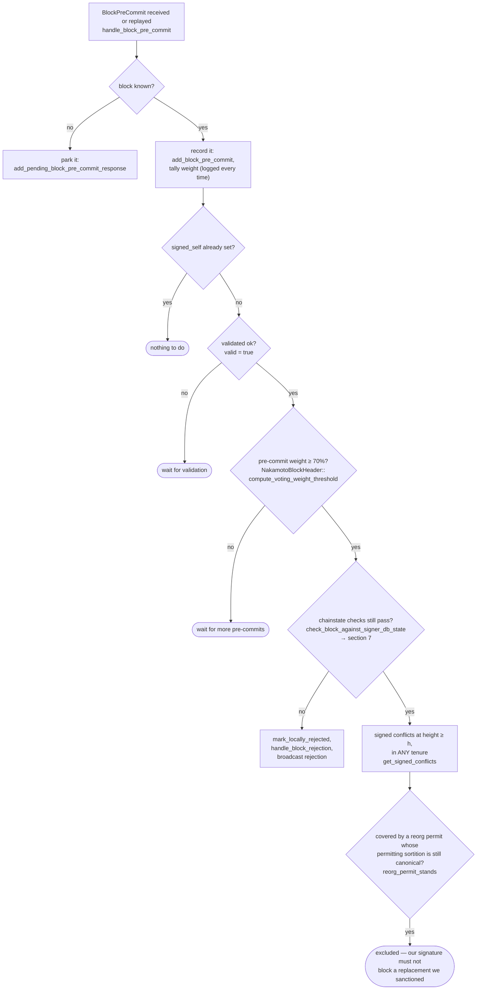

### Title
Peer-signature quorum path in `store_and_process_block_signature` broadcasts a block without re-running the signed-conflict / chainstate guard that `handle_block_pre_commit` enforces before signing - (File: `stacks-signer/src/v0/signer.rs`)

### Summary
The v0 signer has two independent code paths that can push a block toward finalization: the pre-commit→signature path (`handle_block_pre_commit`) and the peer-signature tally path (`handle_block_signature` → `store_and_process_block_signature`). The former explicitly re-validates chainstate and signed-conflict state (`check_block_against_signer_db_state`, `get_signed_conflicts`/`conflict_still_blocks`) immediately before a signature is produced or a group threshold is acted on. The latter — which fires purely off gossiped peer `BlockAccepted` signatures — tallies weight and, on reaching threshold, calls `mark_locally_accepted` and `broadcast_signed_block` with no equivalent re-check.

### Finding Description
Section 5 of the documented design (`docs/signer-flows.md:229-347`) states that the signer must re-check chainstate and conflicting-signature state at the moment weight crosses the 70% threshold, specifically because "between validation and threshold, we may have signed a _different_ block at the same height, possibly in another tenure." [1](#0-0) 

This re-check is implemented in `handle_block_pre_commit`, which calls `check_block_against_signer_db_state` right before acting on the pre-commit threshold, and rejects if the block now conflicts with a signature this signer already produced: [2](#0-1) 

By contrast, `handle_block_signature` (fired for peer `BlockResponse::Accepted` gossip) looks up the tracked `BlockInfo` and immediately calls `store_and_process_block_signature`: [3](#0-2) 

`store_and_process_block_signature` stores the peer signature, tallies weight purely from previously-collected `BlockAccepted` signatures, and — once weight crosses `min_weight` — calls `block_info.mark_locally_accepted(true)` followed immediately by `broadcast_signed_block`: [4](#0-3) 

Nowhere in this function (nor in its caller `handle_block_signature`) is `check_block_against_signer_db_state`, `get_signed_conflicts`, or `conflict_still_blocks` invoked. The only gate applied is the outdated-peer fallback (treat as pre-commit if the sender never pre-committed) and the `signed_group.is_some()` short-circuit — neither of which re-validates the block against this signer's own chainstate/conflict view. This is the same asymmetry the code comments in `handle_block_pre_commit` explicitly call out as dangerous enough to require a fresh check ("Between validation and threshold, we may have signed a _different_ block at the same height ... the world must be re-checked before the signature leaves the box" — but that statement, and its enforcement, is scoped only to the pre-commit path).

### Impact Explanation
A single miner (plus ordinary gossip propagation of other signers' legitimate acceptances) can produce two conflicting sibling blocks at the same height (exactly the scenario extensively tested in `stacks-signer/src/v0/tests.rs::async_sibling_validation`, which shows the async-validation window lets two sibling tenure-start blocks both reach `PreCommitted`) [5](#0-4) . A signer that has already signed block A (`LocallyAccepted`) refuses, via `handle_block_pre_commit`'s conflict guard, to *itself* sign the conflicting sibling B while A's signature is fresh: [6](#0-5) 

However, that same signer can still receive enough *other* signers' `BlockAccepted(B)` messages over StackerDB to cross the 70% weight threshold in `store_and_process_block_signature`. Because that function performs no conflict/chainstate re-check, this signer will mark B `LocallyAccepted` and call `broadcast_signed_block`, pushing the exact conflicting sibling it just refused to sign toward its own node — despite its own state machine having determined the sibling must be held back. This breaks the "signed-conflicts" equality the design otherwise treats as sacrosanct (never contribute to finalizing two conflicting blocks at the same height while a fresh signature exists), routing around the guard through the alternate signature-tally code path rather than the intended pre-commit path. This qualifies as the Critical class of impact: a signer acting to help finalize a conflicting/non-canonical block via a code path that omits the equality check the sibling path enforces.

### Likelihood Explanation
The preconditions are all reachable without needing a signer majority or private keys: (1) two conflicting sibling blocks at the same height are producible by a single miner within the documented async-validation window (already demonstrated to be reachable in the existing test suite), and (2) ordinary signer gossip of legitimate `BlockAccepted` messages for the sibling that a subset of signers did end up signing is all that is required to trigger the vulnerable tally path on the signer holding the other sibling. No majority stake, no forged signatures, and no auth token are required — only observation of genuinely-signed peer messages arriving after this signer already committed to the rival block.

### Recommendation
Add the same re-validation performed in `handle_block_pre_commit` (`check_block_against_signer_db_state`, and the `get_signed_conflicts`/`conflict_still_blocks`/`reorg_permit_stands` conflict logic) to `store_and_process_block_signature` before calling `mark_locally_accepted`/`broadcast_signed_block`, so that crossing the acceptance threshold via peer signatures is gated by the identical conflict/freshness rules that gate crossing the pre-commit threshold.

### Proof of Concept
1. Miner proposes two conflicting sibling tenure-start blocks A and B at the same height within the async-validation window (as reproduced by `run_sibling_scenario` in `stacks-signer/src/v0/tests.rs:603-755`).
2. Signer S validates A first, signs it (`LocallyAccepted`), and — per `signer_refuses_to_sign_second_sibling_tenure_start` — refuses to sign B while A's signature is fresh (`stacks-signer/src/v0/tests.rs:770-789`).
3. A different quorum of signers (who saw B first, or whose freshness window differs) sign B and broadcast `BlockResponse::Accepted(B)` over StackerDB.
4. Signer S receives these `BlockAccepted(B)` messages via `handle_block_signature` → `store_and_process_block_signature` (`stacks-signer/src/v0/signer.rs:2371-2538`), which tallies the weight, crosses `min_weight`, and calls `mark_locally_accepted`/`broadcast_signed_block` for B with no conflict re-check — despite S itself having refused to sign B for exactly this conflict in step 2.

Note: I was unable to fully verify (due to running out of tool iterations) whether some other call site wraps `handle_block_response`/`store_and_process_block_signature` with an additional conflict check I did not locate, or whether `mark_locally_accepted`'s internal state-machine transition (`signerdb.rs`) independently vetoes this case. This should be confirmed by reading `stacks-signer/src/signerdb.rs::mark_locally_accepted` and `BlockInfo::check_state` in full, and by tracing `handle_block_response`'s complete body, before treating this as a confirmed exploit rather than a strong analog.

### Citations

**File:** docs/signer-flows.md (L229-252)
```markdown
## 5. Pre-commit threshold → signature

The only place the signer produces a block signature by counting votes.
Pre-commits from peers (and our own) accumulate; at ≥70% weight the signer
decides whether to follow through. Between validation and threshold, we may have
signed a _different_ block at the same height, possibly in another tenure, so
the world must be re-checked before the signature leaves the box.



**File:** stacks-signer/src/v0/signer.rs (L1333-1366)
```rust
        if min_weight > commit_weight {
            debug!(
                "{self}: Not enough pre-committed to block {block_hash} (have {commit_weight}, need at least {min_weight}/{total_weight})"
            );
            return;
        }

        // The chain and signer db state may have changed materially since this block passed the
        // proposal-time checks (e.g. between validation and reaching the pre-commit threshold we
        // may have signed a block that this one would reorg). Re-run the chainstate checks
        // before putting a signature over the block, and respond with a rejection if they no
        // longer pass, just as the block validation response handler does.
        if let Some(block_rejection) =
            self.check_block_against_signer_db_state(stacks_client, &block_info.block)
        {
            warn!(
                "{self}: Reached the pre-commit threshold for a block, but it no longer passes the chainstate checks. Rejecting.";
                "signer_signature_hash" => %block_hash,
                "block_height" => block_info.block.header.chain_length,
                "reject_code" => %block_rejection.reason_code,
                "reject_reason" => &block_rejection.reason,
            );
            if let Err(e) = block_info.mark_locally_rejected() {
                if !block_info.has_reached_consensus() {
                    warn!("{self}: Failed to mark block as locally rejected: {e:?}");
                }
            };
            self.signer_db
                .insert_block(&block_info)
                .unwrap_or_else(|e| self.handle_insert_block_error(e));
            self.handle_block_rejection(&block_rejection, sortition_state);
            self.send_block_response(&block_info.block, block_rejection.into());
            return;
        }
```

**File:** stacks-signer/src/v0/signer.rs (L2412-2440)
```rust
        let Some(mut block_info) = self.block_lookup_by_reward_cycle(block_hash) else {
            if let Err(e) = self.signer_db.add_pending_block_signature_response(
                block_hash,
                &signer_address,
                signature,
            ) {
                warn!("{self}: Failed to add pending block signature response: {e:?}");
            }
            return;
        };

        info!("{self}: Received block acceptance";
            "signer_pubkey" => public_key.to_hex(),
            "signer_address" => %signer_address,
            "signer_signature_hash" => %block_hash,
            "consensus_hash" => %block_info.block.header.consensus_hash,
            "block_height" => block_info.block.header.chain_length,
            "signer_weight" => self.signer_weights.get(&signer_address).copied().unwrap_or(0),
            "tenure_extend_timestamp" => accepted.response_data.tenure_extend_timestamp,
            "tenure_extend_read_count_timestamp" => accepted.response_data.tenure_extend_read_count_timestamp
        );
        self.store_and_process_block_signature(
            stacks_client,
            sortition_state,
            &mut block_info,
            &signer_address,
            signature,
        );
    }
```

**File:** stacks-signer/src/v0/signer.rs (L2443-2538)
```rust
    fn store_and_process_block_signature(
        &mut self,
        stacks_client: &StacksClient,
        sortition_state: &mut Option<SortitionsView>,
        block_info: &mut BlockInfo,
        signer_address: &StacksAddress,
        signature: &MessageSignature,
    ) {
        let block_hash = &block_info.signer_signature_hash();
        // signature is valid! store it.
        // if this returns false, it means the signature already exists in the DB, so just return.
        if !self
            .signer_db
            .add_block_signature(block_hash, signer_address, signature)
            .unwrap_or_else(|_| panic!("{self}: Failed to save block signature"))
        {
            return;
        }

        // If this isn't our own signature and we haven't seen a pre-commit from this signer yet, try treating it as a pre-commit in case the caller is running an outdated version
        if signer_address != &self.stacks_address && !self.signer_db.has_committed(block_hash, signer_address).inspect_err(|e| warn!("Failed to check if pre-commit message already considered for {signer_address:?} for {block_hash}: {e}")).unwrap_or(false) {
            self.handle_block_pre_commit(stacks_client, sortition_state, signer_address, block_hash);
            return;
        }

        if block_info.signed_group.is_some() {
            // We have already processed this block to the accepted state. Adding more signatures will not change anything so nothing to check.
            return;
        }
        // do we have enough signatures to broadcast?
        // i.e. is the threshold reached?
        let signatures = self
            .signer_db
            .get_block_signatures(block_hash)
            .unwrap_or_else(|_| panic!("{self}: Failed to load block signatures"));

        // put signatures in order by signer address (i.e. reward cycle order)
        let addrs_to_sigs: HashMap<_, _> = signatures
            .into_iter()
            .filter_map(|sig| {
                let Ok(public_key) = Secp256k1PublicKey::recover_to_pubkey_without_validating_low_s(
                    block_hash.bits(),
                    &sig,
                ) else {
                    return None;
                };
                let addr = StacksAddress::p2pkh(self.mainnet, &public_key);
                Some((addr, sig))
            })
            .collect();

        let signature_weight = self.signer_weights.get(signer_address).unwrap_or(&0);
        let total_signature_weight = self.compute_signature_signing_weight(addrs_to_sigs.keys());
        let total_weight = self.compute_signature_total_weight();

        let min_weight = NakamotoBlockHeader::compute_voting_weight_threshold(total_weight)
            .unwrap_or_else(|_| {
                panic!("{self}: Failed to compute threshold weight for {total_weight}")
            });

        if min_weight > total_signature_weight {
            info!("{self}: Received block acceptance, but have not yet reached the acceptance threshold.";
                "signer_signature_hash" => %block_hash,
                "signature_weight" => signature_weight,
                "consensus_hash" => %block_info.block.header.consensus_hash,
                "block_height" => block_info.block.header.chain_length,
                "total_weight_approved" => total_signature_weight,
                "total_weight" => total_weight,
                "percent_approved" => (total_signature_weight as f64 / total_weight as f64 * 100.0),
            );
            return;
        }
        info!("{self}: have reached the block acceptance threshold";
            "signer_signature_hash" => %block_hash,
            "signature_weight" => signature_weight,
            "consensus_hash" => %block_info.block.header.consensus_hash,
            "block_height" => block_info.block.header.chain_length,
            "total_weight_approved" => total_signature_weight,
            "total_weight" => total_weight,
            "percent_approved" => (total_signature_weight as f64 / total_weight as f64 * 100.0),
        );

        // have enough signatures to broadcast!
        // move block to LOCALLY accepted state.
        // It is only considered globally accepted IFF we receive a new block event confirming it OR see the chain tip of the node advance to it.
        if let Err(e) = block_info.mark_locally_accepted(true) {
            if !block_info.has_reached_consensus() {
                warn!("{self}: Failed to mark block as locally accepted: {e:?}");
            }
        }
        let _ = self.signer_db.insert_block(block_info).map_err(|e| {
            warn!("Failed to set group threshold signature timestamp for {block_hash}: {e:?}");
            panic!("{self} Failed to write block to signerdb: {e}");
        });
        self.broadcast_signed_block(stacks_client, block_info.block.clone(), &addrs_to_sigs);
    }
```

**File:** stacks-signer/src/v0/tests.rs (L317-327)
```rust
}

/// Tests for the asynchronous-validation tenure-start timing gap.
///
/// `check_proposal` rejects a second tenure-start block for a tenure, but it runs before the
/// node's async validation, so two sibling tenure-start blocks proposed within the validation
/// window can both be pre-committed. A signer must still refuse to place a *signature* on a
/// second sibling while its signature on the first is fresh, so a single winning miner cannot
/// obtain two signer certificates for one sortition. Once the signature has timed out, the
/// signer consults the node and signs the replacement only if the signed sibling is not
/// canonical at that height, so a sibling that failed to be confirmed can still be replaced.
```

**File:** stacks-signer/src/v0/tests.rs (L770-789)
```rust
    #[test]
    fn signer_refuses_to_sign_second_sibling_tenure_start() {
        // Pin the fresh window far beyond the test's runtime so the guard can only take the
        // fresh branch; the stale branch is covered by the tests below.
        let (info_a, info_b, _) = run_sibling_scenario(Duration::from_secs(100_000), false, None);
        assert_a_signed(&info_a);
        // B is still pre-committed (the sibling is allowed to reach pre-commit), but the signer
        // must refuse to place a second signature on a conflicting same-height block in this
        // tenure while its signature on A is fresh.
        assert_eq!(
            info_b.state,
            BlockState::PreCommitted,
            "block B should be pre-committed but not promoted, got: {}",
            info_b.state
        );
        assert!(
            info_b.signed_self.is_none(),
            "block B must NOT be signed: the signer already signed a conflicting sibling in this tenure"
        );
    }
```
