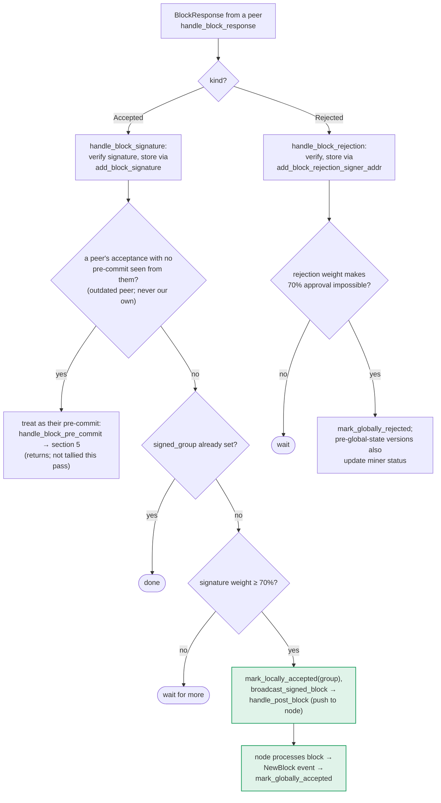

### Title
Signature-threshold path skips the chainstate re-check, letting a locally rejected/conflicting block be pushed to the node - ([File: stacks-signer/src/v0/signer.rs])

### Summary
Unlike the two other places a signer moves toward accepting a block — the validate-ok path (`handle_block_validate_ok`) and the pre-commit path (`handle_block_pre_commit`) — the path that tallies peer `BlockAccepted` signatures, `store_and_process_block_signature`, never calls `check_block_against_signer_db_state` before marking the block `LocallyAccepted` and pushing it to the node. This is analogous to the reported `DelFiPrice`/`OpenOraclePriceData` inconsistency: there are two ways to reach "this signer has approved this block" (pre-commit → sign, and peer-signature tally), and only one of them re-validates against current chainstate before acting.

### Finding Description
Three places move a block toward local acceptance in `stacks-signer/src/v0/signer.rs`:

1. `handle_block_validate_ok` — after node validation succeeds, calls `check_block_against_signer_db_state` before `mark_pre_committed`. [1](#0-0) 

2. `handle_block_pre_commit` — before actually signing at the pre-commit threshold, re-derives conflicts (`get_signed_conflicts`, `reorg_permit_stands`, tip checks) and only then calls `mark_locally_accepted(false)`. [2](#0-1) 

3. `store_and_process_block_signature` — invoked from `handle_block_signature`, which processes `BlockAccepted` messages broadcast by *other* signers. It only checks whether the block is already `signed_group`, tallies signature weight, and once the 70% threshold is reached, calls `block_info.mark_locally_accepted(true)` and `broadcast_signed_block` — with **no call to `check_block_against_signer_db_state`** anywhere in this function. [3](#0-2) 

The `BlockInfo::check_state` state machine explicitly permits `LocallyRejected → LocallyAccepted` ("re-evaluated"), with no distinction between a transition driven by this signer's own re-validation and one driven purely by counting peers' signatures: [4](#0-3) 

`mark_locally_accepted` itself performs no chainstate check either; it just stamps timestamps and calls `move_to`: [5](#0-4) 

The project's own decision-map documentation confirms this asymmetry: sections 4 and 5 (validate-ok, pre-commit) both show an explicit `RECHECK` step against `check_block_against_signer_db_state`, while section 6 (peer signature tally) goes straight from `TALLY` to `BCAST["mark_locally_accepted(group), broadcast_signed_block"]` with no recheck step at all. [6](#0-5) 

**Concrete break of an equality/wedge:** the "signed vs validated" equality is that a signer only signs/pushes a block that its own current chainstate view still endorses. This holds for `handle_block_pre_commit` and `handle_block_validate_ok`, but not for `store_and_process_block_signature`. A signer can:
- locally reject a block B (`mark_locally_rejected`) because `check_block_against_signer_db_state` now finds a conflict (e.g. a signed sibling at the same height, or a stale tenure tip), and
- still receive `BlockAccepted` messages for B from peers who signed before the conflict existed or who have a lagging view,
- reach 70% aggregated weight purely from those stored signatures, and then
- have this signer's own `store_and_process_block_signature` call `mark_locally_accepted(true)` (a legal `LocallyRejected → LocallyAccepted` transition) and `broadcast_signed_block`, pushing the block to its own node — despite this signer having just locally rejected it for cause.

### Impact Explanation
This lets a one-slot miner plus ordinary gossip cause a signer to help push a block onward that the signer's own chainstate logic (`check_block_against_signer_db_state`, `get_signed_conflicts`, tenure-tip checks) currently flags as conflicting/invalid, purely by exploiting stale peer signatures already sitting in `signer_db`'s `block_signatures` table. This matches the "signer signing an invalid/non-canonical/conflicting block" Critical-impact category: the signer's local acceptance and the "push to node" action are decoupled from its live validity view, undermining the very re-check the pre-commit and validate-ok paths were built to enforce.

### Likelihood Explanation
No majority of signers, no other signer's key, and no local-access bypass is required: this signer already possesses valid `BlockAccepted` signatures in its `signer_db` (via ordinary StackerDB gossip) that were valid when produced. The only requirement is a state change between when those signatures were produced and when the local `check_block_against_signer_db_state` would now reject (a normal consequence of block/pre-commit re-proposals, reorg permits going stale, or a sibling block at the same height being locally accepted afterward) — i.e., exactly the class of races the pre-commit path was designed to close. The missing recheck in `store_and_process_block_signature` is a straightforward code-path gap, not a probabilistic/timing coincidence.

### Recommendation
Add the same `check_block_against_signer_db_state` (and/or `get_signed_conflicts`/`reorg_permit_stands`) re-check that `handle_block_pre_commit` and `handle_block_validate_ok` perform, inside `store_and_process_block_signature`, before calling `mark_locally_accepted(true)` and `broadcast_signed_block`. If the recheck fails, the block should be marked `LocallyRejected`/have a rejection broadcast instead of being pushed, mirroring the `RECHECK -- no --> REJ` branches already present in the other two paths.

### Proof of Concept
1. Signer S receives and validates block B (tenure T, height h); other signers accept and broadcast `BlockAccepted(B)` messages, which S stores via `add_block_signature` but does not yet reach 70% weight — S's own copy of B is still, say, `PreCommitted`.
2. A conflicting block B′ at height h in a different (or the same) tenure is signed and locally accepted by S first (via the normal pre-commit path), which is a legitimate, checked transition.
3. A late-arriving `BlockAccepted(B)` peer message (or a resend/replay) pushes S's tally for B over the 70% weight threshold in `store_and_process_block_signature`.
4. Because that function does not call `check_block_against_signer_db_state`/`get_signed_conflicts`, S calls `block_info.mark_locally_accepted(true)` for B (a permitted `PreCommitted/LocallyRejected → LocallyAccepted` transition per `BlockInfo::check_state`) and then `broadcast_signed_block`, pushing B to its own node even though B now conflicts with the block S already locally accepted at the same height. [7](#0-6)

### Citations

**File:** stacks-signer/src/v0/signer.rs (L1432-1478)
```rust
        if conflicts.iter().any(|conflict| {
            conflict.consensus_hash == block_info.block.header.consensus_hash
                && !self.reorg_permit_stands(stacks_client, conflict)
        }) {
            match stacks_client.get_tenure_tip(&block_info.block.header.consensus_hash) {
                Ok(tip) => {
                    let tip_height = tip.anchored_header.height();
                    if tip_height >= block_info.block.header.chain_length {
                        warn!(
                            "{self}: Reached the pre-commit threshold for a block that conflicts with previously signed or accepted blocks, and the canonical tip of its tenure is already at or above the proposed height. Refusing to sign.";
                            "signer_signature_hash" => %block_hash,
                            "block_height" => block_info.block.header.chain_length,
                            "canonical_tip_height" => tip_height,
                        );
                        return;
                    }
                }
                Err(e) => {
                    warn!(
                        "{self}: Failed to fetch the canonical tip of the proposed block's tenure: {e:?}. Treating the tenure as unconfirmed.";
                        "signer_signature_hash" => %block_hash,
                        "consensus_hash" => %block_info.block.header.consensus_hash,
                    );
                }
            }
        }
        if !conflicts.is_empty() {
            info!(
                "{self}: Reached the pre-commit threshold for a block that conflicts with previously signed or accepted blocks, but none of those conflicts still blocks it. Signing the replacement.";
                "signer_signature_hash" => %block_hash,
                "block_height" => block_info.block.header.chain_length,
                "num_conflicts" => conflicts.len(),
            );
        }
        // It is only considered globally accepted IFF we receive a new block event confirming it OR see the chain tip of the node advance to it.
        if let Err(e) = block_info.mark_locally_accepted(false) {
            if !block_info.has_reached_consensus() {
                warn!("{self}: Failed to mark block as locally accepted: {e:?}",);
            }
        }
        self.signer_db
            .insert_block(&block_info)
            .unwrap_or_else(|e| self.handle_insert_block_error(e));
        let accepted = self.create_block_acceptance(&block_info.block);
        // have to save the signature _after_ the block info
        self.handle_block_signature(stacks_client, sortition_state, &accepted);
        self.send_block_response(&block_info.block, accepted.into());
```

**File:** stacks-signer/src/v0/signer.rs (L1946-1970)
```rust
        if let Some(block_rejection) =
            self.check_block_against_signer_db_state(stacks_client, &block_info.block)
        {
            // The signer db state has changed. We no longer view this block as valid. Override the validation response.
            if let Err(e) = block_info.mark_locally_rejected() {
                if !block_info.has_reached_consensus() {
                    warn!("{self}: Failed to mark block as locally rejected: {e:?}");
                }
            };
            self.signer_db
                .insert_block(&block_info)
                .unwrap_or_else(|e| self.handle_insert_block_error(e));
            self.handle_block_rejection(&block_rejection, sortition_state);
            self.send_block_response(&block_info.block, block_rejection.into());
        } else {
            if let Err(e) = block_info.mark_pre_committed() {
                // The block may have reached enough signatures before we validated the block so should fail to mark pre-committed
                // but still call to make sure the timestamps and validity are updated correctly.
                if !block_info.has_reached_consensus()
                    && block_info.state != BlockState::LocallyAccepted
                {
                    warn!("{self}: Failed to mark block as approved: {e:?}",);
                    return;
                }
            }
```

**File:** stacks-signer/src/v0/signer.rs (L2442-2538)
```rust
    /// Store the block acceptance signature and check if we have reached a consensus decision on the block because of it. If we have, update the block state accordingly and broadcast the block if accepted.
    fn store_and_process_block_signature(
        &mut self,
        stacks_client: &StacksClient,
        sortition_state: &mut Option<SortitionsView>,
        block_info: &mut BlockInfo,
        signer_address: &StacksAddress,
        signature: &MessageSignature,
    ) {
        let block_hash = &block_info.signer_signature_hash();
        // signature is valid! store it.
        // if this returns false, it means the signature already exists in the DB, so just return.
        if !self
            .signer_db
            .add_block_signature(block_hash, signer_address, signature)
            .unwrap_or_else(|_| panic!("{self}: Failed to save block signature"))
        {
            return;
        }

        // If this isn't our own signature and we haven't seen a pre-commit from this signer yet, try treating it as a pre-commit in case the caller is running an outdated version
        if signer_address != &self.stacks_address && !self.signer_db.has_committed(block_hash, signer_address).inspect_err(|e| warn!("Failed to check if pre-commit message already considered for {signer_address:?} for {block_hash}: {e}")).unwrap_or(false) {
            self.handle_block_pre_commit(stacks_client, sortition_state, signer_address, block_hash);
            return;
        }

        if block_info.signed_group.is_some() {
            // We have already processed this block to the accepted state. Adding more signatures will not change anything so nothing to check.
            return;
        }
        // do we have enough signatures to broadcast?
        // i.e. is the threshold reached?
        let signatures = self
            .signer_db
            .get_block_signatures(block_hash)
            .unwrap_or_else(|_| panic!("{self}: Failed to load block signatures"));

        // put signatures in order by signer address (i.e. reward cycle order)
        let addrs_to_sigs: HashMap<_, _> = signatures
            .into_iter()
            .filter_map(|sig| {
                let Ok(public_key) = Secp256k1PublicKey::recover_to_pubkey_without_validating_low_s(
                    block_hash.bits(),
                    &sig,
                ) else {
                    return None;
                };
                let addr = StacksAddress::p2pkh(self.mainnet, &public_key);
                Some((addr, sig))
            })
            .collect();

        let signature_weight = self.signer_weights.get(signer_address).unwrap_or(&0);
        let total_signature_weight = self.compute_signature_signing_weight(addrs_to_sigs.keys());
        let total_weight = self.compute_signature_total_weight();

        let min_weight = NakamotoBlockHeader::compute_voting_weight_threshold(total_weight)
            .unwrap_or_else(|_| {
                panic!("{self}: Failed to compute threshold weight for {total_weight}")
            });

        if min_weight > total_signature_weight {
            info!("{self}: Received block acceptance, but have not yet reached the acceptance threshold.";
                "signer_signature_hash" => %block_hash,
                "signature_weight" => signature_weight,
                "consensus_hash" => %block_info.block.header.consensus_hash,
                "block_height" => block_info.block.header.chain_length,
                "total_weight_approved" => total_signature_weight,
                "total_weight" => total_weight,
                "percent_approved" => (total_signature_weight as f64 / total_weight as f64 * 100.0),
            );
            return;
        }
        info!("{self}: have reached the block acceptance threshold";
            "signer_signature_hash" => %block_hash,
            "signature_weight" => signature_weight,
            "consensus_hash" => %block_info.block.header.consensus_hash,
            "block_height" => block_info.block.header.chain_length,
            "total_weight_approved" => total_signature_weight,
            "total_weight" => total_weight,
            "percent_approved" => (total_signature_weight as f64 / total_weight as f64 * 100.0),
        );

        // have enough signatures to broadcast!
        // move block to LOCALLY accepted state.
        // It is only considered globally accepted IFF we receive a new block event confirming it OR see the chain tip of the node advance to it.
        if let Err(e) = block_info.mark_locally_accepted(true) {
            if !block_info.has_reached_consensus() {
                warn!("{self}: Failed to mark block as locally accepted: {e:?}");
            }
        }
        let _ = self.signer_db.insert_block(block_info).map_err(|e| {
            warn!("Failed to set group threshold signature timestamp for {block_hash}: {e:?}");
            panic!("{self} Failed to write block to signerdb: {e}");
        });
        self.broadcast_signed_block(stacks_client, block_info.block.clone(), &addrs_to_sigs);
    }
```

**File:** stacks-signer/src/signerdb.rs (L279-289)
```rust
    /// Mark this block as valid and the appropriate timestamps if they aren't already set, and attempt to mark it as locally accepted.
    pub fn mark_locally_accepted(&mut self, group_signed: bool) -> Result<(), String> {
        if group_signed {
            self.signed_group.get_or_insert(get_epoch_time_secs());
        } else {
            self.valid = Some(true);
            self.approved_time.get_or_insert(get_epoch_time_secs());
            self.signed_self.get_or_insert(get_epoch_time_secs());
        }
        self.move_to(BlockState::LocallyAccepted)
    }
```

**File:** stacks-signer/src/signerdb.rs (L313-329)
```rust
    /// Check if the block state transition is valid
    fn check_state(&self, state: BlockState) -> bool {
        let prev_state = &self.state;
        if *prev_state == state {
            return true;
        }
        match state {
            BlockState::Unprocessed => false,
            BlockState::LocallyAccepted | BlockState::LocallyRejected => !matches!(
                prev_state,
                BlockState::GloballyRejected | BlockState::GloballyAccepted
            ),
            BlockState::GloballyAccepted => !matches!(prev_state, BlockState::GloballyRejected),
            BlockState::GloballyRejected => !matches!(prev_state, BlockState::GloballyAccepted),
            BlockState::PreCommitted => matches!(prev_state, BlockState::Unprocessed),
        }
    }
```

**File:** docs/signer-flows.md (L357-373)
```markdown

