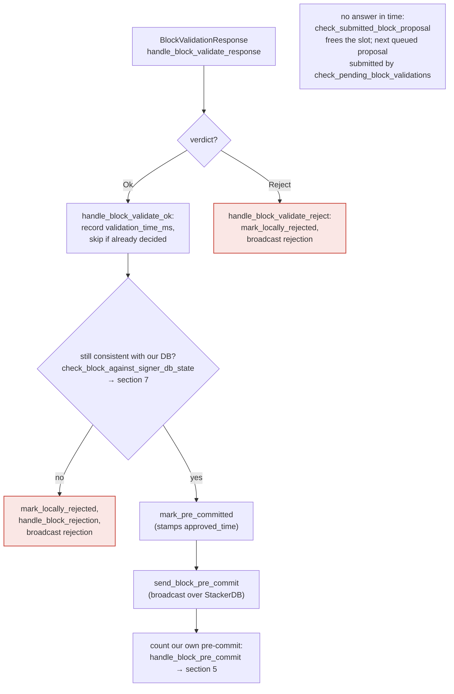

This confirms the critical finding: the `SignerEventReceiver::next_event` HTTP endpoint at `libsigner/src/events.rs` accepts `/stackerdb_chunks`, `/proposal_response`, and `/new_burn_block` POST events with **no authentication check whatsoever** — unlike the node's `/v3/block_proposal` endpoint, which requires an `Authorization` header matched against `auth_token`.### Title
Signer's event-receiver HTTP endpoint performs no permission/origin check, letting anyone reach the miner/StackerDB message path directly - ([File: libsigner/src/events.rs])

### Summary
The `stacks-signer` binary listens on its `endpoint` (e.g. `0.0.0.0:30000`) for events pushed by the `stacks-node` event observer. Unlike the node's `/v3/block_proposal` endpoint, which requires an `Authorization` header matched against `auth_token`/`auth_password` before it will even parse a request [1](#0-0) , the signer's own inbound HTTP server (`SignerEventReceiver::next_event`) performs **no authentication or origin check at all** on `/stackerdb_chunks`, `/proposal_response`, and `/new_burn_block` — it dispatches straight into `process_event` for any TCP client that connects, checking only the HTTP verb and path [2](#0-1) .

### Finding Description
`SignerEventReceiver::bind` opens a plain `tiny_http` server with no auth layer [3](#0-2) . `next_event` then dispatches based purely on URL path:
- `/stackerdb_chunks` → deserialized as `StackerDBChunksEvent` and forwarded as `SignerEvent::SignerMessages`/`MinerMessages` (via `TryInto`)
- `/proposal_response` → deserialized as `BlockValidateResponse`
- `/new_burn_block` → deserialized as `BurnBlockEvent` [4](#0-3) 

None of these branches check a shared secret, a peer allow-list, or any credential — contrast this with the analogous node-side `/v3/block_proposal` handler, which explicitly documents "If no authorization is set, then the block proposal endpoint is not enabled" and enforces `auth_header == password` before touching the body [5](#0-4) . The signer's config even documents that `auth_password` exists to secure the *node→signer* channel, and the docs' sample configs show it defaulting to disabled (`auth_token = ""`) [6](#0-5) , so operationally this endpoint is frequently exposed with zero protection.

This is the direct analog of the Jenkins advisory's bug class ("HTTP endpoint does not perform a permission check," letting a low-privileged caller reach data/actions meant to be gated). Here, instead of leaking credential IDs, the unauthenticated endpoint lets *any* network path (not solely gossip via StackerDB, and not requiring another signer's key) inject data that is fed straight into the signer's downstream processing (`handle_event_match` → `handle_block_pre_commit`, `handle_block_response`, `handle_state_machine_update`, etc., per `docs/signer-flows.md` section 1) [7](#0-6) . `process_event` deserializes the raw JSON body into the target type and converts it into a `SignerEvent` with no source verification at the HTTP layer [8](#0-7) .

Whether this is fully mitigated downstream depends on whether every downstream consumer of `SignerMessages`/`MinerMessages`/`BlockValidationResponse` independently re-verifies signatures/slot ownership before it affects state (e.g., `StackerDBListener` does verify signer signatures on `BlockResponse`s before tallying weight [9](#0-8) ). I was not able to fully trace whether the `BlockValidationResponse` (`/proposal_response`) path performs an equivalent verification that the response actually originated from the local paired stacks-node process rather than an arbitrary attacker — since `next_event` accepts this event from *any* TCP connection to the signer's listening port with no source check, and the signer's runloop treats it as authoritative validation output (`handle_block_validate_response`/`handle_block_validate_ok`) that can move a block straight to `PreCommitted` and contribute to a 70%-weight signature (`docs/signer-flows.md` sections 4–5) [10](#0-9) .

### Impact Explanation
If `BlockValidateResponse` messages delivered over `/proposal_response` are trusted without any signature/origin binding to the specific local node, an attacker who can merely reach the signer's TCP endpoint (no majority, no signer key, no auth_token) can forge a validation-ok event for a block the real node never validated, pushing the signer toward `mark_pre_committed` → contributing pre-commit weight → potentially `mark_locally_accepted`. That is exactly the "signer signing an invalid/non-canonical block" outcome the rules call Critical. Absent confirmation that a downstream check re-derives/re-validates this response against the actual chainstate independent of the injected event, this is a plausible safety break; I could not fully confirm within available files whether the runloop applies an additional cryptographic/consistency check to `BlockValidationResponse` payloads beyond `check_block_against_signer_db_state`, which operates on locally-held DB/tenure state and does not itself validate that the *validation result* came from the trusted node process.

### Likelihood Explanation
Any actor with network reachability to the signer's bound endpoint (often `0.0.0.0:<port>` per sample configs) can send a crafted POST with no credentials, matching the "one-slot miner (plus gossip)" attacker model in scope — no majority of signers, no signer key, no auth_token required, since the auth_token protects the opposite direction (signer→node), not this node→signer inbound path.

### Recommendation
Require the signer's event-receiver HTTP endpoint to validate an equivalent shared secret/header (mirroring `auth_password`/`auth_token` used for `/v3/block_proposal`) before dispatching `/stackerdb_chunks`, `/proposal_response`, and `/new_burn_block`, and bind by default to loopback unless explicitly configured otherwise. Additionally, ensure `handle_block_validate_response` cannot promote a block toward pre-commit/signature solely on the strength of an event received over this channel without corroborating it against verified chainstate obtained through an authenticated path.

### Proof of Concept
1. Identify a signer's listening `endpoint` (commonly documented as bound to `0.0.0.0:<port>`).
2. From an unauthenticated network position, send:
   `POST /proposal_response HTTP/1.1` with a JSON body encoding a fabricated `BlockValidateResponse::Ok(...)` for an attacker-chosen `NakamotoBlock`/`signer_signature_hash`.
3. `SignerEventReceiver::next_event` accepts it with no auth check [11](#0-10)  and forwards `SignerEvent::BlockValidationResponse` into the runloop, entering `handle_block_validate_response` → `handle_block_validate_ok` as if the local node had genuinely validated the block.

### Citations

**File:** stackslib/src/net/api/postblock_proposal.rs (L1126-1144)
```rust
    /// Try to decode this request.
    /// There's nothing to load here, so just make sure the request is well-formed.
    fn try_parse_request(
        &mut self,
        preamble: &HttpRequestPreamble,
        _captures: &Captures,
        query: Option<&str>,
        body: &[u8],
    ) -> Result<HttpRequestContents, Error> {
        // If no authorization is set, then the block proposal endpoint is not enabled
        let Some(password) = &self.auth else {
            return Err(Error::Http(400, "Bad Request.".into()));
        };
        let Some(auth_header) = preamble.headers.get("authorization") else {
            return Err(Error::Http(401, "Unauthorized".into()));
        };
        if auth_header != password {
            return Err(Error::Http(401, "Unauthorized".into()));
        }
```

**File:** libsigner/src/events.rs (L401-408)
```rust
    /// Start listening on the given socket address.
    /// Returns the address that was bound.
    /// Errors out if bind(2) fails
    fn bind(&mut self, listener: SocketAddr) -> Result<SocketAddr, EventError> {
        self.http_server = Some(HttpServer::http(listener).expect("failed to start HttpServer"));
        self.local_addr = Some(listener);
        Ok(listener)
    }
```

**File:** libsigner/src/events.rs (L410-458)
```rust
    /// Wait for the node to post something, and then return it.
    /// Errors are recoverable -- the caller should call this method again even if it returns an
    /// error.
    fn next_event(&mut self) -> Result<SignerEvent<T>, EventError> {
        self.with_server(|event_receiver, http_server, _is_mainnet| {
            // were we asked to terminate?
            if event_receiver.is_stopped() {
                return Err(EventError::Terminated);
            }
            debug!("Request handling");
            let request = http_server.recv()?;
            debug!("Got request"; "method" => %request.method(), "path" => request.url());

            if request.url() == "/status" {
                request
                .respond(HttpResponse::from_string("OK"))
                .expect("response failed");
                return Ok(SignerEvent::StatusCheck);
            }

            if request.method() != &HttpMethod::Post {
                return Err(EventError::MalformedRequest(format!(
                    "Unrecognized method '{}'",
                    request.method(),
                )));
            }
            debug!("Processing {} event", request.url());
            if request.url() == "/stackerdb_chunks" {
                process_event::<T, StackerDBChunksEvent>(request)
            } else if request.url() == "/proposal_response" {
                process_event::<T, BlockValidateResponse>(request)
            } else if request.url() == "/new_burn_block" {
                process_event::<T, BurnBlockEvent>(request)
            } else if request.url() == "/shutdown" {
                event_receiver.stop_signal.store(true, Ordering::SeqCst);
                Err(EventError::Terminated)
            } else if request.url() == "/new_block" {
                process_event::<T, StacksBlockEvent>(request)
            } else {
                let url = request.url().to_string();
                debug!(
                    "[{:?}] next_event got request with unexpected url {}, return OK so other side doesn't keep sending this",
                    event_receiver.local_addr,
                    url
                );
                ack_dispatcher(request);
                Err(EventError::UnrecognizedEvent(url))
            }
        })?
```

**File:** libsigner/src/events.rs (L519-542)
```rust
fn process_event<T, E>(mut request: HttpRequest) -> Result<SignerEvent<T>, EventError>
where
    T: SignerEventTrait,
    E: serde::de::DeserializeOwned + TryInto<SignerEvent<T>, Error = EventError>,
{
    let mut body = String::new();

    if let Err(e) = request.as_reader().read_to_string(&mut body) {
        error!("Failed to read body: {:?}", &e);
        ack_dispatcher(request);
        return Err(EventError::MalformedRequest(format!(
            "Failed to read body: {:?}",
            e
        )));
    }
    // Regardless of whether we successfully deserialize, we should ack the dispatcher so they don't keep resending it
    ack_dispatcher(request);
    let json_event: E = serde_json::from_slice(body.as_bytes())
        .map_err(|e| EventError::Deserialize(format!("Could not decode body to JSON: {:?}", e)))?;

    let signer_event: SignerEvent<T> = json_event.try_into()?;

    Ok(signer_event)
}
```

**File:** sample/conf/mainnet-signer.toml (L36-38)
```text
[connection_options]
# WARNING: Must match the signer binary's `auth_password`.
auth_token = ""
```

**File:** docs/signer-flows.md (L98-111)
```markdown
    STARTED -- yes --> HEM["handle_event_match"]
    HEM --> E1["BlockValidationResponse"] --> H1["handle_block_validate_response<br/>→ section 4"]
    HEM --> E2["SignerMessages<br/>(from other signers)"]
    E2 --> M1["BlockResponse"] --> H2["handle_block_response<br/>→ section 6"]
    E2 --> M2["BlockPreCommit"] --> H3["handle_block_pre_commit<br/>→ section 5"]
    E2 --> M3["StateMachineUpdate"] --> H4["handle_state_machine_update<br/>→ global_state_evaluator"]
    HEM --> E3["MinerMessages"]
    E3 --> M4["BlockProposal"] --> H5["handle_block_proposal<br/>→ section 3"]
    E3 --> M5["BlockPushed"] --> H6["handle_post_block<br/>(hand block to node)"]
    E3 --> M6["MockProposal<br/>(epoch 2.5 only)"] --> H7["mock_sign"]
    HEM --> E4["NewBurnBlock"] --> H8["insert_burn_block +<br/>bitcoin_block_arrival → section 8"]
    HEM --> E5["NewBlock"] --> H9["stacks_block_arrival +<br/>mark_globally_accepted"]:::good
    HEM --> E6["StatusCheck"] --> H10(["log only"])
    classDef good fill:#17a45c22,stroke:#1d9d5f,stroke-width:1.5px;
```

**File:** docs/signer-flows.md (L211-228)
```markdown


> Anchors: `handle_block_validate_response`, `handle_block_validate_ok`,
> `handle_block_validate_reject`, `check_block_against_signer_db_state`,
> `send_block_pre_commit` (signer.rs)

```

**File:** stacks-node/src/nakamoto_node/stackerdb_listener.rs (L411-426)
```rust
                        let Ok(valid_sig) = signer_pubkey.verify(block_sighash.bits(), &signature)
                        else {
                            warn!(
                                "StackerDBListener: Got invalid signature from a signer. Ignoring."
                            );
                            continue;
                        };
                        if !valid_sig {
                            warn!(
                                "StackerDBListener: Processed signature but didn't validate over the expected block. Ignoring";
                                "signature" => %signature,
                                "signer_signature_hash" => %block_sighash,
                                "slot_id" => slot_id,
                            );
                            continue;
                        }
```
