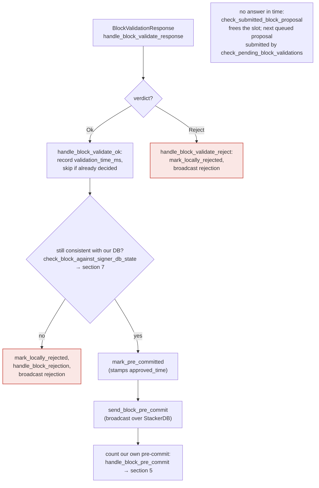
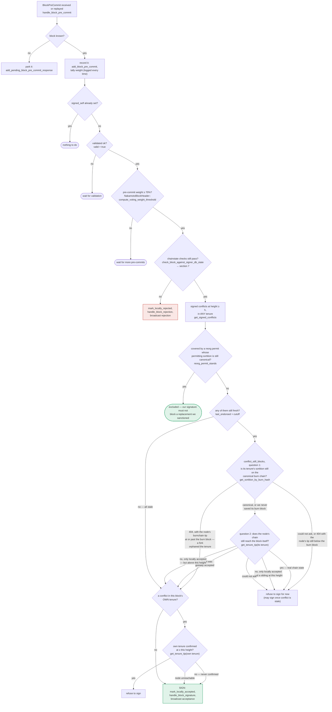

### Title
Fail-open connectivity default lets `check_latest_block_in_tenure` sign a stale/non-canonical block at the final pre-signature check - (File: `stacks-signer/src/chainstate/mod.rs`)

### Summary
`SortitionData::check_latest_block_in_tenure` treats an RPC failure from the signer's own node (`client.get_tenure_tip`) as proof the proposal is fine, returning `Ok(true)` ("assume higher — node's proposal endpoint is the backstop"). This function is reused, unmodified, as the *last* chainstate re-check before a signer emits its irrevocable signature (`check_block_against_signer_db_state`, invoked from both the validate-ok path and the pre-commit-threshold signing path). The "the node's proposal endpoint is the backstop" justification is only true when the block still has to be *submitted* to `/v3/block_proposal`; at the pre-commit-threshold recheck that submission has already happened and returned OK earlier — there is no further backstop before the signature leaves the box.

### Finding Description
`check_latest_block_in_tenure` [1](#0-0)  is the single implementation behind both:
- `check_tenure_change_confirms_parent` (checked against the **parent** tenure for tenure-change blocks), and
- `confirms_latest_block_in_same_tenure` (checked against the block's **own** tenure otherwise),

as documented at [2](#0-1) , both of which feed `check_block_against_signer_db_state`, which itself runs at two points: after node validation succeeds (section 4) and again at the moment the pre-commit threshold is crossed, right before the signer signs (section 5) [3](#0-2) [4](#0-3) .

Inside `check_latest_block_in_tenure`, when the node call to get the tenure tip fails for any reason (timeout, transient RPC error, node under load, node mid-restart, etc.), the function does not fail closed — it explicitly returns `Ok(true)`, i.e. "the proposal is higher / passes": [5](#0-4) 

The comment justifying this default states the assumption is "safe" only because "this proposal ultimately must be passed to the `stacks-node` for proposal processing," i.e. the node's own `/v3/block_proposal` validation is the real backstop [6](#0-5) . That reasoning holds for the call made at proposal arrival (before `submit_block_for_validation`), but the exact same function, with the exact same fallback, is reused at the two later call sites where no further submission to the node's validation endpoint occurs:
- at validate-ok, after the node already returned OK once (`handle_block_validate_ok` → `check_block_against_signer_db_state`), and
- at the pre-commit-threshold crossing, the described "one last look" before the irreversible signature is produced (`handle_block_pre_commit` → `check_block_against_signer_db_state` → `RECHECK` in section 5 of the flow doc) [4](#0-3) .

At that final point, if `get_tenure_tip` for the relevant tenure fails at exactly the moment the signer performs its guard re-check — a plausible and not-attacker-exotic condition (the signer's own node briefly failing to answer during a burnchain reorg window, which is precisely when this guard matters most) — the equality "does this block still confirm the tip we expect" is answered `true` by default instead of being treated as unknown/unsafe. This converts what should be a fail-closed safety check into a fail-open one at the one moment where the check cannot be corrected later: once the signature is emitted it cannot be revoked.

### Impact Explanation
This breaks the "one last look" invariant described in the signer's own design doc: "a signer takes one last look at the world before its signature — the one irreversible act — leaves the box" [7](#0-6) . If that last look silently defaults to "pass" on a connectivity hiccup, a signer can sign a block that does not actually confirm the tip it should, i.e. a stale or non-canonical block relative to its own tenure/parent-tenure state — exactly the "signer signing an invalid/non-canonical/conflicting block" category called Critical in the rules. Because this check is the union of `check_tenure_change_confirms_parent` and `confirms_latest_block_in_same_tenure`, both the tenure-change and same-tenure duplicate/conflict guards are bypassable this way, and the bypass is silent (no rejection is ever broadcast, so no other signer or the miner can detect that the guard didn't run) [5](#0-4) .

### Likelihood Explanation
The trigger condition — a transient failure of `client.get_tenure_tip` on the signer's own node at the exact moment `check_block_against_signer_db_state` runs during the pre-commit-threshold recheck — does not require compromising the signer, its key, or a majority of signers, and is not a bulk/volumetric DoS: it is a single RPC call racing a Bitcoin-reorg or node-restart window that a miner (or ordinary chain conditions) can create simply by timing a competing/conflicting block proposal near a burnchain event. Because the fallback is deterministic code (`Err(e) => return Ok(true)`), any signer whose node is momentarily unreachable at that instant will unconditionally take the unsafe branch — the bug is fully reachable without special privileges, only likely timing.

### Recommendation
Do not reuse the "assume higher" fallback for calls to `check_latest_block_in_tenure` made from `check_block_against_signer_db_state` at validate-ok and at pre-commit-threshold signing time. Those call sites should fail closed (treat connectivity failure as "cannot confirm — do not sign," mirroring the `ConnectivityIssues` rejection pattern used elsewhere in the code, e.g. `check_block_against_local_state`/`check_block_against_global_state`), reserving the optimistic `Ok(true)` default strictly for the proposal-arrival call where the node's `/v3/block_proposal` endpoint still acts as a genuine backstop.

### Proof of Concept
1. A miner proposes tenure-change/duplicate block `B` at height `h` in tenure `T`; the signer already holds a fresh signature over sibling block `A` at height `h` (or a valid tip in `T`/parent tenure) recorded via `get_last_signed_block`.
2. `B`'s pre-commits reach the 70% threshold (peers with a stale/partitioned view may still pre-commit).
3. At the moment the local signer runs the final re-check (`handle_block_pre_commit` → `check_block_against_signer_db_state` → `confirms_latest_block_in_same_tenure`/`check_tenure_change_confirms_parent` → `check_latest_block_in_tenure`), the signer's call to `client.get_tenure_tip(tenure_id)` fails (e.g., the node is momentarily busy processing the reorg, per [5](#0-4) ).
4. `check_latest_block_in_tenure` returns `Ok(true)` regardless of `B`'s actual relationship to the canonical tip, `check_block_against_signer_db_state` reports no rejection, and the signer proceeds to `mark_locally_accepted`/sign `B` — even though `B` conflicts with/does not build on the block the signer already signed.

### Citations

**File:** stacks-signer/src/chainstate/mod.rs (L366-383)
```rust
    /// Check whether or not `block` is higher than the highest block in `tenure_id`.
    ///  returns `Ok(true)` if `block` is higher, `Ok(false)` if not.
    ///
    /// If we can't look up `tenure_id`, assume `block` is higher.
    /// This assumption is safe because this proposal ultimately must be passed
    /// to the `stacks-node` for proposal processing: so, if we pass the block
    /// height check here, we are relying on the `stacks-node` proposal endpoint
    /// to do the validation on the chainstate data that it has.
    ///
    /// This updates the activity timer for the miner of `block`.
    pub fn check_latest_block_in_tenure(
        tenure_id: &ConsensusHash,
        block: &NakamotoBlock,
        signer_db: &mut SignerDb,
        client: &StacksClient,
        tenure_last_block_proposal_timeout: Duration,
        reorg_attempts_activity_timeout: Duration,
    ) -> Result<bool, ClientError> {
```

**File:** stacks-signer/src/chainstate/mod.rs (L450-461)
```rust
        let tip = match client.get_tenure_tip(tenure_id) {
            Ok(tip) => tip.anchored_header,
            Err(e) => {
                warn!(
                    "Failed to fetch the tenure tip for the parent tenure: {e:?}. Assuming proposal is higher than the parent tenure for now.";
                    "proposed_block_consensus_hash" => %block.header.consensus_hash,
                    "signer_signature_hash" => %block.header.signer_signature_hash(),
                    "parent_tenure" => %tenure_id,
                );
                return Ok(true);
            }
        };
```

**File:** docs/signer-flows.md (L13-22)
```markdown
## 0. The life of a block proposal (conceptual)

Before the mechanics: what a proposal goes through, in plain terms. Signing is
deliberately split into two rounds. First each signer says only _"I am willing to
sign this"_ — a **pre-commit**, which carries no signature and commits nothing.
Only once 70% of the weight has said that does anyone actually sign. The gap
between the two rounds is where most of the subtlety lives: time passes, the
burn chain can fork, and another block may win the same slot, so a signer takes
one last look at the world before its signature — the one irreversible act —
leaves the box.
```

**File:** docs/signer-flows.md (L205-228)
```markdown
## 4. The node's validation verdict

The stacks-node answers the `/v3/block_proposal` submission. On OK, the signer
re-checks its own DB state and only then advertises willingness to sign by
broadcasting a **pre-commit**. A signature is _not_ produced here.



> Anchors: `handle_block_validate_response`, `handle_block_validate_ok`,
> `handle_block_validate_reject`, `check_block_against_signer_db_state`,
> `send_block_pre_commit` (signer.rs)

```

**File:** docs/signer-flows.md (L229-270)
```markdown
## 5. Pre-commit threshold → signature

The only place the signer produces a block signature by counting votes.
Pre-commits from peers (and our own) accumulate; at ≥70% weight the signer
decides whether to follow through. Between validation and threshold, we may have
signed a _different_ block at the same height, possibly in another tenure, so
the world must be re-checked before the signature leaves the box.



**File:** docs/signer-flows.md (L391-398)
```markdown
`check_latest_block_in_tenure` answers "does this block confirm the tip we
expect?" and it runs in three places: at proposal arrival (inside
`check_proposal`), at validate-ok, and at the moment of signing. _Which_ tenure
it is asked about depends on the block: a tenure-change block is checked against
its **parent** tenure, every other block against its **own**. Never both. The
pivotal helper is `get_tenure_last_block_info`, which considers only blocks that
carry a signature (`get_last_signed_block`): a pre-commit never vetoes anything,
it only counts as miner activity.
```
