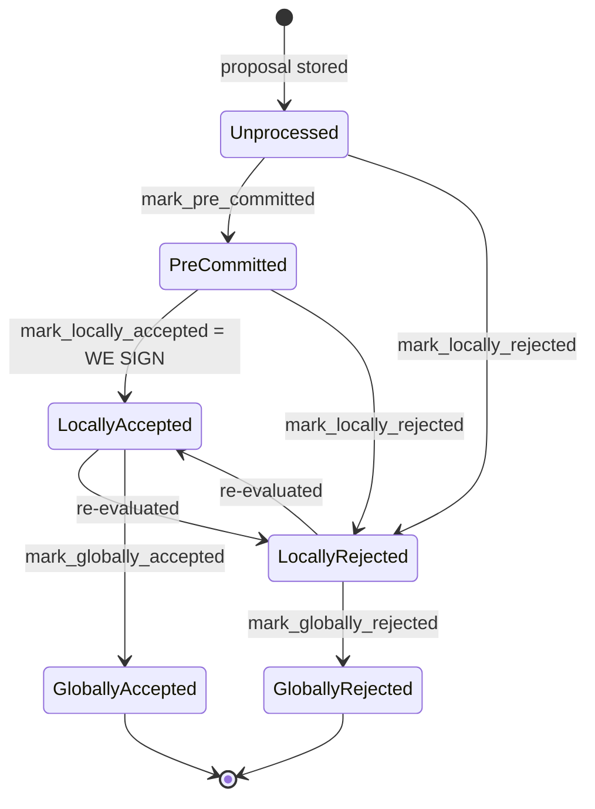

## Finding [1](#0-0) 

### Title
Stale rejection weight is never cleared when a signer flips to acceptance, causing the miner's block-status tally to double-count and mis-trigger `SignersRejected` — ([File: stacks-node/src/nakamoto_node/stackerdb_listener.rs])

### Summary
`BlockStatus` in the node's `StackerDBListener` tracks `total_weight_approved` and `total_weight_rejected` as two independent, additive counters keyed by `responded_signers` / `gathered_signatures`. When a signer legitimately reconsiders a rejected block and later accepts/signs it — a transition the signer state machine explicitly supports (`LocallyRejected --> LocallyAccepted: re-evaluated`) — the acceptance handler adds the signer's weight to `total_weight_approved` but never removes it from `total_weight_rejected`. The stale rejection weight persists forever for that block, exactly mirroring the "two names point to one token" defect: one signer's identity ends up counted under two mutually-exclusive buckets simultaneously.

### Finding Description
In `handle_stackerdb_chunk_event` (or its equivalent processing loop) in `stackerdb_listener.rs`:

- On `BlockResponse::Rejected`, the signer's weight is added to `block.total_weight_rejected` guarded only by `block.responded_signers.insert(slot_id)`: [2](#0-1) 

- On `BlockResponse::Accepted` for the same block hash, the signer's weight is added to `block.total_weight_approved` guarded only by `!block.gathered_signatures.contains_key(&slot_id)`: [3](#0-2) 

Neither branch reconciles against the other counter/set. If the same signer first rejects (their weight lands in `total_weight_rejected`) and later — after legitimate re-evaluation — accepts and signs, their weight is *also* added to `total_weight_approved`. The stale rejection contribution is never subtracted.

This is a genuine regression relative to the signer's own local bookkeeping, which was deliberately built to avoid exactly this: `SignerDb::add_block_signature` explicitly deletes any prior rejection row for that `(signer_signature_hash, signer_addr)` before recording the new signature: [4](#0-3) 

and this is pinned down by a dedicated test: [5](#0-4) 

The block lifecycle diagram in the repo's own signer-flows documentation confirms `LocallyRejected -> LocallyAccepted` is a supported, expected transition, not an edge case: [6](#0-5) 

So while the signer-side local ledger correctly "dereserves" the stale rejection when the vote flips, the miner-side aggregate ledger in `stackerdb_listener.rs`/`BlockStatus` does not, leaving a permanent phantom rejection weight for any signer who ever rejected-then-accepted a given block hash.

This directly feeds the miner's threshold decision in the signing coordinator, which treats `total_weight_rejected` as ground truth for whether 70% approval is "now impossible": [7](#0-6) 

Because the stale weight is retained, the sum `total_weight_rejected + total_weight_approved` can exceed `total_weight` (a single signer counted in both), and — more importantly — `total_weight_rejected` can cross the blocking-minority threshold (`> total_weight - weight_threshold`) using weight that is no longer currently opposed to the block, forcing `NakamotoNodeError::SignersRejected` even though the live, current signer set (after reconsideration) would clear the acceptance threshold.

### Impact Explanation
This is a High-severity liveness wedge on block production: a legitimate re-evaluation by even a single signer (reject → accept, which the codebase treats as a normal, expected flow — see `signers_do_not_reconsider_globally_accepted_and_responded_blocks` and `signer_reevaluates_proposal_with_missing_burn_view` tests) permanently and silently inflates the miner's rejection tally for that specific block hash. Combined with genuine (but sub-30%) rejections from other signers, this stale weight can tip the coordinator into concluding the block is doomed and abandon it, even though the block currently has enough live signatures/willingness to reach the 70% threshold. The miner is forced to re-mine, degrading block production liveness without requiring a majority of malicious signers — a single signer exercising ordinary reconsideration is sufficient to poison that block's tally.

### Likelihood Explanation
High. Reject-then-accept is an explicitly supported and tested signer behavior (proposal re-evaluation, `should_reevaluate_reject_reason`, timeouts causing reconsideration, etc.), so this can be triggered unintentionally in normal operation, and trivially by a single adversarial signer using only their own key by sending a `Rejected` response and later an `Accepted` response for the same `signer_signature_hash`. No majority collusion or access to other signers' keys is required.

### Recommendation
In the `BlockResponse::Accepted` handler, before adding the signer's weight to `total_weight_approved`, check whether that `slot_id` previously contributed to `total_weight_rejected` (e.g., track per-signer vote kind, not just two independent sets) and subtract the stale weight from `total_weight_rejected` (or otherwise make the two counters mutually exclusive per signer), mirroring the cleanup already performed in `SignerDb::add_block_signature`.

### Proof of Concept
1. Miner proposes block `B`.
2. Signer `S` (weight `w`) sends `BlockResponse::Rejected(B)` — node's `BlockStatus.total_weight_rejected += w`, `responded_signers.insert(S)` (`stackerdb_listener.rs:515-518`).
3. `S` later re-evaluates (e.g., its earlier reject reason was `NoSignerConsensus`/`ConnectivityIssues`, which `should_reevaluate_reject_reason` allows to be reconsidered — `stacks-signer/src/v0/signer.rs:2706-2739`) and sends `BlockResponse::Accepted(B)`.
4. Node's accept handler checks only `gathered_signatures.contains_key(&S)` (false, since `S` never accepted before) and adds `w` to `total_weight_approved` — `total_weight_rejected` is left untouched at `w` (`stackerdb_listener.rs:443-465`).
5. Repeat with enough additional genuine rejecters so that `total_weight_rejected` (which still includes `S`'s stale `w`) crosses `total_weight - weight_threshold`, while the *current* live signer intent (excluding `S`'s stale vote) would actually clear `weight_threshold` for approval.
6. `signer_coordinator.rs`'s wait loop sees `total_weight_rejected.saturating_add(weight_threshold) > total_weight` and returns `NakamotoNodeError::SignersRejected`, abandoning block `B` even though enough signers currently intend to sign it.

### Citations

**File:** stacks-node/src/nakamoto_node/stackerdb_listener.rs (L70-82)
```rust
#[derive(Debug, Clone)]
pub struct BlockStatus {
    /// Set of the slot ids of signers who have responded
    pub responded_signers: HashSet<u32>,
    /// Map of the slot id of signers who have signed the block and their signature
    pub gathered_signatures: BTreeMap<u32, MessageSignature>,
    /// Total weight of signers who have signed the block
    pub total_weight_approved: u32,
    /// Total weight of signers who have rejected the block
    pub total_weight_rejected: u32,
    /// Per-txid rejection tracking from signers
    pub failed_txids: HashMap<Txid, FailedTxInfo>,
}
```

**File:** stacks-node/src/nakamoto_node/stackerdb_listener.rs (L443-465)
```rust
                        if !block.gathered_signatures.contains_key(&slot_id) {
                            block.total_weight_approved = block
                                .total_weight_approved
                                .saturating_add(signer_entry.weight);

                            info!("StackerDBListener: Signature Added to block";
                                "signer_signature_hash" => %block_sighash,
                                "signer_pubkey" => signer_pubkey.to_hex(),
                                "signer_slot_id" => slot_id,
                                "signature" => %signature,
                                "signer_weight" => signer_entry.weight,
                                "total_weight_approved" => block.total_weight_approved,
                                "percent_approved" => block.total_weight_approved as f64 / self.total_weight as f64 * 100.0,
                                "total_weight_rejected" => block.total_weight_rejected,
                                "percent_rejected" => block.total_weight_rejected as f64 / self.total_weight as f64 * 100.0,
                                "weight_threshold" => self.weight_threshold,
                                "tenure_extend_timestamp" => tenure_extend_timestamp,
                                "read_count_extend_timestamp" => read_count_extend_timestamp,
                                "server_version" => metadata.server_version,
                            );
                        }
                        block.gathered_signatures.insert(slot_id, signature);
                        block.responded_signers.insert(slot_id);
```

**File:** stacks-node/src/nakamoto_node/stackerdb_listener.rs (L515-518)
```rust
                        if block.responded_signers.insert(slot_id) {
                            block.total_weight_rejected = block
                                .total_weight_rejected
                                .saturating_add(signer_entry.weight);
```

**File:** stacks-signer/src/signerdb.rs (L1870-1881)
```rust
    /// Record an observed block signature
    pub fn add_block_signature(
        &self,
        block_sighash: &Sha512Trunc256Sum,
        signer_addr: &StacksAddress,
        signature: &MessageSignature,
    ) -> Result<bool, DBError> {
        // Remove any block rejection entry for this signer and block hash
        let del_qry = "DELETE FROM block_rejection_signer_addrs WHERE signer_signature_hash = ?1 AND signer_addr = ?2";
        let del_args = params![block_sighash, signer_addr.to_string()];
        self.db.execute(del_qry, del_args)?;

```

**File:** stacks-signer/src/signerdb.rs (L3234-3263)
```rust
    #[test]
    fn reject_then_accept() {
        let db_path = tmp_db_path();
        let db = SignerDb::new(db_path).expect("Failed to create signer db");

        let block_id = Sha512Trunc256Sum::from_data("foo".as_bytes());
        let address = StacksAddress::burn_address(false);
        let sig1 = MessageSignature([0x11; 65]);

        assert_eq!(db.get_block_signatures(&block_id).unwrap(), vec![]);

        assert!(db
            .add_block_rejection_signer_addr(
                &block_id,
                &address,
                RejectReasonPrefix::InvalidParentBlock
            )
            .unwrap());
        assert_eq!(
            db.get_block_rejection_signer_addrs(&block_id).unwrap(),
            vec![(address.clone(), RejectReasonPrefix::InvalidParentBlock)]
        );

        assert!(db.add_block_signature(&block_id, &address, &sig1).unwrap());
        assert_eq!(db.get_block_signatures(&block_id).unwrap(), vec![sig1]);
        assert!(db
            .get_block_rejection_signer_addrs(&block_id)
            .unwrap()
            .is_empty());
    }
```

**File:** docs/signer-flows.md (L137-150)
```markdown

```

**File:** stacks-node/src/nakamoto_node/signer_coordinator.rs (L509-540)
```rust
            if block_status
                .total_weight_rejected
                .saturating_add(self.weight_threshold)
                > self.total_weight
            {
                info!(
                    "{}/{} signer weight votes to reject block",
                    block_status.total_weight_rejected, self.total_weight;
                    "signer_signature_hash" => %block_signer_sighash,
                );
                counters.bump_naka_rejected_blocks();

                // Only act on failed txids that a blocking minority (>30% weight) agrees on
                let blocking_minority = self.total_weight.saturating_sub(self.weight_threshold);
                let mut temporarily_excluded_txids = HashSet::new();
                let mut permanently_excluded_txids = HashSet::new();
                for (txid, info) in &block_status.failed_txids {
                    if info.total_weight > blocking_minority {
                        // Do not perma ban txids that only a small minority of signers reported as problematic
                        // But make sure its removed from the next block proposal
                        if info.problematic_weight > blocking_minority {
                            permanently_excluded_txids.insert(txid.clone());
                        } else {
                            temporarily_excluded_txids.insert(txid.clone());
                        }
                    }
                }

                return Err(NakamotoNodeError::SignersRejected {
                    temporarily_excluded_txids,
                    permanently_excluded_txids,
                });
```
