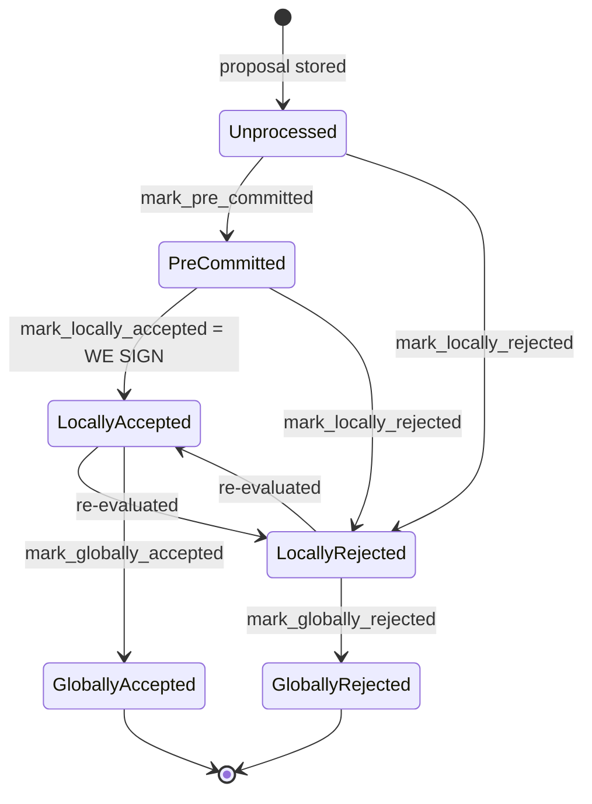
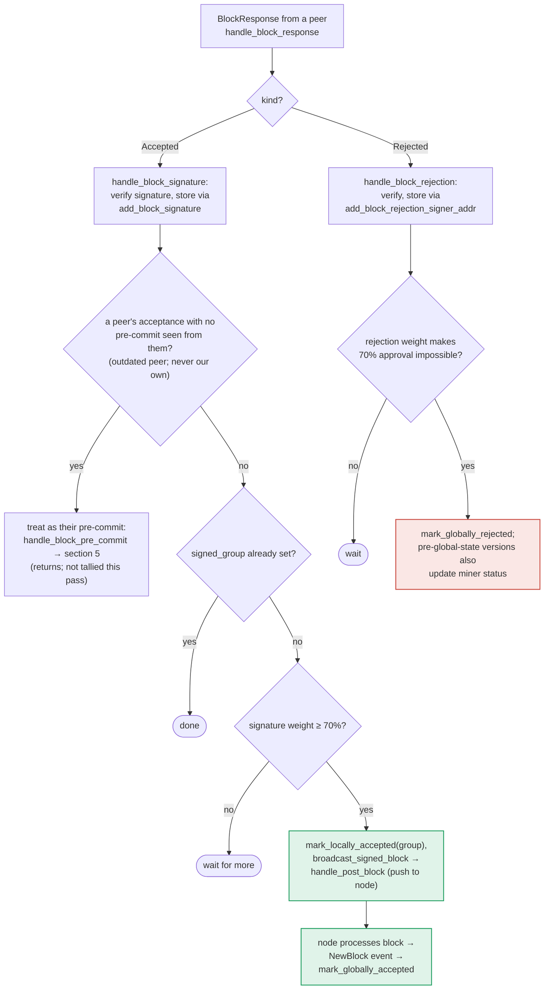

## Title
Signer accepts and pushes conflicting sibling block based purely on gathered peer signature weight, bypassing the chainstate/conflict-guard that gates the signer's own signing path — ([File: stacks-signer/src/v0/signer.rs])

## Summary
`Signer::store_and_process_block_signature` (the handler for observed `BlockResponse::Accepted` messages from peer signers) marks a block `LocallyAccepted` and immediately pushes it to the node once tallied signature weight crosses the 70% threshold. Unlike the sibling code path that produces the signer's *own* signature (`handle_block_pre_commit`), this path never re-runs `check_block_against_signer_db_state` or the `get_signed_conflicts` / `conflict_still_blocks` sibling-guard before accepting and broadcasting. A one-slot miner that proposes two conflicting same-height blocks (already an established, gossip-only attack surface in this codebase, per the extensive `run_sibling_scenario` test suite) can cause a signer to locally accept and forward to its own node a block that conflicts with one it has already signed — purely because enough *already-existing* peer `Accepted` messages for the sibling were gossiped/relayed to it.

## Finding Description
Two structurally different roads lead to `BlockState::LocallyAccepted` for a given `BlockInfo`:

1. **Self-signing path** — `handle_block_pre_commit`, when the local pre-commit weight crosses 70%. Before producing the signer's own signature, this path explicitly re-validates chainstate (`check_block_against_signer_db_state`) and enforces the sibling/one-per-height invariant via `get_signed_conflicts` + `conflict_still_blocks` + `reorg_permit_stands`: [1](#0-0) [2](#0-1) 

2. **Peer-signature aggregation path** — `store_and_process_block_signature`, invoked from `handle_block_signature` whenever an `Accepted` `BlockResponse` arrives from any signer (self or peer). It stores the signature, tallies weight against `NakamotoBlockHeader::compute_voting_weight_threshold`, and once the threshold is met, calls `block_info.mark_locally_accepted(true)` and `broadcast_signed_block` to push the block to the node — with **no call to `check_block_against_signer_db_state`, `get_signed_conflicts`, or `conflict_still_blocks`** anywhere in the function: [3](#0-2) 

The only defensive check in this path is `is_valid_signer` (authenticates that the recovered pubkey belongs to the reward set) in `handle_block_signature`, plus deduplication of the signature itself: [4](#0-3) 

Neither of these checks anything about whether the block being accepted conflicts with a block the signer has *already* locally/globally accepted at the same or higher height. `BlockInfo::mark_locally_accepted`'s state machine is scoped to that single block's row and has no cross-block awareness:
`stacks-signer/src/signerdb.rs` — `mark_locally_accepted` only enforces the row's own `Unprocessed/PreCommitted → LocallyAccepted` transition, per the state diagram documented in the flow docs: [5](#0-4) 

The documentation itself states plainly that the sibling/conflict re-check "runs only in `handle_block_pre_commit`" (section 5) and is the *only* place a block signature is produced with that guard — it says nothing about the peer-signature tally path also being covered: [6](#0-5) [7](#0-6) 

The extensive regression-test suite for the sibling/conflict guard (`signer_refuses_to_sign_second_sibling_tenure_start`, `stale_sibling_still_refused_when_canonical_tip_at_height`, `fresh_conflict_in_another_tenure_blocks_signing`, etc.) all drive the scenario through `handle_block_validate_response` → `handle_block_pre_commit`, i.e. the self-signing path: [8](#0-7) [9](#0-8) 

None of these tests exercise `store_and_process_block_signature`/`handle_block_signature` with a conflicting sibling, i.e. the case where a signer has already signed block A at height H and then receives enough peer `Accepted` messages for a *different* block B at height H to cross the threshold on its own.

**Attack scenario (single miner + gossip, no signer majority needed):**
1. A miner proposes two conflicting tenure-start blocks A and B at the same height/tenure within the normal validation-timing window (this exact setup is the one already tested in `run_sibling_scenario`).
2. Some subset of the signer population — through ordinary timing/ordering of message delivery, not malicious majority collusion — independently pre-commits and signs B before it becomes evident (to those signers) that A is a live/fresh conflict; this can happen legitimately in a slow-gossip / partitioned scenario, and the sum of such signatures for B, once broadcast, can reach 70% of *global* weight even though any individual signer still holds a fresh conflicting acceptance of A.
3. A signer S that has already locally accepted/signed A (through its own conflict-aware pre-commit path) subsequently receives (or a gossiping party simply relays) enough previously-existing `Accepted(B)` messages to push S's own tally for B over threshold in `store_and_process_block_signature`.
4. S calls `mark_locally_accepted(true)` on B and `broadcast_signed_block`, pushing B to its own node — even though S itself holds a fresh, live signature over conflicting sibling A. The very guard that would refuse this exact situation (`conflicts.iter().find(...)` in `handle_block_pre_commit`) is *not* consulted in this code path.

## Impact Explanation
This breaks the "signed vs validated" / "one-per-height" invariant that the rest of the codebase goes to great lengths to preserve (see the entire `conflict_still_blocks`/`get_signed_conflicts` machinery, and its dedicated regression-test suite). A signer can be made to submit a locally-accepted, conflicting/non-canonical sibling block to its own node purely by weight-tallying already-observed signatures, without the signer itself producing a fresh signature under the guard. This falls under the specified Critical impact category: a signer accepting/forwarding a conflicting block that its own conflict guard was designed to reject.

## Likelihood Explanation
Likelihood is moderate-to-high in the specific window this repo's own tests show is reachable by a single miner: two conflicting tenure-start blocks within the asynchronous-validation timing gap already produce siblings that some signers sign and others don't, purely from ordinary network timing (as documented and tested in `async_sibling_validation`/`run_sibling_scenario`). The additional step needed here — feeding a signer enough already-existing `Accepted(B)` gossip after it has independently signed A — requires no majority collusion, only ordinary message relay/gossip of signatures that already exist on the network, which `handle_block_signature` processes unconditionally from any signer message.

## Recommendation
In `store_and_process_block_signature` (or immediately before it is invoked, mirroring `handle_block_pre_commit`), before calling `block_info.mark_locally_accepted(true)`/`broadcast_signed_block` once the aggregated signature threshold is reached, re-run the same chainstate/conflict checks used in the self-signing path: `check_block_against_signer_db_state` and the `get_signed_conflicts` + `conflict_still_blocks` (+ `reorg_permit_stands`) guard. If a fresh, still-live conflicting signed block exists, the signer should refuse to mark the peer-signed block as locally accepted / refuse to push it to the node, consistent with the invariant already enforced on the self-signing path.

## Proof of Concept
Given the available static analysis (no live cluster access), the PoC is a targeted unit-test extension of the existing sibling-scenario test harness:
1. Reuse `run_sibling_scenario`'s setup (`stacks-signer/src/v0/tests.rs`) to get the signer to sign block A (tenure-start, height 10) via its own `handle_block_pre_commit` conflict-checked path.
2. Instead of driving B through `handle_block_validate_response`/`handle_block_pre_commit`, directly synthesize `BlockAccepted` peer messages (as `SignerEvent::SignerMessages`) with signatures over B from enough distinct, valid reward-set signer addresses to reach `compute_voting_weight_threshold`, and feed them through `Signer::handle_block_response`/`handle_block_signature`.
3. Assert that despite holding a fresh `signed_self` over conflicting sibling A, the signer's `BlockInfo` for B transitions to `LocallyAccepted` and `broadcast_signed_block`/`handle_post_block` is invoked — i.e., no rejection is produced and no conflict guard fires, unlike the equivalent scenario when B is driven through the pre-commit path.

I was not able to execute this test in a live environment (no code execution tooling available in this session); the PoC steps above are derived directly from the function boundaries and control flow read in `stacks-signer/src/v0/signer.rs` (`handle_block_signature`, `store_and_process_block_signature`, `handle_block_pre_commit`) and the existing sibling test harness in `stacks-signer/src/v0/tests.rs`.

### Citations

**File:** stacks-signer/src/v0/signer.rs (L1345-1366)
```rust
        if let Some(block_rejection) =
            self.check_block_against_signer_db_state(stacks_client, &block_info.block)
        {
            warn!(
                "{self}: Reached the pre-commit threshold for a block, but it no longer passes the chainstate checks. Rejecting.";
                "signer_signature_hash" => %block_hash,
                "block_height" => block_info.block.header.chain_length,
                "reject_code" => %block_rejection.reason_code,
                "reject_reason" => &block_rejection.reason,
            );
            if let Err(e) = block_info.mark_locally_rejected() {
                if !block_info.has_reached_consensus() {
                    warn!("{self}: Failed to mark block as locally rejected: {e:?}");
                }
            };
            self.signer_db
                .insert_block(&block_info)
                .unwrap_or_else(|e| self.handle_insert_block_error(e));
            self.handle_block_rejection(&block_rejection, sortition_state);
            self.send_block_response(&block_info.block, block_rejection.into());
            return;
        }
```

**File:** stacks-signer/src/v0/signer.rs (L1383-1421)
```rust
        let conflicts = match self
            .signer_db
            .get_signed_conflicts(block_info.block.header.chain_length, &block_hash)
        {
            Ok(conflicts) => conflicts,
            Err(e) => {
                warn!("{self}: Failed to query the signed blocks. Refusing to sign block {block_hash}: {e:?}");
                return;
            }
        };
        let freshness_cutoff = get_epoch_time_secs().saturating_sub(
            self.proposal_config
                .tenure_last_block_proposal_timeout
                .as_secs(),
        );
        // A fresh signature only blocks while the block it covers could still be part of the
        // chain: see `conflict_still_blocks`, which asks the node whether it is. Check
        // freshness first: it is a local timestamp comparison, while `reorg_permit_stands`
        // and `conflict_still_blocks` each query the node, so stale conflicts cost no
        // round-trips.
        if let Some(conflict) = conflicts.iter().find(|conflict| {
            conflict.last_endorsed > freshness_cutoff
                && !self.reorg_permit_stands(stacks_client, conflict)
                && self.conflict_still_blocks(
                    stacks_client,
                    conflict,
                    block_info.block.header.chain_length,
                )
        }) {
            warn!(
                "{self}: Reached the pre-commit threshold for a block, but we have recently signed or accepted a different block at the same or higher height. Refusing to sign.";
                "signer_signature_hash" => %block_hash,
                "block_height" => block_info.block.header.chain_length,
                "conflicting_signer_signature_hash" => %conflict.signer_signature_hash,
                "conflicting_block_height" => conflict.stacks_height,
                "conflicting_consensus_hash" => %conflict.consensus_hash,
            );
            return;
        }
```

**File:** stacks-signer/src/v0/signer.rs (L2389-2440)
```rust
        // recover public key
        let Ok(public_key) = Secp256k1PublicKey::recover_to_pubkey_without_validating_low_s(
            block_hash.bits(),
            signature,
        ) else {
            debug!("{self}: Received unrecovarable signature. Will not store.";
                   "signature" => %signature,
                   "signer_signature_hash" => %block_hash);

            return;
        };

        // authenticate the signature -- it must be signed by one of the stacking set
        let signer_address = StacksAddress::p2pkh(self.mainnet, &public_key);
        if !self.is_valid_signer(&signer_address) {
            debug!("{self}: Received block acceptance with an invalid signature. Will not store.";
                "signer_public_key" => ?public_key,
                "signer_address" => %signer_address,
                "signer_signature_hash" => %block_hash,
                "signature" => %signature
            );
            return;
        }
        let Some(mut block_info) = self.block_lookup_by_reward_cycle(block_hash) else {
            if let Err(e) = self.signer_db.add_pending_block_signature_response(
                block_hash,
                &signer_address,
                signature,
            ) {
                warn!("{self}: Failed to add pending block signature response: {e:?}");
            }
            return;
        };

        info!("{self}: Received block acceptance";
            "signer_pubkey" => public_key.to_hex(),
            "signer_address" => %signer_address,
            "signer_signature_hash" => %block_hash,
            "consensus_hash" => %block_info.block.header.consensus_hash,
            "block_height" => block_info.block.header.chain_length,
            "signer_weight" => self.signer_weights.get(&signer_address).copied().unwrap_or(0),
            "tenure_extend_timestamp" => accepted.response_data.tenure_extend_timestamp,
            "tenure_extend_read_count_timestamp" => accepted.response_data.tenure_extend_read_count_timestamp
        );
        self.store_and_process_block_signature(
            stacks_client,
            sortition_state,
            &mut block_info,
            &signer_address,
            signature,
        );
    }
```

**File:** stacks-signer/src/v0/signer.rs (L2442-2538)
```rust
    /// Store the block acceptance signature and check if we have reached a consensus decision on the block because of it. If we have, update the block state accordingly and broadcast the block if accepted.
    fn store_and_process_block_signature(
        &mut self,
        stacks_client: &StacksClient,
        sortition_state: &mut Option<SortitionsView>,
        block_info: &mut BlockInfo,
        signer_address: &StacksAddress,
        signature: &MessageSignature,
    ) {
        let block_hash = &block_info.signer_signature_hash();
        // signature is valid! store it.
        // if this returns false, it means the signature already exists in the DB, so just return.
        if !self
            .signer_db
            .add_block_signature(block_hash, signer_address, signature)
            .unwrap_or_else(|_| panic!("{self}: Failed to save block signature"))
        {
            return;
        }

        // If this isn't our own signature and we haven't seen a pre-commit from this signer yet, try treating it as a pre-commit in case the caller is running an outdated version
        if signer_address != &self.stacks_address && !self.signer_db.has_committed(block_hash, signer_address).inspect_err(|e| warn!("Failed to check if pre-commit message already considered for {signer_address:?} for {block_hash}: {e}")).unwrap_or(false) {
            self.handle_block_pre_commit(stacks_client, sortition_state, signer_address, block_hash);
            return;
        }

        if block_info.signed_group.is_some() {
            // We have already processed this block to the accepted state. Adding more signatures will not change anything so nothing to check.
            return;
        }
        // do we have enough signatures to broadcast?
        // i.e. is the threshold reached?
        let signatures = self
            .signer_db
            .get_block_signatures(block_hash)
            .unwrap_or_else(|_| panic!("{self}: Failed to load block signatures"));

        // put signatures in order by signer address (i.e. reward cycle order)
        let addrs_to_sigs: HashMap<_, _> = signatures
            .into_iter()
            .filter_map(|sig| {
                let Ok(public_key) = Secp256k1PublicKey::recover_to_pubkey_without_validating_low_s(
                    block_hash.bits(),
                    &sig,
                ) else {
                    return None;
                };
                let addr = StacksAddress::p2pkh(self.mainnet, &public_key);
                Some((addr, sig))
            })
            .collect();

        let signature_weight = self.signer_weights.get(signer_address).unwrap_or(&0);
        let total_signature_weight = self.compute_signature_signing_weight(addrs_to_sigs.keys());
        let total_weight = self.compute_signature_total_weight();

        let min_weight = NakamotoBlockHeader::compute_voting_weight_threshold(total_weight)
            .unwrap_or_else(|_| {
                panic!("{self}: Failed to compute threshold weight for {total_weight}")
            });

        if min_weight > total_signature_weight {
            info!("{self}: Received block acceptance, but have not yet reached the acceptance threshold.";
                "signer_signature_hash" => %block_hash,
                "signature_weight" => signature_weight,
                "consensus_hash" => %block_info.block.header.consensus_hash,
                "block_height" => block_info.block.header.chain_length,
                "total_weight_approved" => total_signature_weight,
                "total_weight" => total_weight,
                "percent_approved" => (total_signature_weight as f64 / total_weight as f64 * 100.0),
            );
            return;
        }
        info!("{self}: have reached the block acceptance threshold";
            "signer_signature_hash" => %block_hash,
            "signature_weight" => signature_weight,
            "consensus_hash" => %block_info.block.header.consensus_hash,
            "block_height" => block_info.block.header.chain_length,
            "total_weight_approved" => total_signature_weight,
            "total_weight" => total_weight,
            "percent_approved" => (total_signature_weight as f64 / total_weight as f64 * 100.0),
        );

        // have enough signatures to broadcast!
        // move block to LOCALLY accepted state.
        // It is only considered globally accepted IFF we receive a new block event confirming it OR see the chain tip of the node advance to it.
        if let Err(e) = block_info.mark_locally_accepted(true) {
            if !block_info.has_reached_consensus() {
                warn!("{self}: Failed to mark block as locally accepted: {e:?}");
            }
        }
        let _ = self.signer_db.insert_block(block_info).map_err(|e| {
            warn!("Failed to set group threshold signature timestamp for {block_hash}: {e:?}");
            panic!("{self} Failed to write block to signerdb: {e}");
        });
        self.broadcast_signed_block(stacks_client, block_info.block.clone(), &addrs_to_sigs);
    }
```

**File:** docs/signer-flows.md (L130-162)
```markdown
## 2. Block lifecycle (`BlockState`)

Every proposal tracked in the signer DB carries a `BlockState`. **`PreCommitted`
carries no signature**: it means "validated, willing to sign if the pre-commit
threshold is met." The first signature appears at `mark_locally_accepted`.
Global states are terminal against each other.



Canonical paths shown; the exact rule in `BlockInfo::check_state` is: either
local state is reachable from anything not yet global, `PreCommitted` only from
`Unprocessed`, and each global state is unreachable from the other.

Timestamps: `approved_time` is stamped at pre-commit _or_ local acceptance
(first wins), `signed_self` only when we sign, `signed_group` when the group
threshold is observed.

> Anchors: `BlockInfo::check_state`, `move_to`, `mark_pre_committed`,
> `mark_locally_accepted`, `mark_globally_accepted`, `mark_locally_rejected`,
> `mark_globally_rejected` (signerdb.rs)
```

**File:** docs/signer-flows.md (L229-236)
```markdown
## 5. Pre-commit threshold → signature

The only place the signer produces a block signature by counting votes.
Pre-commits from peers (and our own) accumulate; at ≥70% weight the signer
decides whether to follow through. Between validation and threshold, we may have
signed a _different_ block at the same height, possibly in another tenure, so
the world must be re-checked before the signature leaves the box.

```

**File:** docs/signer-flows.md (L349-387)
```markdown
## 6. Responses from other signers

Peer acceptances and rejections drive the two consensus outcomes. Acceptances
tally toward the 70% signing threshold and reaching it makes _this_ signer
assemble the signature set and push the block to its node. Rejections tally
toward the blocking minority (>30%), which makes the 70% unreachable and
finalizes the block as globally rejected.



The outdated-peer fallback keeps mixed-version fleets live: an acceptance from a
peer that never sent a pre-commit is routed into the pre-commit path instead, so
that peer's weight still counts toward the threshold that produces _our_
signature. Note that reaching 70% signatures still only marks the block
_locally_ accepted with the group timestamp; global acceptance waits for the node
to adopt it. Marking the miner invalid on a 30% `ReorgNotAllowed` rejection is
skipped once the active protocol version uses global signer state.

> Anchors: `handle_block_response`, `handle_block_signature`,
> `store_and_process_block_signature`, `broadcast_signed_block`,
> `handle_block_rejection`, `store_and_process_block_rejection` (signer.rs)
```

**File:** stacks-signer/src/v0/tests.rs (L770-789)
```rust
    #[test]
    fn signer_refuses_to_sign_second_sibling_tenure_start() {
        // Pin the fresh window far beyond the test's runtime so the guard can only take the
        // fresh branch; the stale branch is covered by the tests below.
        let (info_a, info_b, _) = run_sibling_scenario(Duration::from_secs(100_000), false, None);
        assert_a_signed(&info_a);
        // B is still pre-committed (the sibling is allowed to reach pre-commit), but the signer
        // must refuse to place a second signature on a conflicting same-height block in this
        // tenure while its signature on A is fresh.
        assert_eq!(
            info_b.state,
            BlockState::PreCommitted,
            "block B should be pre-committed but not promoted, got: {}",
            info_b.state
        );
        assert!(
            info_b.signed_self.is_none(),
            "block B must NOT be signed: the signer already signed a conflicting sibling in this tenure"
        );
    }
```

**File:** stacks-signer/src/v0/tests.rs (L1116-1128)
```rust
    #[test]
    fn fresh_conflict_in_another_tenure_blocks_signing() {
        // A sibling at the same height in a DIFFERENT tenure is just as much a double-sign as
        // one in the same tenure. The node knows nothing about either tenure, which must not be
        // read as "tenure 1 is orphaned": a locally accepted block is unknown to the node until
        // the whole signer set has signed it.
        let (info_a, info_b) = run_cross_tenure_scenario(TenureAFate::Live);
        assert_a_signed(&info_a);
        assert_b_refused(
            &info_b,
            "the conflicting sibling in another tenure is fresh",
        );
    }
```
