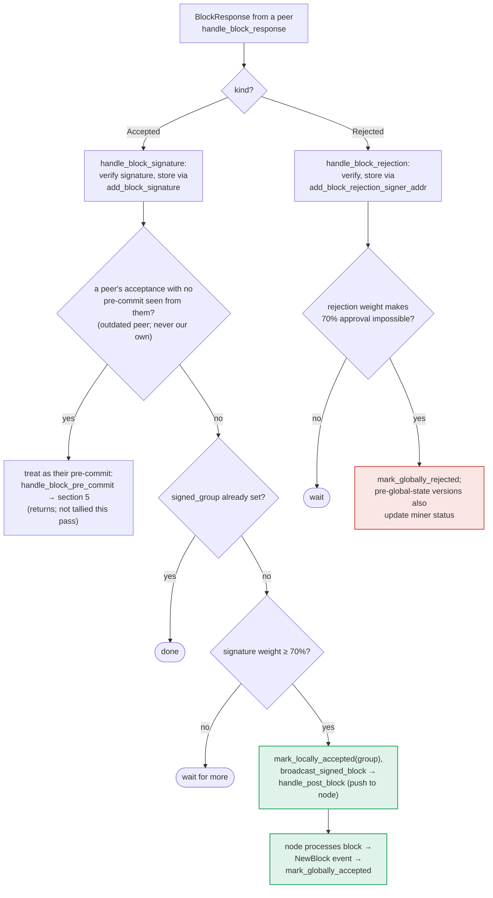

### Title
Outdated-peer fallback in `store_and_process_block_signature` can silently swallow a threshold-crossing acceptance, wedging block finalization - (File: stacks-signer/src/v0/signer.rs)

### Summary
### Finding Description
When a signer receives a `BlockResponse::Accepted` from a peer that this signer has never seen a `BlockPreCommit` from, `store_and_process_block_signature` treats the acceptance as if it were only a pre-commit and returns immediately, skipping the acceptance-threshold tally for that call: [1](#0-0) 

The signature is durably stored via `add_block_signature` before this branch is taken, but the subsequent code that loads `get_block_signatures`, computes `total_signature_weight`, compares it against `min_weight`, and (on success) calls `mark_locally_accepted` + `broadcast_signed_block` is entirely skipped for this invocation: [2](#0-1) 

This mirrors the audited pattern: two logically-equivalent "final" operations (`_mint` vs `_safeMint` in the Party report; here, "count this signature toward the acceptance tally" vs "treat it only as a pre-commit vote") are handled through two different code paths with different completeness guarantees. In the Party bug, an NFT could be received but never claimable because the receiving path used a stricter check than the minting path expected. Here, a signature can be *received and stored* but never counted toward the 70% acceptance threshold in the call that stored it, because the code re-routes to the pre-commit path (`handle_block_pre_commit`) instead of continuing the acceptance tally.

The docs for this exact fallback confirm the intended semantics ("mixed-version fleets... that peer's weight still counts toward the threshold that produces our signature") and that it "returns; not tallied this pass": [3](#0-2) 

The threshold-crossing signature weight is only re-evaluated the *next* time `store_and_process_block_signature` runs for a *different* signer's `Accepted` message on the same block (since `get_block_signatures` reloads the full set from the DB each call). If the arriving message that pushes the weight over threshold is exactly this fallback branch — i.e., the last signer needed to cross 70% is the one whose acceptance is misrouted to the pre-commit path — and no other signer subsequently re-sends an `Accepted` response for this block (all other signers already sent theirs earlier and are not re-triggered), the locally observed acceptance-weight check is never re-run. `mark_locally_accepted` and `broadcast_signed_block` are consequently never invoked by this signer for a block that its own database already has enough stored signatures for.

### Impact Explanation
This is a liveness wedge on the affected signer, not a majority-corruption or forgery: the signer can be stalled from broadcasting/pushing a block it should already consider approved, purely due to message-arrival ordering from a legitimately signing peer (e.g., a signer running a slightly different protocol version or one whose pre-commit message was lost/delayed relative to its acceptance). This falls under the "High" impact bucket described in the rules: a signer wedged such that it never signs/finalizes a valid block it has already effectively collected enough signatures for, potentially delaying or stalling tenure progress until a new proposal round or another trigger re-evaluates the block.

### Likelihood Explanation
Triggering requires only ordinary gossip timing (a peer's acceptance arriving before, or without, its corresponding pre-commit ever being recorded by the local signer) — explicitly the scenario the code comment anticipates ("in case the caller is running an outdated version"). No majority collusion, no other signer's private key, and no local/auth access is required; it can occur from normal network reordering or a legitimately mixed-version signer set. However, for it to actually strand block finalization (rather than merely delay it by one message), it must specifically be the *threshold-crossing* signature and no further `Accepted` re-tally must occur afterward, which narrows the window somewhat and depends on operational conditions (peer set composition, retry/re-proposal behavior) that were not further traced within the available iterations.

### Recommendation
After routing an unseen-pre-commit acceptance through `handle_block_pre_commit`, still re-run (or fall through to) the acceptance-weight tally in `store_and_process_block_signature` for the block, rather than returning unconditionally — e.g., call the threshold-check/broadcast logic after `handle_block_pre_commit` returns, or restructure so the acceptance tally always executes once the signature has been persisted, regardless of whether the pre-commit compatibility shim also runs.

### Proof of Concept
Conceptual/DB-level reproduction (not independently executed within available tool iterations):
1. Configure a signer set where signer `S_last`'s `BlockPreCommit` message for a candidate block is delayed or dropped, while its `BlockResponse::Accepted` for the same block arrives normally.
2. Have the remaining signers reach and broadcast their own `Accepted` responses first, each processed via `store_and_process_block_signature`, so `total_signature_weight` is just under `min_weight` after they are all recorded.
3. `S_last`'s `Accepted` message arrives at the local signer. Because `has_committed(block_hash, S_last)` is `false` (no pre-commit seen from `S_last`), `add_block_signature` stores the signature (now `total_signature_weight` in the DB would meet/exceed `min_weight`), but the code takes the `handle_block_pre_commit` branch and returns at [4](#0-3)  without recomputing/comparing `total_signature_weight` against `min_weight`.
4. If no other signer later resends an `Accepted` message for this block, the local signer never calls `mark_locally_accepted`/`broadcast_signed_block` for it, even though `signer_db.get_block_signatures` would show enough weight — confirmable by directly querying the signerdb state and comparing against the signer's in-memory `BlockInfo.state`.

Note: this PoC path relies on internal message-ordering/timing that could not be empirically driven end-to-end within the current investigation; the code-level mechanism (early return skipping the acceptance tally) is directly confirmed by reading `store_and_process_block_signature`, but the exact reachability window (how often "no other signer re-sends acceptance" holds in practice) would benefit from a live/integration test to fully validate likelihood.

### Citations

**File:** stacks-signer/src/v0/signer.rs (L2453-2466)
```rust
        // if this returns false, it means the signature already exists in the DB, so just return.
        if !self
            .signer_db
            .add_block_signature(block_hash, signer_address, signature)
            .unwrap_or_else(|_| panic!("{self}: Failed to save block signature"))
        {
            return;
        }

        // If this isn't our own signature and we haven't seen a pre-commit from this signer yet, try treating it as a pre-commit in case the caller is running an outdated version
        if signer_address != &self.stacks_address && !self.signer_db.has_committed(block_hash, signer_address).inspect_err(|e| warn!("Failed to check if pre-commit message already considered for {signer_address:?} for {block_hash}: {e}")).unwrap_or(false) {
            self.handle_block_pre_commit(stacks_client, sortition_state, signer_address, block_hash);
            return;
        }
```

**File:** stacks-signer/src/v0/signer.rs (L2472-2538)
```rust
        // do we have enough signatures to broadcast?
        // i.e. is the threshold reached?
        let signatures = self
            .signer_db
            .get_block_signatures(block_hash)
            .unwrap_or_else(|_| panic!("{self}: Failed to load block signatures"));

        // put signatures in order by signer address (i.e. reward cycle order)
        let addrs_to_sigs: HashMap<_, _> = signatures
            .into_iter()
            .filter_map(|sig| {
                let Ok(public_key) = Secp256k1PublicKey::recover_to_pubkey_without_validating_low_s(
                    block_hash.bits(),
                    &sig,
                ) else {
                    return None;
                };
                let addr = StacksAddress::p2pkh(self.mainnet, &public_key);
                Some((addr, sig))
            })
            .collect();

        let signature_weight = self.signer_weights.get(signer_address).unwrap_or(&0);
        let total_signature_weight = self.compute_signature_signing_weight(addrs_to_sigs.keys());
        let total_weight = self.compute_signature_total_weight();

        let min_weight = NakamotoBlockHeader::compute_voting_weight_threshold(total_weight)
            .unwrap_or_else(|_| {
                panic!("{self}: Failed to compute threshold weight for {total_weight}")
            });

        if min_weight > total_signature_weight {
            info!("{self}: Received block acceptance, but have not yet reached the acceptance threshold.";
                "signer_signature_hash" => %block_hash,
                "signature_weight" => signature_weight,
                "consensus_hash" => %block_info.block.header.consensus_hash,
                "block_height" => block_info.block.header.chain_length,
                "total_weight_approved" => total_signature_weight,
                "total_weight" => total_weight,
                "percent_approved" => (total_signature_weight as f64 / total_weight as f64 * 100.0),
            );
            return;
        }
        info!("{self}: have reached the block acceptance threshold";
            "signer_signature_hash" => %block_hash,
            "signature_weight" => signature_weight,
            "consensus_hash" => %block_info.block.header.consensus_hash,
            "block_height" => block_info.block.header.chain_length,
            "total_weight_approved" => total_signature_weight,
            "total_weight" => total_weight,
            "percent_approved" => (total_signature_weight as f64 / total_weight as f64 * 100.0),
        );

        // have enough signatures to broadcast!
        // move block to LOCALLY accepted state.
        // It is only considered globally accepted IFF we receive a new block event confirming it OR see the chain tip of the node advance to it.
        if let Err(e) = block_info.mark_locally_accepted(true) {
            if !block_info.has_reached_consensus() {
                warn!("{self}: Failed to mark block as locally accepted: {e:?}");
            }
        }
        let _ = self.signer_db.insert_block(block_info).map_err(|e| {
            warn!("Failed to set group threshold signature timestamp for {block_hash}: {e:?}");
            panic!("{self} Failed to write block to signerdb: {e}");
        });
        self.broadcast_signed_block(stacks_client, block_info.block.clone(), &addrs_to_sigs);
    }
```

**File:** docs/signer-flows.md (L357-384)
```markdown


The outdated-peer fallback keeps mixed-version fleets live: an acceptance from a
peer that never sent a pre-commit is routed into the pre-commit path instead, so
that peer's weight still counts toward the threshold that produces _our_
signature. Note that reaching 70% signatures still only marks the block
_locally_ accepted with the group timestamp; global acceptance waits for the node
to adopt it. Marking the miner invalid on a 30% `ReorgNotAllowed` rejection is
skipped once the active protocol version uses global signer state.

```
