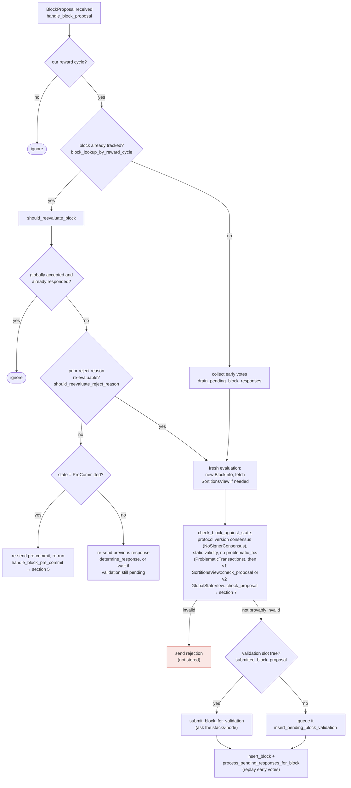

## Analog Found

### Title
Unbounded, cost-free tenure "activity" refresh via conflicting proposals against a locally-accepted-only block wedges the inactivity fallback - (File: `stacks-signer/src/chainstate/mod.rs`)

### Summary
`check_latest_block_in_tenure` refreshes a per-tenure `last_activity_time` counter whenever an incoming proposal conflicts with (fails to exceed the height of) the tenure's last known block. This refresh is rate-limited by `reorg_attempts_activity_timeout` **only** when that known block has already reached `signed_group` (i.e., observed as globally/group accepted). When the block is merely `LocallyAccepted` (never reached global acceptance), every conflicting proposal unconditionally refreshes the timer, with no cooldown at all [1](#0-0) . This is precisely the "cooldown-griefing" shape from the external report: a party who can cheaply trigger a state-refreshing message (here, signing and broadcasting a low-cost block header, rather than a token transfer) can indefinitely extend a protective counter that other participants rely on, at their expense.

### Finding Description
`is_timed_out` (v1/v2, in `stacks-signer/src/chainstate/{v1,v2}.rs`) governs whether the current miner is considered inactive and the signer set should fall back to the prior tenure's miner via `check_miner_inactivity` (`stacks-signer/src/v0/signer_state.rs`) [2](#0-1) . It short-circuits to "never timed out" only if `has_signed_block_in_tenure` is true; otherwise it measures elapsed time since `last_activity_time` (or burn-block receipt time) against `block_proposal_timeout`.

`last_activity_time` is updated in exactly one consensus-relevant path: `check_latest_block_in_tenure`, called from proposal evaluation (`check_proposal`, both v1 and v2), from the validate-ok path, and at signing time [3](#0-2) . When a newly proposed block does not exceed the height of the tenure's last known block, the code decides whether to count this as "activity":

```
if info.signed_group.is_none_or(|signed_time| {
    signed_time + reorg_attempts_activity_timeout.as_secs() > get_epoch_time_secs()
}) {
    // ... update_last_activity_time(...)
}
``` [4](#0-3) 

- If the tenure's last block has `signed_group = Some(t)` (i.e., it was observed to reach the group/global threshold), a reorg attempt only refreshes activity while `t + reorg_attempts_activity_timeout > now` — a bounded window.
- If `signed_group` is `None` (the block is stuck at `LocallyAccepted`, never observed reaching the group threshold — e.g., because the miner never broadcasts/pushes it, or the block never crosses 70%), **every single conflicting proposal refreshes activity, unconditionally, forever**.

The miner who won the current tenure's sortition slot is exactly the party who can trigger this path cheaply: it need only sign additional block headers (e.g., with different timestamps) that do not exceed the existing chain length and broadcast them as `BlockProposal` messages. Each such message is orders of magnitude cheaper than mining/staking, and does not require majority signer collusion, another signer's key, or `auth_token`/local access — it is purely a one-slot-miner + gossip capability, matching the rules' required threat model.

Because `check_latest_block_in_tenure` is invoked on the proposal path *before* full node validation is even required to complete (the routine is part of `check_proposal`, i.e., `check_block_against_state`'s local/global-state branch), the attacker doesn't need proposals to be validated OK by the node — they just need to be well-formed enough to be evaluated and to conflict on height [5](#0-4) .

### Impact Explanation
This directly breaks the liveness guarantee `check_miner_inactivity`/`is_timed_out` is meant to provide: falling back to the prior tenure's miner once the current miner goes inactive [6](#0-5) . A malicious or bribed miner holding a tenure slot whose only produced block is stuck at `LocallyAccepted` (e.g., deliberately withheld from ever reaching the group threshold, or one it knows will never be pushed) can spam cheap conflicting proposals to keep `last_activity_time` perpetually fresh. This prevents any signer from ever considering the tenure inactive, so signers never fall back to `make_miner_state(prior sortition)` — the tenure is wedged, and, since `has_signed_block_in_tenure` is false (nothing was ever actually signed to completion), the tenure produces no chain progress while simultaneously blocking recovery. This is a liveness wedge consistent with the specified High-impact category ("a signer wedged into never signing valid blocks ... or losing the equivocation guard"): here, signers are wedged into never falling back and never signing a *valid* new tenure's blocks, because the state machine keeps believing the dead-end miner is still active.

### Likelihood Explanation
Requires only a single miner controlling the current tenure's sortition slot (an external requirement of "being the miner for a tenure," not a majority of signers), plus the ability to broadcast repeated cheap `BlockProposal` messages over the miner→signer gossip channel — well within the stated scope ("a one-slot miner (plus gossip) can trigger"). The cost is minimal (signing a header, no PoW/PoS majority needed), similar to the original report's characterization: "expensive... but is certainly feasible," with the caveat that here it's even cheaper since it's just signature + gossip rather than a value transfer.

### Recommendation
Apply the same bounded cooldown (`reorg_attempts_activity_timeout`) to the `signed_group.is_none()` branch as is applied to the `Some` branch, gated instead against `approved_time`/`signed_self` of the locally-accepted block (or against the previous `last_activity_time` update itself), so that a stuck `LocallyAccepted` block cannot be used to refresh tenure activity indefinitely and for free.

### Proof of Concept
1. Miner M wins the sortition for tenure T and proposes block B1 at height h. Enough signers locally accept B1 (`LocallyAccepted`) but the group/global 70% threshold is never reached (M can arrange this, e.g., by not gossiping to enough signers or exploiting network partitions) — `signed_group` on B1 stays `None`.
2. M repeatedly signs new headers B2, B3, ... at height ≤ h (e.g., re-timestamped variants) and broadcasts them as `BlockProposal`s.
3. Each arrives at `check_latest_block_in_tenure`; since `info.signed_group` is `None` for B1, the `is_none_or` branch is always true, so `update_last_activity_time` fires unconditionally every time, regardless of `reorg_attempts_activity_timeout` [7](#0-6) .
4. `is_timed_out`/`check_miner_inactivity` never observes staleness because `last_activity_time` is continually refreshed, so signers never fall back to the prior tenure's miner, and the tenure never advances — chain liveness stalls under M's control, at negligible cost to M.

### Citations

**File:** stacks-signer/src/chainstate/mod.rs (L376-420)
```rust
    pub fn check_latest_block_in_tenure(
        tenure_id: &ConsensusHash,
        block: &NakamotoBlock,
        signer_db: &mut SignerDb,
        client: &StacksClient,
        tenure_last_block_proposal_timeout: Duration,
        reorg_attempts_activity_timeout: Duration,
    ) -> Result<bool, ClientError> {
        let last_block_info = SortitionData::get_tenure_last_block_info(
            tenure_id,
            signer_db,
            tenure_last_block_proposal_timeout,
        )?;

        if let Some(info) = last_block_info {
            // N.B. this block might not be the last globally accepted block across the network;
            // it's just the highest one in this tenure that we know about.  If this given block is
            // no higher than it, then it's definitely no higher than the last globally accepted
            // block across the network, so we can do an early rejection here.
            if block.header.chain_length <= info.block.header.chain_length {
                warn!(
                    "Miner's block proposal does not confirm as many blocks as we expect";
                    "proposed_block_consensus_hash" => %block.header.consensus_hash,
                    "signer_signature_hash" => %block.header.signer_signature_hash(),
                    "proposed_chain_length" => block.header.chain_length,
                    "expected_at_least" => info.block.header.chain_length + 1,
                );
                if info.signed_group.is_none_or(|signed_time| {
                    signed_time + reorg_attempts_activity_timeout.as_secs() > get_epoch_time_secs()
                }) {
                    // Note if there is no signed_group time, this is a locally accepted block (i.e. tenure_last_block_proposal_timeout has not been exceeded).
                    // Treat any attempt to reorg a locally accepted block as valid miner activity.
                    // If the call returns a globally accepted block, check its globally accepted time against a quarter of the block_proposal_timeout
                    // to give the miner some extra buffer time to wait for its chain tip to advance
                    // The miner may just be slow, so count this invalid block proposal towards valid miner activity.
                    if let Err(e) = signer_db.update_last_activity_time(
                        &block.header.consensus_hash,
                        get_epoch_time_secs(),
                    ) {
                        warn!("Failed to update last activity time: {e}");
                    }
                }
                return Ok(false);
            }
        }
```

**File:** stacks-signer/src/chainstate/v2.rs (L46-80)
```rust
    /// Check if the sortition identified by the ConsensusHash is timed out based on
    /// the blocks within the signer db and the block proposal timeout
    pub fn is_timed_out(
        sortition: &ConsensusHash,
        signer_db: &SignerDb,
        eval: &GlobalStateEvaluator,
        local_address: &StacksAddress,
        timeout: Duration,
    ) -> Result<bool, SignerChainstateError> {
        // If we've already signed a block in this tenure, the miner can't have timed out: we have
        // committed a signature to this tenure and must not help abandon it.
        //
        // Importantly, a block we have only pre-committed to does not count! A pre-commit carries
        // no signature, and if it never reaches the pre-commit threshold the tenure can stall
        // indefinitely. Treating it as signed here would suppress the inactivity timeout for
        // exactly the signers that pre-committed, so they could never fall back to the prior
        // miner and the tenure could never recover.
        let has_block = signer_db.has_signed_block_in_tenure(sortition)?;
        if has_block {
            return Ok(false);
        }
        let Some(received_ts) =
            signer_db.get_burn_block_received_time_from_signers(eval, sortition, local_address)?
        else {
            return Ok(false);
        };
        let received_time = UNIX_EPOCH + Duration::from_secs(received_ts);
        let last_activity = signer_db
            .get_last_activity_time(sortition)?
            .map(|time| UNIX_EPOCH + Duration::from_secs(time))
            .unwrap_or(received_time);

        let Ok(elapsed) = std::time::SystemTime::now().duration_since(last_activity) else {
            return Ok(false);
        };
```

**File:** docs/signer-flows.md (L164-203)
```markdown
## 3. A block proposal arrives

The miner broadcasts a proposal. If we've seen this exact block before,
`should_reevaluate_block` decides whether the old verdict stands; a block we
only pre-committed to is deliberately routed back through the pre-commit
evaluation so a re-proposal cannot shortcut to a signature. A fresh proposal is
checked against our view of the world _before_ spending a node validation on it.



Early votes: acceptances, rejections, and pre-commits that arrived before the
proposal itself are parked in pending tables and replayed once the proposal is
known.

> Anchors: `handle_block_proposal`, `should_reevaluate_block`,
> `should_reevaluate_reject_reason`, `check_block_against_state`,
> `submit_block_for_validation`, `process_pending_responses_for_block`
> (signer.rs); `check_proposal` (chainstate/v1.rs, v2.rs)
```

**File:** stacks-signer/src/v0/signer_state.rs (L282-374)
```rust
    /// Check and update our local view of the current miner based on it's tenure's
    /// validity and the validity of the prior sortition
    pub fn check_miner_inactivity(
        &mut self,
        db: &mut SignerDb,
        client: &StacksClient,
        proposal_config: &ProposalEvalConfig,
        eval: &GlobalStateEvaluator,
    ) -> Result<(), SignerChainstateError> {
        let Self::Initialized(ref mut state_machine) = self else {
            // no inactivity if the state machine isn't initialized
            return Ok(());
        };

        let MinerState::ActiveMiner { ref tenure_id, .. } = state_machine.current_miner else {
            // no inactivity if there's no active miner
            return Ok(());
        };

        let version = SortitionStateVersion::from_protocol_version(
            state_machine.active_signer_protocol_version,
        );
        let is_timed_out = SortitionState::is_timed_out(
            &version,
            tenure_id,
            db,
            client.get_signer_address(),
            proposal_config,
            eval,
        )?;

        if !is_timed_out {
            return Ok(());
        }

        // the tenure timed out, try to see if we can use the prior tenure instead
        let CurrentAndLastSortition { last_sortition, .. } =
            client.get_current_and_last_sortition()?;
        let Some(last_sortition) = last_sortition
            .and_then(|val| SortitionData::try_from(val).ok())
            .map(|data| SortitionState::new(version, data))
        else {
            warn!("Signer State: Current miner timed out due to inactivity, but could not find a valid prior miner. Allowing current miner to continue");
            return Ok(());
        };

        let sortition_data = last_sortition.data();
        // If we already reverted to the last sortition miner, don't time it out as it means we have already timed out the current sorititon miner
        // as there is no other miner available.
        if &sortition_data.consensus_hash == tenure_id {
            warn!("Signer State: Last sortition miner has timed out, but no prior valid miner. Allowing last sortition miner to continue");
            return Ok(());
        }

        // Only revert to the prior miner if its tenure is the canonical Stacks tip's
        // tenure. A miner only continues (extends) a tenure it won, so if the canonical
        // tip is in some other tenure due to a Bitcoin reorg orphaning the prior
        // sortition's tenure, the prior miner's node has already stopped mining and
        // will never propose again.
        let stacks_tip_ch = client.get_peer_info()?.stacks_tip_consensus_hash;
        if sortition_data.consensus_hash != stacks_tip_ch {
            warn!(
                "Signer State: Current miner timed out due to inactivity, but the canonical stacks tip is not in the prior miner's tenure, so the prior miner cannot continue it. Allowing current miner to continue";
                "stacks_tip_consensus_hash" => %stacks_tip_ch,
                "prior_sortition_consensus_hash" => %sortition_data.consensus_hash,
            );
            return Ok(());
        }

        if !last_sortition.is_tenure_valid(db, client, proposal_config, eval)? {
            warn!("Signer State: Current miner timed out due to inactivity, but prior miner is not valid. Allowing current miner to continue");
            return Ok(());
        }
        let new_active_tenure_ch = &sortition_data.consensus_hash;
        let inactive_tenure_ch = tenure_id.clone();
        state_machine.current_miner = Self::make_miner_state(
            sortition_data.clone(),
            client,
            db,
            proposal_config.tenure_last_block_proposal_timeout,
        )?;
        info!(
            "Signer State: Current tenure timed out, setting the active miner to the prior tenure";
            "inactive_tenure_ch" => %inactive_tenure_ch,
            "new_active_tenure_ch" => %new_active_tenure_ch
        );

        crate::monitoring::actions::increment_signer_agreement_state_change_reason(
            crate::monitoring::SignerAgreementStateChangeReason::InactiveMiner,
        );

        Ok(())
    }
```
