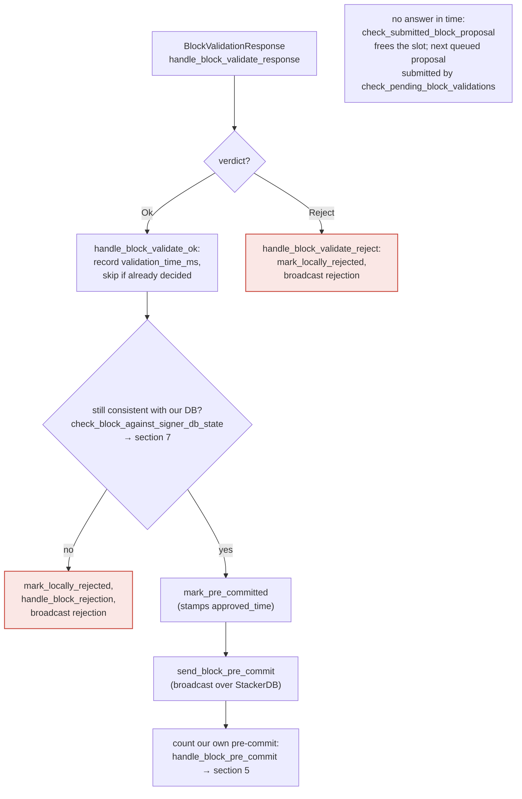
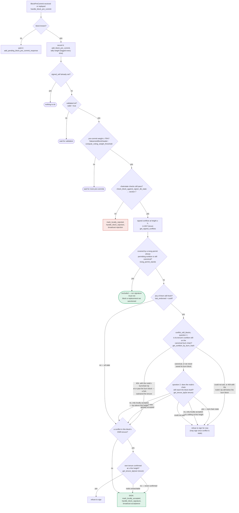

Based on the investigation, I found a concrete, code-supported asymmetry in how the v0 signer handles failures of its `BlockInfo` state-transition guards — the same bug class as the reported issue (a critical function's failure return being ignored, letting execution continue as if it had succeeded).

### Title
Ignored `mark_locally_rejected()` failure lets a rejection be broadcast unconditionally, bypassing the block state-machine guard - (File: `stacks-signer/src/v0/signer.rs`)

### Summary
`stacks-signer/src/v0/signer.rs::handle_block_validate_reject` calls the guarded state-transition function `block_info.mark_locally_rejected()` but never aborts on its `Err` result, unlike the sibling function `handle_block_validate_ok`, which does abort when `mark_pre_committed()` fails in an "unexpected" case.

### Finding Description
In `handle_block_validate_ok` [1](#0-0) , when `mark_pre_committed()` returns `Err`, the code explicitly `return`s if the block hasn't already reached consensus and isn't `LocallyAccepted` — i.e., an unexpected guard failure aborts further processing rather than broadcasting a message inconsistent with the DB state.

By contrast, `handle_block_validate_reject` [2](#0-1)  handles the `Err` from `block_info.mark_locally_rejected()` only by conditionally logging a warning — there is no `return` in either branch. Execution always falls through to `insert_block`, `handle_block_rejection`, and `send_block_response(rejection)`, regardless of whether the guarded state transition actually succeeded. The comment above `handle_block_validate_ok` confirms these mark functions are guards that can legitimately fail once a block "may have reached enough signatures" (i.e., once global consensus/local acceptance has already occurred) [3](#0-2) , meaning the same class of failure is possible for `mark_locally_rejected()`, but here it is never used to gate the broadcast.

### Impact Explanation
Because validation is asynchronous (the node's `/v3/block_proposal` verdict races against pre-commit/acceptance gossip from other signers, as documented in `docs/signer-flows.md` section 4 [4](#0-3) ), a single signer can end up having already locally/globally accepted a block (or pre-committed to it) by the time its own node's validation response for that same block comes back as `Reject`. In that race, `mark_locally_rejected()` is expected to fail (that's exactly why the code checks `has_reached_consensus()`), but the unconditional fall-through still causes the signer to sign and broadcast a `BlockRejection` for a block it has already accepted/pre-committed to. This produces a self-contradictory signed message from one signer for the same `signer_signature_hash`, which other signers' tallies (`GlobalStateEvaluator`/pre-commit and acceptance counting per `docs/signer-flows.md` section 5 [5](#0-4) ) are not designed to expect, and can push a legitimate, already-progressing block toward spurious "over 30% rejected" global rejection — a liveness wedge for an otherwise-valid block, triggerable by ordinary timing (a slow node validation response) rather than by any majority collusion.

### Likelihood Explanation
This requires only the ordinary asynchronous race already acknowledged in the codebase's own comments and in the dedicated test `stacks-node/src/tests/signer/v0/signers_wait_for_validation.rs` [6](#0-5) , which exists specifically to guard against a signer racing pre-commit threshold against its own pending validation. It does not require a majority of signers, another signer's key, or any privileged access — a single miner/proposer delaying or manipulating validation timing (or ordinary network jitter) is sufficient to create the race.

### Recommendation
Mirror the `mark_pre_committed()` handling: in `handle_block_validate_reject`, when `mark_locally_rejected()` returns `Err`, only proceed to broadcast the rejection if the failure is the "expected" case (block already reached consensus / already in a terminal state where a stray rejection message is harmless); otherwise abort (`return`) exactly as `handle_block_validate_ok` does, so a signed rejection is never emitted for a block whose recorded local state disagrees with it.

### Proof of Concept
Not independently reproduced with a running test harness in this session; the asymmetry is demonstrated by direct code comparison between the two cited call sites (`handle_block_validate_ok` lines 1961–1970 vs. `handle_block_validate_reject` lines 2020–2050) plus the existing test `signer_waits_for_validation_before_signing`, which shows the underlying race condition (pre-commit/acceptance vs. delayed own-node validation response) is a recognized, reachable scenario in this codebase. I was unable to retrieve the body of `mark_locally_rejected()`/`check_state()` in `stacks-signer/src/signerdb.rs` within the available tool calls to confirm the exact set of states from which the transition is refused; a Devin session with full repository access would be needed to trace `signerdb.rs` precisely and build a concrete unit-test PoC.

### Citations

**File:** stacks-signer/src/v0/signer.rs (L1960-1970)
```rust
        } else {
            if let Err(e) = block_info.mark_pre_committed() {
                // The block may have reached enough signatures before we validated the block so should fail to mark pre-committed
                // but still call to make sure the timestamps and validity are updated correctly.
                if !block_info.has_reached_consensus()
                    && block_info.state != BlockState::LocallyAccepted
                {
                    warn!("{self}: Failed to mark block as approved: {e:?}",);
                    return;
                }
            }
```

**File:** stacks-signer/src/v0/signer.rs (L2020-2050)
```rust
        if let Err(e) = block_info.mark_locally_rejected() {
            if !block_info.has_reached_consensus() {
                warn!("{self}: Failed to mark block as locally rejected: {e:?}");
            }
        }
        let block_rejection = BlockRejection::from_validate_rejection(
            block_validate_reject.clone(),
            &self.private_key,
            self.mainnet,
            self.signer_db.calculate_full_extend_timestamp(
                self.proposal_config
                    .tenure_idle_timeout
                    .saturating_add(self.proposal_config.tenure_idle_timeout_buffer),
                &block_info.block,
                false,
            ),
            self.signer_db.calculate_read_count_extend_timestamp(
                self.proposal_config
                    .read_count_idle_timeout
                    .saturating_add(self.proposal_config.tenure_idle_timeout_buffer),
                &block_info.block,
                false,
            ),
        );

        block_info.reject_reason = Some(block_rejection.response_data.reject_reason.clone());
        self.signer_db
            .insert_block(&block_info)
            .unwrap_or_else(|e| self.handle_insert_block_error(e));
        self.handle_block_rejection(&block_rejection, sortition_state);
        self.send_block_response(&block_info.block, block_rejection.into());
```

**File:** docs/signer-flows.md (L205-223)
```markdown
## 4. The node's validation verdict

The stacks-node answers the `/v3/block_proposal` submission. On OK, the signer
re-checks its own DB state and only then advertises willingness to sign by
broadcasting a **pre-commit**. A signature is _not_ produced here.


```

**File:** docs/signer-flows.md (L229-270)
```markdown
## 5. Pre-commit threshold → signature

The only place the signer produces a block signature by counting votes.
Pre-commits from peers (and our own) accumulate; at ≥70% weight the signer
decides whether to follow through. Between validation and threshold, we may have
signed a _different_ block at the same height, possibly in another tenure, so
the world must be re-checked before the signature leaves the box.



**File:** stacks-node/src/tests/signer/v0/signers_wait_for_validation.rs (L33-56)
```rust
#[test]
#[ignore]
/// Test that signers don't issue signatures until they have validated the block
///
/// This test verifies a race condition where a signer receives enough pre-commits
/// to exceed the 70% threshold before receiving its own block validation response.
/// The signer should NOT issue a signature until it has confirmed the block is valid.
///
/// Test Setup:
/// - Distribute signers across two miners (4 on miner 1, 1 on miner 2)
/// - Signers on different miners use different validation endpoints
///
/// Test Execution:
/// 1. Propose a block to all signers
/// 2. Pause block validation on miner 2 (the single signer)
/// 3. 4 signers on miner 1 issue pre-commits, pushing threshold over 70%
/// 4. The single signer on miner 2 receives all pre-commits but its validation is stalled
/// 5. Verify the single signer does NOT issue a signature until validation completes
/// 6. Resume validation and confirm the block is accepted
///
/// Test Assertion:
/// The signer waits for its own validation before issuing a signature, preventing
/// race conditions where it could sign before discovering the block is invalid.
fn signer_waits_for_validation_before_signing() {
```
