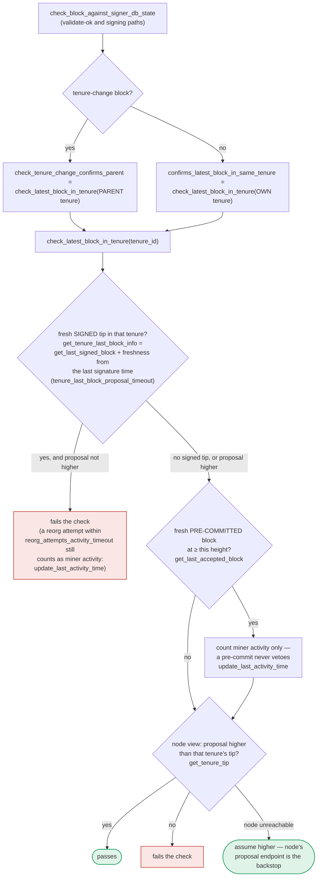

### Title
v1 signer allows a duplicate/conflicting tenure-change block to be signed because the own-tenure `DuplicateBlockFound` guard checks only *globally* accepted state, not what any signer has *locally signed* - ([File: stacks-signer/src/chainstate/v1.rs])

### Summary
The v1 signer-chainstate path guards against signing two competing tenure-start blocks in the same tenure using a check that only looks at globally-accepted blocks, while the same guard in v2 was hardened to look at locally-or-globally accepted (i.e. signed) blocks. Combined with the fact that this duplicate check runs only once, at proposal arrival, and is never re-run at pre-commit/signing time, a miner (optionally aided by ordinary network partitioning/gossip timing rather than any signer-key compromise) can get disjoint subsets of v1 signers to independently validate, pre-commit, and sign two different tenure-change blocks for the same tenure before either reaches global acceptance.

### Finding Description
`validate_tenure_change_payload` in v1 rejects a proposal with `DuplicateBlockFound` only when `signer_db.get_last_globally_accepted_block(&block.header.consensus_hash)` returns `Some(...)`: [1](#0-0) 

Compare this to the v2 equivalent, which deliberately widened the check to `get_last_signed_block` (locally *or* globally accepted), precisely to close this gap: [2](#0-1) 

The documentation for this repo explicitly calls out the discrepancy and its consequence: [3](#0-2) 

This "own-tenure duplicate" check runs **only at proposal arrival** and is never re-executed at validate-ok or at pre-commit/signing time; only the *parent*-tenure check (`check_tenure_change_confirms_parent`) is re-run then: [4](#0-3) 

The intended backstop for this is the pre-commit-time "own-tenure conflict" guard inside `handle_block_pre_commit`, which looks for blocks this same signer has already signed at height ≥ h in *any* tenure via `get_signed_conflicts`: [5](#0-4) 

That backstop is local-state-only: it can only see blocks that were actually inserted into *this* signer's own `signer_db` (i.e., blocks this signer itself received as a proposal and validated), via `signed_self`/`signed_group`. A signer that was never shown a rival tenure-change block (because a miner sent competing proposals to different signer subsets, or because of ordinary propagation lag across StackerDB/gossip) has no local record of it, so `get_signed_conflicts` finds nothing to conflict with.

Putting these together: a v1 signer that (a) never saw the first competing tenure-start block, and (b) whose local view of the parent tenure's globally-accepted state hasn't advanced yet, has no mechanism — neither the proposal-time `DuplicateBlockFound` check (globally-accepted-only) nor the pre-commit-time conflict guard (local-signed-only) — that prevents it from validating, pre-committing, and ultimately signing a second, conflicting tenure-change block for the same tenure that another disjoint subset of signers is concurrently signing. This breaks the "one signed block per tenure" equality that both the v1 comment and the v2 fix ("Only blocks we have signed... count here") are meant to enforce, and it is achievable by a normal miner broadcasting two valid-looking, differently-signed tenure-change proposals into a signer set that has not yet converged, without needing any signer's private key or a majority of signers.

### Impact Explanation
If two disjoint signer subsets each independently cross the 70% threshold on two different tenure-change blocks for the same tenure, this is exactly the "Critical" class defined by the rules: a signer signing a conflicting block, breaking the intended one-block-per-tenure invariant. This can manifest as competing candidate blocks both accumulating signer weight, requiring downstream (node-level) tie-breaking/consensus mechanics to resolve — a state the signer set is specifically designed to prevent from happening at all.

### Likelihood Explanation
This does not require compromising any signer key, StackerDB, or majority collusion — it only requires a miner able to construct two syntactically valid tenure-change block proposals against the same parent tenure (trivial for a block-committer) and to have them reach different, non-overlapping subsets of v1-protocol signers before their `signer_db`s converge on global acceptance of either. Given that the codebase explicitly supports and documents "mixed-version fleets" running v1 and v2 side by side, and that block-validation/pre-commit timing is inherently asynchronous across peers, this is a realistic, moderately-likely condition rather than a purely theoretical one — though I could not fully verify from the available index how widely v1 is still deployed versus v2 in current production configurations, which affects real-world exposure.

### Recommendation
Change v1's `validate_tenure_change_payload` own-tenure duplicate check to use `get_last_signed_block` (as v2 already does) instead of `get_last_globally_accepted_block`, so a signer's own local signature commits it against re-signing a competing tenure-change block. Additionally, consider re-running the own-tenure duplicate check (not just the parent-tenure confirmation) at pre-commit/signing time so that a block reaching threshold long after proposal is re-validated against the *current* set of locally known signed blocks, closing the described "long after it was proposed" gap noted in `docs/signer-flows.md`.

### Proof of Concept
1. A miner constructs two syntactically valid Nakamoto blocks, `Block A` and `Block B`, each a tenure-change (`BlockFound`) block claiming the same `prev_tenure_consensus_hash` (the same parent tenure) but different `tenure_consensus_hash`/consensus_hash values (i.e. they arise from two different sortition winners/forks, or the miner simply proposes them at slightly different points before the fork settles).
2. The miner broadcasts `Block A` to signer subset S1 and `Block B` to signer subset S2 (e.g. by relying on normal proposal delivery timing/partitioning rather than any protocol violation).
3. Each signer in S1 validates `Block A`: `check_tenure_change_confirms_parent` passes (parent tenure not yet signed by anyone in S1), and `get_last_globally_accepted_block` for `Block A`'s own tenure returns `None` (nothing has been globally accepted there yet) — `Block A` is accepted, pre-committed, and eventually signed once S1 crosses 70% of S1's local view. Symmetrically, S2 signs `Block B`.
4. Because S1 signers never received `Block B` (and vice versa), the pre-commit-time `get_signed_conflicts` guard in `handle_block_pre_commit` finds no local conflicting `BlockInfo` for the rival block, so it does not block signing.
5. Result: two conflicting tenure-change blocks for the same tenure each accumulate signer signatures from disjoint signer subsets — the "one signed block per tenure" invariant is broken. [1](#0-0) [2](#0-1) [5](#0-4)

### Citations

**File:** stacks-signer/src/chainstate/v1.rs (L505-518)
```rust
        let last_in_current_tenure = signer_db
            .get_last_globally_accepted_block(&block.header.consensus_hash)
            .map_err(|e| {
                SignerChainstateError::from(ClientError::InvalidResponse(e.to_string()))
            })?;
        if let Some(last_in_current_tenure) = last_in_current_tenure {
            warn!(
                "Miner block proposal contains a tenure change, but we've already signed a block in this tenure. Considering proposal invalid.";
                "proposed_block_consensus_hash" => %block.header.consensus_hash,
                "proposed_block_signer_signature_hash" => %block.header.signer_signature_hash(),
                "last_in_tenure_signer_signature_hash" => %last_in_current_tenure.block.header.signer_signature_hash(),
            );
            return Err(RejectReason::DuplicateBlockFound);
        }
```

**File:** stacks-signer/src/chainstate/v2.rs (L340-357)
```rust
        // We already confirmed in check miner activity that the current tenure is valid. So check we are not
        // reorging the tenure blocks. Only blocks we have signed (locally or globally accepted) count
        // here: a block we have merely pre-committed to carries no signature from us, so it is safe to
        // accept a competing tenure-start block in its place if it failed to reach consensus.
        let last_in_current_tenure = signer_db
            .get_last_signed_block(&block.header.consensus_hash)
            .map_err(|e| {
                SignerChainstateError::from(ClientError::InvalidResponse(e.to_string()))
            })?;
        if let Some(last_in_current_tenure) = last_in_current_tenure {
            warn!(
                "Miner block proposal contains a tenure change, but we've already signed a block in this tenure. Considering proposal invalid.";
                "proposed_block_consensus_hash" => %block.header.consensus_hash,
                "proposed_block_signer_signature_hash" => %block.header.signer_signature_hash(),
                "last_in_tenure_signer_signature_hash" => %last_in_current_tenure.block.header.signer_signature_hash(),
            );
            return Err(RejectReason::DuplicateBlockFound);
        }
```

**File:** docs/signer-flows.md (L400-418)
```markdown

```

**File:** docs/signer-flows.md (L425-437)
```markdown
Two things belong to the proposal path only and are **not** re-run at validate-ok
or at signing:

- `validate_tenure_change_payload` rejects with `DuplicateBlockFound` when we
  have already accepted a block in the tenure a tenure-change block is starting.
  v2 counts locally or globally accepted blocks (`get_last_signed_block`); v1
  counts only globally accepted ones (`get_last_globally_accepted_block`).
- the v2 `check_proposal` wrapper checks miner pubkey hash, consensus hash, the
  pox bitvec, and tenure-extend rules before delegating here.

Because the duplicate check never runs again, a block that crosses the pre-commit
threshold long after it was proposed relies on section 5's own-tenure conflict
guard to cover the same ground.
```

**File:** stacks-signer/src/v0/signer.rs (L1340-1374)
```rust
        // The chain and signer db state may have changed materially since this block passed the
        // proposal-time checks (e.g. between validation and reaching the pre-commit threshold we
        // may have signed a block that this one would reorg). Re-run the chainstate checks
        // before putting a signature over the block, and respond with a rejection if they no
        // longer pass, just as the block validation response handler does.
        if let Some(block_rejection) =
            self.check_block_against_signer_db_state(stacks_client, &block_info.block)
        {
            warn!(
                "{self}: Reached the pre-commit threshold for a block, but it no longer passes the chainstate checks. Rejecting.";
                "signer_signature_hash" => %block_hash,
                "block_height" => block_info.block.header.chain_length,
                "reject_code" => %block_rejection.reason_code,
                "reject_reason" => &block_rejection.reason,
            );
            if let Err(e) = block_info.mark_locally_rejected() {
                if !block_info.has_reached_consensus() {
                    warn!("{self}: Failed to mark block as locally rejected: {e:?}");
                }
            };
            self.signer_db
                .insert_block(&block_info)
                .unwrap_or_else(|e| self.handle_insert_block_error(e));
            self.handle_block_rejection(&block_rejection, sortition_state);
            self.send_block_response(&block_info.block, block_rejection.into());
            return;
        }

        // A pre-commit may be superseded by a competing proposal at the same height (e.g. a
        // re-proposed tenure-start block after the first failed to reach consensus), but a
        // signature must not be superseded while it's still "fresh". A signed block at the
        // same or higher height in ANY tenure is a conflict: two blocks at the same height are
        // siblings no matter which tenure they belong to (e.g. the next tenure's tenure-start
        // block conflicts with the current tenure's block at the same height). Blocks in
        // tenures whose reorg we sanctioned under the reorg-timing rules are excluded, but
```
