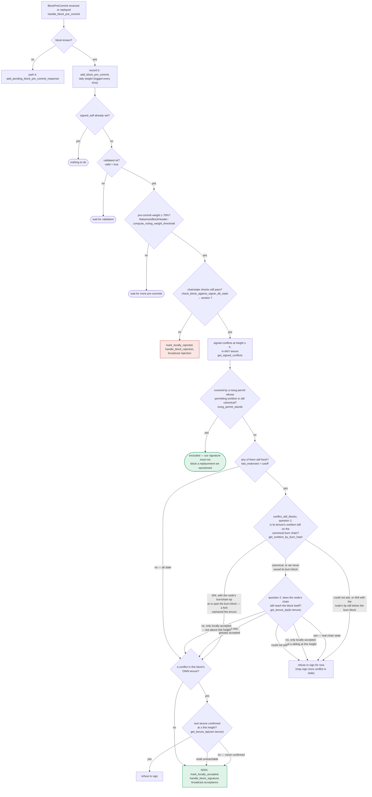

### Title
Stale in-memory `BlockInfo` snapshot replayed after pending pre-commits/signatures overwrites freshly-updated signerdb state, risking loss of the equivocation guard - (File: `stacks-signer/src/v0/signer.rs`)

### Summary
`handle_block_proposal` creates a single, fresh `BlockInfo` (state `Unprocessed`, `valid = None`), persists it once, and then hands a `&mut` reference to that *same in-memory copy* to `process_pending_responses_for_block`, which replays early pre-commits, rejections, and signatures that arrived before the proposal itself. The first sub-loop (pre-commits) delegates to `handle_block_pre_commit`, which — following the same "take it out of the map, mutate, put it back" convention used throughout `signer.rs` (e.g. `handle_block_validate_ok`, `stacks-signer/src/v0/signer.rs:1914-1930`) — performs its **own independent** `block_lookup_by_reward_cycle` fetch, mutation (potentially `mark_locally_accepted`, i.e. signing) and `insert_block` write for the identical `signer_signature_hash`. The subsequent rejection/signature sub-loops in `process_pending_responses_for_block` (`stacks-signer/src/v0/signer.rs:1751-1779`) continue to operate on the outer, now-stale `block_info` and eventually persist it back to signerdb, silently clobbering whatever `handle_block_pre_commit` just wrote.

### Finding Description
`handle_block_proposal` (`stacks-signer/src/v0/signer.rs:1574-1727`) builds `block_info` fresh from the proposal (line 1654), stores it once (lines 1717-1719), then calls:

```
self.process_pending_responses_for_block(
    stacks_client,
    sortition_state,
    &mut block_info,
    pending_responses,
);
```

Inside `process_pending_responses_for_block` (`stacks-signer/src/v0/signer.rs:1730-1780`), three sequential loops run over the *same* `signer_signature_hash`:

1. Pre-commits → `self.handle_block_pre_commit(...)` (no access to the outer `block_info`; it must re-derive its own copy via `block_lookup_by_reward_cycle`, mutate it, and `insert_block` it back — this is the documented pattern seen explicitly at `stacks-signer/src/v0/signer.rs:1914-1930` for the analogous validation-response path: "For mutability reasons, we need to take the block_info out of the map and add it back after processing").
2. Rejections → `self.store_and_process_block_rejection(sortition_state, block_info, ...)`, passed the **outer**, still-`Unprocessed` `block_info`.
3. Signatures → `self.store_and_process_block_signature(stacks_client, sortition_state, block_info, ...)`, again passed the **outer** stale `block_info`.

If enough parked pre-commits are replayed in step 1 to cross the 70% pre-commit threshold, `handle_block_pre_commit`'s independent read/modify/write cycle can advance the persisted `BlockInfo` to `LocallyAccepted` with `signed_self = true` (per the state machine documented in `docs/signer-flows.md:130-162, 229-270`, the only place a signature is produced). But the outer `block_info` reference held by `process_pending_responses_for_block` was captured *before* that state change and does not see it. When loops 2 and 3 subsequently call `store_and_process_block_rejection` / `store_and_process_block_signature` with that stale `block_info` and those functions persist it (mirroring the same mutate-then-`insert_block` convention used everywhere else in this file, e.g. `stacks-signer/src/v0/signer.rs:1928-1930, 1955-1957, 1972-1974`), the DB row for that `signer_signature_hash` is overwritten with a snapshot that predates and does not carry the `signed_self`/`LocallyAccepted` transition just made by `handle_block_pre_commit`.

This is the direct analog of the Lens `pubCount` bug: a counter/state value (`pubCount` there, `BlockInfo.state`/`signed_self` here) is captured once, an intervening action (module reentrancy there, the pre-commit replay sub-loop here) legitimately advances the authoritative on-disk state, and then the original caller finishes its action using the stale captured value, silently overwriting the newer, correct state.

### Impact Explanation
Losing the `signed_self = true` marker / reverting `BlockState` from `LocallyAccepted` back to an earlier state breaks the equality the whole pre-commit protocol depends on: "did I already sign a block at this height." Per `docs/signer-flows.md:229-270`, the local `signerdb` record of `signed_self`/`get_signed_conflicts` is exactly what a signer consults before ever signing *another* block at the same height, to prevent equivocation. If that record is wiped by this stale overwrite, and the miner (or a reorg-inducing peer) later proposes a conflicting block at the same height, the signer's own book-keeping no longer reflects the prior signature, and it can proceed to sign a second, conflicting block — a genuine equivocation/safety break. At minimum, if the overwrite instead lands as `LocallyRejected` for a block the signer already validated and pre-committed, this can also wedge the signer out of ever completing the pre-commit→signature transition for that block (liveness impact).

### Likelihood Explanation
This does not require a majority of signers or any signing key — it only requires the natural, permitted-by-design condition of receiving parked/early pre-commits, rejections, and signatures for the *same* proposal before the proposal itself arrives (explicitly supported by `drain_pending_block_responses`/`insert_pending_block_validation`), which is common in real network conditions (message reordering, latency). A single slow-proposal-propagation event combined with a fast-converging supermajority of pre-commits arriving first is sufficient to trigger the race between `handle_block_pre_commit`'s independent DB round-trip and the subsequent rejection/signature loops still holding the stale `block_info`.

### Recommendation
Do not carry a single long-lived `&mut BlockInfo` across the three replay sub-loops in `process_pending_responses_for_block`. After each sub-loop that can independently mutate and persist the row for `signer_signature_hash` (in particular after the pre-commit loop, since `handle_block_pre_commit` does its own read-modify-write), re-fetch the authoritative `BlockInfo` from `signerdb` via `block_lookup_by_reward_cycle` before continuing to the next sub-loop, instead of reusing the possibly stale in-memory copy. Alternatively, refactor `handle_block_pre_commit`, `store_and_process_block_rejection`, and `store_and_process_block_signature` to all operate on one single fetch-mutate-store pass keyed by hash rather than each independently reading/writing the same row, eliminating the possibility of a lost update.

### Proof of Concept
1. Signer S has not yet received `BlockProposal` P for height H, but has already received (and parked, via `add_pending_block_pre_commit_response`) enough `BlockPreCommit` messages from peers to exceed the 70% weight threshold for P's `signer_signature_hash`.
2. P finally arrives; `handle_block_proposal` builds a fresh `BlockInfo` (`Unprocessed`), stores it, and calls `process_pending_responses_for_block(..., &mut block_info, pending_responses)`.
3. The pre-commit replay loop calls `handle_block_pre_commit` once per parked pre-commit; on crossing threshold this independently fetches its own `BlockInfo` copy from `signerdb`, calls `mark_locally_accepted`, signs, and `insert_block`s the `LocallyAccepted`/`signed_self = true` record.
4. If any pending rejection or signature response for the same hash was also parked (a plausible race — e.g. a peer's stray/duplicate rejection retried before it saw the acceptance), the subsequent loop in `process_pending_responses_for_block` calls `store_and_process_block_rejection`/`store_and_process_block_signature` with the outer, pre-step-3 `block_info` (still `Unprocessed`), and that call's own `insert_block` persists this stale snapshot, overwriting the `LocallyAccepted`/`signed_self` row written in step 3.
5. Signerdb's row for this `signer_signature_hash` now no longer reflects that S already signed; a conflicting proposal for height H processed afterward will not be recognized by `get_signed_conflicts`/the equivocation checks in section 5 of `docs/signer-flows.md`, allowing S to sign a second, conflicting block at the same height. [1](#0-0) [2](#0-1) [3](#0-2) [4](#0-3)

### Citations

**File:** stacks-signer/src/v0/signer.rs (L1710-1727)
```rust
                    .insert_pending_block_validation(&signer_signature_hash, get_epoch_time_secs())
                    .unwrap_or_else(|e| {
                        warn!("{self}: Failed to insert pending block validation: {e:?}")
                    });
            }

            // Do not store KNOWN invalid blocks as this could DOS the signer. We only store blocks that are valid or unknown.
            self.signer_db
                .insert_block(&block_info)
                .unwrap_or_else(|e| self.handle_insert_block_error(e));
            self.process_pending_responses_for_block(
                stacks_client,
                sortition_state,
                &mut block_info,
                pending_responses,
            );
        }
    }
```

**File:** stacks-signer/src/v0/signer.rs (L1730-1780)
```rust
    fn process_pending_responses_for_block(
        &mut self,
        stacks_client: &StacksClient,
        sortition_state: &mut Option<SortitionsView>,
        block_info: &mut BlockInfo,
        pending_responses: PendingBlockResponses,
    ) {
        let signer_signature_hash = block_info.block.header.signer_signature_hash();
        for stacker_address in pending_responses.pre_commits {
            debug!("{self}: Processing pending pre-commit.";
                "stacker_address" => %stacker_address,
                "signer_signature_hash" => %signer_signature_hash,
                "block_id" => %block_info.block.block_id(),
            );
            self.handle_block_pre_commit(
                stacks_client,
                sortition_state,
                &stacker_address,
                &signer_signature_hash,
            );
        }
        for (stacker_address, reject_reason) in pending_responses.rejections {
            debug!("{self}: Processing pending rejection.";
                "stacker_address" => %stacker_address,
                "signer_signature_hash" => %signer_signature_hash,
                "block_id" => %block_info.block.block_id(),
                "reject_reason" => ?reject_reason,
            );
            self.store_and_process_block_rejection(
                sortition_state,
                block_info,
                &stacker_address,
                reject_reason,
            );
        }
        let block_id = block_info.block.block_id();
        for (stackers_address, signature) in pending_responses.signatures {
            debug!("{self}: Processing pending signature.";
                "stacker_address" => %stackers_address,
                "signer_signature_hash" => %signer_signature_hash,
                "block_id" => %block_id,
            );
            self.store_and_process_block_signature(
                stacks_client,
                sortition_state,
                block_info,
                &stackers_address,
                &signature,
            );
        }
    }
```

**File:** stacks-signer/src/v0/signer.rs (L1913-1930)
```rust
        }
        // For mutability reasons, we need to take the block_info out of the map and add it back after processing
        let Some(mut block_info) = self.block_lookup_by_reward_cycle(signer_signature_hash) else {
            // We have not seen this block before. Why are we getting a response for it?
            debug!("{self}: Received a block validate response for a block we have are not tracking. Ignoring...");
            return;
        };

        // Record the block validation time but do not consider stx transfers or boot contract calls
        block_info.validation_time_ms = if block_validate_ok.cost.is_zero() {
            Some(0)
        } else {
            Some(block_validate_ok.validation_time_ms)
        };

        self.signer_db
            .insert_block(&block_info)
            .unwrap_or_else(|e| self.handle_insert_block_error(e));
```

**File:** docs/signer-flows.md (L229-270)
```markdown
## 5. Pre-commit threshold → signature

The only place the signer produces a block signature by counting votes.
Pre-commits from peers (and our own) accumulate; at ≥70% weight the signer
decides whether to follow through. Between validation and threshold, we may have
signed a _different_ block at the same height, possibly in another tenure, so
the world must be re-checked before the signature leaves the box.


