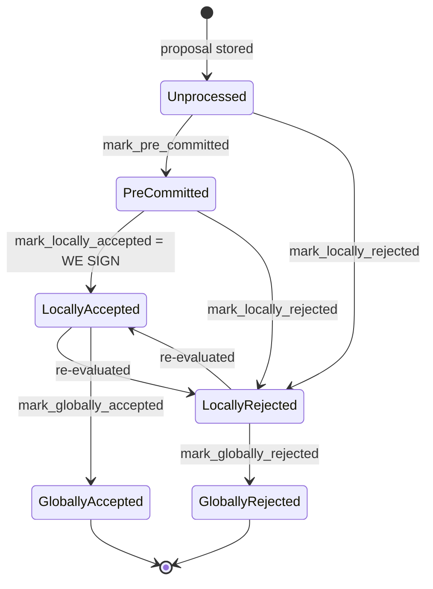

Based on my research, I found a concrete analog in the signer's miner-inactivity/liveness logic that mirrors the reported bug class: a state counter (there, `poolIdArrayIndexForExcessDeposit`; here, the tenure's `last_activity_time`) that is advanced/refreshed on an action regardless of whether that action actually achieved anything meaningful, letting a single low-cost actor game the system to its own advantage.

### Title
Miner can indefinitely suppress the inactivity fallback by repeatedly proposing never-completing blocks - (File: `stacks-signer/src/chainstate/mod.rs`)

### Summary
`SortitionData::check_latest_block_in_tenure` refreshes `last_activity_time` whenever a competing/replacement proposal arrives while a "fresh pre-commit" exists in the tenure, even though that pre-commit never carries a signature and may never cross the 70% pre-commit threshold. Since a single miner can trivially keep producing new, individually-valid-looking block proposals, it can perpetually reset this freshness window and thereby block `check_miner_inactivity`/`SortitionState::is_timed_out` from ever timing the miner out and falling back to the prior tenure.

### Finding Description
`check_latest_block_in_tenure` treats a **pre-committed** (unsigned) block as valid "miner activity" whenever it is still fresh relative to `tenure_last_block_proposal_timeout`: [1](#0-0) 

`approved_time` is stamped at `mark_pre_committed`, which happens purely from the node's validate-ok response, independent of whether the pre-commit threshold (70% weight) is ever reached: [2](#0-1) 

`is_timed_out` (both v1 and v2) only ever exempts a tenure from timeout when a block has actually been **signed** — pre-commits are explicitly documented as not counting: [3](#0-2) [4](#0-3) 

But `is_timed_out`'s clock is `last_activity_time`, and that clock is exactly what `check_latest_block_in_tenure`'s "fresh pre-commit" branch keeps bumping on every new proposal — this is the equality the report's rollover pattern breaks: activity is being counted as a proxy for "the miner is working" but is actually driven by an action (a pre-commit) that carries no guarantee of ever completing (a signature). A miner that simply proposes a fresh, distinct, individually-validatable block every `tenure_last_block_proposal_timeout` interval keeps `approved_time` (and thus `last_activity_time`) perpetually refreshed, without ever needing 70% of signers to actually sign anything.

This is analogous to the Stader `poolIdArrayIndexForExcessDeposit` bug: there, the rollover index advanced regardless of whether a full allocation actually happened, letting a cheap action (1 wei transfer) bias the next round in the attacker's favor. Here, the activity clock advances regardless of whether a full signature threshold is actually reached, letting a cheap action (repeated block proposals that only need to pass node validation, not signer consensus) keep a miner permanently "active" and block signers from ever falling back to the prior valid miner.

### Impact Explanation
This is a liveness wedge triggerable by a single actor (the current miner alone, no signer collusion or majority needed): as long as they keep submitting new proposals that pass basic validation, the signer set can never conclude the miner has gone inactive and never falls back to a prior/backup miner (`check_miner_inactivity` → `SortitionState::is_timed_out` → `make_miner_state(prior sortition)`), per: [5](#0-4) 
This matches the "signer wedged" liveness-impact category: the tenure can be stalled indefinitely at the will of a single miner who never delivers a fully signed block.

### Likelihood Explanation
Low cost, single actor: the miner only needs to keep the node accepting distinct proposals (varying timestamp/txs) fast enough to beat `tenure_last_block_proposal_timeout`, which is the exact behavior the code comments describe as intentional ("the miner may just be slow, so count this invalid block proposal towards valid miner activity"). No signer majority, no key compromise, and no StackerDB/transport exploitation is required — it only depends on miner-controlled proposal cadence.

### Recommendation
Bound how many times, or for how long, a never-signed pre-commit can keep resetting `last_activity_time` for a given tenure — e.g., only count the *first* fresh pre-commit per height toward activity, or fold this into the existing `reorg_attempts_activity_timeout`/`ReorgNotAllowed` consensus safeguard so that repeated non-converging pre-commits from the same miner are eventually treated as inactivity rather than perpetually renewed activity.

### Proof of Concept
1. Miner proposes block A at height h+1 in tenure T; it validates OK, `mark_pre_committed` stamps `approved_time`, but fewer than 70% of signers ever pre-commit (e.g., miner withholds the accompanying broadcast needed to reach quorum, or simply lets the round lapse).
2. Just before `tenure_last_block_proposal_timeout` elapses, miner proposes a distinct block B at the same height h+1; it also validates OK and gets pre-committed, refreshing `approved_time` again via the `CARVE`/`is_fresh_pre_commit` branch in `check_latest_block_in_tenure` (`stacks-signer/src/chainstate/mod.rs:422-447`), which calls `update_last_activity_time`.
3. Repeat indefinitely with new distinct proposals; `last_activity_time` never goes stale, so `SortitionState::is_timed_out` never returns `true`, and `check_miner_inactivity` never falls back to the prior tenure — the chain stalls under this single miner's control without ever producing a globally signed block.

### Citations

**File:** stacks-signer/src/chainstate/mod.rs (L422-447)
```rust
        // A block we have only pre-committed to must NOT veto this proposal, but, similar to above
        // this should still count as activity for the miner.
        let last_accepted_block = signer_db
            .get_last_accepted_block(tenure_id)
            .map_err(|e| ClientError::InvalidResponse(e.to_string()))?;
        if let Some(info) = last_accepted_block {
            let is_fresh_pre_commit = info.state == BlockState::PreCommitted
                && info.approved_time.is_some_and(|approved_time| {
                    approved_time.saturating_add(tenure_last_block_proposal_timeout.as_secs())
                        > get_epoch_time_secs()
                });
            if is_fresh_pre_commit && block.header.chain_length <= info.block.header.chain_length {
                info!(
                    "Miner's block proposal conflicts with a block we have only pre-committed to. Counting it as miner activity, but not rejecting the proposal.";
                    "proposed_block_consensus_hash" => %block.header.consensus_hash,
                    "signer_signature_hash" => %block.header.signer_signature_hash(),
                    "proposed_chain_length" => block.header.chain_length,
                    "pre_committed_signer_signature_hash" => %info.block.header.signer_signature_hash(),
                    "pre_committed_chain_length" => info.block.header.chain_length,
                );
                if let Err(e) = signer_db
                    .update_last_activity_time(&block.header.consensus_hash, get_epoch_time_secs())
                {
                    warn!("Failed to update last activity time: {e}");
                }
            }
```

**File:** docs/signer-flows.md (L132-163)
```markdown
Every proposal tracked in the signer DB carries a `BlockState`. **`PreCommitted`
carries no signature**: it means "validated, willing to sign if the pre-commit
threshold is met." The first signature appears at `mark_locally_accepted`.
Global states are terminal against each other.



Canonical paths shown; the exact rule in `BlockInfo::check_state` is: either
local state is reachable from anything not yet global, `PreCommitted` only from
`Unprocessed`, and each global state is unreachable from the other.

Timestamps: `approved_time` is stamped at pre-commit _or_ local acceptance
(first wins), `signed_self` only when we sign, `signed_group` when the group
threshold is observed.

> Anchors: `BlockInfo::check_state`, `move_to`, `mark_pre_committed`,
> `mark_locally_accepted`, `mark_globally_accepted`, `mark_locally_rejected`,
> `mark_globally_rejected` (signerdb.rs)

```

**File:** stacks-signer/src/chainstate/v2.rs (L45-76)
```rust
impl SortitionState {
    /// Check if the sortition identified by the ConsensusHash is timed out based on
    /// the blocks within the signer db and the block proposal timeout
    pub fn is_timed_out(
        sortition: &ConsensusHash,
        signer_db: &SignerDb,
        eval: &GlobalStateEvaluator,
        local_address: &StacksAddress,
        timeout: Duration,
    ) -> Result<bool, SignerChainstateError> {
        // If we've already signed a block in this tenure, the miner can't have timed out: we have
        // committed a signature to this tenure and must not help abandon it.
        //
        // Importantly, a block we have only pre-committed to does not count! A pre-commit carries
        // no signature, and if it never reaches the pre-commit threshold the tenure can stall
        // indefinitely. Treating it as signed here would suppress the inactivity timeout for
        // exactly the signers that pre-committed, so they could never fall back to the prior
        // miner and the tenure could never recover.
        let has_block = signer_db.has_signed_block_in_tenure(sortition)?;
        if has_block {
            return Ok(false);
        }
        let Some(received_ts) =
            signer_db.get_burn_block_received_time_from_signers(eval, sortition, local_address)?
        else {
            return Ok(false);
        };
        let received_time = UNIX_EPOCH + Duration::from_secs(received_ts);
        let last_activity = signer_db
            .get_last_activity_time(sortition)?
            .map(|time| UNIX_EPOCH + Duration::from_secs(time))
            .unwrap_or(received_time);
```

**File:** stacks-signer/src/chainstate/v1.rs (L52-94)
```rust
impl SortitionState {
    /// Check if the given sortition identified by its ConsensusHash has timed out based on current signed blocks
    /// and the time at which the burn block for it was first recorded in the provided signerdb
    pub fn is_timed_out(
        sortition: &ConsensusHash,
        db: &SignerDb,
        block_proposal_timeout: Duration,
    ) -> Result<bool, SignerChainstateError> {
        // If we've already signed a block in this tenure, the miner can't have timed out: we have
        // committed a signature to this tenure and must not help abandon it.
        //
        // Importantly, a block we have only pre-committed to does not count! A pre-commit carries
        // no signature, and if it never reaches the pre-commit threshold the tenure can stall
        // indefinitely. Treating it as signed here would suppress the inactivity timeout for
        // exactly the signers that pre-committed, so they could never fall back to the prior
        // miner and the tenure could never recover.
        let has_block = db.has_signed_block_in_tenure(sortition)?;
        if has_block {
            return Ok(false);
        }
        let Some(received_ts) = db.get_burn_block_receive_time_ch(sortition)? else {
            return Ok(false);
        };
        let received_time = UNIX_EPOCH + Duration::from_secs(received_ts);
        let last_activity = db
            .get_last_activity_time(sortition)?
            .map(|time| UNIX_EPOCH + Duration::from_secs(time))
            .unwrap_or(received_time);

        let Ok(elapsed) = std::time::SystemTime::now().duration_since(last_activity) else {
            return Ok(false);
        };

        if elapsed > block_proposal_timeout {
            info!(
                "Tenure miner was inactive too long and timed out";
                "tenure_ch" => %sortition,
                "elapsed_inactive" => elapsed.as_secs(),
                "config_block_proposal_timeout" => block_proposal_timeout.as_secs()
            );
        }
        Ok(elapsed > block_proposal_timeout)
    }
```

**File:** stacks-signer/src/v0/signer_state.rs (L284-335)
```rust
    pub fn check_miner_inactivity(
        &mut self,
        db: &mut SignerDb,
        client: &StacksClient,
        proposal_config: &ProposalEvalConfig,
        eval: &GlobalStateEvaluator,
    ) -> Result<(), SignerChainstateError> {
        let Self::Initialized(ref mut state_machine) = self else {
            // no inactivity if the state machine isn't initialized
            return Ok(());
        };

        let MinerState::ActiveMiner { ref tenure_id, .. } = state_machine.current_miner else {
            // no inactivity if there's no active miner
            return Ok(());
        };

        let version = SortitionStateVersion::from_protocol_version(
            state_machine.active_signer_protocol_version,
        );
        let is_timed_out = SortitionState::is_timed_out(
            &version,
            tenure_id,
            db,
            client.get_signer_address(),
            proposal_config,
            eval,
        )?;

        if !is_timed_out {
            return Ok(());
        }

        // the tenure timed out, try to see if we can use the prior tenure instead
        let CurrentAndLastSortition { last_sortition, .. } =
            client.get_current_and_last_sortition()?;
        let Some(last_sortition) = last_sortition
            .and_then(|val| SortitionData::try_from(val).ok())
            .map(|data| SortitionState::new(version, data))
        else {
            warn!("Signer State: Current miner timed out due to inactivity, but could not find a valid prior miner. Allowing current miner to continue");
            return Ok(());
        };

        let sortition_data = last_sortition.data();
        // If we already reverted to the last sortition miner, don't time it out as it means we have already timed out the current sorititon miner
        // as there is no other miner available.
        if &sortition_data.consensus_hash == tenure_id {
            warn!("Signer State: Last sortition miner has timed out, but no prior valid miner. Allowing last sortition miner to continue");
            return Ok(());
        }

```
