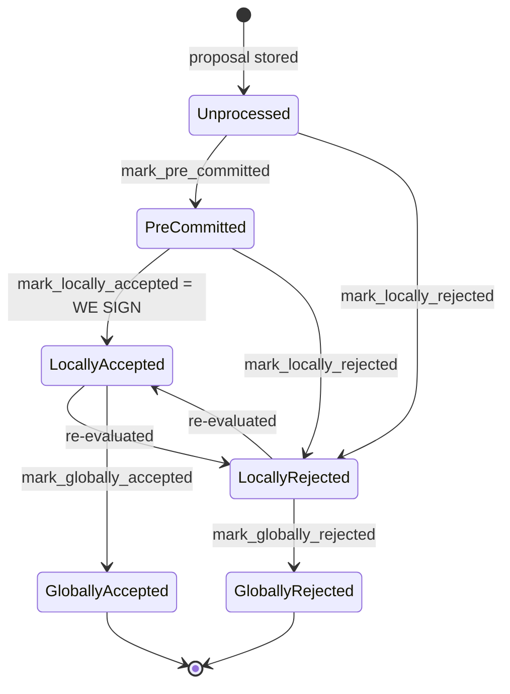

## Analysis Result

Actually, this backstop confirms the vulnerability rather than closing it: `get_signed_conflicts` is scoped by `(chain_length, block_hash)` — it finds conflicting *signed* blocks at the same or higher height, but the code comment explicitly states "The chainstate checks don't cover this for tenure-change blocks: those check the **parent** tenure instead of their own," and the same-tenure backstop (lines 1432-1457) only fires when a conflict is found via `get_signed_conflicts` AND asks the *node's* tenure tip — which will not yet reflect a block this same signer signed locally but that hasn't reached global acceptance. The two duplicate-block guards (`v1::validate_tenure_change_payload` using `get_last_globally_accepted_block`, vs `v2::validate_tenure_change_payload` using `get_last_signed_block`) are the analog to the report's `balanceOfToken` vs `balanceOfTokenAt` divergence — the same real-world state ("have I already signed a block in this tenure?") yields two different answers depending on which check path is active, and the weaker (v1) check is the one used to gate a signature.

### Title
V1 signer's tenure-change duplicate-block check uses only globally-accepted state, allowing a signer to sign two conflicting tenure-start blocks in the same tenure - (File: stacks-signer/src/chainstate/v1.rs)

### Summary
`SortitionsView::validate_tenure_change_payload` (v1 protocol) checks for an existing block in the current tenure using `signer_db.get_last_globally_accepted_block(&block.header.consensus_hash)`, whereas the v2 equivalent (`GlobalStateView::validate_tenure_change_payload`) uses `signer_db.get_last_signed_block(...)`, which also counts locally-accepted (signed-by-us-but-not-yet-globally-accepted) blocks. This asymmetry means a v1 signer can be induced to sign a second, competing tenure-change block for a tenure in which it has already signed a first block, as long as that first signature has not yet been observed as globally accepted by the node.

### Finding Description
`get_last_signed_block` and `get_last_globally_accepted_block` are semantically different: [1](#0-0) ; the former also returns locally-accepted blocks the signer has itself signed. `validate_tenure_change_payload` for v1 uses only the "globally accepted" variant when refusing to sign a duplicate tenure-start block: [2](#0-1) . The v2 implementation was hardened to use `get_last_signed_block` instead, explicitly to also cover locally-accepted (self-signed) blocks: [3](#0-2) .

Because a locally accepted block is one this very signer has already put a signature on (`mark_locally_accepted`, first signature at that point per the lifecycle docs) [4](#0-3) , the v1 check's blind spot means: if the network/node has not yet observed this block as globally accepted (e.g. it's slow to propagate, or the node hasn't processed it), a *second, distinct* tenure-change block proposed for the same tenure will pass `validate_tenure_change_payload` with no `DuplicateBlockFound` rejection.

The only remaining backstop is the pre-commit-time same-tenure conflict check in `handle_block_pre_commit`, which is explicitly documented as *not* covering tenure-change blocks against their own tenure (it checks the **parent** tenure instead) [5](#0-4) , and its same-tenure fallback (lines 1432-1457) asks the **node's** tenure tip rather than the local signed state — which will also not yet reflect the first block if it hasn't been pushed/globally accepted [6](#0-5) . Thus for a v1 signer, there is no path that re-derives "have I already signed a tenure-start block in this exact tenure" from local signed state at pre-commit time; the only guard against it is the proposal-time check that has the global-only blind spot.

### Impact Explanation
This lets a single miner (who controls the tenure-change block content) get one v1-protocol signer to sign two different, conflicting first-blocks for the same tenure — a direct instance of "a signer signing a conflicting block," matching the Critical impact category (signature over a conflicting block). If enough other signers are similarly delayed or on v1, this can produce two block proposals each carrying partial signature weight for the same tenure slot, undermining the one-block-per-tenure-start invariant the pre-commit conflict logic is designed to enforce elsewhere. Only a lagging (not necessarily malicious) node/observation is required from the signer's own perspective, and the miner does not need any other signer's key or a signer majority — this is triggerable by a single miner racing two tenure-change proposals.

### Likelihood Explanation
Likelihood requires: (1) the affected signer(s) running the v1 protocol version (pre-`GLOBAL_SIGNER_STATE_ACTIVATION_VERSION`) [7](#0-6) , and (2) a window where the first tenure-change block is signed locally but not yet globally accepted (i.e., the node hasn't processed it or the 70% signature threshold/broadcast hasn't landed on this signer's node view yet) — this is a normal, frequently occurring window in the block lifecycle rather than a rare edge case, since global acceptance always lags local signing by network/node-processing latency. No majority of signers or privileged access is required; a single miner proposing a second tenure-change block during this window is sufficient.

### Recommendation
Change `SortitionsView::validate_tenure_change_payload` (v1, `stacks-signer/src/chainstate/v1.rs`) to use `signer_db.get_last_signed_block(&block.header.consensus_hash)` instead of `get_last_globally_accepted_block`, matching the v2 implementation, so that the duplicate-tenure-start check also accounts for blocks this signer has locally accepted (signed) but which have not yet reached global acceptance.

### Proof of Concept
Conceptual reproduction path (cannot be executed without live node/test harness access via this tool):
1. Configure signer(s) to run under the v1 (`SortitionStateVersion::V1`) signer protocol.
2. Miner proposes tenure-change Block A for tenure T; signer validates it, reaches pre-commit threshold, and calls `mark_locally_accepted`, producing `signed_self` for Block A — but the stacks-node has not yet processed/announced Block A (no `NewBlock` event fired, so `mark_globally_accepted` never runs, and `get_last_globally_accepted_block(T)` still returns `None`).
3. Before the node catches up, the miner proposes a second, different tenure-change Block B also for tenure T (e.g., different transactions/parent choice within allowed timing).
4. `validate_tenure_change_payload` for Block B calls `get_last_globally_accepted_block(T)`, which returns `None` (Block A is only locally accepted), so the `DuplicateBlockFound` rejection is skipped.
5. Block B proceeds through validation and pre-commit; at pre-commit time, `get_signed_conflicts`/the same-tenure backstop asks `stacks_client.get_tenure_tip(T)`, which — since the node has not processed Block A — reports the tenure tip below Block B's height, so the guard does not block signing.
6. The signer signs Block B, having already signed Block A for the same tenure T — two conflicting signatures for the same tenure-start slot from the same signer.

### Citations

**File:** stacks-signer/src/signerdb.rs (L3560-3586)
```rust
        let block_info = db
            .get_last_signed_block(&consensus_hash_1)
            .unwrap()
            .unwrap();
        assert_eq!(block_info, block_info_3);
        let block_info = db
            .get_last_globally_accepted_block(&consensus_hash_1)
            .unwrap()
            .unwrap();
        assert_eq!(block_info, block_info_1);

        // Verify tenure consensus_hash_2
        let block_info = db
            .get_last_accepted_block(&consensus_hash_2)
            .unwrap()
            .unwrap();
        assert_eq!(block_info, block_info_4);
        let block_info = db
            .get_last_signed_block(&consensus_hash_2)
            .unwrap()
            .unwrap();
        assert_eq!(block_info, block_info_4);
        let block_info = db
            .get_last_globally_accepted_block(&consensus_hash_2)
            .unwrap()
            .unwrap();
        assert_eq!(block_info, block_info_4);
```

**File:** stacks-signer/src/chainstate/v1.rs (L505-518)
```rust
        let last_in_current_tenure = signer_db
            .get_last_globally_accepted_block(&block.header.consensus_hash)
            .map_err(|e| {
                SignerChainstateError::from(ClientError::InvalidResponse(e.to_string()))
            })?;
        if let Some(last_in_current_tenure) = last_in_current_tenure {
            warn!(
                "Miner block proposal contains a tenure change, but we've already signed a block in this tenure. Considering proposal invalid.";
                "proposed_block_consensus_hash" => %block.header.consensus_hash,
                "proposed_block_signer_signature_hash" => %block.header.signer_signature_hash(),
                "last_in_tenure_signer_signature_hash" => %last_in_current_tenure.block.header.signer_signature_hash(),
            );
            return Err(RejectReason::DuplicateBlockFound);
        }
```

**File:** stacks-signer/src/chainstate/v2.rs (L340-357)
```rust
        // We already confirmed in check miner activity that the current tenure is valid. So check we are not
        // reorging the tenure blocks. Only blocks we have signed (locally or globally accepted) count
        // here: a block we have merely pre-committed to carries no signature from us, so it is safe to
        // accept a competing tenure-start block in its place if it failed to reach consensus.
        let last_in_current_tenure = signer_db
            .get_last_signed_block(&block.header.consensus_hash)
            .map_err(|e| {
                SignerChainstateError::from(ClientError::InvalidResponse(e.to_string()))
            })?;
        if let Some(last_in_current_tenure) = last_in_current_tenure {
            warn!(
                "Miner block proposal contains a tenure change, but we've already signed a block in this tenure. Considering proposal invalid.";
                "proposed_block_consensus_hash" => %block.header.consensus_hash,
                "proposed_block_signer_signature_hash" => %block.header.signer_signature_hash(),
                "last_in_tenure_signer_signature_hash" => %last_in_current_tenure.block.header.signer_signature_hash(),
            );
            return Err(RejectReason::DuplicateBlockFound);
        }
```

**File:** docs/signer-flows.md (L132-150)
```markdown
Every proposal tracked in the signer DB carries a `BlockState`. **`PreCommitted`
carries no signature**: it means "validated, willing to sign if the pre-commit
threshold is met." The first signature appears at `mark_locally_accepted`.
Global states are terminal against each other.


```

**File:** stacks-signer/src/v0/signer.rs (L1423-1431)
```rust
        // No conflict is both fresh and still live. A conflict that no longer matters, i.e.
        // stale, or provably dead per `conflict_still_blocks`, cannot veto on its own. A
        // stale conflict in another tenure in particular no longer speaks for us: whether this
        // block may replace what another tenure built is settled by the chainstate checks above.
        // A stale conflict in this block's own tenure still blocks if the node already has that
        // tenure at or above the proposed height, since the proposal then duplicates state the
        // node has already built on. (The chainstate checks don't cover this for tenure-change
        // blocks: those check the parent tenure instead of their own.)
        // The permit check is deferred to here so that only same-tenure conflicts pay for it.
```

**File:** stacks-signer/src/v0/signer.rs (L1432-1457)
```rust
        if conflicts.iter().any(|conflict| {
            conflict.consensus_hash == block_info.block.header.consensus_hash
                && !self.reorg_permit_stands(stacks_client, conflict)
        }) {
            match stacks_client.get_tenure_tip(&block_info.block.header.consensus_hash) {
                Ok(tip) => {
                    let tip_height = tip.anchored_header.height();
                    if tip_height >= block_info.block.header.chain_length {
                        warn!(
                            "{self}: Reached the pre-commit threshold for a block that conflicts with previously signed or accepted blocks, and the canonical tip of its tenure is already at or above the proposed height. Refusing to sign.";
                            "signer_signature_hash" => %block_hash,
                            "block_height" => block_info.block.header.chain_length,
                            "canonical_tip_height" => tip_height,
                        );
                        return;
                    }
                }
                Err(e) => {
                    warn!(
                        "{self}: Failed to fetch the canonical tip of the proposed block's tenure: {e:?}. Treating the tenure as unconfirmed.";
                        "signer_signature_hash" => %block_hash,
                        "consensus_hash" => %block_info.block.header.consensus_hash,
                    );
                }
            }
        }
```

**File:** stacks-signer/src/chainstate/mod.rs (L523-548)
```rust
/// The version of the sortition state
#[derive(Debug, Clone)]
pub enum SortitionStateVersion {
    /// Version 1: Local Signer State evaluation only
    V1,
    /// Version 2: Global Signer State evaluation
    V2,
}

impl SortitionStateVersion {
    /// Convert the protocol version to a sortition state version
    pub fn from_protocol_version(version: u64) -> Self {
        if version < GLOBAL_SIGNER_STATE_ACTIVATION_VERSION {
            Self::V1
        } else {
            Self::V2
        }
    }
    /// Uses global state version
    pub fn uses_global_state(&self) -> bool {
        match self {
            Self::V1 => false,
            Self::V2 => true,
        }
    }
}
```
