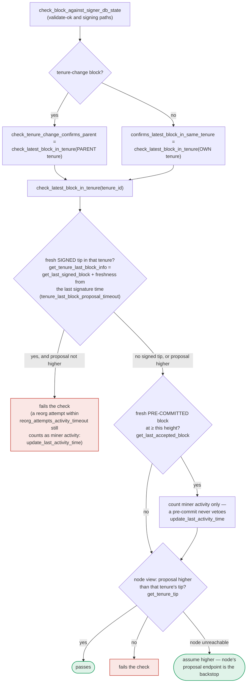

### Title
`check_latest_block_in_tenure` records miner-activity keep-alive under the wrong tenure key (`block.header.consensus_hash` instead of `tenure_id`) — ([File: stacks-signer/src/chainstate/mod.rs])

### Summary
`SortitionData::check_latest_block_in_tenure` is parameterized by `tenure_id`, the tenure whose signed tip is being checked against the incoming proposal. Per the documented dispatch rule, a tenure-change block is checked against its **parent** tenure (`tenure_id` = parent's consensus hash), while every other block is checked against its **own** tenure. When the check determines that the proposal doesn't advance the checked tenure's signed tip (i.e., it looks like a reorg attempt or conflicts with a fresh pre-commit), the function calls `signer_db.update_last_activity_time(&block.header.consensus_hash, ...)` to record this as legitimate miner activity for the tenure being contested — but it keys the update with `block.header.consensus_hash` (the proposal's own/new tenure) rather than `tenure_id` (the tenure actually being checked/contested). For a tenure-change block these two consensus hashes are different, so the activity timestamp is written to the wrong row of the `tenure_activity` table.

### Finding Description
`stacks-signer/src/chainstate/mod.rs`: [1](#0-0) 
and the second occurrence for the pre-commit-conflict branch: [2](#0-1) 

Both call sites key the write with `&block.header.consensus_hash` instead of `tenure_id`. The persistence layer is a strict, single-row-per-key table: [3](#0-2) [4](#0-3) 

`update_last_activity_time`/`get_last_activity_time` are keyed strictly by `consensus_hash` (one row per tenure) — exactly the kind of single-key mapping the float-capital report describes being overwritten/mis-targeted by using the wrong index.

The documentation for this exact function confirms the intended semantics — the tenure being "kept alive" via `update_last_activity_time` is the tenure passed in as `tenure_id`, which for a tenure-change block is explicitly the **parent** tenure, not the block's own tenure: [5](#0-4) 

Because the code writes to `block.header.consensus_hash` (the new tenure the proposal is trying to start) rather than `tenure_id` (the parent tenure actually being contested), the activity keep-alive signal never reaches the tenure it was meant to protect when the checked block is a tenure-change block.

This state feeds directly into the liveness decision `SortitionState::is_timed_out`, which reads `get_last_activity_time(sortition)` keyed by the tenure's own consensus hash to decide whether a miner/tenure should be considered timed out and abandonable by signers: [6](#0-5) 

### Impact Explanation
This breaks the intended "keep tenure X's activity current" equality: a signer that repeatedly rejects reorg/conflicting tenure-change proposals against a parent tenure believes it has recorded that the parent tenure is still contested/active, but the timestamp is silently attributed to an unrelated (new, possibly never-adopted) tenure hash instead. Consequences:
- The parent tenure's `last_activity_time` is never refreshed by this legitimate signal, so `SortitionState::is_timed_out` can incorrectly conclude the parent miner has timed out sooner than it should, causing signers to prematurely abandon a still-active/canonical tenure and support a competing miner — a liveness wedge that can lead to signing a conflicting/non-canonical tenure-change block, i.e. breaking the "approved-parent vs canonical" equality this check exists to protect.
- Conversely, a single miner can use repeated low/losing tenure-change proposals to seed a fresh, bogus `tenure_activity` row keyed by their own (not-yet-adopted) tenure's consensus hash, "pre-arming" that tenure's activity timer before it is legitimately signed, potentially delaying a correct timeout determination for that new tenure later.

This is reachable by a single miner (plus normal proposal gossip already delivered to signers) with no cooperation from other signers required, matching the report's "one-slot miner" trigger requirement.

### Likelihood Explanation
High likelihood of being hit in practice: any ordinary tenure-change reorg attempt or a stale/duplicate tenure-change proposal that fails the height check in `check_latest_block_in_tenure` (a routine, frequently-exercised code path, not requiring any unusual conditions) triggers the mis-keyed write. It requires no majority collusion, no key compromise, and no auth token — just a normal or crafted tenure-change block proposal from the miner whose turn it is (or a byzantine miner sending an old/competing tenure-change block).

### Recommendation
Change both `update_last_activity_time` calls in `check_latest_block_in_tenure` to key on `tenure_id` (the tenure actually being checked/contested) rather than `block.header.consensus_hash` (the proposal's own tenure), matching the documented semantics ("this updates the activity timer for the miner of `block`" in the tenure identified by `tenure_id`). Add a regression test asserting that for a tenure-change block whose `tenure_id` (parent) differs from `block.header.consensus_hash`, `get_last_activity_time(tenure_id)` — not `get_last_activity_time(&block.header.consensus_hash)` — is updated after a rejected/conflicting proposal.

### Proof of Concept
1. Signer has a globally/locally-accepted signed tip for tenure `T_parent` (consensus hash `CH_parent`) at height `h`.
2. A tenure-change block `B` is proposed starting a new tenure with its own header `consensus_hash = CH_new` (`CH_new != CH_parent`), and `B.chain_length <= h` (a reorg-attempt/duplicate against the parent tip).
3. `check_tenure_change_confirms_parent` invokes `check_latest_block_in_tenure(&CH_parent, B, ...)` (per the documented dispatch rule for tenure-change blocks in `docs/signer-flows.md`).
4. Inside `check_latest_block_in_tenure`, `block.header.chain_length <= info.block.header.chain_length` is true, so it calls `signer_db.update_last_activity_time(&B.header.consensus_hash, now)`, i.e. it writes to `tenure_activity` keyed by `CH_new`, not `CH_parent`.
5. `signer_db.get_last_activity_time(&CH_parent)` remains unchanged (stale/None), even though the intent was to mark `CH_parent`'s miner as still active. A later call to `SortitionState::is_timed_out(&CH_parent, ...)` uses this stale/missing value and can incorrectly report the parent tenure as timed out.

This can be directly demonstrated with the existing unit-test pattern already in the repo (`stacks-signer/src/chainstate/tests/v2.rs::pre_committed_block_does_not_veto_replacement`, lines 955-1040), which currently only checks the same-tenure (`tenure_id == block.header.consensus_hash`) case and therefore does not surface the divergence; extending it (or adding a sibling test) with a genuine tenure-change block whose own `consensus_hash` differs from the parent `tenure_id` passed into `check_latest_block_in_tenure` would show `get_last_activity_time(&tenure_id)` staying `None`/stale while `get_last_activity_time(&block.header.consensus_hash)` gets updated instead.

### Citations

**File:** stacks-signer/src/chainstate/mod.rs (L376-419)
```rust
    pub fn check_latest_block_in_tenure(
        tenure_id: &ConsensusHash,
        block: &NakamotoBlock,
        signer_db: &mut SignerDb,
        client: &StacksClient,
        tenure_last_block_proposal_timeout: Duration,
        reorg_attempts_activity_timeout: Duration,
    ) -> Result<bool, ClientError> {
        let last_block_info = SortitionData::get_tenure_last_block_info(
            tenure_id,
            signer_db,
            tenure_last_block_proposal_timeout,
        )?;

        if let Some(info) = last_block_info {
            // N.B. this block might not be the last globally accepted block across the network;
            // it's just the highest one in this tenure that we know about.  If this given block is
            // no higher than it, then it's definitely no higher than the last globally accepted
            // block across the network, so we can do an early rejection here.
            if block.header.chain_length <= info.block.header.chain_length {
                warn!(
                    "Miner's block proposal does not confirm as many blocks as we expect";
                    "proposed_block_consensus_hash" => %block.header.consensus_hash,
                    "signer_signature_hash" => %block.header.signer_signature_hash(),
                    "proposed_chain_length" => block.header.chain_length,
                    "expected_at_least" => info.block.header.chain_length + 1,
                );
                if info.signed_group.is_none_or(|signed_time| {
                    signed_time + reorg_attempts_activity_timeout.as_secs() > get_epoch_time_secs()
                }) {
                    // Note if there is no signed_group time, this is a locally accepted block (i.e. tenure_last_block_proposal_timeout has not been exceeded).
                    // Treat any attempt to reorg a locally accepted block as valid miner activity.
                    // If the call returns a globally accepted block, check its globally accepted time against a quarter of the block_proposal_timeout
                    // to give the miner some extra buffer time to wait for its chain tip to advance
                    // The miner may just be slow, so count this invalid block proposal towards valid miner activity.
                    if let Err(e) = signer_db.update_last_activity_time(
                        &block.header.consensus_hash,
                        get_epoch_time_secs(),
                    ) {
                        warn!("Failed to update last activity time: {e}");
                    }
                }
                return Ok(false);
            }
```

**File:** stacks-signer/src/chainstate/mod.rs (L422-448)
```rust
        // A block we have only pre-committed to must NOT veto this proposal, but, similar to above
        // this should still count as activity for the miner.
        let last_accepted_block = signer_db
            .get_last_accepted_block(tenure_id)
            .map_err(|e| ClientError::InvalidResponse(e.to_string()))?;
        if let Some(info) = last_accepted_block {
            let is_fresh_pre_commit = info.state == BlockState::PreCommitted
                && info.approved_time.is_some_and(|approved_time| {
                    approved_time.saturating_add(tenure_last_block_proposal_timeout.as_secs())
                        > get_epoch_time_secs()
                });
            if is_fresh_pre_commit && block.header.chain_length <= info.block.header.chain_length {
                info!(
                    "Miner's block proposal conflicts with a block we have only pre-committed to. Counting it as miner activity, but not rejecting the proposal.";
                    "proposed_block_consensus_hash" => %block.header.consensus_hash,
                    "signer_signature_hash" => %block.header.signer_signature_hash(),
                    "proposed_chain_length" => block.header.chain_length,
                    "pre_committed_signer_signature_hash" => %info.block.header.signer_signature_hash(),
                    "pre_committed_chain_length" => info.block.header.chain_length,
                );
                if let Err(e) = signer_db
                    .update_last_activity_time(&block.header.consensus_hash, get_epoch_time_secs())
                {
                    warn!("Failed to update last activity time: {e}");
                }
            }
        }
```

**File:** stacks-signer/src/signerdb.rs (L631-635)
```rust
static CREATE_TENURE_ACTIVTY_TABLE: &str = r#"
CREATE TABLE IF NOT EXISTS tenure_activity (
    consensus_hash TEXT NOT NULL PRIMARY KEY,
    last_activity_time INTEGER NOT NULL
) STRICT;"#;
```

**File:** stacks-signer/src/signerdb.rs (L2248-2271)
```rust
    /// Update the tenure (identified by consensus_hash) last activity timestamp
    pub fn update_last_activity_time(
        &mut self,
        tenure: &ConsensusHash,
        last_activity_time: u64,
    ) -> Result<(), DBError> {
        debug!("Updating last activity for tenure"; "consensus_hash" => %tenure, "last_activity_time" => last_activity_time);
        self.db.execute("INSERT OR REPLACE INTO tenure_activity (consensus_hash, last_activity_time) VALUES (?1, ?2)", params![tenure, u64_to_sql(last_activity_time)?])?;
        Ok(())
    }

    /// Get the last activity timestamp for a tenure (identified by consensus_hash)
    pub fn get_last_activity_time(&self, tenure: &ConsensusHash) -> Result<Option<u64>, DBError> {
        let query =
            "SELECT last_activity_time FROM tenure_activity WHERE consensus_hash = ? LIMIT 1";
        let Some(last_activity_time_i64) = query_row::<i64, _>(&self.db, query, &[tenure])? else {
            return Ok(None);
        };
        let last_activity_time = u64::try_from(last_activity_time_i64).map_err(|e| {
            error!("Failed to parse db last_activity_time as u64: {e}");
            DBError::Corruption
        })?;
        Ok(Some(last_activity_time))
    }
```

**File:** docs/signer-flows.md (L391-418)
```markdown
`check_latest_block_in_tenure` answers "does this block confirm the tip we
expect?" and it runs in three places: at proposal arrival (inside
`check_proposal`), at validate-ok, and at the moment of signing. _Which_ tenure
it is asked about depends on the block: a tenure-change block is checked against
its **parent** tenure, every other block against its **own**. Never both. The
pivotal helper is `get_tenure_last_block_info`, which considers only blocks that
carry a signature (`get_last_signed_block`): a pre-commit never vetoes anything,
it only counts as miner activity.


```

**File:** stacks-signer/src/chainstate/v2.rs (L45-89)
```rust
impl SortitionState {
    /// Check if the sortition identified by the ConsensusHash is timed out based on
    /// the blocks within the signer db and the block proposal timeout
    pub fn is_timed_out(
        sortition: &ConsensusHash,
        signer_db: &SignerDb,
        eval: &GlobalStateEvaluator,
        local_address: &StacksAddress,
        timeout: Duration,
    ) -> Result<bool, SignerChainstateError> {
        // If we've already signed a block in this tenure, the miner can't have timed out: we have
        // committed a signature to this tenure and must not help abandon it.
        //
        // Importantly, a block we have only pre-committed to does not count! A pre-commit carries
        // no signature, and if it never reaches the pre-commit threshold the tenure can stall
        // indefinitely. Treating it as signed here would suppress the inactivity timeout for
        // exactly the signers that pre-committed, so they could never fall back to the prior
        // miner and the tenure could never recover.
        let has_block = signer_db.has_signed_block_in_tenure(sortition)?;
        if has_block {
            return Ok(false);
        }
        let Some(received_ts) =
            signer_db.get_burn_block_received_time_from_signers(eval, sortition, local_address)?
        else {
            return Ok(false);
        };
        let received_time = UNIX_EPOCH + Duration::from_secs(received_ts);
        let last_activity = signer_db
            .get_last_activity_time(sortition)?
            .map(|time| UNIX_EPOCH + Duration::from_secs(time))
            .unwrap_or(received_time);

        let Ok(elapsed) = std::time::SystemTime::now().duration_since(last_activity) else {
            return Ok(false);
        };
        if elapsed > timeout {
            info!("Sortition has timed out";
                "sorition" => %sortition,
                "timeout" => %timeout.as_secs(),
                "elapsed" => %elapsed.as_secs()
            )
        }
        Ok(elapsed > timeout)
    }
```
