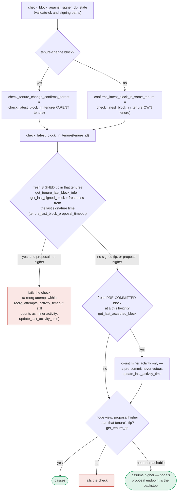

### Title
v1 `SortitionsView::validate_tenure_change_payload` lets a signer sign two conflicting tenure-start blocks in the same tenure - ([File: stacks-signer/src/chainstate/v1.rs])

### Summary
The v1 duplicate-tenure-start check in `validate_tenure_change_payload` only looks at globally accepted blocks, not locally-accepted-but-not-yet-globally-accepted ones. This is the same class of bug as the `LoanManager.createUserLoan` report: a unique-key check ("has a block for this tenure/loanId already been created?") is evaluated against a narrower state than the one the system actually commits signatures over, so a second, conflicting record can slip through and get "created" (signed) against the same key.

### Finding Description
In `validate_tenure_change_payload` (v1), the anti-equivocation check for a tenure-start (`TenureChange`+coinbase) block proposal is: [1](#0-0) 

which calls `signer_db.get_last_globally_accepted_block(&block.header.consensus_hash)` — i.e. it only rejects a second tenure-start proposal for the same `consensus_hash` (tenure) if a *globally accepted* block already exists there. The v2 equivalent was patched to use `get_last_signed_block` (covering `LocallyAccepted`/`PreCommitted→signed` states as well): [2](#0-1) 

The regression test that documents exactly this gap exists only for v2: [3](#0-2) 

Per the project's own documentation of the pipeline, this `DuplicateBlockFound` check is a one-shot gate that runs *only* at proposal arrival and is never re-run at validate-ok or at signing time; the signing-time "own tenure conflict" re-check (`check_latest_block_in_tenure`) is invoked only against the **parent** tenure for tenure-change blocks, never the block's own tenure: [4](#0-3) 

Putting these together: a single-slot miner (the one who won the sortition for tenure `T`) can:
1. Propose tenure-start block `B1` for tenure `T`. It clears v1's `check_proposal`/`validate_tenure_change_payload` (no prior globally-accepted block exists yet), gets validated by the node, and enough signers `mark_locally_accepted`/sign it (`signed_self` set) — but it stalls before reaching the 70% global-acceptance threshold (e.g., because the miner or network delays broadcasting enough signature shares, or a minority of signers is slow).
2. The same miner then proposes a different, conflicting tenure-start block `B2` for the *same* tenure `T` (different transactions/coinbase — e.g., to rewrite tenure history or double-mine).
3. For any v1 signer that hasn't yet reached the `tenure_last_block_proposal_timeout` window and has not yet been asked to re-validate against its own tenure (because, per the doc, that own-tenure guard for tenure-change blocks is never exercised at signing time), `validate_tenure_change_payload`'s `get_last_globally_accepted_block` lookup returns `None` (since `B1` never went globally accepted), so `DuplicateBlockFound` is *not* raised, and `B2` is treated as a fresh, valid tenure-start proposal.
4. The signer proceeds to sign `B2`, even though it (or peers) already signed `B1` in the same tenure.

This breaks the "one certified block per tenure" invariant that the entire pre-commit/threshold design relies on to prevent equivocation — i.e., a signer signs a conflicting block, directly matching the report's "Critical" impact class ("a signer signing an invalid, non-canonical, or conflicting block").

### Impact Explanation
If enough of the signer set is still running the v1 (`SortitionsView`) chainstate path — the codebase explicitly supports mixed/legacy protocol versions (`determine_active_signer_protocol_version`, `uses_global_state()` checks in `stacks-signer/src/v0/signer.rs`) — a miner can obtain two disjoint, valid signature sets over two different tenure-start blocks for the same tenure. That is a consensus safety violation: two conflicting blocks can each accumulate signer weight, enabling a fork/equivocation instead of a DoS. This is strictly worse than the referenced report's griefing/DoS outcome and matches the rubric's Critical bucket.

### Likelihood Explanation
Requires only the tenure's own miner (a single "one-slot" actor) plus normal gossip/timing — no majority of signers, no other signer's key, and no node bug. The window is bounded by `tenure_last_block_proposal_timeout` (used in `get_tenure_last_block_info`), so the attack is time-limited but real: any delay in reaching the 70% weight threshold on `B1` — network partitioning among signers, deliberately slow-walking pre-commit broadcasts, or simply some signers being offline — reopens the window for `B2` to be accepted by the signers who haven't yet timed out or already signed `B1`.

### Recommendation
Change `stacks-signer/src/chainstate/v1.rs::validate_tenure_change_payload` to use `signer_db.get_last_signed_block(&block.header.consensus_hash)` (matching the v2 fix and the `check_tenure_change_rejects_when_locally_accepted_block_exists` test's semantics) instead of `get_last_globally_accepted_block`, so that any block the signer has already locally accepted/signed in that tenure blocks a conflicting second tenure-start proposal, regardless of whether it later reached global acceptance.

### Proof of Concept
Analogous to the existing v2 regression test but exercised against `stacks-signer/src/chainstate/v1.rs::SortitionsView::check_proposal`:
1. Build `sortitions_view` and `signer_db` as in `check_tenure_change_rejects_when_locally_accepted_block_exists` (`stacks-signer/src/chainstate/tests/v2.rs:756-850`), but invoke the v1 `check_proposal` path (`stacks-signer/src/chainstate/v1.rs:136`).
2. Insert an existing `BlockInfo` for `consensus_hash = cur_sortition.data.consensus_hash`, call `mark_locally_accepted(false)` (not `mark_globally_accepted`), and `signer_db.insert_block(&existing_block_info)`.
3. Build a second, distinct tenure-start block (`TenureChangePayload` with `cause=BlockFound` + coinbase) for the same `consensus_hash`, and run it through v1's `check_proposal`.
4. Observe that, unlike the v2 test which asserts `Err(RejectReason::DuplicateBlockFound)`, the v1 path returns `Ok(())` because `validate_tenure_change_payload` (v1.rs:505) calls `get_last_globally_accepted_block`, which does not see the `LocallyAccepted` block inserted in step 2 — demonstrating the second, conflicting tenure-start block passes proposal-time validation and would proceed toward signing.

### Citations

**File:** stacks-signer/src/chainstate/v1.rs (L505-518)
```rust
        let last_in_current_tenure = signer_db
            .get_last_globally_accepted_block(&block.header.consensus_hash)
            .map_err(|e| {
                SignerChainstateError::from(ClientError::InvalidResponse(e.to_string()))
            })?;
        if let Some(last_in_current_tenure) = last_in_current_tenure {
            warn!(
                "Miner block proposal contains a tenure change, but we've already signed a block in this tenure. Considering proposal invalid.";
                "proposed_block_consensus_hash" => %block.header.consensus_hash,
                "proposed_block_signer_signature_hash" => %block.header.signer_signature_hash(),
                "last_in_tenure_signer_signature_hash" => %last_in_current_tenure.block.header.signer_signature_hash(),
            );
            return Err(RejectReason::DuplicateBlockFound);
        }
```

**File:** stacks-signer/src/chainstate/v2.rs (L340-358)
```rust
        // We already confirmed in check miner activity that the current tenure is valid. So check we are not
        // reorging the tenure blocks. Only blocks we have signed (locally or globally accepted) count
        // here: a block we have merely pre-committed to carries no signature from us, so it is safe to
        // accept a competing tenure-start block in its place if it failed to reach consensus.
        let last_in_current_tenure = signer_db
            .get_last_signed_block(&block.header.consensus_hash)
            .map_err(|e| {
                SignerChainstateError::from(ClientError::InvalidResponse(e.to_string()))
            })?;
        if let Some(last_in_current_tenure) = last_in_current_tenure {
            warn!(
                "Miner block proposal contains a tenure change, but we've already signed a block in this tenure. Considering proposal invalid.";
                "proposed_block_consensus_hash" => %block.header.consensus_hash,
                "proposed_block_signer_signature_hash" => %block.header.signer_signature_hash(),
                "last_in_tenure_signer_signature_hash" => %last_in_current_tenure.block.header.signer_signature_hash(),
            );
            return Err(RejectReason::DuplicateBlockFound);
        }
        Ok(())
```

**File:** stacks-signer/src/chainstate/tests/v2.rs (L748-850)
```rust
/// Test that a tenure change proposal is rejected when a locally-accepted
/// (but not globally-accepted) block already exists in the same tenure.
///
/// This is a regression test: previously, the check used
/// `get_last_globally_accepted_block`, which would miss blocks in
/// `LocallyAccepted` or `PreCommitted` state and incorrectly allow
/// a duplicate tenure change.
#[test]
fn check_tenure_change_rejects_when_locally_accepted_block_exists() {
    let MockServerClient {
        server,
        client: stacks_client,
        config: _,
    } = MockServerClient::new();
    let rand_int = server.local_addr().unwrap().port();

    let (_stacks_client, mut signer_db, block_sk, mut block, cur_sortition, _, sortitions_view) =
        setup_test_environment(&format!("{}_{rand_int}", function_name!()));

    // Set up the block in the current tenure
    block.header.consensus_hash = cur_sortition.data.consensus_hash.clone();
    let parent_block_header = make_parent_header_meta(&block_sk, &mut block);
    let response = crate::client::tests::build_get_tenure_tip_response(&parent_block_header);

    // Insert a locally-accepted block in the same tenure (same consensus_hash).
    // This simulates a miner's first tenure-start block that the signer has
    // locally accepted but that hasn't yet gathered enough signatures to be
    // globally accepted. In practice this block would contain a tenure-change
    // and coinbase tx, but we omit them here because `get_last_accepted_block`
    // only queries by consensus_hash and block state — the block's transactions
    // are irrelevant to the duplicate check.
    let existing_block_proposal = BlockProposal {
        block: NakamotoBlock::new(
            NakamotoBlockHeader {
                version: 1,
                chain_length: 10,
                burn_spent: 10,
                consensus_hash: cur_sortition.data.consensus_hash.clone(),
                parent_block_id: StacksBlockId([0; 32]),
                tx_merkle_root: Sha512Trunc256Sum([0; 32]),
                state_index_root: TrieHash([0; 32]),
                timestamp: 11,
                miner_signature: MessageSignature::empty(),
                signer_signature: vec![],
                pox_treatment: BitVec::ones(1).unwrap(),
                problematic_txs: vec![],
            },
            vec![],
        ),
        burn_height: 2,
        reward_cycle: 1,
        block_proposal_data: BlockProposalData::empty(),
    };
    let mut existing_block_info = BlockInfo::from(existing_block_proposal);
    existing_block_info.mark_locally_accepted(false).unwrap();
    signer_db.insert_block(&existing_block_info).unwrap();

    // Now build a *second* tenure-start block proposal for the same tenure.
    // This simulates the miner attempting to replace their first block (e.g.,
    // with different transactions). The tenure change tx must have
    // cause=BlockFound with a coinbase to be recognized as a tenure-start block.
    let tenure_change_payload = TenureChangePayload {
        tenure_consensus_hash: cur_sortition.data.consensus_hash.clone(),
        prev_tenure_consensus_hash: cur_sortition.data.parent_tenure_id.clone(),
        burn_view_consensus_hash: cur_sortition.data.consensus_hash.clone(),
        previous_tenure_end: block.header.parent_block_id.clone(),
        previous_tenure_blocks: 1,
        cause: TenureChangeCause::BlockFound,
        pubkey_hash: Hash160::from_node_public_key(&StacksPublicKey::from_private(&block_sk)),
    };
    let tenure_change_tx = make_tenure_change_tx(tenure_change_payload);
    let coinbase_tx = StacksTransaction::new(
        TransactionVersion::Testnet,
        TransactionAuth::Standard(TransactionSpendingCondition::new_initial_sighash()),
        TransactionPayload::Coinbase(CoinbasePayload([0; 32]), None, Some(VRFProof::empty())),
    );
    *block.executed_and_skipped_txs_mut() = vec![tenure_change_tx, coinbase_tx];
    block.header.sign_miner(&block_sk).unwrap();

    let exit_flag = Arc::new(AtomicBool::new(false));
    let moved_exit_flag = exit_flag.clone();

    let serve = std::thread::spawn(move || {
        crate::client::tests::write_response_nonblockinig(
            &server,
            response.as_bytes(),
            moved_exit_flag,
        );
    });

    let result = sortitions_view.check_proposal(&stacks_client, &mut signer_db, &block);

    exit_flag.store(true, Ordering::SeqCst);
    serve.join().unwrap();

    // The proposal should be rejected because there's already a locally-accepted
    // block in this tenure. Before the fix, this would have incorrectly passed
    // because get_last_globally_accepted_block would not find the locally-accepted block.
    assert!(
        matches!(result, Err(RejectReason::DuplicateBlockFound)),
        "Expected DuplicateBlockFound rejection when a locally-accepted block exists in the tenure, got: {result:?}"
    );
}
```

**File:** docs/signer-flows.md (L391-433)
```markdown
`check_latest_block_in_tenure` answers "does this block confirm the tip we
expect?" and it runs in three places: at proposal arrival (inside
`check_proposal`), at validate-ok, and at the moment of signing. _Which_ tenure
it is asked about depends on the block: a tenure-change block is checked against
its **parent** tenure, every other block against its **own**. Never both. The
pivotal helper is `get_tenure_last_block_info`, which considers only blocks that
carry a signature (`get_last_signed_block`): a pre-commit never vetoes anything,
it only counts as miner activity.



A failed check becomes a different rejection depending on who asked.
`check_block_against_signer_db_state` returns `SortitionViewMismatch`, or
`ConnectivityIssues` when the lookup itself errored rather than answering; the v2
`check_proposal` path returns `InvalidParentBlock`.

Two things belong to the proposal path only and are **not** re-run at validate-ok
or at signing:

- `validate_tenure_change_payload` rejects with `DuplicateBlockFound` when we
  have already accepted a block in the tenure a tenure-change block is starting.
  v2 counts locally or globally accepted blocks (`get_last_signed_block`); v1
  counts only globally accepted ones (`get_last_globally_accepted_block`).
- the v2 `check_proposal` wrapper checks miner pubkey hash, consensus hash, the
  pox bitvec, and tenure-extend rules before delegating here.
```
