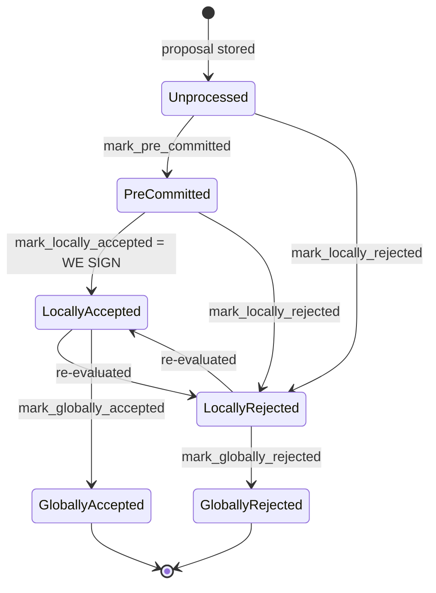

### Title
Premature `mark_globally_rejected` on a block that is still in flight to global acceptance permanently desyncs the signer's local record from the canonical chain - ([File: stacks-signer/src/v0/signer.rs])

### Summary
`store_and_process_block_rejection` moves a tracked block straight to the terminal `BlockState::GloballyRejected` as soon as a blocking-minority (≥30%) rejection weight is observed, with no regard for whether the remaining ~70% of weight is simultaneously converging on acceptance. Because `GloballyAccepted` and `GloballyRejected` are mutually unreachable terminal states, if the block is later actually adopted by the node (the real ground truth for global acceptance), the signer's own `mark_globally_accepted` call silently fails and is never persisted. The signer is left permanently believing a canonical, on-chain block was rejected — the exact "irreversible early close blocks the true finalization" pattern described in the external auction report.

### Finding Description
The block lifecycle is a state machine with two mutually terminal end-states: [1](#0-0) 

`store_and_process_block_rejection` tallies rejection weight from peers and, once `total_reject_weight + min_weight > total_weight` (i.e. the ~30% blocking-minority threshold is crossed), unconditionally calls `mark_globally_rejected()` and persists it: [2](#0-1) 

`mark_globally_rejected` simply forces the state transition: [3](#0-2) 

This 30% threshold and the 70% acceptance threshold are complementary halves of the *same* total signer weight, so it is entirely possible — via ordinary network asynchrony/latency, not any malicious majority — for one signer to observe ≥30% rejections from its peers (e.g. due to a stale/racy `check_block_against_signer_db_state` view) while the other ~70% weight independently accepts and signs the block, reaches the signing threshold in `store_and_process_block_signature`, and gets broadcast/adopted by the node: [4](#0-3) 

When that same signer later receives the `NewBlock` event announcing the node actually processed/adopted the block (the documented ground truth for global acceptance), it tries to correct its record: [5](#0-4) 

But `mark_globally_accepted` cannot move a `GloballyRejected` block to `GloballyAccepted` (terminal states are "unreachable from the other," per the documented state machine), so `block_info.mark_globally_accepted()` returns `Err`, the function logs a warning and `return`s **before** `self.signer_db.insert_block(&block_info)` is ever reached. The corrected state (including the `signed_group` timestamp that `mark_globally_accepted` would have set) is therefore never written to the local DB — the record is stuck at `GloballyRejected` forever, exactly mirroring the auction bug: an early, irreversible "close" (`mark_globally_rejected`) races ahead of and permanently precludes the true finalization step (`mark_globally_accepted` on real chain adoption).

This is not merely cosmetic bookkeeping. Downstream logic keys directly off "was this block signed in this tenure": [6](#0-5) 

and the miner-inactivity/tenure-fallback path explicitly treats "no signed block in tenure" as license to fall back to a prior tenure: [7](#0-6) 

Since the affected signer's own copy of `signed_self`/`signed_group` for that block was never persisted (the signer was on the rejecting side and the correcting write never landed), `has_signed_block_in_tenure` returns `false` for a tenure that is, in ground truth, canonical and confirmed on-chain. The same corrupted record is consulted by `check_latest_block_in_tenure`/`get_tenure_last_block_info` at the moment of signing a subsequent proposal (section 7 of the flow doc), meaning this signer's conflict/tip checks no longer see the real, adopted tip of that tenure.

### Impact Explanation
This falls under the "High" bucket in the rubric: a signer can be wedged such that its local record diverges from the truth for a specific tenure/block, causing it to treat a canonical, already-adopted block as absent/rejected. Concretely: `is_timed_out`/`check_miner_inactivity` may fall back to the prior tenure as though the current miner never got a block signed, and `check_latest_block_in_tenure`'s `get_last_signed_block` for that tenure returns nothing, opening the door for the signer to treat a genuinely conflicting/competing proposal at or above that height as non-conflicting and sign it — i.e., a real risk of the signer eventually signing a non-canonical/conflicting block on top of stale state, escalating from a liveness wedge toward the Critical bucket ("a signer signing an invalid, non-canonical, or conflicting block"), depending on subsequent proposal timing.

### Likelihood Explanation
No majority or malicious collusion of signers is required. The trigger condition — one signer receiving ≥30% rejection weight from peers while the remaining ~70% independently accept and the block is adopted — is a plausible race under normal network delay/partial view divergence (e.g., a signer applying `check_block_against_signer_db_state` slightly out of step with peers), since 30%/70% are complementary halves of one weight pool. This can happen without any single actor controlling 30% of stake by themselves; it only requires that the affected signer's peer view (out of its control) happens to cross the 30% rejection mark before/independently of the acceptance side reaching 70%. The order-of-operations bug (the early `return` before `insert_block` on failed transition) is deterministic once the race lands.

### Recommendation
Do not treat a locally-observed 30% rejection weight as an irreversible terminal state. Either (a) allow `GloballyRejected -> GloballyAccepted` recovery specifically when the trigger is direct ground-truth chain adoption (`NewBlock`/tenure-tip confirmation) rather than gate it behind the normal state-machine invariant, or (b) do not persist `GloballyRejected` until the signer has also confirmed (via a node query) that the block was not, in parallel, pushed and accepted by the node. At minimum, `handle_event_match`'s `NewBlock` handling should not silently drop the correction on `mark_globally_accepted` failure — it should force-overwrite `signed_group`/`state` when the node's own chain state proves the block was adopted, since chain adoption is defined elsewhere in this codebase as the actual ground truth for global acceptance.

### Proof of Concept
1. Configure a 5-signer set with weights summing to 100, arranged so one signer (S1) is delayed applying `check_block_against_signer_db_state` for a proposal (e.g. simulate a fresh sibling-conflict scenario as in `run_sibling_scenario`/`signer_refuses_to_sign_second_sibling_tenure_start`) such that S1's peers cross 30% rejection weight visible to S1 (three signers totaling ≥30% send `BlockResponse::Rejected` for hash H) while the remaining ~70% weight independently send `BlockResponse::Accepted` for H.
2. Drive S1's event loop with the rejections first: `handle_block_response` -> `handle_block_rejection` -> `store_and_process_block_rejection` reaches the ≥30% threshold and calls `mark_globally_rejected()` + `insert_block`, persisting `state = GloballyRejected` for H in S1's `signerdb`.
3. Separately, drive the other signers' acceptances to reach the 70% signing threshold; have the miner assemble the signature set and `post_block`, and simulate S1 receiving the resulting `SignerEvent::NewBlock` for the same `signer_signature_hash` H (as in `handle_event_match`'s `NewBlock` arm).
4. Observe: `block_info.mark_globally_accepted()` returns `Err` because `move_to` disallows `GloballyRejected -> GloballyAccepted`; the `warn!` fires and the function returns before `insert_block`; querying S1's `signerdb` for H afterward still shows `state = GloballyRejected` and `signed_group = None`, even though the block is on the canonical chain.
5. Confirm `has_signed_block_in_tenure`/`get_last_signed_block` for that tenure on S1 return `false`/`None`, demonstrating the permanent desync from ground truth described above.

### Citations

**File:** docs/signer-flows.md (L137-154)
```markdown


Canonical paths shown; the exact rule in `BlockInfo::check_state` is: either
local state is reachable from anything not yet global, `PreCommitted` only from
`Unprocessed`, and each global state is unreachable from the other.
```

**File:** docs/signer-flows.md (L464-469)
```markdown
    HPU["housekeeping:<br/>handle_pending_update"] --> PEND{"a pending BurnBlock<br/>update to settle?"}
    PEND -- yes --> ARR
    PEND -- no --> TO{"current tenure timed out?<br/>check_miner_inactivity →<br/>v1/v2 SortitionState::is_timed_out"}
    TO -- "signed a block in tenure?<br/>has_signed_block_in_tenure" --> NEVER(["never times out —<br/>we committed a signature"])
    TO -- "no signed block, and inactive<br/>past block_proposal_timeout" --> FALL["fall back to prior tenure:<br/>make_miner_state(prior sortition)"]
    TICK["housekeeping:<br/>capitulate_viewpoint<br/>(rate-limited by<br/>capitulate_miner_view_timeout)"] --> UPD["update_parent_tenure_last_block:<br/>adopt newer node tip or drop a<br/>signed view that went stale"]
```

**File:** stacks-signer/src/v0/signer.rs (L710-726)
```rust
                if let Ok(Some(mut block_info)) = self
                    .signer_db
                    .block_lookup(signer_sighash)
                    .inspect_err(|e| warn!("{self}: Failed to load block state: {e:?}"))
                {
                    if block_info.state == BlockState::GloballyAccepted {
                        // We have already globally accepted this block. Do nothing.
                        return;
                    }
                    if let Err(e) = block_info.mark_globally_accepted() {
                        warn!("{self}: Failed to mark block as globally accepted: {e:?}");
                        return;
                    }
                    if let Err(e) = self.signer_db.insert_block(&block_info) {
                        warn!("{self}: Failed to update block state to globally accepted: {e:?}");
                    }
                }
```

**File:** stacks-signer/src/v0/signer.rs (L2295-2341)
```rust
        // do we have enough signatures to mark a block a globally rejected?
        // i.e. is (set-size) - (threshold) + 1 reached.
        let rejection_addrs = match self.signer_db.get_block_rejection_signer_addrs(block_hash) {
            Ok(addrs) => addrs,
            Err(e) => {
                warn!("{self}: Failed to load block rejection addresses: {e:?}.",);
                return;
            }
        };
        let signature_weight = self.signer_weights.get(signer_address).unwrap_or(&0);
        let total_reject_weight =
            self.compute_signature_signing_weight(rejection_addrs.iter().map(|(addr, _)| addr));
        let total_weight = self.compute_signature_total_weight();

        let min_weight = NakamotoBlockHeader::compute_voting_weight_threshold(total_weight)
            .unwrap_or_else(|_| {
                panic!("{self}: Failed to compute threshold weight for {total_weight}")
            });
        if total_reject_weight.saturating_add(min_weight) <= total_weight {
            // Not enough rejection signatures to make a decision
            info!("{self}: Have not yet received enough block rejections to reach a consensus decision on this block";
                "signer_signature_hash" => %block_hash,
                "signature_weight" => signature_weight,
                "consensus_hash" => %block_info.block.header.consensus_hash,
                "block_height" => block_info.block.header.chain_length,
                "total_weight_rejected" => total_reject_weight,
                "total_weight" => total_weight,
                "percent_rejected" => (total_reject_weight as f64 / total_weight as f64 * 100.0),
            );
            return;
        }
        info!("{self}: have reached the block rejection threshold";
            "signer_signature_hash" => %block_hash,
            "signature_weight" => signature_weight,
            "consensus_hash" => %block_info.block.header.consensus_hash,
            "block_height" => block_info.block.header.chain_length,
            "total_weight_rejected" => total_reject_weight,
            "total_weight" => total_weight,
            "percent_rejected" => (total_reject_weight as f64 / total_weight as f64 * 100.0),
        );
        if let Err(e) = block_info.mark_globally_rejected() {
            warn!("{self}: Failed to mark block as globally rejected: {e:?}",);
        }
        if let Err(e) = self.signer_db.insert_block(block_info) {
            error!("{self}: Failed to update block state: {e:?}",);
            panic!("{self} Failed to update block state: {e}");
        }
```

**File:** stacks-signer/src/v0/signer.rs (L2503-2537)
```rust
        if min_weight > total_signature_weight {
            info!("{self}: Received block acceptance, but have not yet reached the acceptance threshold.";
                "signer_signature_hash" => %block_hash,
                "signature_weight" => signature_weight,
                "consensus_hash" => %block_info.block.header.consensus_hash,
                "block_height" => block_info.block.header.chain_length,
                "total_weight_approved" => total_signature_weight,
                "total_weight" => total_weight,
                "percent_approved" => (total_signature_weight as f64 / total_weight as f64 * 100.0),
            );
            return;
        }
        info!("{self}: have reached the block acceptance threshold";
            "signer_signature_hash" => %block_hash,
            "signature_weight" => signature_weight,
            "consensus_hash" => %block_info.block.header.consensus_hash,
            "block_height" => block_info.block.header.chain_length,
            "total_weight_approved" => total_signature_weight,
            "total_weight" => total_weight,
            "percent_approved" => (total_signature_weight as f64 / total_weight as f64 * 100.0),
        );

        // have enough signatures to broadcast!
        // move block to LOCALLY accepted state.
        // It is only considered globally accepted IFF we receive a new block event confirming it OR see the chain tip of the node advance to it.
        if let Err(e) = block_info.mark_locally_accepted(true) {
            if !block_info.has_reached_consensus() {
                warn!("{self}: Failed to mark block as locally accepted: {e:?}");
            }
        }
        let _ = self.signer_db.insert_block(block_info).map_err(|e| {
            warn!("Failed to set group threshold signature timestamp for {block_hash}: {e:?}");
            panic!("{self} Failed to write block to signerdb: {e}");
        });
        self.broadcast_signed_block(stacks_client, block_info.block.clone(), &addrs_to_sigs);
```

**File:** stacks-signer/src/signerdb.rs (L303-306)
```rust
    /// Attempt to mark the block as globally rejected
    pub fn mark_globally_rejected(&mut self) -> Result<(), String> {
        self.move_to(BlockState::GloballyRejected)
    }
```

**File:** stacks-signer/src/signerdb.rs (L1496-1510)
```rust
    /// Return whether this signer has signed a block, or observed the signer set sign a block,
    /// in a tenure (identified by its consensus hash). Used by `is_timed_out` to keep a tenure
    /// we are committed to from being timed out.
    ///
    /// Unlike [`SignerDb::has_approved_block_in_tenure`] this excludes blocks that were only
    /// pre-committed. A pre-commit does not put a signature over the block, so it does not
    /// represent a commitment that would be violated by abandoning the tenure.
    ///
    /// Rejection, even global rejection, does NOT clear the commitment. A rejection is a
    /// revocable opinion; a signature is a bearer instrument. Once ours is public, anyone can
    /// aggregate it toward the 70% threshold should enough rejecting signers change their
    /// minds, so a block we signed binds us to its tenure no matter what state it later fell
    /// to. This is deliberately a different predicate from
    /// [`SignerDb::get_last_signed_block`], which answers a tip question rather than a
    /// commitment question (see there).
```
