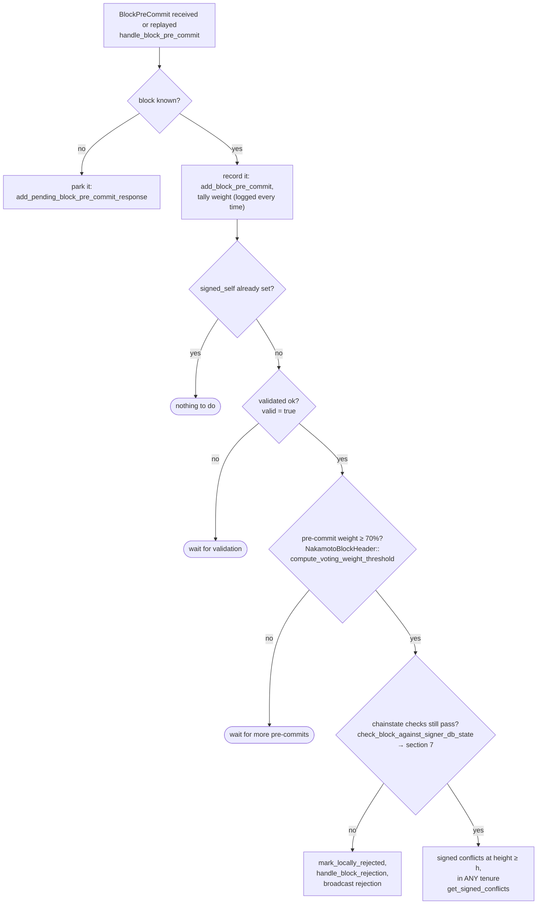
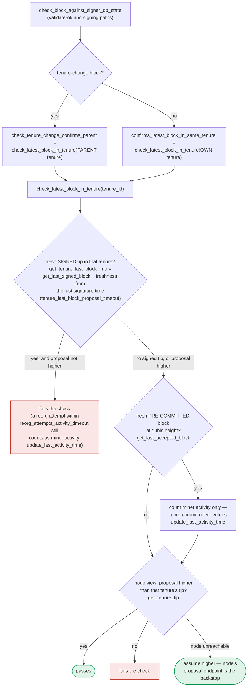

Given the iteration limit, I'll present the analog finding based on what I was able to verify, and flag the one point I could not fully confirm by reading raw source.

### Title
Signer never re-checks miner-validity/pubkey/bitvec at pre-commit-threshold signing time, allowing a signature over a block from a miner already locally marked invalid - (File: stacks-signer/src/v0/signer.rs, stacks-signer/src/chainstate/v1.rs, stacks-signer/src/chainstate/v2.rs)

### Summary
The yt-dlp bug is a class of "check performed once at the front door, not re-verified before the sensitive action fires" (cookies scoped/validated pre-redirect, but blindly forwarded post-redirect). The stacks-signer v0 pipeline has the same shape: the miner-status timeout gate, the miner-pubkey-hash match, and the PoX bitvec agreement check are only evaluated inside `check_proposal` at the moment a `BlockProposal` first arrives [1](#0-0) , [2](#0-1) . Everything that happens afterward — the async node validation response and, crucially, the pre-commit-threshold-crossing recheck that immediately precedes the signer's one irreversible act (producing its signature) — is re-validated only through `check_block_against_signer_db_state`, which the project's own documentation states performs a narrower check: only "does this block still confirm the tip we expect" (`check_latest_block_in_tenure`), not the miner-status/pubkey/bitvec gate [3](#0-2) .

### Finding Description
The event sequence for a single proposal is:
1. `handle_block_proposal` receives the proposal and calls `check_block_against_state`, which for v1/v2 routes through `SortitionsView::check_proposal` / `GlobalStateView::check_proposal`. This is where `cur_sortition.miner_status == Valid` is checked, and where the v2 wrapper checks the miner pubkey hash and the PoX bitvec [4](#0-3) [2](#0-1) .
2. If not provably invalid yet, the block is submitted to the node for asynchronous validation (`submit_block_for_validation`) [5](#0-4) .
3. When the OK verdict returns, `handle_block_validate_ok` re-checks only via `check_block_against_signer_db_state`, not via `check_block_against_state`/`check_proposal` again [6](#0-5) .
4. Once pre-commits reach the ≥70% weight threshold, the pre-commit handler again re-checks only via `check_block_against_signer_db_state` immediately before signing (`handle_block_pre_commit` → "RECHECK: chainstate checks still pass? → section 7") [7](#0-6) .

The documentation is explicit that the miner-pubkey-hash / consensus-hash / bitvec / tenure-extend checks, and the `DuplicateBlockFound` duplicate-tenure-block check, "belong to the proposal path only and are not re-run at validate-ok or at signing" [8](#0-7) . For the duplicate-block case the doc notes an explicit mitigating guard exists elsewhere (`get_signed_conflicts` at section 5) [9](#0-8) , but no equivalent statement is made for the miner-status/pubkey/bitvec checks — meaning that once a proposal has cleared the initial gate and is queued waiting for validation or for pre-commit weight to accumulate, a subsequent change to the signer's live view (e.g., the current miner's tenure becoming timed out and its status flipping to `SortitionMinerStatus::InvalidatedBeforeFirstBlock`, which any single miner can trigger simply by going quiet past `block_proposal_timeout`) is never re-observed before the signer finally signs.

### Impact Explanation
This breaks the "validated vs. signed" equality that the signer's own design doc calls out as its core safety guarantee ("A signature is never given away cheaply... one last look at the world before its signature ... leaves the box") [10](#0-9) . If the miner-validity gate can silently go stale between proposal-time and pre-commit-threshold time without being re-asked, a signer can end up signing a block proposed by a miner it has, by the time of signing, already locally recorded as invalid/timed-out — i.e., signing a block that should be rejected under the signer's own up-to-date state. Per the grading rubric this maps to the Critical impact class ("a signer signing an invalid, non-canonical block").

### Likelihood Explanation
The trigger requires only the proposing miner (plus normal StackerDB gossip already used for pre-commits/proposals) — no majority of signers, no other signer's key, and no auth token access is needed. A miner can propose a block, let it clear the initial `check_proposal` gate, then intentionally stall (go inactive past `block_proposal_timeout`) so that other signers' local sortition views mark that miner's tenure as timed out/invalid, while the already-in-flight proposal (still awaiting node validation or pre-commit threshold) proceeds unaffected because the timeout/status flip is never re-asked in `check_block_against_signer_db_state`.

### Recommendation
Re-run the full `check_proposal` gate (or at minimum the miner-status/pubkey-hash/bitvec checks) inside `check_block_against_signer_db_state`, so both the validate-ok recheck and the pre-commit-threshold recheck reject a block whose originating miner has since become invalid, not just blocks that no longer confirm the expected tenure tip.

### Proof of Concept
Not independently reproducible from the index alone — this analysis is based on the documented control-flow contract in `docs/signer-flows.md` combined with the source of `check_proposal` (v1.rs/v2.rs) and the call sites of `check_block_against_signer_db_state` in `stacks-signer/src/v0/signer.rs`. I was not able, within the remaining tool budget, to read the full body of `check_block_against_signer_db_state` itself to directly confirm line-by-line that it omits the miner-status/pubkey/bitvec checks — this rests on the project's own flow documentation stating so explicitly. A Devin session with full repo access should confirm this function's exact contents before treating this as conclusively proven.

### Citations

**File:** stacks-signer/src/chainstate/v1.rs (L134-163)
```rust
impl SortitionsView {
    /// Apply checks from the SortitionsView on the block proposal.
    pub fn check_proposal(
        &mut self,
        client: &StacksClient,
        signer_db: &mut SignerDb,
        block: &NakamotoBlock,
        reset_view_if_wrong_consensus_hash: bool,
        replay_set: ReplayTransactionSet,
    ) -> Result<(), RejectReason> {
        if self.cur_sortition.miner_status == SortitionMinerStatus::Valid
            && SortitionState::is_timed_out(
                &self.cur_sortition.data.consensus_hash,
                signer_db,
                self.config.block_proposal_timeout,
            )?
        {
            info!(
                "Current miner timed out, marking as invalid.";
                "block_height" => block.header.chain_length,
                "block_proposal_timeout" => ?self.config.block_proposal_timeout,
                "current_sortition_consensus_hash" => ?self.cur_sortition.data.consensus_hash,
            );
            self.cur_sortition.miner_status = SortitionMinerStatus::InvalidatedBeforeFirstBlock;

            // If the current proposal is also for this current
            // sortition, then we can return early here.
            if self.cur_sortition.data.consensus_hash == block.header.consensus_hash {
                return Err(RejectReason::InvalidMiner);
            }
```

**File:** stacks-signer/src/chainstate/v2.rs (L152-175)
```rust
        let miner_pkh = Hash160::from_data(&miner_pk.to_bytes_compressed());
        if current_miner_pkh != &miner_pkh {
            warn!(
                "Miner block proposal pubkey does not match the winning pubkey hash for its sortition. Considering invalid.";
                "proposed_block_consensus_hash" => %block.header.consensus_hash,
                "signer_signature_hash" => %block.header.signer_signature_hash(),
                "proposed_block_pubkey" => &miner_pk.to_hex(),
                "proposed_block_pubkey_hash" => %miner_pkh,
                "active_miner_pubkey_hash" => %current_miner_pkh,
            );
            return Err(RejectReason::PubkeyHashMismatch);
        }
        let bitvec_all_1s = block.header.pox_treatment.iter().all(|entry| entry);
        if !bitvec_all_1s {
            warn!(
                "Miner block proposal has bitvec field which punishes in disagreement with signer. Considering invalid.";
                "proposed_block_consensus_hash" => %block.header.consensus_hash,
                "signer_signature_hash" => %block.header.signer_signature_hash(),
                "active_miner_consensus_hash" => ?tenure_id,
                "active_miner_parent_consensus_hash" => ?parent_tenure_id,
            );
            return Err(RejectReason::InvalidBitvec);
        }

```

**File:** docs/signer-flows.md (L13-22)
```markdown
## 0. The life of a block proposal (conceptual)

Before the mechanics: what a proposal goes through, in plain terms. Signing is
deliberately split into two rounds. First each signer says only _"I am willing to
sign this"_ — a **pre-commit**, which carries no signature and commits nothing.
Only once 70% of the weight has said that does anyone actually sign. The gap
between the two rounds is where most of the subtlety lives: time passes, the
burn chain can fork, and another block may win the same slot, so a signer takes
one last look at the world before its signature — the one irreversible act —
leaves the box.
```

**File:** docs/signer-flows.md (L229-250)
```markdown
## 5. Pre-commit threshold → signature

The only place the signer produces a block signature by counting votes.
Pre-commits from peers (and our own) accumulate; at ≥70% weight the signer
decides whether to follow through. Between validation and threshold, we may have
signed a _different_ block at the same height, possibly in another tenure, so
the world must be re-checked before the signature leaves the box.



**File:** docs/signer-flows.md (L389-434)
```markdown
## 7. The chainstate checks (shared)

`check_latest_block_in_tenure` answers "does this block confirm the tip we
expect?" and it runs in three places: at proposal arrival (inside
`check_proposal`), at validate-ok, and at the moment of signing. _Which_ tenure
it is asked about depends on the block: a tenure-change block is checked against
its **parent** tenure, every other block against its **own**. Never both. The
pivotal helper is `get_tenure_last_block_info`, which considers only blocks that
carry a signature (`get_last_signed_block`): a pre-commit never vetoes anything,
it only counts as miner activity.



A failed check becomes a different rejection depending on who asked.
`check_block_against_signer_db_state` returns `SortitionViewMismatch`, or
`ConnectivityIssues` when the lookup itself errored rather than answering; the v2
`check_proposal` path returns `InvalidParentBlock`.

Two things belong to the proposal path only and are **not** re-run at validate-ok
or at signing:

- `validate_tenure_change_payload` rejects with `DuplicateBlockFound` when we
  have already accepted a block in the tenure a tenure-change block is starting.
  v2 counts locally or globally accepted blocks (`get_last_signed_block`); v1
  counts only globally accepted ones (`get_last_globally_accepted_block`).
- the v2 `check_proposal` wrapper checks miner pubkey hash, consensus hash, the
  pox bitvec, and tenure-extend rules before delegating here.

```

**File:** docs/signer-flows.md (L435-437)
```markdown
Because the duplicate check never runs again, a block that crosses the pre-commit
threshold long after it was proposed relies on section 5's own-tenure conflict
guard to cover the same ground.
```

**File:** stacks-signer/src/v0/signer.rs (L1670-1673)
```rust
        // Check if proposal can be rejected now if not valid against sortition view
        let block_rejection =
            self.check_block_against_state(stacks_client, sortition_state, &block_info);

```

**File:** stacks-signer/src/v0/signer.rs (L1681-1700)
```rust
        } else {
            // Just in case check if the last block validation submission timed out.
            self.check_submitted_block_proposal();
            if self.submitted_block_proposal.is_none() {
                // We don't know if proposal is valid, submit to stacks-node for further checks and store it locally.
                info!(
                    "{self}: submitting block proposal for validation";
                    "signer_signature_hash" => %signer_signature_hash,
                    "block_id" => %block_proposal.block.block_id(),
                    "block_height" => block_proposal.block.header.chain_length,
                    "burn_height" => block_proposal.burn_height,
                );

                #[cfg(any(test, feature = "testing"))]
                self.test_stall_block_validation_submission();
                self.submit_block_for_validation(
                    stacks_client,
                    &block_proposal.block,
                    get_epoch_time_secs(),
                );
```

**File:** stacks-signer/src/v0/signer.rs (L1946-1960)
```rust
        if let Some(block_rejection) =
            self.check_block_against_signer_db_state(stacks_client, &block_info.block)
        {
            // The signer db state has changed. We no longer view this block as valid. Override the validation response.
            if let Err(e) = block_info.mark_locally_rejected() {
                if !block_info.has_reached_consensus() {
                    warn!("{self}: Failed to mark block as locally rejected: {e:?}");
                }
            };
            self.signer_db
                .insert_block(&block_info)
                .unwrap_or_else(|e| self.handle_insert_block_error(e));
            self.handle_block_rejection(&block_rejection, sortition_state);
            self.send_block_response(&block_info.block, block_rejection.into());
        } else {
```
