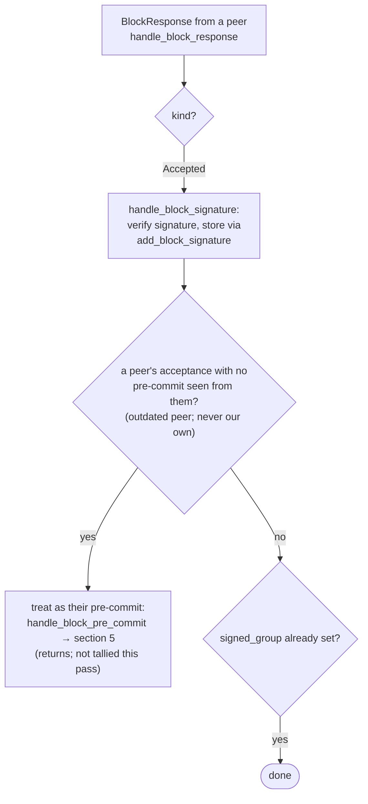

### Title
Reorg-timing mitigation in `check_parent_tenure_choice` is bypassed when the local approval timestamp is missing, silently permitting reorgs of established tenures - (File: `stacks-signer/src/chainstate/mod.rs`)

### Summary
`SortitionData::check_parent_tenure_choice` is the mitigation that stops a miner from reorging a tenure that already produced a block *unless* that block was proposed too close to the next sortition (`first_proposal_burn_block_timing`). The timing computation silently defaults to "0 seconds elapsed" (i.e. always poorly-timed, always permitted) whenever the signer's local record of the reorged tenure's first block lacks an `approved_time`, instead of refusing the reorg or treating it conservatively. This mirrors the class of bug in the referenced report: a timing-based mitigation (there, a minimum withdrawal delay; here, a minimum tenure-timing window) can be defeated because a code path bypasses the delay check under specific, attacker-reachable conditions, and the mitigation quietly reverts to the pre-mitigation (vulnerable) behavior instead of failing safe.

### Finding Description
`check_parent_tenure_choice` in [1](#0-0)  permits a reorg of an already-mined tenure only if that tenure's first block was proposed "very close" to the burn-block transition. It fetches the local approval record via `get_first_approved_block_in_tenure`: [2](#0-1) 

That query matches rows where `signed_self`, `signed_group`, **or** `approved_time` is set — i.e. it can return a `BlockInfo` whose `approved_time` is `None` (the signer only ever observed the group's/global signature via gossip and never itself ran `mark_pre_committed`/locally approved the block).

The timing computation then does: [3](#0-2) 

When `local_block_info.approved_time` is `None`, `proposal_to_sortition` is forced to `0`, and `Duration::from_secs(0) < first_proposal_burn_block_timing` is unconditionally `true`. The code logs "considering it as a late-arriving proposal" and pushes the tenure into `superseded_tenures`, i.e. it **always** grants the reorg permit for that tenure regardless of how long ago the tenure was actually established.

This defeats the very mitigation the timing window exists for: the config comment describes it explicitly as a safety knob against "dangerous reorgs of established tenures" ( [4](#0-3) ). The intended check compares wall-clock time between when *this signer* approved the tenure's first block and when the next sortition arrived; it is not supposed to reduce to "no data ⇒ automatically qualifies," because that is exactly the state an attacker can arrange (e.g., a signer that is late to observe/pre-commit the block locally, was recently restarted and lost/never obtained the timing record, or that never ran `mark_pre_committed` for that block but still learns of `signed_group` through gossip per the "outdated peer" path in `handle_block_response` — [5](#0-4) ).

Once permitted, the tenure is recorded as `superseded` (`mark_tenure_superseded`, [6](#0-5) ), which causes `reorg_permit_stands`/`get_signed_conflicts` to subsequently **exclude** this signer's own fresh signature over the superseded tenure's block as a conflict ( [7](#0-6) , [8](#0-7) ). The net effect: this signer both accepts the tenure-change block that reorgs an established tenure it should have refused, and stops treating its earlier, still-canonical signature as a conflict, letting the replacement block get signed.

`check_parent_tenure_choice` is invoked from both v1's `check_proposal`/`validate_tenure_change_payload` ( [9](#0-8) ) and analogous v2 code, so the bypass applies to the shared proposal-acceptance path used to decide `ReorgNotAllowed` rejections.

### Impact Explanation
This breaks the "approved-parent vs canonical" equality the mitigation is meant to protect: a single signer, due to a locally missing timestamp rather than genuine proximity to the sortition, can be tricked into treating an established (non-late) tenure as reorg-eligible, and will then sign a tenure-change block that reorgs a tenure it should have rejected (`ReorgNotAllowed`). This is a "signer signing an invalid/non-canonical/conflicting block" class issue (Critical per the rubric), since the very determination that gates `RejectReason::ReorgNotAllowed` is defeated by a missing local record rather than the actual chronology the mitigation is supposed to measure.

### Likelihood Explanation
The trigger is entirely local to a single signer's chainstate view — no majority collusion or key compromise is required. Any condition that leaves `approved_time` unset for the reorged tenure's first `BlockInfo` while `signed_self`/`signed_group` are set triggers it (signer restart with a gap in the DB, a fresh signer joining mid-tenure, or the "outdated peer" acceptance path in `handle_block_response` recording only a `signed_group` timestamp). A miner that observes such a signer (or waits for one) can then reorg with a stale/poorly-behaved commit against a tenure that legitimately produced a block well before the new sortition, and this signer will not raise `ReorgNotAllowed`.

### Recommendation
Do not treat a missing `approved_time` as "0 seconds elapsed / always poorly timed." Either:
- Refuse the reorg (`return Ok(false)`) when the local timing record is incomplete, matching the fail-safe pattern already used a few lines above when `local_block_info` itself is missing (`Ok(false)` with a warning), or
- Fall back to a node-derived timestamp (e.g. the block's actual processed time from the Stacks node) instead of defaulting to `0`, so the comparison reflects reality rather than "no data."

### Proof of Concept
1. Signer S has an incomplete local record for tenure T's first block: it knows the block via `signed_group` (peer gossip / "outdated peer" acceptance path) but never called `mark_pre_committed` on it itself, so `approved_time` is `None` for that `BlockInfo`.
2. A new sortition arrives with a tenure-change block whose `parent_tenure_id` is not the prior sortition (i.e., it reorgs tenure T), well after tenure T's first block was genuinely established (long past `first_proposal_burn_block_timing`).
3. `check_parent_tenure_choice` runs on signer S: `get_first_approved_block_in_tenure(T)` returns the `BlockInfo` with `approved_time = None`; `proposal_to_sortition` is forced to `0`; `Duration::from_secs(0) < first_proposal_burn_block_timing` is true, so the reorg is (incorrectly) permitted and tenure T is marked `superseded`.
4. Signer S signs the tenure-change block reorging T, and its own earlier signature over T's block stops blocking further replacement (`reorg_permit_stands` returns true while the permitting sortition is canonical), even though tenure T should have been protected as an established, canonical tenure.

(Full exploitation timing — how reliably an attacker can force a target signer into the "no `approved_time`" state — depends on gossip/replay ordering details of `stacks-signer`'s stackerdb sync that were out of scope to verify further here; this PoC establishes the code-level bypass, which is what the mitigation-error report class targets.)

### Citations

**File:** stacks-signer/src/chainstate/mod.rs (L170-245)
```rust
    pub fn check_parent_tenure_choice(
        &self,
        signer_db: &mut SignerDb,
        client: &StacksClient,
        first_proposal_burn_block_timing: &Duration,
    ) -> Result<bool, SignerChainstateError> {
        // if the parent tenure is the last sortition, it is a valid choice.
        // if the parent tenure is a reorg, then all of the reorged sortitions
        //  must either have produced zero blocks _or_ produced their first (and only) block
        //  very close to the burn block transition.
        if self.prior_sortition == self.parent_tenure_id {
            return Ok(true);
        }
        info!(
            "Most recent miner's tenure does not build off the prior sortition, checking if this is valid behavior";
            "sortition_state.consensus_hash" => %self.consensus_hash,
            "sortition_state.prior_sortition" => %self.prior_sortition,
            "sortition_state.parent_tenure_id" => %self.parent_tenure_id,
        );

        let tenures_reorged =
            client.get_tenure_forking_info(&self.parent_tenure_id, &self.prior_sortition)?;
        if tenures_reorged.is_empty() {
            warn!("Miner is not building off of most recent tenure, but stacks node was unable to return information about the relevant sortitions. Marking miner invalid.");
            return Ok(false);
        }

        // this value *should* always be some, but try to do the best we can if it isn't
        let sortition_state_received_time =
            signer_db.get_burn_block_receive_time(&self.burn_block_hash)?;

        // Track which tenures are superseded by the reorg, then mark them in
        // the DB after the reorg is permitted.
        let mut superseded_tenures = Vec::new();
        for tenure in tenures_reorged.iter() {
            if tenure.consensus_hash == self.parent_tenure_id {
                // this was a built-upon tenure, no need to check this tenure as part of the reorg.
                continue;
            }

            // disallow reorg if more than one block has already been signed
            let globally_accepted_blocks =
                signer_db.get_globally_accepted_block_count_in_tenure(&tenure.consensus_hash)?;
            if globally_accepted_blocks > 1 {
                warn!(
                    "Miner is not building off of most recent tenure, but a tenure they attempted to reorg has already more than one globally accepted block.";
                    "parent_tenure" => %self.parent_tenure_id,
                    "last_sortition" => %self.prior_sortition,
                    "violating_tenure_id" => %tenure.consensus_hash,
                    "violating_tenure_first_block_id" => ?tenure.first_block_mined,
                    "globally_accepted_blocks" => globally_accepted_blocks,
                );
                return Ok(false);
            }

            let Some(first_block_mined) = &tenure.first_block_mined else {
                // The node saw no blocks in this tenure, so the reorg takes nothing away from
                // the canonical chain. We may still hold a signature over a block in it that
                // the node has never seen (a block we accept locally is not handed to the node
                // until the whole signer set has signed it), so the reorg must still be
                // recorded if it is permitted.
                superseded_tenures.push(tenure);
                continue;
            };
            let Some(local_block_info) =
                signer_db.get_first_approved_block_in_tenure(&tenure.consensus_hash)?
            else {
                warn!(
                    "Miner is not building off of most recent tenure, but a tenure they attempted to reorg has already mined blocks, and there is no local knowledge for that tenure's block timing.";
                    "parent_tenure" => %self.parent_tenure_id,
                    "last_sortition" => %self.prior_sortition,
                    "violating_tenure_id" => %tenure.consensus_hash,
                    "violating_tenure_first_block_id" => %first_block_mined,
                );
                return Ok(false);
            };
```

**File:** stacks-signer/src/chainstate/mod.rs (L247-278)
```rust
            let checked_proposal_timing = if let Some(sortition_state_received_time) =
                sortition_state_received_time
            {
                // how long was there between when the proposal was received and the next sortition started?
                let proposal_to_sortition = if let Some(approved_at) =
                    local_block_info.approved_time
                {
                    sortition_state_received_time.saturating_sub(approved_at)
                } else {
                    info!("We did not sign over the reorged tenure's first block, considering it as a late-arriving proposal");
                    0
                };
                if Duration::from_secs(proposal_to_sortition) < *first_proposal_burn_block_timing {
                    info!(
                        "Miner is not building off of most recent tenure. A tenure they reorg has already mined blocks, but the block was poorly timed, allowing the reorg.";
                        "parent_tenure" => %self.parent_tenure_id,
                        "last_sortition" => %self.prior_sortition,
                        "violating_tenure_id" => %tenure.consensus_hash,
                        "violating_tenure_first_block_id" => %first_block_mined,
                        "violating_tenure_proposed_time" => local_block_info.proposed_time,
                        "new_tenure_received_time" => sortition_state_received_time,
                        "new_tenure_burn_timestamp" => self.burn_header_timestamp,
                        "first_proposal_burn_block_timing_secs" => first_proposal_burn_block_timing.as_secs(),
                        "proposal_to_sortition" => proposal_to_sortition,
                    );
                    superseded_tenures.push(tenure);
                    continue;
                }
                true
            } else {
                false
            };
```

**File:** stacks-signer/src/signerdb.rs (L1518-1527)
```rust
    /// Return the first approved/signed block in a tenure (identified by its consensus hash)
    pub fn get_first_approved_block_in_tenure(
        &self,
        tenure: &ConsensusHash,
    ) -> Result<Option<BlockInfo>, DBError> {
        let query = "SELECT block_info FROM blocks WHERE consensus_hash = ? AND (signed_self IS NOT NULL OR signed_group IS NOT NULL OR approved_time IS NOT NULL) ORDER BY stacks_height ASC LIMIT 1";
        let result: Option<String> = query_row(&self.db, query, [tenure])?;

        try_deserialize(result)
    }
```

**File:** stacks-signer/src/signerdb.rs (L1599-1625)
```rust
    ///
    /// Blocks in tenures whose reorg we sanctioned under the reorg-timing rules (see
    /// [`SignerDb::mark_tenure_superseded`]) are still returned, but annotated with the
    /// permitting tenure's sortition (`superseded_by_*`): the permit only holds while that
    /// sortition is canonical, which the caller derives from the node per evaluation (see
    /// `Signer::reorg_permit_stands`) -- like every other question about whether a conflict is
    /// still *live* (`Signer::conflict_still_blocks`), it is not recorded.
    pub fn get_signed_conflicts(
        &self,
        height: u64,
        excluded_signer_signature_hash: &Sha512Trunc256Sum,
    ) -> Result<Vec<SignedConflictInfo>, DBError> {
        let query = "SELECT b.consensus_hash, b.signer_signature_hash, b.stacks_height, b.state,
                MAX(COALESCE(b.signed_self, 0), COALESCE(b.signed_group, 0)) AS last_endorsed,
                st.superseded_by_consensus_hash, st.superseded_by_burn_block_hash
            FROM blocks b
            LEFT JOIN superseded_tenures st ON st.consensus_hash = b.consensus_hash
            WHERE (b.signed_self IS NOT NULL OR b.signed_group IS NOT NULL)
                AND b.stacks_height >= ?1
                AND b.signer_signature_hash != ?2
            ORDER BY b.stacks_height DESC";
        let args = params![
            u64_to_sql(height)?,
            excluded_signer_signature_hash.to_string(),
        ];
        query_rows(&self.db, query, args)
    }
```

**File:** stacks-signer/src/signerdb.rs (L1642-1660)
```rust
    pub fn mark_tenure_superseded(
        &mut self,
        consensus_hash: &ConsensusHash,
        burn_block_height: u64,
        superseded_by_consensus_hash: &ConsensusHash,
        superseded_by_burn_block_hash: &BurnchainHeaderHash,
    ) -> Result<(), DBError> {
        self.db.execute(
            "INSERT OR REPLACE INTO superseded_tenures (consensus_hash, burn_block_height, superseded_by_consensus_hash, superseded_by_burn_block_hash, superseded_at) VALUES (?1, ?2, ?3, ?4, ?5)",
            params![
                consensus_hash,
                u64_to_sql(burn_block_height)?,
                superseded_by_consensus_hash,
                superseded_by_burn_block_hash,
                u64_to_sql(get_epoch_time_secs())?
            ],
        )?;
        Ok(())
    }
```

**File:** sample/conf/signer/mainnet-signer-conf.toml (L149-166)
```text
# Reorg protection window. Measures the time between when the first block
# of a tenure was signed and when the next burn block (sortition) arrived.
#
# If a new miner tries to reorg a tenure that already produced blocks:
#   - If (burn_block_received - first_block_signed) < this value:
#     Reorg is ALLOWED (the tenure was "poorly timed" and the incoming
#     miner did not have sufficient time to RBF an outdated commit)
#   - If (burn_block_received - first_block_signed) >= this value:
#     Reorg is DENIED (the tenure was established long enough for the
#     incoming miner to RBF any outdated commit)
#
# WARNING: Setting this too LOW allows dangerous reorgs of established
# tenures. Setting it too HIGH blocks legitimate miner handoffs when
# the previous tenure's first block arrived shortly before the sortition.
#
# Default: 60
# Units: seconds
# first_proposal_burn_block_timing_secs = 60
```

**File:** docs/signer-flows.md (L357-364)
```markdown


**File:** stacks-signer/src/v0/signer.rs (L1208-1247)
```rust
    /// Whether a reorg permit recorded for this conflict's tenure still stands.
    ///
    /// `check_parent_tenure_choice` records a permit when the reorg-timing rules sanction a
    /// later tenure replacing what the conflict's tenure built (see
    /// [`SignerDb::mark_tenure_superseded`]). A standing permit excludes the conflict entirely:
    /// our signature must not stand in the way of a replacement we sanctioned. But the permit
    /// is only as alive as the sortition it was granted to: if a burnchain fork orphaned the
    /// permitting sortition, the reorg we sanctioned can no longer happen, and the record must
    /// not keep suppressing the conflict.
    ///
    /// A false 404 here (e.g. from a node still catching up) only restores a conflict the
    /// permit could have excluded, which at worst delays the replacement, so unlike
    /// `conflict_still_blocks` no tip-height guard is needed. A node error voids the permit for
    /// the same reason: blocking is the direction that can be taken back.
    fn reorg_permit_stands(
        &self,
        stacks_client: &StacksClient,
        conflict: &SignedConflictInfo,
    ) -> bool {
        let Some(superseded_by) = &conflict.superseded_by else {
            return false;
        };
        match stacks_client.get_sortition_by_burn_hash(&superseded_by.burn_block_hash) {
            Ok(_) => true,
            Err(ClientError::RequestFailure(reqwest::StatusCode::NOT_FOUND)) => {
                info!("{self}: The tenure we permitted to reorg a conflicting block's tenure was itself orphaned by a burnchain fork. The permit no longer excludes the conflict.";
                    "conflicting_consensus_hash" => %conflict.consensus_hash,
                    "superseded_by_consensus_hash" => %superseded_by.consensus_hash,
                    "superseded_by_burn_block_hash" => %superseded_by.burn_block_hash,
                );
                false
            }
            Err(e) => {
                warn!("{self}: Failed to check whether the sortition that permitted a reorg is still canonical: {e:?}. Treating the permit as void.";
                    "conflicting_consensus_hash" => %conflict.consensus_hash,
                    "superseded_by_consensus_hash" => %superseded_by.consensus_hash,
                );
                false
            }
        }
```

**File:** stacks-signer/src/chainstate/v1.rs (L483-504)
```rust
        // Ensure that the tenure change block confirms the expected parent block
        let confirms_expected_parent = SortitionData::check_tenure_change_confirms_parent(
            tenure_change,
            block,
            signer_db,
            client,
            self.config.tenure_last_block_proposal_timeout,
            self.config.reorg_attempts_activity_timeout,
        )
        .map_err(SignerChainstateError::from)?;
        if !confirms_expected_parent {
            return Err(RejectReason::InvalidParentBlock);
        }
        // now, we have to check if the parent tenure was a valid choice.
        let is_valid_parent_tenure = proposed_by.state().data.check_parent_tenure_choice(
            signer_db,
            client,
            &self.config.first_proposal_burn_block_timing,
        )?;
        if !is_valid_parent_tenure {
            return Err(RejectReason::ReorgNotAllowed);
        }
```
