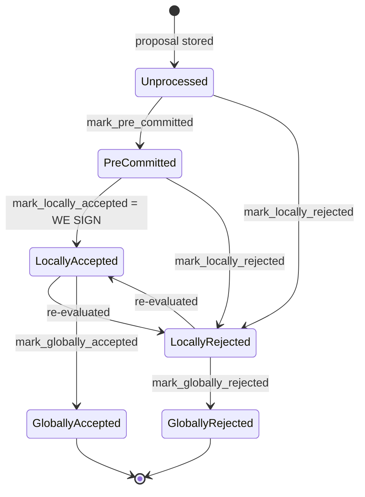

### Title
Stale rejection weight is never revoked when a signer later accepts, letting `total_weight_approved`/`total_weight_rejected` double-count a single signer's weight - ([File: stacks-node/src/nakamoto_node/stackerdb_listener.rs])

### Summary
`StackerDBListener::handle_signer_messages` (the miner-side coordinator that tallies `BlockResponse` messages from signers to decide whether a proposed block has crossed the 70% approval/30% rejection threshold) gates the two counters it maintains — `total_weight_approved` and `total_weight_rejected` — on two *different* keys. The `Accepted` arm gates on `block.gathered_signatures.contains_key(&slot_id)`, while the `Rejected` arm gates on `block.responded_signers.insert(slot_id)`. Because a signer's own state machine explicitly allows `LocallyRejected → LocallyAccepted` (a rejected block can later be re-evaluated and signed, e.g. once a conflicting sibling goes stale), a single honest signer can legitimately emit a `Rejected` message and later an `Accepted` message for the *same* block. When that happens, the signer's weight is added to `total_weight_rejected` on the reject, and *also* added to `total_weight_approved` on the later accept — the stale rejection weight is never subtracted. `total_weight_approved + total_weight_rejected` can now exceed `total_weight`, breaking the aggregated-weight-vs-verified-accepts invariant the miner and signer set assume.

### Finding Description
`BlockStatus` tracks four fields relevant here: `responded_signers`, `gathered_signatures`, `total_weight_approved`, `total_weight_rejected`. [1](#0-0) 

For `BlockResponse::Accepted`, weight is added only if the slot's signature has not yet been recorded in `gathered_signatures`: [2](#0-1) 

For `BlockResponse::Rejected`, weight is added only if the slot has not yet been recorded in `responded_signers` — a set shared conceptually with "has this signer spoken at all", but which the accept path never consults or clears: [3](#0-2) 

Sequence that triggers the double-count:
1. Signer S proposes-block-evaluates and rejects it (e.g. `RejectReason` from a stale/conflicting sibling not yet resolved) — `handle_block_rejection`/`store_and_process_block_rejection` broadcasts `BlockResponse::Rejected`. The coordinator's Rejected arm runs `responded_signers.insert(slot_id)` → `true` → `total_weight_rejected += weight(S)`.
2. The conflict later resolves and S's own state machine transitions `LocallyRejected → LocallyAccepted` on re-evaluation (this transition is a documented, intended part of the signer's flow) and S broadcasts `BlockResponse::Accepted` for the same block. [4](#0-3) 
3. The coordinator's Accepted arm checks `gathered_signatures.contains_key(&slot_id)` — false, since S never accepted before — so it proceeds to `total_weight_approved += weight(S)`, and does *not* check or clear `responded_signers`/`total_weight_rejected`.
4. `weight(S)` is now counted in *both* `total_weight_approved` and `total_weight_rejected` simultaneously, and `total_weight_rejected` is never decremented.

This breaks the equality the coordinator relies on: the sum of per-signer weights it tallies should never exceed `total_weight` (the sum of all signer weights), because each signer should contribute to exactly one side of the tally at a time. With the bug, `total_weight_rejected` continues to reflect the stale rejection indefinitely.

### Impact Explanation
This is a liveness wedge on the block-production path, not a cryptographic forgery: `get_block_status`/`get_signer_signatures` (`stacks-node/src/nakamoto_node/signer_coordinator.rs`) aborts with `NakamotoNodeError::SignersRejected` once `total_weight_rejected.saturating_add(self.weight_threshold) > self.total_weight`. [5](#0-4) 
Because the phantom rejection weight from a signer who has since accepted is never removed, the coordinator can spuriously conclude that 70% approval is now mathematically impossible and abort block production, even though the real, current distinct-signer state may in fact be able to reach (or has already reached) the 70% threshold. This can stall miner block production and force retries/timeouts, and — because `rejections_timeout` step logic also reacts to `total_weight_rejected` changes — can also perturb the coordinator's retry/backoff behavior. [6](#0-5) 

The genuine acceptance signatures that are collected into `gathered_signatures`/pushed to the network remain individually valid (each is checked with `signer_pubkey.verify`), so this bug does not by itself let an invalid block get pushed or signed. Its impact is confined to false-negative rejection accounting → wedged/stalled tenures, matching the "liveness wedge" category.

### Likelihood Explanation
This requires no adversarial signer and no majority collusion: it is triggered by a single honest signer following the documented `LocallyRejected → LocallyAccepted` re-evaluation path, which the codebase explicitly implements and tests as normal behavior (siblings resolving, stale conflicts clearing, etc.). Any tenure with contested/competing block proposals or transient rejection reasons that later resolve is a natural trigger, making this readily reachable in ordinary network conditions rather than a contrived edge case.

### Recommendation
Make the two counters consistent and mutually exclusive per signer: track a single per-signer "last known vote" (accept or reject) keyed by `slot_id`, and when a signer's vote transitions from reject to accept (or vice versa), subtract the previous vote's weight from its counter before adding the weight to the new counter. Concretely, gate the `Accepted` arm on `responded_signers` the same way, and when a signer's slot is already present in `responded_signers` with a different vote type, adjust both `total_weight_approved` and `total_weight_rejected` accordingly instead of only ever additively counting into `total_weight_approved`.

### Proof of Concept
1. Set up a `StackerDBListener`/`SignerCoordinator` tallying a `BlockStatus` for a proposed block, with signer weights such that `weight_threshold` requires 70% of `total_weight`, and pick a signer S whose weight alone is greater than `total_weight - weight_threshold` (i.e., S's weight alone can tip the "30% rejected" threshold).
2. Simulate S sending `SignerMessageV0::BlockResponse(BlockResponse::Rejected(...))` for the block's `signer_signature_hash` → observe `total_weight_rejected` increases by `weight(S)` and now (with other signers similarly near the boundary) causes `total_weight_rejected.saturating_add(weight_threshold) > total_weight`, or gets close to it.
3. Simulate S later sending `SignerMessageV0::BlockResponse(BlockResponse::Accepted(...))` for the *same* `signer_signature_hash` (representing a legitimate `LocallyRejected → LocallyAccepted` re-evaluation).
4. Observe that `total_weight_approved` increases by `weight(S)` as expected, but `total_weight_rejected` is *not* decremented — assert `block.total_weight_approved + block.total_weight_rejected > total_weight`, and that if enough other signers are near the reject-threshold boundary, `get_block_status` returns `Err(NakamotoNodeError::SignersRejected { .. })` even though the current, up-to-date distinct-signer state should still allow the block to reach approval.

*Note:* This is based on direct inspection of `stacks-node/src/nakamoto_node/stackerdb_listener.rs` and `signer_coordinator.rs` and the documented signer state machine in `docs/signer-flows.md`; I did not find or execute an existing automated test exercising this exact reject→accept flip sequence in the coordinator, so the PoC above is a proposed reproduction script rather than a cited existing test.

### Citations

**File:** stacks-node/src/nakamoto_node/stackerdb_listener.rs (L70-82)
```rust
#[derive(Debug, Clone)]
pub struct BlockStatus {
    /// Set of the slot ids of signers who have responded
    pub responded_signers: HashSet<u32>,
    /// Map of the slot id of signers who have signed the block and their signature
    pub gathered_signatures: BTreeMap<u32, MessageSignature>,
    /// Total weight of signers who have signed the block
    pub total_weight_approved: u32,
    /// Total weight of signers who have rejected the block
    pub total_weight_rejected: u32,
    /// Per-txid rejection tracking from signers
    pub failed_txids: HashMap<Txid, FailedTxInfo>,
}
```

**File:** stacks-node/src/nakamoto_node/stackerdb_listener.rs (L443-465)
```rust
                        if !block.gathered_signatures.contains_key(&slot_id) {
                            block.total_weight_approved = block
                                .total_weight_approved
                                .saturating_add(signer_entry.weight);

                            info!("StackerDBListener: Signature Added to block";
                                "signer_signature_hash" => %block_sighash,
                                "signer_pubkey" => signer_pubkey.to_hex(),
                                "signer_slot_id" => slot_id,
                                "signature" => %signature,
                                "signer_weight" => signer_entry.weight,
                                "total_weight_approved" => block.total_weight_approved,
                                "percent_approved" => block.total_weight_approved as f64 / self.total_weight as f64 * 100.0,
                                "total_weight_rejected" => block.total_weight_rejected,
                                "percent_rejected" => block.total_weight_rejected as f64 / self.total_weight as f64 * 100.0,
                                "weight_threshold" => self.weight_threshold,
                                "tenure_extend_timestamp" => tenure_extend_timestamp,
                                "read_count_extend_timestamp" => read_count_extend_timestamp,
                                "server_version" => metadata.server_version,
                            );
                        }
                        block.gathered_signatures.insert(slot_id, signature);
                        block.responded_signers.insert(slot_id);
```

**File:** stacks-node/src/nakamoto_node/stackerdb_listener.rs (L486-518)
```rust
                    SignerMessageV0::BlockResponse(BlockResponse::Rejected(rejected_data)) => {
                        let (lock, cvar) = &*self.blocks;
                        let mut blocks = lock.lock().expect("FATAL: failed to lock block status");

                        let Some(block) = blocks.get_mut(&rejected_data.signer_signature_hash)
                        else {
                            info!(
                                "StackerDBListener: Received rejection for block that we did not request. Ignoring.";
                                "signer_signature_hash" => %rejected_data.signer_signature_hash,
                                "slot_id" => slot_id,
                                "signer_set" => self.signer_set,
                            );
                            continue;
                        };

                        let rejected_pubkey = match rejected_data.recover_public_key() {
                            Ok(rejected_pubkey) => {
                                if rejected_pubkey != signer_pubkey {
                                    warn!("StackerDBListener: Recovered public key from rejected data does not match signer's public key. Ignoring.");
                                    continue;
                                }
                                rejected_pubkey
                            }
                            Err(e) => {
                                warn!("StackerDBListener: Failed to recover public key from rejected data: {e:?}. Ignoring.");
                                continue;
                            }
                        };

                        if block.responded_signers.insert(slot_id) {
                            block.total_weight_rejected = block
                                .total_weight_rejected
                                .saturating_add(signer_entry.weight);
```

**File:** docs/signer-flows.md (L137-150)
```markdown

```

**File:** stacks-node/src/nakamoto_node/signer_coordinator.rs (L486-507)
```rust

            if rejections != block_status.total_weight_rejected {
                rejections = block_status.total_weight_rejected;
                let (rejections_step, new_rejections_timeout) = self
                    .block_rejection_timeout_steps
                    .range((Included(0), Included(rejections)))
                    .last()
                    .ok_or_else(|| {
                        NakamotoNodeError::SigningCoordinatorFailure(
                            "Invalid rejection timeout step function definition".into(),
                        )
                    })?;
                rejections_timeout = new_rejections_timeout;
                info!("Number of received rejections updated, resetting timeout";
                                    "rejections" => rejections,
                                    "rejections_timeout" => rejections_timeout.as_secs(),
                                    "rejections_step" => rejections_step,
                                    "rejections_threshold" => self.total_weight.saturating_sub(self.weight_threshold));

                counters.set_miner_current_rejections_timeout_secs(rejections_timeout.as_secs());
                counters.set_miner_current_rejections(rejections);
            }
```

**File:** stacks-node/src/nakamoto_node/signer_coordinator.rs (L509-540)
```rust
            if block_status
                .total_weight_rejected
                .saturating_add(self.weight_threshold)
                > self.total_weight
            {
                info!(
                    "{}/{} signer weight votes to reject block",
                    block_status.total_weight_rejected, self.total_weight;
                    "signer_signature_hash" => %block_signer_sighash,
                );
                counters.bump_naka_rejected_blocks();

                // Only act on failed txids that a blocking minority (>30% weight) agrees on
                let blocking_minority = self.total_weight.saturating_sub(self.weight_threshold);
                let mut temporarily_excluded_txids = HashSet::new();
                let mut permanently_excluded_txids = HashSet::new();
                for (txid, info) in &block_status.failed_txids {
                    if info.total_weight > blocking_minority {
                        // Do not perma ban txids that only a small minority of signers reported as problematic
                        // But make sure its removed from the next block proposal
                        if info.problematic_weight > blocking_minority {
                            permanently_excluded_txids.insert(txid.clone());
                        } else {
                            temporarily_excluded_txids.insert(txid.clone());
                        }
                    }
                }

                return Err(NakamotoNodeError::SignersRejected {
                    temporarily_excluded_txids,
                    permanently_excluded_txids,
                });
```
