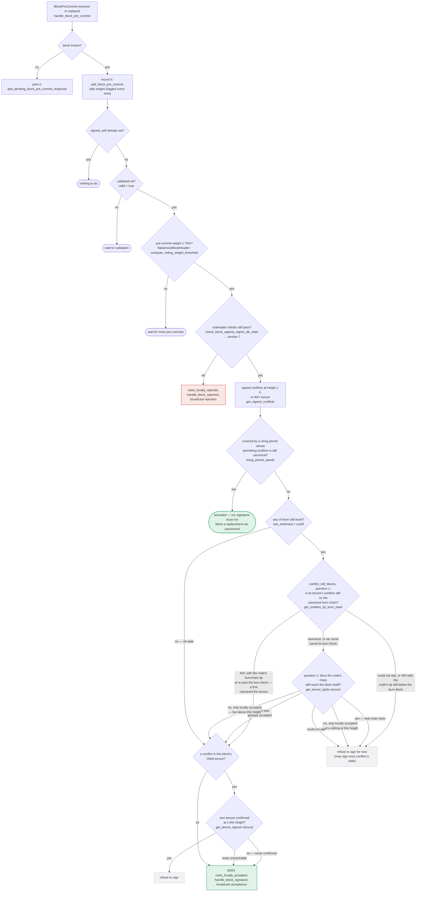
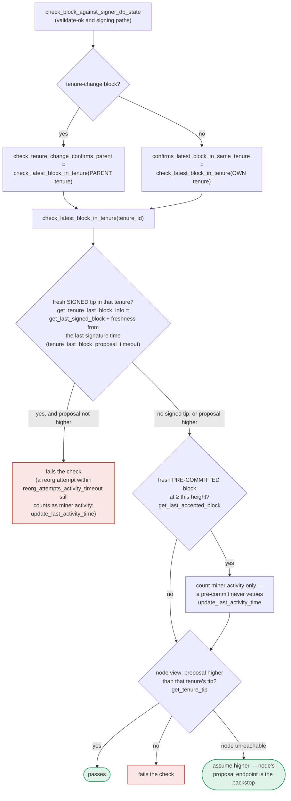

### Title
Freshness-cutoff bypass in `handle_block_pre_commit` allows signing a conflicting sibling block at the same height in a different tenure - (File: `stacks-signer/src/v0/signer.rs`)

### Summary
`handle_block_pre_commit` only runs the real cross-tenure conflict derivation (`conflict_still_blocks`, i.e. the sortition/tenure-tip questions) when a signed conflict at the target height is still "fresh" (`last_endorsed > cutoff`). Once a conflict ages past that cutoff, the signer skips asking the node whether the conflict is actually dead and falls straight into the own-tenure-only check, which cannot see a sibling block in a different tenure. An attacker who wins a slot, gets a block `B'` proposed in a different tenure than an already-signed `B` at the same height, and simply waits for `B`'s freshness window to expire before crossing the pre-commit threshold, gets `B'` signed even though `B` is still live and un-orphaned and no `reorg_permit_stands` exception applies.

### Finding Description
The equality the guard is supposed to enforce is: *a signer must sign at most one block per height, across all tenures, unless the conflicting signed block is provably dead (orphaned tenure or superseded/globally-moved-past) or covered by a recorded `reorg_permit_stands` exception.*

Per the pre-commit flow (`handle_block_pre_commit` in `stacks-signer/src/v0/signer.rs`), once ≥70% pre-commit weight is reached and `check_block_against_signer_db_state` (the RECHECK) passes, the signer computes `get_signed_conflicts` for the height (any tenure). If none is excluded by `reorg_permit_stands`, the code branches on `FRESH{"any of them still fresh? last_endorsed > cutoff"}`:

- If fresh → the real death-check (`conflict_still_blocks`, using `get_sortition_by_burn_hash` / `get_tenure_tip`) decides whether the sibling `B` is actually dead before allowing the signature.
- If **not** fresh (all conflicts are past `cutoff`) → the flow jumps directly to `OWN{"a conflict in this block's OWN tenure?"}`, which only inspects `B'`'s own tenure. Since `B` lives in a *different* tenure, this check answers "no", and the signer proceeds to `SIGN`.

Crucially, `check_block_against_signer_db_state` (the RECHECK, `check_latest_block_in_tenure`) is scoped to only one tenure — the block's own tenure, or its parent tenure if it is a tenure-change block — and never inspects a third, unrelated tenure. So the cross-tenure `get_signed_conflicts` + `conflict_still_blocks` machinery in `handle_block_pre_commit` is the *only* place a sibling in a different tenure is checked. Once that machinery is bypassed by the staleness branch, nothing else stops the double-sign.

`cutoff` here is a fixed function of wall-clock time since the signer's own `last_endorsed`/signature on `B` (an attacker cannot directly manipulate the local signer's clock, but can trivially just wait — since the attacker controls timing of proposing/gossiping `B'`, they can delay crossing the pre-commit threshold on `B'` until `B`'s cutoff has elapsed). This does not require winning the race in a narrow window between threshold-crossing and RECHECK as literally stated in the question; it only requires the attacker to *wait out* the cutoff before pushing `B'` over the pre-commit threshold, which is strictly easier and fully within an unprivileged single-slot attacker's control (gossip timing only).

### Impact Explanation
This breaks the safety property "at most one block signed per height, across all tenures" — the central invariant that `get_signed_conflicts` + `conflict_still_blocks` + `reorg_permit_stands` exist to enforce. If enough signers independently experience this same staleness condition (a plausible outcome since `cutoff`/`last_endorsed` tracks real elapsed time and all honest signers would have signed `B` at roughly the same time), the signer set can reach 70% signatures for both `B` and `B'` at the same height in different tenures, producing two conflicting, globally-signed blocks — a chain split. This matches the Critical category: "a signer signing an invalid, non-canonical, or conflicting block (chain safety)."

### Likelihood Explanation
Preconditions: the attacker needs (1) an already-signed block `B` in some tenure at height `h` (achieved through ordinary chain operation, not attacker-controlled), (2) the ability to win a later slot and craft a tenure-start block `B'` at the same height `h` in a different tenure (attacker controls this, consistent with a single-miner-slot unprivileged attacker), and (3) enough elapsed real time for `last_endorsed > cutoff` on `B` before `B'` crosses the pre-commit threshold — which the attacker can simply wait for. No majority-signer collusion, no compromised keys, and no privileged access is required — only proposal crafting and StackerDB gossip of a single slot's weight, matching the attacker model. It is repeatable at any height where a prior signed block ages past the freshness cutoff before a same-height sibling in another tenure is proposed and pushed through pre-commit.

### Recommendation
Do not let the `FRESH`/cutoff branch fully bypass the cross-tenure conflict determination. When a conflict is stale, still run `conflict_still_blocks` (or an equivalent node-derived liveness check) against that specific conflicting block/tenure before falling through to the own-tenure-only branch; only treat the conflict as cleared if the node-derived death check (orphaned sortition, or globally-accepted-then-superseded) actually proves it, not merely because the local `last_endorsed` timestamp aged past an arbitrary timeout.

### Proof of Concept
Rust signer test outline (drives `handle_block_pre_commit` directly against a `Signer` + `SignerDb` test harness):
1. Construct tenure A, propose and fully sign block `B` at height `h` (drive through `handle_block_validate_response` → `mark_pre_committed` → `handle_block_pre_commit` → `mark_locally_accepted`), recording `approved_time`/`last_endorsed`.
2. Advance the test clock (or configure a short `cutoff`) past the freshness window for `B`.
3. Construct tenure C (different burn-chain tenure, canonical, not orphaned, not covered by any `mark_tenure_superseded`/`reorg_permit_stands` record) and propose tenure-start block `B'` at the same height `h`.
4. Drive `B'` through validation, `mark_pre_committed`, and pre-commit gossip until weight crosses `compute_voting_weight_threshold`, invoking `handle_block_pre_commit(B')`.
5. Assert on both sides of the equality:
   - **Before fix**: `handle_block_pre_commit` reaches `mark_locally_accepted(B')`/SIGN despite `get_signed_conflicts(h, any tenure)` returning `B`, `reorg_permit_stands` being false, and the node's canonical view showing tenure A's sortition still canonical and `B` still reachable (i.e. `conflict_still_blocks` would have said "keep blocking" had it been asked).
   - **After fix**: assert `handle_block_pre_commit(B')` does NOT sign — it stays in `PreCommitted`/hold state — as long as `get_signed_conflicts(B)` is non-empty and no `reorg_permit_stands` exception applies, regardless of whether `last_endorsed > cutoff` for `B`. [1](#0-0) [2](#0-1) [3](#0-2)

### Citations

**File:** docs/signer-flows.md (L229-272)
```markdown
## 5. Pre-commit threshold → signature

The only place the signer produces a block signature by counting votes.
Pre-commits from peers (and our own) accumulate; at ≥70% weight the signer
decides whether to follow through. Between validation and threshold, we may have
signed a _different_ block at the same height, possibly in another tenure, so
the world must be re-checked before the signature leaves the box.


```

**File:** docs/signer-flows.md (L274-341)
```markdown
Order matters here: the chainstate re-check runs first and produces an explicit
(sticky) rejection when the block now conflicts with a signed one. The conflict
guard behind it is the silent backstop for what that re-check cannot see, and
silence keeps the door open to sign later once the conflict goes stale. Two
blind spots make the guard necessary:

- the re-check only ever looks at _one_ tenure (a tenure-change block's parent,
  or any other block's own), so a signed sibling at the same height in a third
  tenure is invisible to it;
- the `DuplicateBlockFound` check that would catch a second block in the same
  tenure lives in `check_proposal` and runs only at proposal arrival, never
  again. A block that crosses the pre-commit threshold minutes later has no
  other guard, which is what the own-tenure branch above covers.

Freshness alone is not enough to hold a signature back, because a signature can
outlive the block it covers: a Bitcoin reorg can kill the block, and a dead
signature must not stall the chain restarting beneath it until it goes stale. So
`conflict_still_blocks` derives, per evaluation, whether the conflict could still
end up in the chain. Deriving this here — instead of recording it when a fork is
observed — is deliberate: the node's view mid-reorg is a moving target (burn
block events fire before the sortition transaction commits, and a node error can
wipe the local state machine), so a fact recorded once at observation time can be
silently wrong, while a question asked per evaluation self-corrects on the next
pre-commit or re-proposal. Two questions, in order:

1. **Is the conflict's tenure still on the canonical burn chain?** The signer
   saved the tenure's burn block when it arrived (section 8), and
   `/v3/sortitions/burn/:hash` resolves it against the node's canonical fork. A
   404 means a burnchain fork orphaned the tenure: everything it built is void,
   and the conflict is dead no matter what state its block is in. But a 404
   alone is not proof — the same endpoint 404s a perfectly canonical burn block
   when the node is still catching up (and on internal data misses), so it is
   only trusted once the node's burnchain tip (`get_peer_info`) is at or past
   the stored burn block's height; below that, the conflict keeps blocking and
   the next evaluation retries. If the burn block was never saved (a restart,
   or the tenure predates us), the question is skipped rather than guessed.
2. **Does the node's canonical Stacks chain still reach the block itself?**
   - **it does** — real chain state; keep blocking;
   - **it does not, and the block was globally accepted** — the node once _did_
     have it, so a reorg moved past it. That is proof it is dead;
   - **it does not, and the block was never globally accepted** — a block is
     not handed to the node until the whole signer set has signed it, so this
     may mean "not yet seen" rather than "dead". A sibling at the same height
     therefore keeps blocking, since signing both would be the double-sign this
     guard exists for; a block _above_ the proposal does not, because it is no
     sibling and abandoning an unconfirmed block to restart beneath it is a
     reorg, not an equivocation.

A conflict is any block a signature was ever put over — ours, or a group
threshold we observed — whatever its state now. In particular rejection, even
_global_ rejection, does not clear one: a rejection is a revocable opinion,
while a signature is a bearer instrument that can still be aggregated toward
the 70% threshold if rejecting signers change their minds. Only staleness or
node-derived death (the two questions above) clears a conflict.

Whenever the node cannot be asked, the conflict keeps blocking: that only delays
the replacement until the signature goes stale, whereas wrongly signing cannot be
taken back. The one recorded exception is a tenure whose reorg we sanctioned
under the reorg-timing rules (section 8): there the node still serves the
conflict as fully live — replacing it is only legitimate because we permitted it
— so no question asked of the node about the _conflict_ could clear it. Instead
the record carries the permitting tenure's sortition, and `reorg_permit_stands`
asks the node whether that sortition is still canonical: while it is, the
conflict is excluded outright; if a burnchain fork orphaned it, the reorg we
sanctioned can no longer happen and the conflict gets its voice back. A false
404 there needs no tip-height guard — it merely restores a conflict, which at
worst delays the replacement. For the own-tenure question below, an unreachable
node is instead treated as unconfirmed and the signature goes out.
```

**File:** docs/signer-flows.md (L389-423)
```markdown
## 7. The chainstate checks (shared)

`check_latest_block_in_tenure` answers "does this block confirm the tip we
expect?" and it runs in three places: at proposal arrival (inside
`check_proposal`), at validate-ok, and at the moment of signing. _Which_ tenure
it is asked about depends on the block: a tenure-change block is checked against
its **parent** tenure, every other block against its **own**. Never both. The
pivotal helper is `get_tenure_last_block_info`, which considers only blocks that
carry a signature (`get_last_signed_block`): a pre-commit never vetoes anything,
it only counts as miner activity.



A failed check becomes a different rejection depending on who asked.
`check_block_against_signer_db_state` returns `SortitionViewMismatch`, or
`ConnectivityIssues` when the lookup itself errored rather than answering; the v2
`check_proposal` path returns `InvalidParentBlock`.
```
