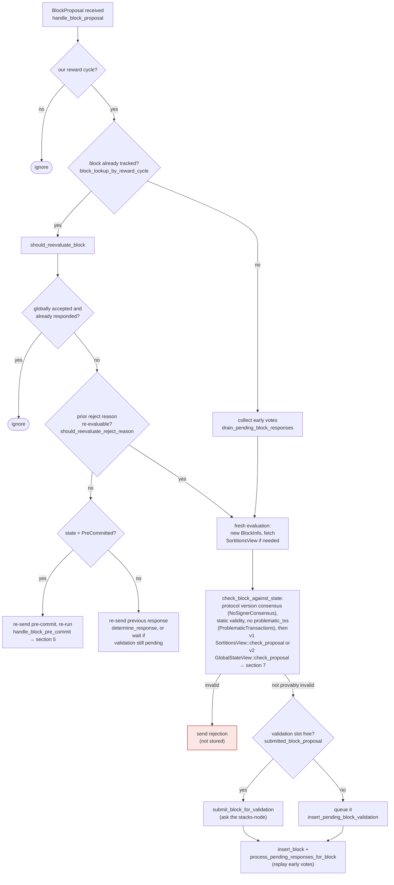

Found it: `block_lookup_by_reward_cycle` in `stacks-signer/src/v0/signer.rs` keys duplicate-tracking off the miner-supplied `BlockProposal.reward_cycle` field instead of a value derived from the block's own `consensus_hash`/sortition, which is directly analogous to phpBB trusting the client-supplied Host header instead of a verified server value for a security-relevant decision.

### Title
Signer's duplicate-proposal tracking trusts the unauthenticated, miner-supplied `reward_cycle` field instead of deriving it from the block's consensus hash - ([File: stacks-signer/src/v0/signer.rs])

### Summary
`BlockProposal.reward_cycle` is a plain `u64` field chosen by the miner and carried unauthenticated inside the signed block-proposal wrapper message (the field itself is not covered by `NakamotoBlock`'s own header signature scheme, only by the block content it wraps). [1](#0-0) 
`handle_block_proposal` first gates on this field (`block_proposal.reward_cycle != self.reward_cycle` → ignore), and any proposal that gets past this gate is looked up/deduplicated via `block_lookup_by_reward_cycle`, which filters purely on the stored `block_info.reward_cycle == self.reward_cycle` equality rather than any node-verified property of the block (e.g. the sortition/consensus hash that the reward cycle should be derived from). [2](#0-1) [3](#0-2) 

### Finding Description
Every downstream consequence of "have we already decided on this exact block?" — `should_reevaluate_block`, the pre-commit re-evaluation, conflict-guard bypass logic, and the DB row's `reward_cycle` tag used by `block_lookup_by_reward_cycle` — is reached only if this miner-chosen field matches. The signer never independently recomputes `reward_cycle` from `block.header.consensus_hash`/the sortition view before trusting it for this purpose; it simply stores whatever the proposer wrote into the `BlockProposal` and gates all subsequent identity/dedup logic on that. This is structurally the same class of bug as phpBB trusting the attacker-controllable `Host` header instead of deriving the canonical value from verified server configuration: an unauthenticated, attacker-chosen field is treated as ground truth for a decision that should instead be derived from data the signer has independently verified (the sortition/consensus-hash chain).

Because `signer_signature_hash` is derived from the full `NakamotoBlockHeader` (which does not include `BlockProposal.reward_cycle`), a miner (the one slot that legitimately produces proposals for its own tenure) can send two different `BlockProposal` envelopes carrying the **same** `signer_signature_hash` but a **different** `reward_cycle` value (e.g. by re-wrapping the identical block object with `reward_cycle - 1` or `reward_cycle + 1` on the boundary transition where a signer is registered for both the outgoing and incoming cycle, which the codebase explicitly anticipates — see `outgoing_signers_ignore_block_proposals`). [4](#0-3) 
When a signer is registered in both cycles' `ConfiguredSigner` instances (a documented dual-membership window around cycle boundaries), the *same* `signer_signature_hash` can be stored twice — once under each `reward_cycle` tag — because `block_lookup_by_reward_cycle` filters on the reward_cycle tag rather than the true, node-derived block identity. `block_lookup_by_reward_cycle`'s own doc comment even flags this as deliberately different behavior "to accommodate for reward cycle." [3](#0-2) 
This means the "have we already decided on this block" equality that `should_reevaluate_block` relies on to prevent a re-proposal from bypassing pre-commit/conflict checks (docs/signer-flows.md section 3) can be defeated by the miner simply changing which `reward_cycle`-scoped `Signer` instance processes the identical proposal, presenting it as "new" to the second instance and forcing a second, independent full re-evaluation and potential second signature over the identical `signer_signature_hash` from the same signer key under a different `ConfiguredSigner`/reward-cycle instance. [5](#0-4) 

### Impact Explanation
This does not by itself force acceptance of an invalid/non-canonical block (the node-side `postblock_proposal.rs` and chainstate checks still gate validity), but it breaks the intra-signer "one evaluation per proposal" identity invariant that `should_reevaluate_block`/`block_lookup_by_reward_cycle` are meant to enforce, letting a single miner force redundant, cycle-mislabeled processing of the identical `signer_signature_hash` and potentially two separately-tracked `BlockInfo` rows (one per `reward_cycle` value) for what is actually one block. Per the scoring rubric this is a liveness/state-tracking wedge in the signer's own bookkeeping rather than a clean "signature over an invalid/non-canonical block," so it maps to the High tier (state confusion / stale-tracking due to miner-controlled data) rather than Critical.

### Likelihood Explanation
Reachable by a single miner with no cooperation from other signers: the `reward_cycle` field is fully attacker (miner)-controlled plaintext in the wire message, and dual-registration across a reward-cycle boundary (where two `ConfiguredSigner` instances for the same key run concurrently) is an explicitly supported, common runtime condition, not a rare edge case. [6](#0-5) 

### Recommendation
Derive the reward cycle used for lookup/deduplication and gating from a value the signer itself computes (e.g. from `block.header.consensus_hash` via the sortition view /burnchain height), rather than trusting `BlockProposal.reward_cycle` as sent by the miner; alternatively, key `block_lookup`/`block_lookup_by_reward_cycle` purely on `signer_signature_hash` (which is already collision-resistant over the full header) and treat any recorded `reward_cycle` field as informational/logging-only, never as a gate that changes whether the block is treated as "new."

### Proof of Concept
1. Signer S is registered for both cycle `N` (outgoing) and `N+1` (incoming) around a reward-cycle boundary, i.e. two `ConfiguredSigner::RegisteredSigner` instances of `Signer` exist for S, one with `self.reward_cycle == N`, one with `self.reward_cycle == N+1`.
2. A miner constructs `BlockProposal { block, burn_height, reward_cycle: N, .. }` and sends it; the `reward_cycle == N` instance processes, validates, and stores it (`block_lookup_by_reward_cycle` under tag `N`), potentially pre-committing/signing.
3. The same miner re-wraps the identical `block` (same `signer_signature_hash`) in a new `BlockProposal { block, burn_height, reward_cycle: N+1, .. }` and sends it again.
4. The `reward_cycle == N+1` `Signer` instance's `handle_block_proposal` passes the `block_proposal.reward_cycle != self.reward_cycle` gate, then `block_lookup_by_reward_cycle` returns `None` (because the stored row is tagged `N`, not `N+1`) — even though `signer_signature_hash` is identical — so the block is treated as brand-new and fully re-evaluated/pre-committed/potentially signed a second time under a different tracking row, defeating the "already decided" identity check that `should_reevaluate_block` depends on. [2](#0-1) [3](#0-2)

### Citations

**File:** libsigner/src/events.rs (L58-69)
```rust
#[derive(Clone, Debug, PartialEq, Serialize, Deserialize)]
/// BlockProposal sent to signers
pub struct BlockProposal {
    /// The block itself
    pub block: NakamotoBlock,
    /// The burn height the block is mined during
    pub burn_height: u64,
    /// The reward cycle the block is mined during
    pub reward_cycle: u64,
    /// Versioned and backwards-compatible block proposal data
    pub block_proposal_data: BlockProposalData,
}
```

**File:** stacks-signer/src/v0/signer.rs (L1580-1604)
```rust
    ) {
        debug!("{self}: Received a block proposal: {block_proposal:?}");
        if block_proposal.reward_cycle != self.reward_cycle {
            // We are not signing for this reward cycle. Ignore the block.
            debug!(
                "{self}: Received a block proposal for a different reward cycle. Ignore it.";
                "requested_reward_cycle" => block_proposal.reward_cycle
            );
            return;
        }

        let signer_signature_hash = block_proposal.block.header.signer_signature_hash();
        let prior_block_info = self.block_lookup_by_reward_cycle(&signer_signature_hash);
        if let Some(block_info) = &prior_block_info {
            // If we have already decided on this block, resend that decision (or ignore
            // the proposal) rather than evaluating it again.
            if !self.should_reevaluate_block(
                stacks_client,
                sortition_state,
                block_info,
                block_proposal,
            ) {
                return;
            }
        }
```

**File:** stacks-signer/src/v0/signer.rs (L2666-2684)
```rust
    /// Helper for getting the block info from the db while accommodating for reward cycle
    pub fn block_lookup_by_reward_cycle(
        &self,
        block_hash: &Sha512Trunc256Sum,
    ) -> Option<BlockInfo> {
        let block_info = self
            .signer_db
            .block_lookup(block_hash)
            .inspect_err(|e| {
                error!("{self}: Failed to lookup block hash {block_hash} in signer db: {e:?}");
            })
            .ok()
            .flatten()?;
        if block_info.reward_cycle == self.reward_cycle {
            Some(block_info)
        } else {
            None
        }
    }
```

**File:** stacks-node/src/tests/signer/v0/mod.rs (L6249-6268)
```rust
#[test]
#[ignore]
/// Test that signers for an outgoing reward cycle, do not sign blocks for the incoming reward cycle.
///
/// Test Setup:
/// The test spins up five stacks signers that are stacked for multiple cycles, one miner Nakamoto node, and a corresponding bitcoind.
/// The stacks node is then advanced to Epoch 3.0 boundary to allow block signing.
///
/// Test Execution:
/// The node mines to the next reward cycle.
/// Sends a status request to the signers to ensure both the current and previoustimeout_heur reward cycle signers are active.
/// A valid Nakamoto block is proposed.
/// Two invalid Nakamoto blocks are proposed.
///
/// Test Assertion:
/// All signers for cycle N+1 sign the valid block.
/// No signers for cycle N emit any messages.
/// All signers for cycle N+1 reject the invalid blocks.
/// No signers for cycle N emit any messages for the invalid blocks.
/// The chain advances to block N.
```

**File:** docs/signer-flows.md (L164-203)
```markdown
## 3. A block proposal arrives

The miner broadcasts a proposal. If we've seen this exact block before,
`should_reevaluate_block` decides whether the old verdict stands; a block we
only pre-committed to is deliberately routed back through the pre-commit
evaluation so a re-proposal cannot shortcut to a signature. A fresh proposal is
checked against our view of the world _before_ spending a node validation on it.



Early votes: acceptances, rejections, and pre-commits that arrived before the
proposal itself are parked in pending tables and replayed once the proposal is
known.

> Anchors: `handle_block_proposal`, `should_reevaluate_block`,
> `should_reevaluate_reject_reason`, `check_block_against_state`,
> `submit_block_for_validation`, `process_pending_responses_for_block`
> (signer.rs); `check_proposal` (chainstate/v1.rs, v2.rs)
```

**File:** stacks-signer/src/runloop.rs (L130-148)
```rust
/// The configuration state for a reward cycle.
/// Allows us to track if we've registered a signer for a cycle or not
///  and to differentiate between being unregistered and simply not configured
pub enum ConfiguredSigner<Signer, T>
where
    Signer: SignerTrait<T>,
    T: StacksMessageCodec + Clone + Send + Debug,
{
    /// Signer is registered for the cycle and ready to process messages
    RegisteredSigner(Signer),
    /// The signer runloop isn't registered for this cycle (i.e., we've checked the
    ///   the signer set and we're not in it)
    NotRegistered {
        /// the cycle number we're not registered for
        cycle: u64,
        /// Phantom data for the message codec
        _phantom_state: std::marker::PhantomData<T>,
    },
}
```
