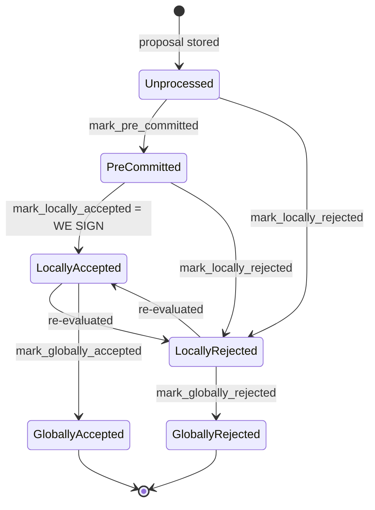

### Title
Stale approval weight is never reclaimed when a signer flips from Accepted to Rejected, corrupting the miner-side vote tally - (File: `stacks-node/src/nakamoto_node/stackerdb_listener.rs`)

### Summary
The `StackerDBListener` that the mining coordinator uses to tally signer votes accumulates `total_weight_approved` and `total_weight_rejected` in two independent counters keyed off a single shared `responded_signers` set, but the state machine in `stacks-signer` explicitly permits a signer to move from `LocallyAccepted` back to `LocallyRejected` on re-evaluation. When that reversal happens, the node-side listener silently drops the corrective rejection message and leaves the stale approval weight permanently counted, breaking the aggregated-weight-vs-verified-accepts equality the coordinator relies on to decide when a block is safe to finalize or abandon.

### Finding Description
`SignerDb::check_state` in `stacks-signer/src/signerdb.rs` explicitly allows a block to transition `LocallyAccepted -> LocallyRejected` ("re-evaluated") as long as the block has not yet reached a *global* state: [1](#0-0) 

This is also documented as a first-class transition in the signer flow docs, alongside the reverse `LocallyRejected -> LocallyAccepted`: [2](#0-1) 

On the miner/coordinator side, `StackerDBListener` tallies both branches into the same `BlockInfoStatus`, but the "already responded" guard that gates rejection counting is the *same* `responded_signers` set that acceptance handling populates:

- Accepted branch: adds weight only the first time the slot is unseen in `gathered_signatures`, then unconditionally marks the slot as `responded_signers`: [3](#0-2) 

- Rejected branch: only counts `total_weight_rejected` if `responded_signers.insert(slot_id)` returns `true` (i.e., first time seen): [4](#0-3) 

Because the Accepted branch already inserted the signer's `slot_id` into `responded_signers`, a subsequent legitimate `Rejected` message from the same signer (sent after the signer's own local re-evaluation flips `LocallyAccepted -> LocallyRejected`) finds `responded_signers.insert(slot_id)` returning `false`. The rejection is logged/stored for auditing but **never added to `total_weight_rejected`**, and — critically — nothing in this file ever subtracts the signer's weight from `total_weight_approved`, which was incremented earlier and is monotonic for the lifetime of the `BlockInfoStatus`: [5](#0-4) 

The coordinator (`signer_coordinator.rs`) makes its accept/reject/timeout decisions purely from these two counters: [6](#0-5) 

This is the direct analog of the FrankenDAO bug: an action meant to retract an earlier positive credit (`veto` should undo `proposalsPassed`/`proposalsCreated`; here, a signer's corrective rejection should undo their earlier phantom "accept" weight) fails to reverse the bookkeeping, leaving a stale credit in place.

### Impact Explanation
This breaks the "aggregated-weight vs verified-accepts" equality that the mining coordinator depends on: `total_weight_approved` can retain weight from a signer who has since rescinded acceptance and rejected the block, while `total_weight_rejected` under-counts that same signer's current, valid opinion. Depending on timing this can:
- Let the coordinator declare `total_weight_approved >= self.weight_threshold` (treat the block as signed/accepted) using phantom weight from a signer who no longer endorses the block, i.e., counting a rejection as an accept in the aggregate the miner acts on.
- Prevent the rejection-majority check (`total_weight_rejected + weight_threshold > total_weight`) from ever firing when it legitimately should, because the flipped signer's weight is stuck in the wrong bucket, potentially wedging the coordinator into waiting past the point it should have abandoned the block (a liveness/accounting wedge on the node side).

### Likelihood Explanation
Reaching this requires only a single signer (one-slot) whose local block state legitimately transitions `LocallyAccepted -> LocallyRejected` — a transition the signer state machine explicitly supports for re-evaluation — followed by that signer broadcasting its rejection over StackerDB. No majority, no other signer's key, and no malicious behavior on the signer's part are required; this can happen from ordinary re-evaluation logic (e.g., after learning of a conflicting signed block) that the codebase's own docs describe as a normal path.

### Recommendation
Track approval and rejection weight per-signer with a single source of truth (e.g., a `HashMap<slot_id, Vote>` instead of two independently-latched sets), so that when a signer's vote flips, the previous contribution is subtracted from the old bucket before/while adding it to the new bucket, keeping `total_weight_approved`/`total_weight_rejected` consistent with the *current* view of each signer's response rather than the first one ever seen.

### Proof of Concept
1. Signer S (weight w) validates and signs block B, broadcasting `BlockResponse::Accepted`. The coordinator's listener adds `w` to `total_weight_approved` and inserts S's slot into `responded_signers`. [3](#0-2) 
2. Before global consensus is reached on B, S's local block state re-evaluates (a `LocallyAccepted -> LocallyRejected` transition, which `check_state` permits) and S broadcasts `BlockResponse::Rejected` for the same block hash. [7](#0-6) 
3. The listener processes the rejection, but `responded_signers.insert(slot_id)` returns `false` (already inserted in step 1), so `total_weight_rejected` is not incremented for S, and `total_weight_approved` is never decremented anywhere in the file. [4](#0-3) 
4. The coordinator's threshold checks now operate on a `total_weight_approved` that still includes S's weight despite S's current rejection, and a `total_weight_rejected` that omits it — the aggregated tally no longer reflects the verified set of current accepts. [6](#0-5) 

Note: I could not trace, within the available iterations, the exact call site inside `stacks-signer/src/v0/signer.rs` that triggers a re-evaluation from an already-*signed* (`signed_self = Some`) `LocallyAccepted` block back to `LocallyRejected` and re-broadcasts a `Rejected` message (the state-machine permissiveness and the documented `signer-flows.md` transition are confirmed, but the precise trigger conditions for reversing after having personally produced a signature were not fully verified). This should be independently confirmed before treating the severity as fully proven end-to-end.

### Citations

**File:** stacks-signer/src/signerdb.rs (L313-329)
```rust
    /// Check if the block state transition is valid
    fn check_state(&self, state: BlockState) -> bool {
        let prev_state = &self.state;
        if *prev_state == state {
            return true;
        }
        match state {
            BlockState::Unprocessed => false,
            BlockState::LocallyAccepted | BlockState::LocallyRejected => !matches!(
                prev_state,
                BlockState::GloballyRejected | BlockState::GloballyAccepted
            ),
            BlockState::GloballyAccepted => !matches!(prev_state, BlockState::GloballyRejected),
            BlockState::GloballyRejected => !matches!(prev_state, BlockState::GloballyAccepted),
            BlockState::PreCommitted => matches!(prev_state, BlockState::Unprocessed),
        }
    }
```

**File:** docs/signer-flows.md (L137-150)
```markdown

```

**File:** stacks-node/src/nakamoto_node/stackerdb_listener.rs (L443-465)
```rust
                        if !block.gathered_signatures.contains_key(&slot_id) {
                            block.total_weight_approved = block
                                .total_weight_approved
                                .saturating_add(signer_entry.weight);

                            info!("StackerDBListener: Signature Added to block";
                                "signer_signature_hash" => %block_sighash,
                                "signer_pubkey" => signer_pubkey.to_hex(),
                                "signer_slot_id" => slot_id,
                                "signature" => %signature,
                                "signer_weight" => signer_entry.weight,
                                "total_weight_approved" => block.total_weight_approved,
                                "percent_approved" => block.total_weight_approved as f64 / self.total_weight as f64 * 100.0,
                                "total_weight_rejected" => block.total_weight_rejected,
                                "percent_rejected" => block.total_weight_rejected as f64 / self.total_weight as f64 * 100.0,
                                "weight_threshold" => self.weight_threshold,
                                "tenure_extend_timestamp" => tenure_extend_timestamp,
                                "read_count_extend_timestamp" => read_count_extend_timestamp,
                                "server_version" => metadata.server_version,
                            );
                        }
                        block.gathered_signatures.insert(slot_id, signature);
                        block.responded_signers.insert(slot_id);
```

**File:** stacks-node/src/nakamoto_node/stackerdb_listener.rs (L486-519)
```rust
                    SignerMessageV0::BlockResponse(BlockResponse::Rejected(rejected_data)) => {
                        let (lock, cvar) = &*self.blocks;
                        let mut blocks = lock.lock().expect("FATAL: failed to lock block status");

                        let Some(block) = blocks.get_mut(&rejected_data.signer_signature_hash)
                        else {
                            info!(
                                "StackerDBListener: Received rejection for block that we did not request. Ignoring.";
                                "signer_signature_hash" => %rejected_data.signer_signature_hash,
                                "slot_id" => slot_id,
                                "signer_set" => self.signer_set,
                            );
                            continue;
                        };

                        let rejected_pubkey = match rejected_data.recover_public_key() {
                            Ok(rejected_pubkey) => {
                                if rejected_pubkey != signer_pubkey {
                                    warn!("StackerDBListener: Recovered public key from rejected data does not match signer's public key. Ignoring.");
                                    continue;
                                }
                                rejected_pubkey
                            }
                            Err(e) => {
                                warn!("StackerDBListener: Failed to recover public key from rejected data: {e:?}. Ignoring.");
                                continue;
                            }
                        };

                        if block.responded_signers.insert(slot_id) {
                            block.total_weight_rejected = block
                                .total_weight_rejected
                                .saturating_add(signer_entry.weight);

```

**File:** stacks-node/src/nakamoto_node/signer_coordinator.rs (L509-546)
```rust
            if block_status
                .total_weight_rejected
                .saturating_add(self.weight_threshold)
                > self.total_weight
            {
                info!(
                    "{}/{} signer weight votes to reject block",
                    block_status.total_weight_rejected, self.total_weight;
                    "signer_signature_hash" => %block_signer_sighash,
                );
                counters.bump_naka_rejected_blocks();

                // Only act on failed txids that a blocking minority (>30% weight) agrees on
                let blocking_minority = self.total_weight.saturating_sub(self.weight_threshold);
                let mut temporarily_excluded_txids = HashSet::new();
                let mut permanently_excluded_txids = HashSet::new();
                for (txid, info) in &block_status.failed_txids {
                    if info.total_weight > blocking_minority {
                        // Do not perma ban txids that only a small minority of signers reported as problematic
                        // But make sure its removed from the next block proposal
                        if info.problematic_weight > blocking_minority {
                            permanently_excluded_txids.insert(txid.clone());
                        } else {
                            temporarily_excluded_txids.insert(txid.clone());
                        }
                    }
                }

                return Err(NakamotoNodeError::SignersRejected {
                    temporarily_excluded_txids,
                    permanently_excluded_txids,
                });
            } else if block_status.total_weight_approved >= self.weight_threshold {
                info!("Received enough signatures, block accepted";
                    "signer_signature_hash" => %block_signer_sighash,
                );
                return Ok(block_status.gathered_signatures.values().cloned().collect());
            } else if rejections_timer.elapsed() > *rejections_timeout {
```
