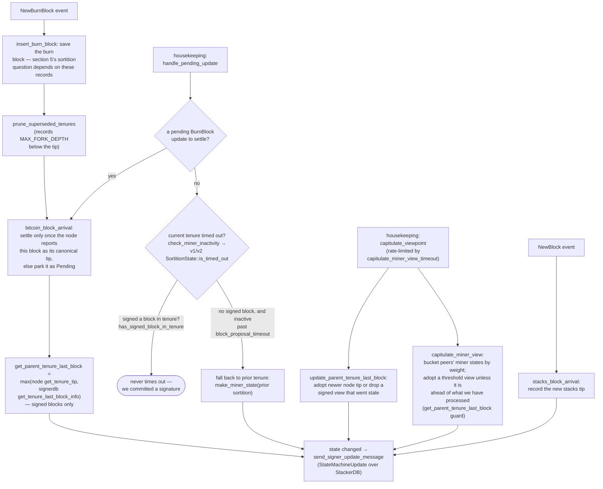

### Title
Signer signs a block whose canonical-miner identity was validated only at proposal time and never re-checked before the irreversible signature — ([File: stacks-signer/src/v0/signer.rs])

### Summary
The v2 (global-state) chainstate check `GlobalStateView::check_proposal` in `stacks-signer/src/chainstate/v2.rs` is the only place that verifies a proposed block's `consensus_hash` and recovered miner public-key hash still match the signer's *current* active-miner view (`current_miner_pkh`, `tenure_id`), and that the PoX bitvec/tenure-extend rules hold. This function runs exactly once, when a proposal first arrives, via `Signer::check_block_against_state` → `check_block_against_global_state`. [1](#0-0) [2](#0-1) 

Between that check and the moment the signer actually produces its signature (the irreversible act), two later checkpoints exist — `handle_block_validate_ok` (after the node's async validation) and the pre-commit RECHECK before signing at ≥70% weight — but both call only `check_block_against_signer_db_state`, which the code itself documents as an *incomplete* check ("Do NOT call this function PRIOR to check_proposal or block_proposal validation succeeds"), limited to tenure-parent/last-block freshness. [3](#0-2) [4](#0-3) 

This is the same bug class as the Koel SSRF report: a security check (`SafeUrl`/`HasAudioContentType` there; canonical-miner/pubkey/consensus-hash check here) is enforced on the "create" path but silently dropped on the other reachable paths that lead to the same sensitive sink (streaming there; signing here).

### Finding Description
`docs/signer-flows.md` explicitly documents the gap: "Two things belong to the proposal path only and are **not** re-run at validate-ok or at signing: … the v2 `check_proposal` wrapper checks miner pubkey hash, consensus hash, the pox bitvec, and tenure-extend rules before delegating here." [5](#0-4) 

Walking the code confirms this:

1. **Proposal arrival** — `handle_block_proposal` calls `check_block_against_state`, which for v2 delegates to `check_block_against_global_state` → `GlobalStateView::check_proposal`. This is where `consensus_hash == tenure_id`, `miner_pkh == current_miner_pkh`, and `bitvec_all_1s` are enforced. [6](#0-5) [7](#0-6) 

2. **Validate-ok recheck** — once the node's async `/v3/block_proposal` validation returns OK, `handle_block_validate_ok` re-checks the DB state via `check_block_against_signer_db_state`, then marks the block `mark_pre_committed` and broadcasts a pre-commit. This recheck function only calls `check_tenure_change_confirms_parent` / `check_latest_block_in_tenure`, not `check_proposal`. [8](#0-7) [9](#0-8) 

3. **Signing at threshold** — per the documented flow, the RECHECK immediately before the signer actually signs (`mark_locally_accepted`) is the same `check_block_against_signer_db_state`, again omitting the miner-pubkey/consensus-hash/bitvec/tenure-extend checks. [10](#0-9) 

Between step 1 and step 3, meaningful time passes: the signer must wait for its own node's async validation, then for ≥70% of pre-commit weight from peers. During that window, the signer's own state machine legitimately advances — `capitulate_viewpoint`, `handle_pending_update`, and burn-block arrival processing (section 8 of the flow doc) can update `current_miner`/`tenure_id` in `local_state_machine` / `global_state_evaluator` as new burn blocks and `StateMachineUpdate`s are observed, entirely as part of normal single-miner-plus-gossip operation (no signer majority collusion required — this is routine tenure/sortition progression). [11](#0-10) [12](#0-11) 

If the active-miner view moves on (e.g., the tenure being signed times out and the signer falls back to a prior/other tenure state, or a new sortition elects a different miner) while a previously pre-committed block for the *old* view still accumulates pre-commit weight from slower peers, this signer's own re-verification before the actual signature never re-asks "does this block's consensus_hash/miner pubkey still match my current canonical miner view?" — because that question lives solely inside `check_proposal`, which is skipped at this stage. The only thing checked is whether the block is the tenure's *latest* block by height (`check_latest_block_in_tenure`), not whether the tenure/miner is still the one the state machine currently endorses as canonical.

### Impact Explanation
This breaks the "approved-parent vs canonical" / "signed vs validated" equality that the whole two-round (pre-commit → sign) design exists to protect, per the design note in the docs itself: "Between validation and threshold, we may have signed a *different* block at the same height, possibly in another tenure, so the world must be re-checked before the signature leaves the box." [13](#0-12)  The re-check that actually runs (`check_block_against_signer_db_state`) covers height/tenure-parent conflicts but not the canonical-miner identity checks from `check_proposal`. A signature is the one irreversible act in this whole protocol; producing it over a block whose miner/tenure is no longer the signer's own current canonical view is exactly the "signer signing a non-canonical block" class called out as Critical in scope.

### Likelihood Explanation
No majority collusion or malicious signer key is required. This can occur purely from the routine asynchronous timing of the existing protocol: node-validation round-trip time plus waiting for peer pre-commits, combined with normal burn-chain/tenure-state advancement that is already modeled as legitimate in `signer_state.rs`/`chainstate` (`capitulate_viewpoint`, `handle_pending_update`, tenure timeout fallback). The gap is also explicitly acknowledged in the project's own documentation for the duplicate-block case (and left unaddressed for the pubkey/consensus-hash/bitvec/tenure-extend case), indicating this is a known blind spot rather than a theoretical one. [5](#0-4) 

### Recommendation
Re-run (or a sufficient subset of) `GlobalStateView::check_proposal`'s canonical-miner checks — at minimum the `consensus_hash`/`tenure_id` match and the recovered miner pubkey-hash match against the *current* `current_miner` view — inside `check_block_against_signer_db_state`, or explicitly re-invoke `check_proposal` immediately before `mark_pre_committed` (validate-ok path) and immediately before `mark_locally_accepted` (pre-commit threshold path), so that a block whose miner/tenure has fallen out of the signer's current canonical view cannot slip through to a signature purely because it was canonical at proposal time.

### Proof of Concept
Conceptual timing PoC (no majority signer collusion, only natural protocol timing + burn-chain progression):
1. Miner M proposes block B for tenure T. Signer S's `current_miner` matches (M, T); `check_proposal` passes; S submits B to its node for validation.
2. While S awaits its node's async response, tenure T times out on S's local state machine (`check_miner_inactivity`/fallback in section 8) or a new sortition elects a different miner M′ for a new tenure T′, updating S's `current_miner` to (M′, T′).
3. S's node validation for B returns OK; `handle_block_validate_ok` runs `check_block_against_signer_db_state` only — this does not compare B's consensus_hash/miner pubkey against the now-updated `current_miner`, so it can still pass (B is still the tenure's latest known block by height) → S marks B `PreCommitted` and pre-commits.
4. Enough slower peers, still on the stale view, cross 70% pre-commit weight on B. S's pre-commit RECHECK again runs only `check_block_against_signer_db_state`, not `check_proposal`, and S signs B (`mark_locally_accepted`) even though B is no longer canonical per S's own current miner/tenure view.

I could not execute this against a running signer network to observe concrete log output (no runtime access in this environment); the analysis above is based on tracing the exact call graph and the project's own documentation of the gap in `docs/signer-flows.md`.

### Citations

**File:** stacks-signer/src/chainstate/v2.rs (L111-174)
```rust
impl GlobalStateView {
    /// Apply checks from the signer state machine on the block proposal.
    pub fn check_proposal(
        &self,
        client: &StacksClient,
        signer_db: &mut SignerDb,
        block: &NakamotoBlock,
    ) -> Result<(), RejectReason> {
        let MinerState::ActiveMiner {
            current_miner_pkh,
            tenure_id,
            parent_tenure_id,
            ..
        } = &self.signer_state.current_miner
        else {
            info!(
                "No valid current miner. Considering invalid.";
                "block_height" => block.header.chain_length,
                "signer_signature_hash" => %block.header.signer_signature_hash()
            );
            return Err(RejectReason::InvalidMiner);
        };
        if &block.header.consensus_hash != tenure_id {
            info!("Miner block proposal consensus hash does not match the current miner's tenure id. Considering invalid.";
                "block_height" => block.header.chain_length,
                "signer_signature_hash" => %block.header.signer_signature_hash(),
                "block_consensus_hash" => %block.header.consensus_hash,
                "active_miner_tenure_id" => %tenure_id,
                "active_miner_parent_tenure_id" => %parent_tenure_id,
            );
            return Err(RejectReason::ConsensusHashMismatch {
                actual: block.header.consensus_hash.clone(),
                expected: tenure_id.clone(),
            });
        }
        let Some(miner_pk) = block.header.recover_miner_pk() else {
            warn!("Failed to recover miner pubkey";
                  "signer_signature_hash" => %block.header.signer_signature_hash(),
                  "consensus_hash" => %block.header.consensus_hash);
            return Err(RejectReason::IrrecoverablePubkeyHash);
        };
        let miner_pkh = Hash160::from_data(&miner_pk.to_bytes_compressed());
        if current_miner_pkh != &miner_pkh {
            warn!(
                "Miner block proposal pubkey does not match the winning pubkey hash for its sortition. Considering invalid.";
                "proposed_block_consensus_hash" => %block.header.consensus_hash,
                "signer_signature_hash" => %block.header.signer_signature_hash(),
                "proposed_block_pubkey" => &miner_pk.to_hex(),
                "proposed_block_pubkey_hash" => %miner_pkh,
                "active_miner_pubkey_hash" => %current_miner_pkh,
            );
            return Err(RejectReason::PubkeyHashMismatch);
        }
        let bitvec_all_1s = block.header.pox_treatment.iter().all(|entry| entry);
        if !bitvec_all_1s {
            warn!(
                "Miner block proposal has bitvec field which punishes in disagreement with signer. Considering invalid.";
                "proposed_block_consensus_hash" => %block.header.consensus_hash,
                "signer_signature_hash" => %block.header.signer_signature_hash(),
                "active_miner_consensus_hash" => ?tenure_id,
                "active_miner_parent_consensus_hash" => ?parent_tenure_id,
            );
            return Err(RejectReason::InvalidBitvec);
        }
```

**File:** stacks-signer/src/v0/signer.rs (L344-369)
```rust
        let mut prior_state = self.local_state_machine.clone();
        let local_signer_protocol_version = self.get_signer_protocol_version();
        if self.reward_cycle <= current_reward_cycle {
            self.local_state_machine.handle_pending_update(&mut self.signer_db, stacks_client,
                &self.proposal_config,
                &mut self.tx_replay_scope, &self.global_state_evaluator, local_signer_protocol_version)
                .unwrap_or_else(|e| error!("{self}: failed to update local state machine for pending update"; "err" => ?e));
        }
        // See if we should capitulate our viewpoint...
        self.local_state_machine.capitulate_viewpoint(
            stacks_client,
            &mut self.signer_db,
            &mut self.global_state_evaluator,
            local_signer_protocol_version,
            sortition_state,
            self.capitulate_miner_view_timeout,
            self.proposal_config.tenure_last_block_proposal_timeout,
            &mut self.last_capitulate_miner_view,
        );

        if prior_state != self.local_state_machine {
            let version = self.get_signer_protocol_version();
            self.local_state_machine
                .send_signer_update_message(&mut self.stackerdb, version);
            prior_state = self.local_state_machine.clone();
        }
```

**File:** stacks-signer/src/v0/signer.rs (L1670-1680)
```rust
        // Check if proposal can be rejected now if not valid against sortition view
        let block_rejection =
            self.check_block_against_state(stacks_client, sortition_state, &block_info);

        #[cfg(any(test, feature = "testing"))]
        let block_rejection =
            self.test_reject_block_proposal(block_proposal, &mut block_info, block_rejection);

        if let Some(block_rejection) = block_rejection {
            // We know proposal is invalid. Send rejection message, do not do further validation and do not store it.
            self.send_block_response(&block_info.block, block_rejection.into());
```

**File:** stacks-signer/src/v0/signer.rs (L1799-1850)
```rust
    /// WARNING: This is an incomplete check. Do NOT call this function PRIOR to check_proposal or block_proposal validation succeeds.
    ///
    /// Re-verify a block's chain length against the last signed block within signerdb.
    /// This is required in case a block has been approved since the initial checks of the block validation endpoint.
    fn check_block_against_signer_db_state(
        &mut self,
        stacks_client: &StacksClient,
        proposed_block: &NakamotoBlock,
    ) -> Option<BlockRejection> {
        let signer_signature_hash = proposed_block.header.signer_signature_hash();
        // If this is a tenure change block, ensure that it confirms the correct number of blocks from the parent tenure.
        if let Some(tenure_change) = proposed_block.get_tenure_change_tx_payload() {
            // Ensure that the tenure change block confirms the expected parent block
            match SortitionData::check_tenure_change_confirms_parent(
                tenure_change,
                proposed_block,
                &mut self.signer_db,
                stacks_client,
                self.proposal_config.tenure_last_block_proposal_timeout,
                self.proposal_config.reorg_attempts_activity_timeout,
            ) {
                Ok(true) => return None,
                Ok(false) => {
                    return Some(self.create_block_rejection(
                        RejectReason::SortitionViewMismatch,
                        proposed_block,
                    ))
                }
                Err(e) => {
                    warn!("{self}: Error checking block proposal: {e}";
                        "signer_signature_hash" => %signer_signature_hash,
                        "block_id" => %proposed_block.block_id()
                    );
                    return Some(self.create_block_rejection(
                        RejectReason::ConnectivityIssues(
                            "error checking block proposal".to_string(),
                        ),
                        proposed_block,
                    ));
                }
            }
        }

        // Ensure that the block is the last block in the chain of its current tenure.
        match SortitionData::check_latest_block_in_tenure(
            &proposed_block.header.consensus_hash,
            proposed_block,
            &mut self.signer_db,
            stacks_client,
            self.proposal_config.tenure_last_block_proposal_timeout,
            self.proposal_config.reorg_attempts_activity_timeout,
        ) {
```

**File:** stacks-signer/src/v0/signer.rs (L1941-1984)
```rust
        if !block_info.check_static_valid_block() {
            debug!("{self}: Block is syntatically invalid; will not store");
            return;
        }

        if let Some(block_rejection) =
            self.check_block_against_signer_db_state(stacks_client, &block_info.block)
        {
            // The signer db state has changed. We no longer view this block as valid. Override the validation response.
            if let Err(e) = block_info.mark_locally_rejected() {
                if !block_info.has_reached_consensus() {
                    warn!("{self}: Failed to mark block as locally rejected: {e:?}");
                }
            };
            self.signer_db
                .insert_block(&block_info)
                .unwrap_or_else(|e| self.handle_insert_block_error(e));
            self.handle_block_rejection(&block_rejection, sortition_state);
            self.send_block_response(&block_info.block, block_rejection.into());
        } else {
            if let Err(e) = block_info.mark_pre_committed() {
                // The block may have reached enough signatures before we validated the block so should fail to mark pre-committed
                // but still call to make sure the timestamps and validity are updated correctly.
                if !block_info.has_reached_consensus()
                    && block_info.state != BlockState::LocallyAccepted
                {
                    warn!("{self}: Failed to mark block as approved: {e:?}",);
                    return;
                }
            }

            self.signer_db
                .insert_block(&block_info)
                .unwrap_or_else(|e| self.handle_insert_block_error(e));
            self.send_block_pre_commit(signer_signature_hash.clone());
            // have to save the signature _after_ the block info
            let address = self.stacks_address.clone();
            self.handle_block_pre_commit(
                stacks_client,
                sortition_state,
                &address,
                signer_signature_hash,
            );
        }
```

**File:** docs/signer-flows.md (L229-236)
```markdown
## 5. Pre-commit threshold → signature

The only place the signer produces a block signature by counting votes.
Pre-commits from peers (and our own) accumulate; at ≥70% weight the signer
decides whether to follow through. Between validation and threshold, we may have
signed a _different_ block at the same height, possibly in another tenure, so
the world must be re-checked before the signature leaves the box.

```

**File:** docs/signer-flows.md (L246-268)
```markdown
    VALID -- yes --> TH{"pre-commit weight ≥ 70%?<br/>NakamotoBlockHeader::<br/>compute_voting_weight_threshold"}
    TH -- no --> N3(["wait for more pre-commits"])
    TH -- yes --> RECHECK{"chainstate checks still pass?<br/>check_block_against_signer_db_state<br/>→ section 7"}
    RECHECK -- no --> REJ["mark_locally_rejected,<br/>handle_block_rejection,<br/>broadcast rejection"]:::bad
    RECHECK -- yes --> CONF["signed conflicts at height ≥ h,<br/>in ANY tenure<br/>get_signed_conflicts"]
    CONF --> PERM{"covered by a reorg permit whose<br/>permitting sortition is still canonical?<br/>reorg_permit_stands"}
    PERM -- yes --> EXCL(["excluded — our signature must not<br/>block a replacement we sanctioned"]):::good
    PERM -- no --> FRESH{"any of them still fresh?<br/>last_endorsed > cutoff"}
    FRESH -- yes --> SORT{"conflict_still_blocks, question 1:<br/>is its tenure's sortition still on the<br/>canonical burn chain?<br/>get_sortition_by_burn_hash"}
    SORT -- "404, with the node's burnchain tip<br/>at or past the burn block — a fork<br/>orphaned the tenure" --> OWN
    SORT -- "canonical, or we never<br/>saved its burn block" --> LIVE{"question 2: does the node's chain<br/>still reach the block itself?<br/>get_tenure_tip(its tenure)"}
    SORT -- "could not ask, or 404 with the<br/>node's tip still below the burn block" --> HOLD1
    LIVE -- "yes — real chain state" --> HOLD1["refuse to sign for now<br/>(may sign once conflict is stale)"]:::hold
    LIVE -- "no, and it was<br/>globally accepted" --> OWN
    LIVE -- "no, only locally accepted<br/>— but above this height" --> OWN
    LIVE -- "no, only locally accepted<br/>and a sibling at this height" --> HOLD1
    LIVE -- "could not ask" --> HOLD1
    FRESH -- "no — all stale" --> OWN{"a conflict in this block's<br/>OWN tenure?"}
    OWN -- yes --> TIP{"own tenure confirmed<br/>at ≥ this height?<br/>get_tenure_tip(own tenure)"}
    TIP -- yes --> HOLD2["refuse to sign"]:::hold
    TIP -- "no — never confirmed" --> SIGN
    TIP -- "node unreachable" --> SIGN
    OWN -- no --> SIGN["SIGN: mark_locally_accepted,<br/>handle_block_signature,<br/>broadcast acceptance"]:::good
```

**File:** docs/signer-flows.md (L425-437)
```markdown
Two things belong to the proposal path only and are **not** re-run at validate-ok
or at signing:

- `validate_tenure_change_payload` rejects with `DuplicateBlockFound` when we
  have already accepted a block in the tenure a tenure-change block is starting.
  v2 counts locally or globally accepted blocks (`get_last_signed_block`); v1
  counts only globally accepted ones (`get_last_globally_accepted_block`).
- the v2 `check_proposal` wrapper checks miner pubkey hash, consensus hash, the
  pox bitvec, and tenure-extend rules before delegating here.

Because the duplicate check never runs again, a block that crosses the pre-commit
threshold long after it was proposed relies on section 5's own-tenure conflict
guard to cover the same ground.
```

**File:** docs/signer-flows.md (L450-476)
```markdown
## 8. Burn blocks & the miner-view state machine

Independent of any single block, the signer maintains a view of _who the current
miner is and what they should build on_, and broadcasts it as a
`StateMachineUpdate`. The whole miner state, including
`parent_tenure_last_block`, is the equality key for global agreement, so what
this flow computes is consensus-visible.


```
