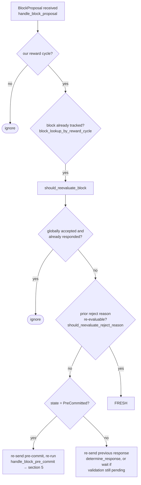

## Finding: Stale rejection weight is never cleared when a signer's vote flips from Reject to Accept, letting the node-side coordinator discard an already-approved block

### Summary
In `stacks-node/src/nakamoto_node/stackerdb_listener.rs`, the `BlockStatus` tracked per-proposal keeps two independent bookkeeping structures — `gathered_signatures` (keyed by slot, gates `total_weight_approved`) and `responded_signers` (keyed by slot, gates `total_weight_rejected`) — that are not kept consistent with each other. A signer whose *first* message for a given block is a rejection, and whose *second* message is a later acceptance (a state transition the signer-side state machine explicitly allows via `BlockInfo::check_state`), has its weight added to `total_weight_rejected` on the first message and then *also* added to `total_weight_approved` on the second message, with the rejected weight never removed. `SignerCoordinator::get_block_status` checks the rejected-weight condition before the approved-weight condition, so this stale rejected weight can cause the coordinator to treat an already-signed/approved block as globally rejected.

### Finding Description
`stacks-node/src/nakamoto_node/stackerdb_listener.rs` maintains, per `signer_signature_hash`, a `BlockStatus`: [1](#0-0) 

On an `Accepted` message, the weight-add guard is `!block.gathered_signatures.contains_key(&slot_id)`: [2](#0-1) 

On a `Rejected` message, the weight-add guard is the *different* structure `block.responded_signers.insert(slot_id)`: [3](#0-2) 

Because these are two separate sets/maps, the two code paths are not mutually exclusive for the same `slot_id`:
- If the signer's first message is **Reject**: `responded_signers.insert(slot_id)` succeeds → `total_weight_rejected += weight`.
- If that same signer later sends **Accept** for the same block: `gathered_signatures.contains_key(slot_id)` is still `false` (never touched by the reject path) → `total_weight_approved += weight` as well, with no corresponding decrement of `total_weight_rejected`.

The result is that a single signer's weight ends up counted in *both* aggregate buckets simultaneously — breaking the invariant that `total_weight_approved + total_weight_rejected` reflects only currently-held, non-overlapping opinions.

This vote flip is not a hypothetical: the signer-side state machine explicitly permits a block to move from `LocallyRejected` to `LocallyAccepted` (any local state is reachable from any non-terminal state): [4](#0-3) 

and the proposal-arrival flow explicitly re-evaluates a previously-rejected block when the reject reason becomes re-evaluable (`should_reevaluate_reject_reason`), which is exactly the mechanism that produces a genuine Reject-then-Accept sequence for the same `signer_signature_hash`: [5](#0-4) 

`SignerCoordinator::get_block_status` (node side) checks the rejected condition *before* the approved condition: [6](#0-5) 

so once `total_weight_rejected` (stuck with the stale, superseded weight) crosses the blocking-minority threshold, the coordinator returns `NakamotoNodeError::SignersRejected` and discards the block — even if, at that same moment, `total_weight_approved` has legitimately reached the 70% threshold, because the flipped signer's weight is present in both counters.

Note the asymmetric direction: Accept-then-Reject is *not* vulnerable, because the accept path unconditionally inserts into `responded_signers` too (`block.responded_signers.insert(slot_id);` at line 465), so a later reject from the same signer is blocked by that guard. Only the Reject-then-Accept ordering leaks.

### Impact Explanation
This is a liveness wedge triggerable by a single signer's ordinary state transition, requiring no majority: it can cause the node's block-proposal coordinator to permanently misclassify a block as globally rejected (bumping `naka_rejected_blocks`, discarding the proposal, excluding "problematic" txids) even though the same or a greater weight of signers currently approves it. Because the rejected weight is never decremented, the miner may be forced to abandon and re-propose a block that in fact already carries enough current acceptances, stalling tenure progress. This matches the "aggregated-weight vs verified-accepts" equality break called out as in-scope: the aggregated `total_weight_rejected` figure no longer reflects the verified set of signers who currently hold that opinion.

### Likelihood Explanation
Reject-then-Accept for the same `signer_signature_hash` is a normal, protocol-sanctioned path (not an attack-only construct): the signer-side flow explicitly re-evaluates and can flip a prior rejection to acceptance once the reject reason is no longer applicable (`should_reevaluate_reject_reason`, `BlockInfo::check_state` allowing `LocallyRejected → LocallyAccepted`). Any signer — misbehaving or just running the normal, documented reconsideration logic — can produce the exact two-message sequence that triggers the double count purely by broadcasting two ordinary `BlockResponse` StackerDB messages for the same block.

### Recommendation
Track approved/rejected weight from a single per-slot "current vote" record instead of two independently-updated structures, e.g. store the signer's latest verdict (`Accepted`/`Rejected`) per slot and recompute `total_weight_approved`/`total_weight_rejected` by folding over that single map, removing the previous contribution whenever a slot's verdict changes. Alternatively, when handling `Accepted`, explicitly check and subtract any previously counted rejected weight for that `slot_id` (and vice versa for `Rejected`) before adding the new weight.

### Proof of Concept
1. Node starts a block proposal round with signer weights and `weight_threshold` = 70% of `total_weight`, and slot `S` (weight `w_S`) among the signer set.
2. Signer at slot `S` sends `BlockResponse::Rejected` for the block's `signer_signature_hash`. In `stackerdb_listener.rs`, `responded_signers.insert(S)` succeeds, `total_weight_rejected += w_S`.
3. The signer subsequently re-evaluates (e.g., the reason that caused rejection becomes stale/re-evaluable per `should_reevaluate_reject_reason`) and sends `BlockResponse::Accepted` for the *same* `signer_signature_hash`.
4. In `stackerdb_listener.rs`'s Accept branch, `gathered_signatures.contains_key(S)` is `false` (never set by the reject branch), so `total_weight_approved += w_S` is also applied.
5. Now suppose the remaining signers' weight already sums to just under `weight_threshold` for approvals and just over the blocking minority for `total_weight_rejected` (using `w_S` counted in both). `SignerCoordinator::get_block_status` evaluates the rejected branch first and returns `NakamotoNodeError::SignersRejected`, discarding a block that, by distinct-signer weight, actually has ≥70% current approval once `S`'s flip is properly accounted for.

### Citations

**File:** stacks-node/src/nakamoto_node/stackerdb_listener.rs (L70-82)
```rust
#[derive(Debug, Clone)]
pub struct BlockStatus {
    /// Set of the slot ids of signers who have responded
    pub responded_signers: HashSet<u32>,
    /// Map of the slot id of signers who have signed the block and their signature
    pub gathered_signatures: BTreeMap<u32, MessageSignature>,
    /// Total weight of signers who have signed the block
    pub total_weight_approved: u32,
    /// Total weight of signers who have rejected the block
    pub total_weight_rejected: u32,
    /// Per-txid rejection tracking from signers
    pub failed_txids: HashMap<Txid, FailedTxInfo>,
}
```

**File:** stacks-node/src/nakamoto_node/stackerdb_listener.rs (L443-465)
```rust
                        if !block.gathered_signatures.contains_key(&slot_id) {
                            block.total_weight_approved = block
                                .total_weight_approved
                                .saturating_add(signer_entry.weight);

                            info!("StackerDBListener: Signature Added to block";
                                "signer_signature_hash" => %block_sighash,
                                "signer_pubkey" => signer_pubkey.to_hex(),
                                "signer_slot_id" => slot_id,
                                "signature" => %signature,
                                "signer_weight" => signer_entry.weight,
                                "total_weight_approved" => block.total_weight_approved,
                                "percent_approved" => block.total_weight_approved as f64 / self.total_weight as f64 * 100.0,
                                "total_weight_rejected" => block.total_weight_rejected,
                                "percent_rejected" => block.total_weight_rejected as f64 / self.total_weight as f64 * 100.0,
                                "weight_threshold" => self.weight_threshold,
                                "tenure_extend_timestamp" => tenure_extend_timestamp,
                                "read_count_extend_timestamp" => read_count_extend_timestamp,
                                "server_version" => metadata.server_version,
                            );
                        }
                        block.gathered_signatures.insert(slot_id, signature);
                        block.responded_signers.insert(slot_id);
```

**File:** stacks-node/src/nakamoto_node/stackerdb_listener.rs (L515-518)
```rust
                        if block.responded_signers.insert(slot_id) {
                            block.total_weight_rejected = block
                                .total_weight_rejected
                                .saturating_add(signer_entry.weight);
```

**File:** stacks-signer/src/signerdb.rs (L313-329)
```rust
    /// Check if the block state transition is valid
    fn check_state(&self, state: BlockState) -> bool {
        let prev_state = &self.state;
        if *prev_state == state {
            return true;
        }
        match state {
            BlockState::Unprocessed => false,
            BlockState::LocallyAccepted | BlockState::LocallyRejected => !matches!(
                prev_state,
                BlockState::GloballyRejected | BlockState::GloballyAccepted
            ),
            BlockState::GloballyAccepted => !matches!(prev_state, BlockState::GloballyRejected),
            BlockState::GloballyRejected => !matches!(prev_state, BlockState::GloballyAccepted),
            BlockState::PreCommitted => matches!(prev_state, BlockState::Unprocessed),
        }
    }
```

**File:** docs/signer-flows.md (L166-184)
```markdown
The miner broadcasts a proposal. If we've seen this exact block before,
`should_reevaluate_block` decides whether the old verdict stands; a block we
only pre-committed to is deliberately routed back through the pre-commit
evaluation so a re-proposal cannot shortcut to a signature. A fresh proposal is
checked against our view of the world _before_ spending a node validation on it.



**File:** stacks-node/src/nakamoto_node/signer_coordinator.rs (L509-545)
```rust
            if block_status
                .total_weight_rejected
                .saturating_add(self.weight_threshold)
                > self.total_weight
            {
                info!(
                    "{}/{} signer weight votes to reject block",
                    block_status.total_weight_rejected, self.total_weight;
                    "signer_signature_hash" => %block_signer_sighash,
                );
                counters.bump_naka_rejected_blocks();

                // Only act on failed txids that a blocking minority (>30% weight) agrees on
                let blocking_minority = self.total_weight.saturating_sub(self.weight_threshold);
                let mut temporarily_excluded_txids = HashSet::new();
                let mut permanently_excluded_txids = HashSet::new();
                for (txid, info) in &block_status.failed_txids {
                    if info.total_weight > blocking_minority {
                        // Do not perma ban txids that only a small minority of signers reported as problematic
                        // But make sure its removed from the next block proposal
                        if info.problematic_weight > blocking_minority {
                            permanently_excluded_txids.insert(txid.clone());
                        } else {
                            temporarily_excluded_txids.insert(txid.clone());
                        }
                    }
                }

                return Err(NakamotoNodeError::SignersRejected {
                    temporarily_excluded_txids,
                    permanently_excluded_txids,
                });
            } else if block_status.total_weight_approved >= self.weight_threshold {
                info!("Received enough signatures, block accepted";
                    "signer_signature_hash" => %block_signer_sighash,
                );
                return Ok(block_status.gathered_signatures.values().cloned().collect());
```
