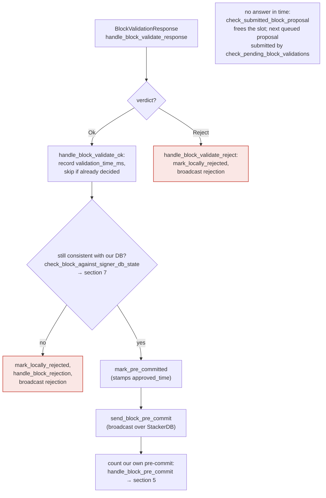

## Analysis

The AVideo bug class is CWE-306 (missing authentication on a state-changing callback endpoint). The strongest analog in-scope is the stacks-signer's own inbound event HTTP server, which the stacks-node is supposed to POST validation callbacks to, but which performs **no authentication or origin check whatsoever** before trusting the payload and feeding it into the signer's state machine.

`SignerEventReceiver::next_event` in `libsigner/src/events.rs` accepts any POST to `/proposal_response`, `/stackerdb_chunks`, `/new_burn_block`, or `/new_block` and deserializes it straight into a `SignerEvent` with zero credential/token/IP check: [1](#0-0) 

`process_event` similarly reads the body, ACKs, and deserializes with no auth gate: [2](#0-1) 

The `auth_token`/`auth_password` pairing documented in the sample configs only secures the *outbound* direction (signer → node `/v3/block_proposal`), never the *inbound* listener the node uses to POST results back: [3](#0-2) [4](#0-3) 

Sample configs bind this listener to all interfaces (`0.0.0.0:30000`), and the code itself carries a warning acknowledging the risk of exposure without further hardening, but implements none: [5](#0-4) [6](#0-5) 

A forged `BlockValidateResponse::Reject` delivered to `/proposal_response` is dispatched unconditionally to `handle_block_validate_reject`, which sets `block_info.valid = Some(false)` and moves the block to `LocallyRejected`: [7](#0-6) 

Because `handle_block_validate_ok` bails out once `block_info.valid.is_some()`, the genuine, later-arriving `Ok` verdict from the real stacks-node is discarded and logged as a duplicate: [8](#0-7) 

### Title
Unauthenticated Signer Event Listener Allows Forged Block-Validation Callbacks to Wedge a Signer - (`libsigner/src/events.rs`)

### Summary
The `SignerEventReceiver` HTTP listener that the stacks-node uses to push `BlockValidateResponse` (and other) events to a `stacks-signer` process performs no authentication of the caller. Any network-reachable party can POST a forged `/proposal_response` payload and have it processed by the signer's state machine exactly as if it came from the signer's own trusted node.

### Finding Description
`SignerEventReceiver::next_event` dispatches on URL path alone (`/proposal_response`, `/stackerdb_chunks`, `/new_burn_block`, `/new_block`, `/shutdown`) with no header/token check, and `process_event` deserializes the POST body directly into a `SignerEvent` [1](#0-0) [2](#0-1) . The `auth_token`/`auth_password` mechanism documented throughout the config samples secures only the signer's *outbound* calls to the node's `/v3/block_proposal` RPC [3](#0-2) ; nothing secures this *inbound* listener, and sample configs bind it on `0.0.0.0` [5](#0-4) .

`SignerEvent::BlockValidationResponse` flows straight into `handle_block_validate_response`, which routes to `handle_block_validate_ok`/`handle_block_validate_reject` based solely on the injected payload's `signer_signature_hash` [9](#0-8) . These handlers unconditionally set `block_info.valid` and transition `BlockState` [7](#0-6) , and both guard against *later* responses via `if block_info.valid.is_some() { ...ignore... }` [8](#0-7) [10](#0-9)  — but not against a *forged first* response. Whoever's callback lands first, real or fabricated, wins, and the real node's subsequent verdict is silently discarded as a duplicate.

This breaks the equality the whole flow depends on: "the signer's local `valid` decision equals the stacks-node's actual validation verdict," described as ground truth in the project's own signer-flow documentation [11](#0-10) .

### Impact Explanation
An attacker who can reach a signer's event-listener port can send a forged `BlockValidateReject` for a signature hash that the signer is currently, or about to be, waiting on real validation for. `handle_block_validate_reject` immediately marks the block `LocallyRejected` and broadcasts that rejection [12](#0-11) . When the real node's genuine `Ok` verdict later arrives for the same block, it is discarded because `block_info.valid` is already `Some(false)` [8](#0-7) . That signer is now permanently wedged for this block: it will never sign a block it itself already publicly rejected, matching the "High — a signer wedged into never signing valid blocks" impact category. The same mechanism can be used in the opposite direction (forged `Ok`) to make a signer's local `valid` flag diverge from what its own configured node actually decided, decoupling the signer's pre-commit/acceptance decision from the ground-truth validation it is supposed to be anchored to.

### Likelihood Explanation
No credentials, keys, or majority collusion are required — only network reachability to the signer's configured `endpoint`, which the shipped sample configs bind to `0.0.0.0` [5](#0-4) . The codebase itself only offers a runtime warning about this exposure risk, not an enforced control [13](#0-12) , and no code path in `libsigner/src/events.rs` inspects headers, tokens, or peer identity before trusting the payload.

### Recommendation
Require and verify a shared secret (the same `auth_token`/`auth_password` already defined for the outbound direction, or a dedicated one) on every inbound request to the `SignerEventReceiver` HTTP server before dispatching in `next_event`/`process_event`, rejecting unauthenticated requests with 401/403. Additionally, bind the listener to loopback by default and require explicit opt-in for non-local bind addresses.

### Proof of Concept
1. Identify a signer's event endpoint (default sample config: `0.0.0.0:30000`, path `/proposal_response`).
2. While the signer is waiting on a real validation for block `B` (submitted via `submitted_block_proposal`), send:
```
POST /proposal_response HTTP/1.1
Host: <signer_host>:30000
Content-Type: application/json
Content-Length: ...

{"result":"Reject","signer_signature_hash":"<B's hash>", "reason":"forged","reason_code":"...","...":"..."}
```
3. `handle_block_validate_reject` marks `B` `LocallyRejected` and broadcasts the rejection over StackerDB.
4. When the genuine `Ok` response for `B` arrives from the real stacks-node, `handle_block_validate_ok` logs "Already processed a block validate response... Ignoring validation response" and does nothing — the signer never signs `B`, even though its own node validated it as good.

### Citations

**File:** libsigner/src/events.rs (L413-459)
```rust
    fn next_event(&mut self) -> Result<SignerEvent<T>, EventError> {
        self.with_server(|event_receiver, http_server, _is_mainnet| {
            // were we asked to terminate?
            if event_receiver.is_stopped() {
                return Err(EventError::Terminated);
            }
            debug!("Request handling");
            let request = http_server.recv()?;
            debug!("Got request"; "method" => %request.method(), "path" => request.url());

            if request.url() == "/status" {
                request
                .respond(HttpResponse::from_string("OK"))
                .expect("response failed");
                return Ok(SignerEvent::StatusCheck);
            }

            if request.method() != &HttpMethod::Post {
                return Err(EventError::MalformedRequest(format!(
                    "Unrecognized method '{}'",
                    request.method(),
                )));
            }
            debug!("Processing {} event", request.url());
            if request.url() == "/stackerdb_chunks" {
                process_event::<T, StackerDBChunksEvent>(request)
            } else if request.url() == "/proposal_response" {
                process_event::<T, BlockValidateResponse>(request)
            } else if request.url() == "/new_burn_block" {
                process_event::<T, BurnBlockEvent>(request)
            } else if request.url() == "/shutdown" {
                event_receiver.stop_signal.store(true, Ordering::SeqCst);
                Err(EventError::Terminated)
            } else if request.url() == "/new_block" {
                process_event::<T, StacksBlockEvent>(request)
            } else {
                let url = request.url().to_string();
                debug!(
                    "[{:?}] next_event got request with unexpected url {}, return OK so other side doesn't keep sending this",
                    event_receiver.local_addr,
                    url
                );
                ack_dispatcher(request);
                Err(EventError::UnrecognizedEvent(url))
            }
        })?
    }
```

**File:** libsigner/src/events.rs (L519-542)
```rust
fn process_event<T, E>(mut request: HttpRequest) -> Result<SignerEvent<T>, EventError>
where
    T: SignerEventTrait,
    E: serde::de::DeserializeOwned + TryInto<SignerEvent<T>, Error = EventError>,
{
    let mut body = String::new();

    if let Err(e) = request.as_reader().read_to_string(&mut body) {
        error!("Failed to read body: {:?}", &e);
        ack_dispatcher(request);
        return Err(EventError::MalformedRequest(format!(
            "Failed to read body: {:?}",
            e
        )));
    }
    // Regardless of whether we successfully deserialize, we should ack the dispatcher so they don't keep resending it
    ack_dispatcher(request);
    let json_event: E = serde_json::from_slice(body.as_bytes())
        .map_err(|e| EventError::Deserialize(format!("Could not decode body to JSON: {:?}", e)))?;

    let signer_event: SignerEvent<T> = json_event.try_into()?;

    Ok(signer_event)
}
```

**File:** stackslib/src/config/mod.rs (L3802-3816)
```rust
    /// HTTP auth password to use when communicating with stacks-signer binary.
    ///
    /// This token is used in the `Authorization` header for certain requests.
    /// Primarily, it secures the communication channel between this node and a
    /// connected `stacks-signer` instance.
    ///
    /// It is also used to authenticate requests to `/v2/blocks?broadcast=1`.
    /// ---
    /// @default: `None` (authentication disabled for relevant endpoints)
    /// @notes:
    ///   - This field **must** be configured if the node needs to receive
    ///     block proposals from a configured `stacks-signer` [[events_observer]]
    ///     via the `/v3/block_proposal` endpoint.
    ///   - The value must match the token configured on the signer.
    pub auth_token: Option<String>,
```

**File:** sample/conf/signer/mainnet-signer-conf.toml (L37-50)
```text
# REQUIRED: Local endpoint this signer listens on for events from the node.
# Must match the endpoint in the node's [[events_observer]] section.
endpoint = "0.0.0.0:30000"

# REQUIRED: Network selection.
# Valid values: "mainnet", "testnet", "mocknet"
network = "mainnet"

# REQUIRED: Authorization password for the node's block proposal endpoint.
#
# WARNING: This MUST match the `auth_token` in the stacks-node's
# [connection_options] section. If they do not match, the signer
# cannot communicate with the node and will fail silently.
auth_password = "<YOUR_AUTH_PASSWORD>"
```

**File:** stacks-signer/src/lib.rs (L119-132)
```rust
impl<S: Signer<T> + Send + 'static, T: SignerEventTrait + 'static> SpawnedSigner<S, T> {
    /// Create a new spawned signer
    pub fn new(config: GlobalConfig) -> Self {
        let endpoint = config.endpoint;
        info!("Stacks signer version {:?}", VERSION_STRING.as_str());
        info!("Starting signer with config: {:?}", config);
        warn!(
            "Reminder: The signer is primarily designed for use with a local or subnet network stacks node. \
            It's important to exercise caution if you are communicating with an external node, \
            as this could potentially expose sensitive data or functionalities to security risks \
            if additional proper security checks are not integrated in place. \
            For more information, check the documentation at \
            https://docs.stacks.co/guides-and-tutorials/running-a-signer#preflight-setup"
        );
```

**File:** stacks-signer/src/v0/signer.rs (L1932-1944)
```rust
        if block_info.valid.is_some() {
            // We should only have valid set if we have already processed a validation response for this block OR we locally marked it as rejected
            // and responded to it. If we received a new proposal for it that we wished to consider, we would have reset valid to None.
            // This is only really possible when a signer is sharing a node or we have timed out a pending validation and it suddenly arrives.
            warn!(
                "{self}: Already processed a block validate response for block {}. Ignoring validation response.", block_info.block.header.signer_signature_hash(); "valid" => ?block_info.valid,
            );
            return;
        }
        if !block_info.check_static_valid_block() {
            debug!("{self}: Block is syntatically invalid; will not store");
            return;
        }
```

**File:** stacks-signer/src/v0/signer.rs (L1987-2050)
```rust
    /// Handle the block validate reject response
    fn handle_block_validate_reject(
        &mut self,
        block_validate_reject: &BlockValidateReject,
        sortition_state: &mut Option<SortitionsView>,
    ) {
        crate::monitoring::actions::increment_block_validation_responses(false);
        let signer_signature_hash = &block_validate_reject.signer_signature_hash;
        if self
            .submitted_block_proposal
            .as_ref()
            .map(|(proposal_hash, _)| proposal_hash == signer_signature_hash)
            .unwrap_or(false)
        {
            self.submitted_block_proposal = None;
        }
        let Some(mut block_info) = self.block_lookup_by_reward_cycle(signer_signature_hash) else {
            // We have not seen this block before. Why are we getting a response for it?
            debug!("{self}: Received a block validate response for a block we are not tracking. Ignoring...");
            return;
        };
        if block_info.valid.is_some() {
            // We should only have valid set if we have already processed a validation response for this block OR we locally marked it as rejected.
            // and responded to it. If we received a new proposal for it, we would have reset valid to None.
            warn!(
                "{self}: Already processed a block validate response for block {}. Ignoring validation response.", block_info.block.header.signer_signature_hash(); "valid" => ?block_info.valid,
            );
            return;
        }
        if !block_info.check_static_valid_block() {
            debug!("{self}: Block is syntatically invalid; will not store");
            return;
        }
        if let Err(e) = block_info.mark_locally_rejected() {
            if !block_info.has_reached_consensus() {
                warn!("{self}: Failed to mark block as locally rejected: {e:?}");
            }
        }
        let block_rejection = BlockRejection::from_validate_rejection(
            block_validate_reject.clone(),
            &self.private_key,
            self.mainnet,
            self.signer_db.calculate_full_extend_timestamp(
                self.proposal_config
                    .tenure_idle_timeout
                    .saturating_add(self.proposal_config.tenure_idle_timeout_buffer),
                &block_info.block,
                false,
            ),
            self.signer_db.calculate_read_count_extend_timestamp(
                self.proposal_config
                    .read_count_idle_timeout
                    .saturating_add(self.proposal_config.tenure_idle_timeout_buffer),
                &block_info.block,
                false,
            ),
        );

        block_info.reject_reason = Some(block_rejection.response_data.reject_reason.clone());
        self.signer_db
            .insert_block(&block_info)
            .unwrap_or_else(|e| self.handle_insert_block_error(e));
        self.handle_block_rejection(&block_rejection, sortition_state);
        self.send_block_response(&block_info.block, block_rejection.into());
```

**File:** stacks-signer/src/v0/signer.rs (L2053-2080)
```rust
    /// Handle the block validate response returned from our prior calls to submit a block for validation
    fn handle_block_validate_response(
        &mut self,
        stacks_client: &StacksClient,
        block_validate_response: &BlockValidateResponse,
        sortition_state: &mut Option<SortitionsView>,
    ) {
        info!("{self}: Received a block validate response: {block_validate_response:?}");
        match block_validate_response {
            BlockValidateResponse::Ok(block_validate_ok) => {
                crate::monitoring::actions::record_block_validation_latency(
                    block_validate_ok.validation_time_ms,
                );
                self.handle_block_validate_ok(stacks_client, block_validate_ok, sortition_state);
            }
            BlockValidateResponse::Reject(block_validate_reject) => {
                self.handle_block_validate_reject(block_validate_reject, sortition_state);
            }
        };
        // Remove this block validation from the pending table
        let signer_sig_hash = block_validate_response.signer_signature_hash();
        self.signer_db
            .remove_pending_block_validation(signer_sig_hash)
            .unwrap_or_else(|e| warn!("{self}: Failed to remove pending block validation: {e:?}"));

        // Check if there is a pending block validation that we need to submit to the node
        self.check_pending_block_validations(stacks_client);
    }
```

**File:** docs/signer-flows.md (L205-227)
```markdown
## 4. The node's validation verdict

The stacks-node answers the `/v3/block_proposal` submission. On OK, the signer
re-checks its own DB state and only then advertises willingness to sign by
broadcasting a **pre-commit**. A signature is _not_ produced here.



> Anchors: `handle_block_validate_response`, `handle_block_validate_ok`,
> `handle_block_validate_reject`, `check_block_against_signer_db_state`,
> `send_block_pre_commit` (signer.rs)
```
