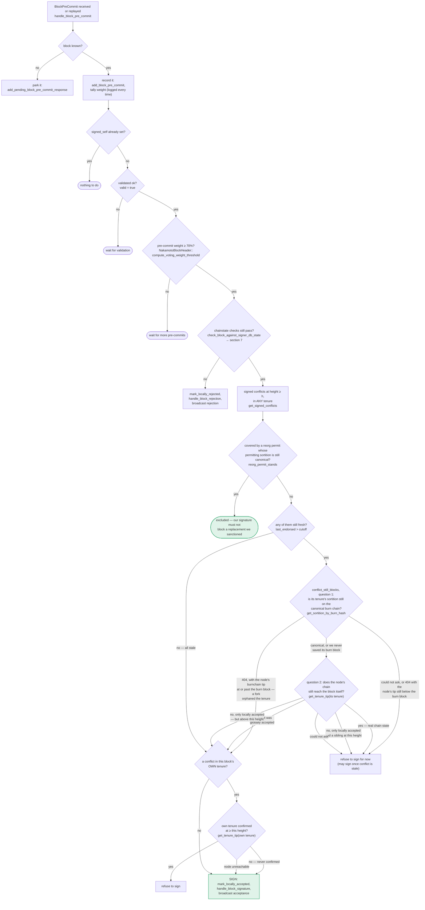

### Title
`mark_pre_committed()` mutates `valid = true` before the state-transition check, letting a globally-rejected block be re-validated and signed - ([File: stacks-signer/src/signerdb.rs])

### Summary
`BlockInfo::mark_pre_committed()` unconditionally sets `self.valid = Some(true)` *before* calling `move_to(BlockState::PreCommitted)`, and does not roll this back if `move_to` fails. `handle_block_validate_ok` in `stacks-signer/src/v0/signer.rs` calls `mark_pre_committed()` and, on error, only aborts if the block has *not* reached consensus and is not already `LocallyAccepted`; if the block is already `GloballyRejected`, it falls through anyway with the block's `valid` field now incorrectly forced to `true`, and proceeds to broadcast a pre-commit and run `handle_block_pre_commit` for a block the signer set has already rejected.

### Finding Description
`BlockInfo::mark_pre_committed`: [1](#0-0) 
sets `valid = Some(true)` unconditionally, then calls `move_to`, which enforces the legal state graph via `check_state`: [2](#0-1) 
Per `check_state`, `GloballyRejected` is reachable from *any* prior state except `GloballyAccepted` — including directly from `Unprocessed`, a state in which `valid` is still `None`. So a `BlockInfo` can legitimately reach `GloballyRejected` while `valid == None` (e.g. via a global-rejection tally computed from other signers' rejections before this signer's own local validation ever completed).

The caller, `handle_block_validate_ok`, only bails out on a `mark_pre_committed` failure when the block has **not** reached consensus and is not `LocallyAccepted`: [3](#0-2) 
When the pre-existing state is `GloballyRejected`, `has_reached_consensus()` is true, so the early return is skipped even though `move_to` failed (state stays `GloballyRejected`) — but `valid` has already been mutated to `true` inside `mark_pre_committed` before the failure. The code then inserts this corrupted `BlockInfo` (state `GloballyRejected`, `valid = true`) into `signer_db`, broadcasts a fresh `BlockPreCommit` for the hash, and calls `handle_block_pre_commit` for itself.

Inside `handle_block_pre_commit`, the pre-commit-weight/threshold logic reads `block_info.valid` to decide whether to proceed toward signing (per the documented flow: "`ALREADY: signed_self already set? no` → `VALID: valid = true?` yes (due to the bug) → weight/threshold checks → `SIGN`"), documented in the pre-commit flow: [4](#0-3) 
Because `valid` was force-set to `true` by the failed `mark_pre_committed` call, this signer can proceed down the signing path for a block whose canonical local record says `GloballyRejected`. If pre-commit weight already recorded for this hash (which, like signatures/rejections, is not cleared on rejection per the codebase's own documented invariant: "Rejection does not clear a conflict... it keeps conflicting even once globally rejected") crosses the 70% threshold once this signer's own late pre-commit is added, the RECHECK/CONF/SIGN branches (section 5 of the docs) can be reached and this signer will call `mark_locally_accepted` and broadcast an acceptance signature — i.e., turn an already globally-rejected block into a signed acceptance from this node.

### Impact Explanation
This breaks the "rejection recounted as an accept" invariant explicitly called out as Critical: a signer's local ledger records a block as `GloballyRejected` (consensus already decided against it), yet the corrupted `valid=true` field lets the same signer re-enter the pre-commit/sign pipeline for that exact block hash and potentially emit a genuine `BlockAccepted` signature for a block the network has already rejected. A signature emitted here is publicly aggregatable toward the acceptance threshold (per the codebase's own comment that signatures "can still be aggregated toward the 70% threshold" even after rejection), so this is not merely cosmetic — it contributes a real vote toward accepting a block that should be dead.

### Likelihood Explanation
This does not require a majority of signers or another signer's key — it only requires ordinary race timing between (a) a slow `/v3/block_proposal` validation response from the local stacks-node for a block, and (b) other signers' rejections for the same block reaching the 30%+ weight needed to mark it `GloballyRejected` in this signer's own `signerdb` before the local validate-ok arrives. Because `valid` starts as `None` for a freshly-proposed block and `GloballyRejected` is reachable straight from `Unprocessed`, the precondition ("valid still None, state already GloballyRejected") is reachable through normal node/network latency without any signer collusion — a plain miner proposal plus normal StackerDB gossip timing (validate-ok arriving after enough rejections) can trigger it.

### Recommendation
In `BlockInfo::mark_pre_committed` (and symmetrically in `mark_locally_accepted`/`mark_locally_rejected`), only mutate `valid`/timestamps *after* `move_to` succeeds, or roll back the mutation on an `Err` return, so a failed state transition never leaves `valid` incorrectly set. Additionally, `handle_block_validate_ok`'s fallback-on-error branch should treat `GloballyRejected` as a terminal failure (abort, do not re-pre-commit) rather than falling through to `send_block_pre_commit`/`handle_block_pre_commit`.

### Proof of Concept
1. Miner proposes block `B`. Signer submits `B` for validation to its stacks-node (`submit_block_for_validation`), leaving local `BlockInfo` for `B` at `state = Unprocessed`, `valid = None`.
2. Before the node's validation response returns, gossip from other signers accumulates ≥30% rejection weight against `B` (e.g. they see a conflicting sibling), and this signer's own aggregation logic calls `mark_globally_rejected()` on the same `BlockInfo` — legal per `check_state` since `GloballyRejected` is reachable from `Unprocessed`. Local DB row for `B`: `state = GloballyRejected`, `valid = None`.
3. The delayed `BlockValidateOk` for `B` finally arrives. `handle_block_validate_ok` loads this `BlockInfo`; `block_info.valid.is_some()` is `false` (still `None`), so it does not early-return at that guard.
4. `check_block_against_signer_db_state` returns `None` (chainstate checks unrelated to the rejection tally pass).
5. `mark_pre_committed()` sets `valid = Some(true)` then fails `move_to(PreCommitted)` (prior state `GloballyRejected` is not `Unprocessed`), returning `Err`.
6. The caller's guard `!has_reached_consensus() && state != LocallyAccepted` is `false` (consensus already reached), so it does **not** return; it inserts the now-corrupted `BlockInfo` (`GloballyRejected`, `valid=true`) and calls `send_block_pre_commit` + `handle_block_pre_commit` for itself.
7. If aggregate pre-commit weight for `B`'s hash (persisted independently of the later rejection) reaches the 70% threshold once this signer's contribution is added, `handle_block_pre_commit` proceeds through its `RECHECK`/`CONF` branches and reaches `SIGN`, causing this signer to call `mark_locally_accepted` and broadcast a `BlockAccepted` signature for `B` — a block already recorded as globally rejected.

*Note:* I was unable to fully trace the exact call site that invokes `mark_globally_rejected()` from within the running signer's own message-handling flow (i.e., confirm the precise weight-tally function that transitions a signer's own local `BlockInfo` to `GloballyRejected` before its own validate-ok arrives) due to exhausting available tool iterations; the root-cause defect (`valid` mutated before `move_to` in `mark_pre_committed`, and the caller's fallthrough for already-consensus blocks) is directly confirmed in the cited source, but the full end-to-end PoC path through `handle_block_pre_commit`'s weight thresholds should be validated with a live/integration test in this repo before treating the impact as fully proven.

### Citations

**File:** stacks-signer/src/signerdb.rs (L272-277)
```rust
    /// Mark this block as valid, record the approved time timestamp if not already set and attempt to mark it as pre-committed.
    pub fn mark_pre_committed(&mut self) -> Result<(), String> {
        self.valid = Some(true);
        self.approved_time.get_or_insert(get_epoch_time_secs());
        self.move_to(BlockState::PreCommitted)
    }
```

**File:** stacks-signer/src/signerdb.rs (L313-341)
```rust
    /// Check if the block state transition is valid
    fn check_state(&self, state: BlockState) -> bool {
        let prev_state = &self.state;
        if *prev_state == state {
            return true;
        }
        match state {
            BlockState::Unprocessed => false,
            BlockState::LocallyAccepted | BlockState::LocallyRejected => !matches!(
                prev_state,
                BlockState::GloballyRejected | BlockState::GloballyAccepted
            ),
            BlockState::GloballyAccepted => !matches!(prev_state, BlockState::GloballyRejected),
            BlockState::GloballyRejected => !matches!(prev_state, BlockState::GloballyAccepted),
            BlockState::PreCommitted => matches!(prev_state, BlockState::Unprocessed),
        }
    }

    /// Attempt to transition the block state
    pub fn move_to(&mut self, state: BlockState) -> Result<(), String> {
        if !self.check_state(state) {
            return Err(format!(
                "Invalid state transition from {} to {state}",
                self.state
            ));
        }
        self.state = state;
        Ok(())
    }
```

**File:** stacks-signer/src/v0/signer.rs (L1960-1984)
```rust
        } else {
            if let Err(e) = block_info.mark_pre_committed() {
                // The block may have reached enough signatures before we validated the block so should fail to mark pre-committed
                // but still call to make sure the timestamps and validity are updated correctly.
                if !block_info.has_reached_consensus()
                    && block_info.state != BlockState::LocallyAccepted
                {
                    warn!("{self}: Failed to mark block as approved: {e:?}",);
                    return;
                }
            }

            self.signer_db
                .insert_block(&block_info)
                .unwrap_or_else(|e| self.handle_insert_block_error(e));
            self.send_block_pre_commit(signer_signature_hash.clone());
            // have to save the signature _after_ the block info
            let address = self.stacks_address.clone();
            self.handle_block_pre_commit(
                stacks_client,
                sortition_state,
                &address,
                signer_signature_hash,
            );
        }
```

**File:** docs/signer-flows.md (L237-269)
```markdown

