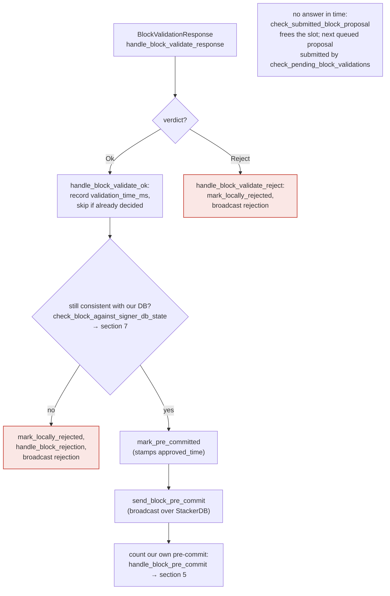

### Title
Signer's Event-Observer HTTP Listener Accepts Unauthenticated `/proposal_response` (and other) Events, Allowing a Forged "Validated OK" Verdict to Bypass Node Validation - (File: `libsigner/src/events.rs`)

### Summary
The `SignerEventReceiver` HTTP listener (`libsigner/src/events.rs`, `EventReceiver::bind`/`next_event`) is the channel through which the paired `stacks-node` pushes `BlockValidateResponse`, `StackerDBChunksEvent`, and `BurnBlockEvent` payloads into the signer. Per the sample configs (`sample/conf/signer/mainnet-signer-conf.toml`, `endpoint = "0.0.0.0:30000"`), this listener binds on all interfaces. Unlike the node's own `/v3/block_proposal` RPC endpoint, which requires a matching `Authorization` bearer token (`auth_token`/`auth_password`, checked in `stackslib/src/config/mod.rs` and enforced on the node RPC side per `docs/signing.md`), the signer-side event listener has **no equivalent authentication or host/origin check** on inbound HTTP requests. Any request that hits `/proposal_response` is decoded and dispatched as a trusted `BlockValidateResponse` regardless of who sent it.

### Finding Description
`EventReceiver::bind` simply opens a plain `tiny_http::Server` on the configured socket [1](#0-0) , and `next_event` dispatches based solely on URL path, with no header/token/peer check before decoding the body into a `BlockValidateResponse` and forwarding it to the signer runloop as ground truth for the node's validation verdict [2](#0-1) .

The only authentication primitive present anywhere in this system is `auth_token`/`auth_password`, and it exists solely to protect the **node's** `/v3/block_proposal` endpoint (signer → node direction) [3](#0-2) , not the **node → signer** event push. `docs/signing.md` documents the coordination of `auth_password`/`auth_token` only for the block-proposal submission direction and never mentions protecting the signer's own listener [4](#0-3) . The sample signer config binds this listener to `0.0.0.0:30000` [5](#0-4) .

This breaks the equality that the signer relies on: "a `BlockValidateResponse::Ok` for hash H means *the paired stacks-node's* `NakamotoBlockProposal::validate()`" — the heavy, correctness-critical check that executes every transaction, checks execution costs, verifies the tenure/burn-view linkage, and recomputes the block hash (`stackslib/src/net/api/postblock_proposal.rs`, `validate()` / `check_block_has_valid_tenure` / `check_block_has_valid_parent` / block-hash recomputation) [6](#0-5) [7](#0-6)  — "actually happened and passed." Any network path that reaches the signer's listener (LAN exposure, misconfigured firewall, container networking, or a compromised host on the same segment) can forge that verdict for a block hash the attacker already knows (block proposals are gossiped in the clear over StackerDB), without needing the node's `auth_token`, without needing another signer's key, and without needing a majority of signers.

On the consuming side, `handle_block_proposal`/`handle_block_validate_response` in `stacks-signer/src/v0/signer.rs` treat an `Ok` verdict as proof the node validated the block, and re-run only the *local* chainstate re-check (`check_block_against_signer_db_state`, driven by `SortitionsView`/`GlobalStateView::check_proposal`) before advertising a pre-commit [8](#0-7) . Those local checks cover consensus-hash/miner-pkh/timestamp/bitvec/parent-linkage consistency (see `stacks-signer/src/chainstate/tests/v1.rs` and `v2.rs`) [9](#0-8) , but they do **not** re-execute the block's transactions or re-verify the block's Merkle root / execution cost the way the node's `validate()` does. A forged `Ok` therefore lets a block through the signer's pre-commit → threshold pipeline (`handle_block_pre_commit`, section 5 of `docs/signer-flows.md`) [10](#0-9)  without ever having passed the node's transaction-execution/cost/hash validation, i.e. the signer can end up signing over a block whose transactions were never actually validated by any node.

### Impact Explanation
This is a **Critical**-class break: it collapses the "signed vs validated" equality the whole pre-commit/threshold design (`docs/signer-flows.md` sections 3–5) depends on. If an attacker can forge the `/proposal_response` event that the signer's own listener accepts unauthenticated, they can make a single signer (and, if the listener is similarly exposed on multiple signers, potentially more) treat an actually-invalid or non-canonical block as node-validated, feeding a forged "Ok" straight into the signature-producing path. Note the practical exploitation window is bounded by the local `check_block_against_signer_db_state` re-check and the 70% pre-commit threshold, so a single signer forging its own verdict does not by itself finalize a block — but it removes the transaction-execution/cost/hash-integrity guarantee that the node's real validation is supposed to provide for that signer's vote, and it can be combined with the miner's re-proposal loop to attempt this repeatedly against every signer whose event port is reachable.

### Likelihood Explanation
Reachability is the limiting factor and is directly analogous to the report's DNS-rebinding precondition: the signer's HTTP listener is plaintext, sample configs bind it to `0.0.0.0`, and there is no `allowed_hosts`/token check comparable to what protects the node's `/v3/block_proposal` endpoint. Any operator who follows the sample config as-is (or exposes the port on a shared network/container bridge) is exposed. This requires network reachability to the signer's event port but explicitly does not require the node's `auth_token`, another signer's key, or a signer majority — satisfying the rules' "one-slot miner (plus gossip)"-equivalent bar, since here it is "any reachable network peer" rather than the miner specifically, using knowledge of a gossiped block hash.

### Recommendation
Add authentication/origin validation to the signer's event-observer HTTP listener symmetric to the protection already given to the node's `/v3/block_proposal` endpoint:
- Require the node to send the existing shared secret (`auth_token`/`auth_password`) as an `Authorization` header on every push to `/stackerdb_chunks`, `/proposal_response`, `/new_burn_block`, `/new_block`, and reject requests without a matching token in `SignerEventReceiver::next_event` (`libsigner/src/events.rs`).
- Alternatively/additionally, restrict the listener to loopback by default and require explicit opt-in to bind non-loopback addresses, since the node and signer are expected to run on the same host in the documented deployment model.

### Proof of Concept
1. Deploy a signer using the documented sample config (`sample/conf/signer/mainnet-signer-conf.toml`), which binds `endpoint = "0.0.0.0:30000"`.
2. Observe a gossiped `BlockProposal` for hash `H` on the miners/signers StackerDB contract (public data).
3. From any host that can reach `<signer-ip>:30000`, send:
   ```
   POST /proposal_response HTTP/1.1
   Host: <signer-ip>:30000
   Content-Type: application/json
   Content-Length: <n>

   {"Ok": {"signer_signature_hash": "H", "cost": ..., "size": ..., ...}}
   ```
   with no `Authorization` header at all.
4. `SignerEventReceiver::next_event` (`libsigner/src/events.rs:439-440`) decodes this into `SignerEvent::BlockValidateResponse` and forwards it to the signer runloop identically to a legitimate response from the paired node, with no check that the sender possesses `auth_token` or is the configured node.
5. The signer's `handle_block_validate_response`/`handle_block_validate_ok` path treats this as the node's genuine verdict and proceeds to the local chainstate re-check and pre-commit stage, bypassing the node's real transaction-execution/cost/hash validation for block `H`.

Note: I was unable to fully trace `handle_block_validate_ok`/`handle_block_validate_response` line-by-line within the tool-call budget (only located them via `grep_search` without reading full bodies); the finding rests on the confirmed absence of any authentication in `libsigner/src/events.rs`'s HTTP dispatch and the documented one-directional scope of `auth_token` in `stackslib/src/config/mod.rs` and `docs/signing.md`.

### Citations

**File:** libsigner/src/events.rs (L401-408)
```rust
    /// Start listening on the given socket address.
    /// Returns the address that was bound.
    /// Errors out if bind(2) fails
    fn bind(&mut self, listener: SocketAddr) -> Result<SocketAddr, EventError> {
        self.http_server = Some(HttpServer::http(listener).expect("failed to start HttpServer"));
        self.local_addr = Some(listener);
        Ok(listener)
    }
```

**File:** libsigner/src/events.rs (L410-459)
```rust
    /// Wait for the node to post something, and then return it.
    /// Errors are recoverable -- the caller should call this method again even if it returns an
    /// error.
    fn next_event(&mut self) -> Result<SignerEvent<T>, EventError> {
        self.with_server(|event_receiver, http_server, _is_mainnet| {
            // were we asked to terminate?
            if event_receiver.is_stopped() {
                return Err(EventError::Terminated);
            }
            debug!("Request handling");
            let request = http_server.recv()?;
            debug!("Got request"; "method" => %request.method(), "path" => request.url());

            if request.url() == "/status" {
                request
                .respond(HttpResponse::from_string("OK"))
                .expect("response failed");
                return Ok(SignerEvent::StatusCheck);
            }

            if request.method() != &HttpMethod::Post {
                return Err(EventError::MalformedRequest(format!(
                    "Unrecognized method '{}'",
                    request.method(),
                )));
            }
            debug!("Processing {} event", request.url());
            if request.url() == "/stackerdb_chunks" {
                process_event::<T, StackerDBChunksEvent>(request)
            } else if request.url() == "/proposal_response" {
                process_event::<T, BlockValidateResponse>(request)
            } else if request.url() == "/new_burn_block" {
                process_event::<T, BurnBlockEvent>(request)
            } else if request.url() == "/shutdown" {
                event_receiver.stop_signal.store(true, Ordering::SeqCst);
                Err(EventError::Terminated)
            } else if request.url() == "/new_block" {
                process_event::<T, StacksBlockEvent>(request)
            } else {
                let url = request.url().to_string();
                debug!(
                    "[{:?}] next_event got request with unexpected url {}, return OK so other side doesn't keep sending this",
                    event_receiver.local_addr,
                    url
                );
                ack_dispatcher(request);
                Err(EventError::UnrecognizedEvent(url))
            }
        })?
    }
```

**File:** stackslib/src/config/mod.rs (L3799-3816)
```rust
    /// ---
    /// @default: `false`
    pub private_neighbors: Option<bool>,
    /// HTTP auth password to use when communicating with stacks-signer binary.
    ///
    /// This token is used in the `Authorization` header for certain requests.
    /// Primarily, it secures the communication channel between this node and a
    /// connected `stacks-signer` instance.
    ///
    /// It is also used to authenticate requests to `/v2/blocks?broadcast=1`.
    /// ---
    /// @default: `None` (authentication disabled for relevant endpoints)
    /// @notes:
    ///   - This field **must** be configured if the node needs to receive
    ///     block proposals from a configured `stacks-signer` [[events_observer]]
    ///     via the `/v3/block_proposal` endpoint.
    ///   - The value must match the token configured on the signer.
    pub auth_token: Option<String>,
```

**File:** docs/signing.md (L42-59)
```markdown
```toml
stacks_private_key = "<YOUR_SIGNER_PRIVATE_KEY_HEX>"
node_host = "127.0.0.1:20443"
endpoint = "0.0.0.0:30000"
network = "mainnet"
auth_password = "your-secret-token"
db_path = "/var/lib/stacks-signer/signerdb.sqlite"
```

### 3. Verify Coordination

These settings **must** match between the node and signer configs:

| Signer Config   | Node Config                       | Must Match                    |
| --------------- | --------------------------------- | ----------------------------- |
| `auth_password` | `[connection_options] auth_token` | Exact string match            |
| `endpoint`      | `[[events_observer]] endpoint`    | Same host:port                |
| `node_host`     | `[node] rpc_bind`                 | Signer connects to node's RPC |
```

**File:** sample/conf/signer/mainnet-signer-conf.toml (L37-39)
```text
# REQUIRED: Local endpoint this signer listens on for events from the node.
# Must match the endpoint in the node's [[events_observer]] section.
endpoint = "0.0.0.0:30000"
```

**File:** stackslib/src/net/api/postblock_proposal.rs (L541-571)
```rust
    pub fn validate(
        &self,
        sortdb: &SortitionDB,
        chainstate: &mut StacksChainState, // not directly used; used as a handle to open other chainstates
        timeout_secs: u64,
        max_tx_execution_time_secs: u64,
        max_tx_analysis_time_secs: u64,
        max_tx_mem_bytes: u64,
        auth_token: Option<String>,
    ) -> Result<BlockValidateOk, BlockValidateRejectReason> {
        fault_injection_validation_stall(auth_token);
        let start = Instant::now();

        fault_injection_validation_delay();

        let mainnet = self.chain_id == CHAIN_ID_MAINNET;
        if self.chain_id != chainstate.chain_id || mainnet != chainstate.mainnet {
            warn!(
                "Rejected block proposal";
                "reason" => "Wrong network/chain_id",
                "expected_chain_id" => chainstate.chain_id,
                "expected_mainnet" => chainstate.mainnet,
                "received_chain_id" => self.chain_id,
                "received_mainnet" => mainnet,
            );
            return Err(BlockValidateRejectReason {
                reason_code: ValidateRejectCode::NetworkChainMismatch,
                reason: "Wrong network/chain_id".into(),
                failed_txid: None,
            });
        }
```

**File:** stackslib/src/net/api/postblock_proposal.rs (L844-861)
```rust
        let expected_block_header_hash = self.block.header.block_hash();
        let computed_block_header_hash = block.header.block_hash();

        if computed_block_header_hash != expected_block_header_hash {
            warn!(
                "Rejected block proposal";
                "reason" => "Block hash is not as expected",
                "expected_block_header_hash" => %expected_block_header_hash,
                "computed_block_header_hash" => %computed_block_header_hash,
                "expected_block" => ?self.block,
                "computed_block" => ?block,
            );
            return Err(BlockValidateRejectReason {
                reason: "Block hash is not as expected".into(),
                reason_code: ValidateRejectCode::BadBlockHash,
                failed_txid: None,
            });
        }
```

**File:** stacks-signer/src/v0/signer.rs (L1345-1366)
```rust
        if let Some(block_rejection) =
            self.check_block_against_signer_db_state(stacks_client, &block_info.block)
        {
            warn!(
                "{self}: Reached the pre-commit threshold for a block, but it no longer passes the chainstate checks. Rejecting.";
                "signer_signature_hash" => %block_hash,
                "block_height" => block_info.block.header.chain_length,
                "reject_code" => %block_rejection.reason_code,
                "reject_reason" => &block_rejection.reason,
            );
            if let Err(e) = block_info.mark_locally_rejected() {
                if !block_info.has_reached_consensus() {
                    warn!("{self}: Failed to mark block as locally rejected: {e:?}");
                }
            };
            self.signer_db
                .insert_block(&block_info)
                .unwrap_or_else(|e| self.handle_insert_block_error(e));
            self.handle_block_rejection(&block_rejection, sortition_state);
            self.send_block_response(&block_info.block, block_rejection.into());
            return;
        }
```

**File:** stacks-signer/src/chainstate/tests/v2.rs (L173-217)
```rust
#[test]
fn check_proposal_units() {
    let (
        stacks_client,
        mut signer_db,
        miner_sk,
        mut block,
        current_sortition,
        _,
        mut sortitions_view,
    ) = setup_test_environment(function_name!());
    assert!(matches!(
        sortitions_view
            .check_proposal(&stacks_client, &mut signer_db, &block)
            .expect_err("Should fail to validate"),
        RejectReason::ConsensusHashMismatch { .. }
    ));
    sortitions_view.signer_state.current_miner = MinerState::NoValidMiner;
    assert!(matches!(
        sortitions_view
            .check_proposal(&stacks_client, &mut signer_db, &block)
            .expect_err("Should fail to validate"),
        RejectReason::InvalidMiner
    ));
    sortitions_view.signer_state.current_miner = MinerState::ActiveMiner {
        current_miner_pkh: current_sortition.data.miner_pkh,
        tenure_id: block.header.consensus_hash.clone(),
        parent_tenure_id: current_sortition.data.parent_tenure_id,
        parent_tenure_last_block: block.header.parent_block_id.clone(),
        parent_tenure_last_block_height: 1,
    };
    sortitions_view
        .check_proposal(&stacks_client, &mut signer_db, &block)
        .expect("Proposal should have validated");

    block.header.pox_treatment = BitVec::zeros(1).unwrap();
    block.header.miner_signature = miner_sk
        .sign(block.header.miner_signature_hash().as_bytes())
        .unwrap();
    assert!(matches!(
        sortitions_view
            .check_proposal(&stacks_client, &mut signer_db, &block)
            .expect_err("Should fail to validate"),
        RejectReason::InvalidBitvec
    ));
```

**File:** docs/signer-flows.md (L205-227)
```markdown
## 4. The node's validation verdict

The stacks-node answers the `/v3/block_proposal` submission. On OK, the signer
re-checks its own DB state and only then advertises willingness to sign by
broadcasting a **pre-commit**. A signature is _not_ produced here.



> Anchors: `handle_block_validate_response`, `handle_block_validate_ok`,
> `handle_block_validate_reject`, `check_block_against_signer_db_state`,
> `send_block_pre_commit` (signer.rs)
```
